# 事件处理与用户缓存

<cite>
**本文档中引用的文件**
- [slack.clj](file://src/metabase/channel/events/slack.clj)
- [refresh_slack_channel_user_cache.clj](file://src/metabase/channel/task/refresh_slack_channel_user_cache.clj)
- [slack.clj](file://src/metabase/channel/slack.clj)
- [events.clj](file://src/metabase/actions/events.clj)
- [comments.clj](file://src/metabase/channel/events/comments.clj)
- [slack_impl.clj](file://src/metabase/channel/impl/slack.clj)
- [settings.clj](file://src/metabase/channel/settings.clj)
- [events_core.clj](file://src/metabase/events/core.clj)
- [events_impl.clj](file://src/metabase/events/impl.clj)
- [pulse_send.clj](file://src/metabase/pulse/send.clj)
- [pulse_models.clj](file://src/metabase/pulse/models/pulse.clj)
</cite>

## 目录
1. [简介](#简介)
2. [项目结构概览](#项目结构概览)
3. [事件监听器架构](#事件监听器架构)
4. [Slack事件处理机制](#slack事件处理机制)
5. [用户缓存管理系统](#用户缓存管理系统)
6. [Quartz调度器集成](#quartz调度器集成)
7. [缓存失效与增量更新策略](#缓存失效与增量更新策略)
8. [大规模团队环境下的消息路由](#大规模团队环境下的消息路由)
9. [性能监控与调优](#性能监控与调优)
10. [故障排除指南](#故障排除指南)
11. [总结](#总结)

## 简介

Metabase的事件处理与用户缓存系统是一个复杂而精密的架构，负责处理Slack集成中的各种事件（如脉冲触发、评论添加）并维护用户状态的准确性。该系统通过事件驱动的方式响应系统变化，确保在大规模团队环境中消息路由的正确性和实时性。

本文档深入分析了两个核心组件：
- **events/slack.clj**：定义了事件监听器，响应系统事件并启动通知流程
- **refresh_slack_channel_user_cache.clj**：基于Quartz的任务调度器，维护Slack用户ID与Metabase用户映射的准确性

## 项目结构概览

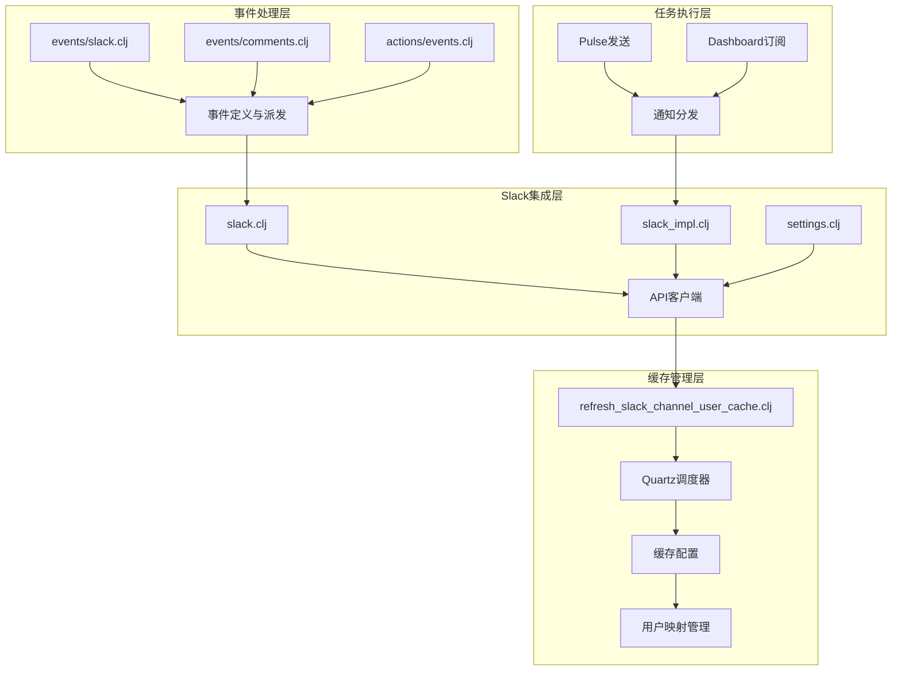

**图表来源**
- [slack.clj](file://src/metabase/channel/slack.clj#L1-L50)
- [refresh_slack_channel_user_cache.clj](file://src/metabase/channel/task/refresh_slack_channel_user_cache.clj#L1-L63)

## 事件监听器架构

### 事件系统基础

Metabase采用基于Methodical的事件系统，提供了类似Emacs Lisp钩子风格的事件机制。事件系统的核心特性包括：

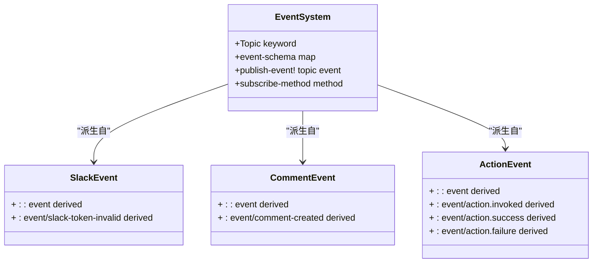

**图表来源**
- [events.clj](file://src/metabase/channel/events/slack.clj#L1-L5)
- [comments.clj](file://src/metabase/channel/events/comments.clj#L1-L5)
- [events.clj](file://src/metabase/actions/events.clj#L1-L43)

### 事件监听器实现

事件监听器通过继承`:metabase/event`基类来定义特定的事件类型。每个事件都有明确的语义和用途：

| 事件类型 | 描述 | 触发条件 | 处理逻辑 |
|---------|------|----------|----------|
| `:event/slack-token-invalid` | Slack令牌无效事件 | Slack API返回认证错误 | 发送管理员邮件通知，标记令牌为无效 |
| `:event/comment-created` | 评论创建事件 | 用户在仪表板或问题上添加评论 | 启动相关通知流程 |
| `:event/action.invoked` | 动作调用事件 | 系统动作被触发 | 记录动作执行上下文 |
| `:event/action.success` | 动作成功事件 | 系统动作成功完成 | 记录成功结果 |
| `:event/action.failure` | 动作失败事件 | 系统动作执行失败 | 记录错误信息 |

**节来源**
- [slack.clj](file://src/metabase/channel/events/slack.clj#L1-L5)
- [comments.clj](file://src/metabase/channel/events/comments.clj#L1-L5)
- [events.clj](file://src/metabase/actions/events.clj#L1-L43)

## Slack事件处理机制

### Slack API客户端架构

Slack事件处理的核心是`slack.clj`文件中定义的API客户端，它提供了完整的Slack API交互能力：

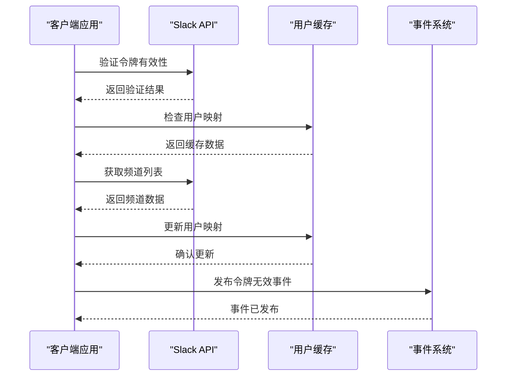

**图表来源**
- [slack.clj](file://src/metabase/channel/slack.clj#L1-L100)

### 错误处理与事件发布

当Slack API返回认证错误时，系统会自动发布`:event/slack-token-invalid`事件：

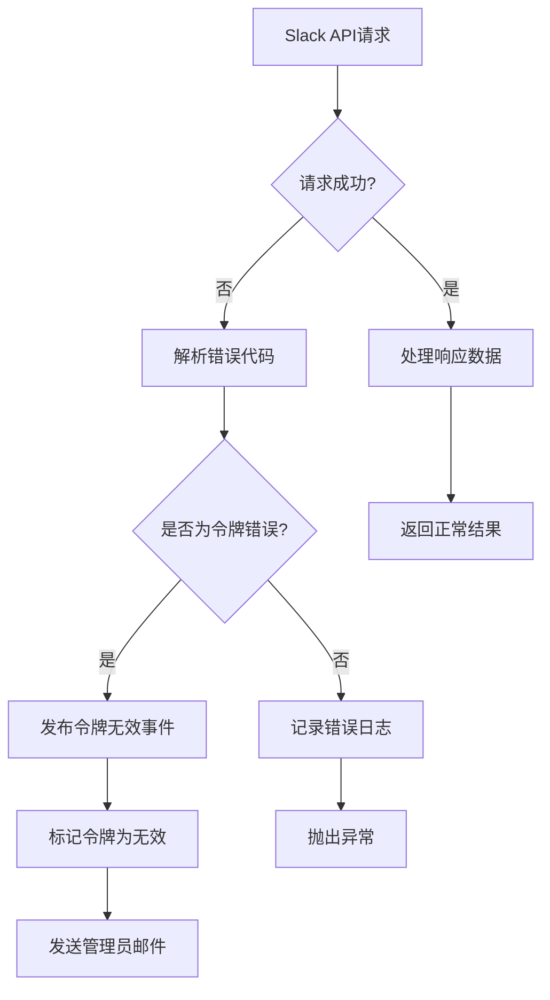

**图表来源**
- [slack.clj](file://src/metabase/channel/slack.clj#L40-L80)

**节来源**
- [slack.clj](file://src/metabase/channel/slack.clj#L40-L80)

## 用户缓存管理系统

### 缓存架构设计

用户缓存系统采用分布式共享缓存模式，确保多个实例间的数据一致性：

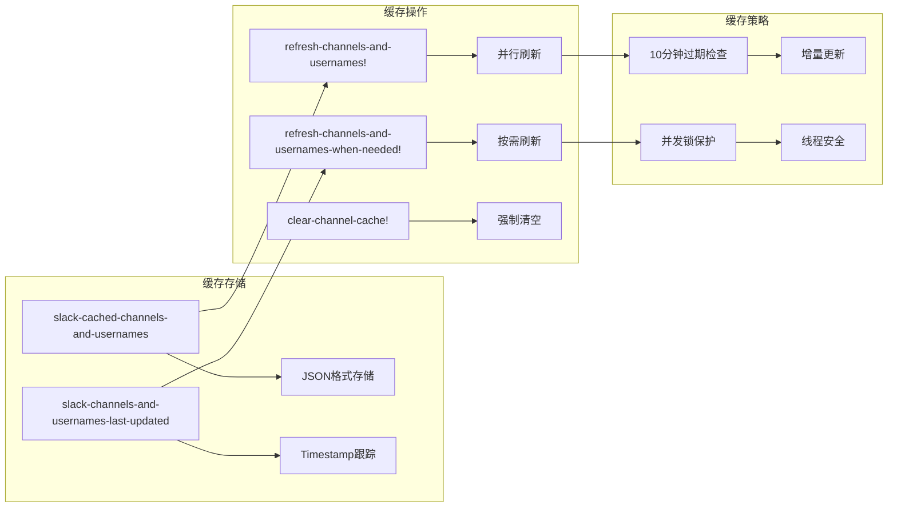

**图表来源**
- [settings.clj](file://src/metabase/channel/settings.clj#L50-L80)
- [slack.clj](file://src/metabase/channel/slack.clj#L200-L250)

### 用户映射转换机制

系统提供了多种用户映射转换函数，用于处理不同格式的用户数据：

| 转换函数 | 输入格式 | 输出格式 | 用途 |
|---------|----------|----------|------|
| `channel-transform` | Slack频道对象 | Metabase频道映射 | 频道名称转换 |
| `user-transform` | Slack用户对象 | Metabase用户映射 | 用户名称转换 |
| `notification-recipient->channel` | 通知接收者 | 频道ID | 消息路由 |

**节来源**
- [slack.clj](file://src/metabase/channel/slack.clj#L150-L200)
- [slack_impl.clj](file://src/metabase/channel/impl/slack.clj#L15-L25)

## Quartz调度器集成

### 任务调度架构

`refresh_slack_channel_user_cache.clj`文件实现了基于Quartz的定时任务调度，支持两种调度模式：

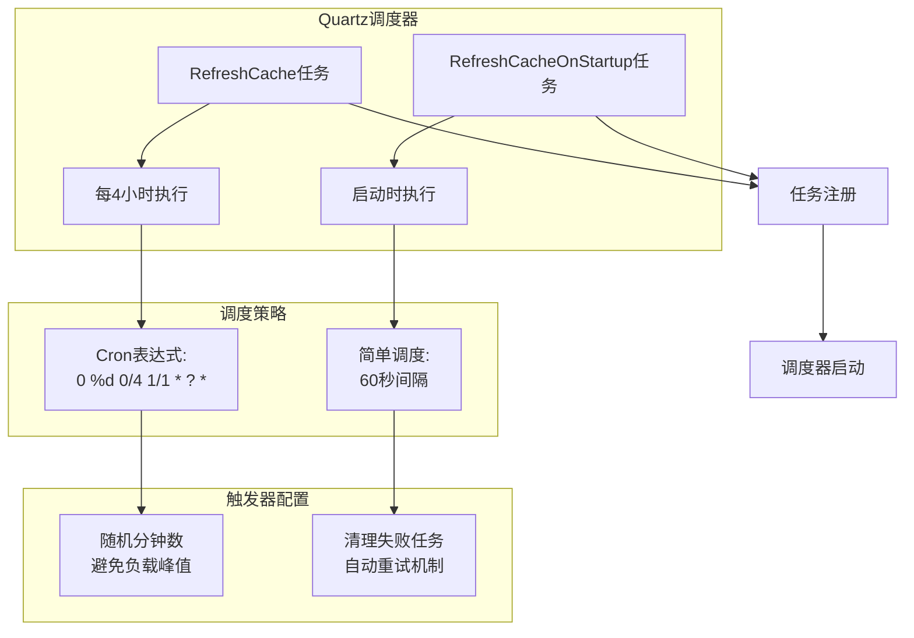

**图表来源**
- [refresh_slack_channel_user_cache.clj](file://src/metabase/channel/task/refresh_slack_channel_user_cache.clj#L35-L63)

### 调度器初始化流程

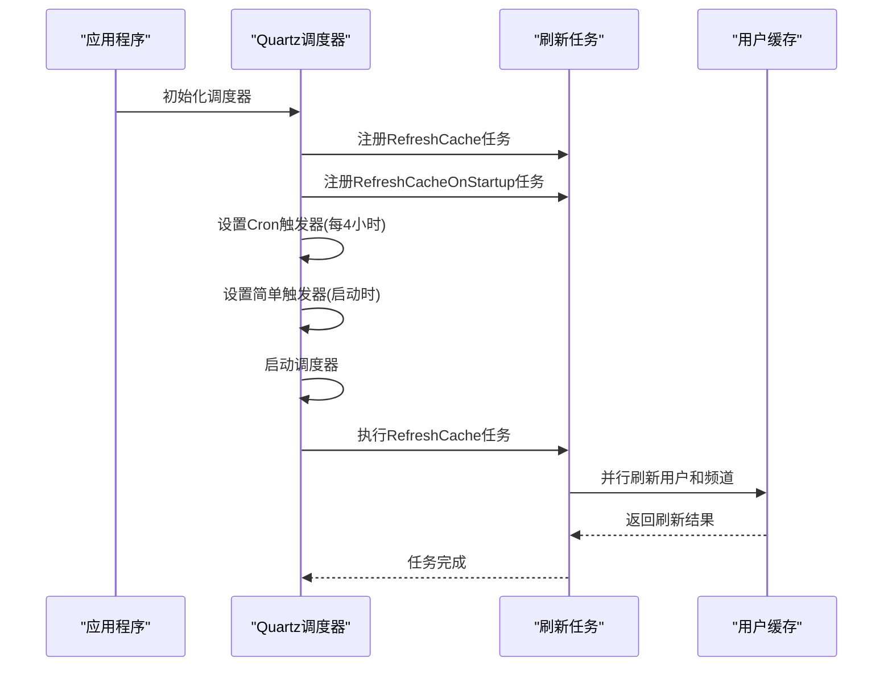

**图表来源**
- [refresh_slack_channel_user_cache.clj](file://src/metabase/channel/task/refresh_slack_channel_user_cache.clj#L35-L63)

**节来源**
- [refresh_slack_channel_user_cache.clj](file://src/metabase/channel/task/refresh_slack_channel_user_cache.clj#L35-L63)

## 缓存失效与增量更新策略

### 过期检测机制

系统实现了智能的缓存过期检测，避免不必要的频繁刷新：

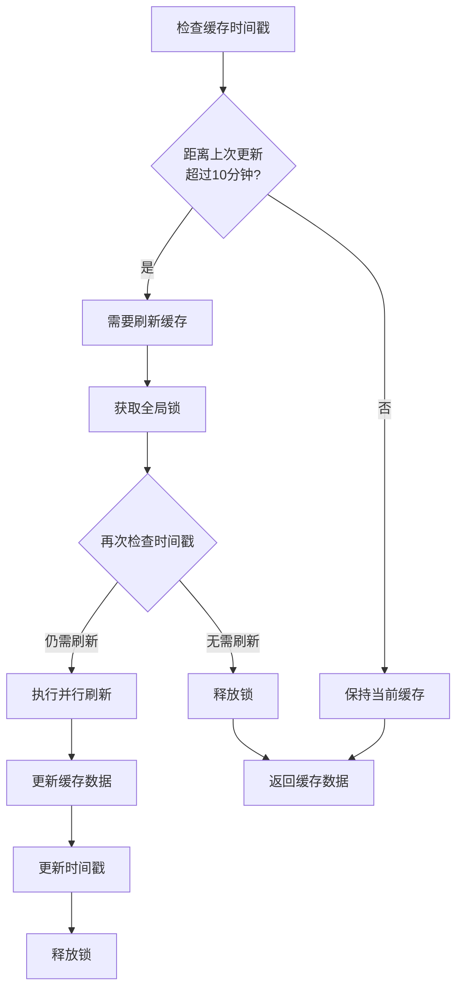

**图表来源**
- [slack.clj](file://src/metabase/channel/slack.clj#L250-L280)

### 增量更新流程

系统支持增量更新策略，只更新发生变化的部分：

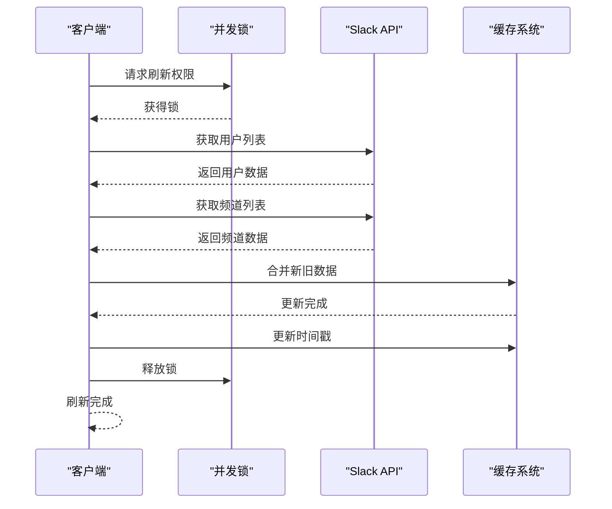

**图表来源**
- [slack.clj](file://src/metabase/channel/slack.clj#L280-L320)

**节来源**
- [slack.clj](file://src/metabase/channel/slack.clj#L250-L320)

## 大规模团队环境下的消息路由

### 消息路由架构

在大规模团队环境中，系统需要确保消息能够准确路由到正确的接收者：

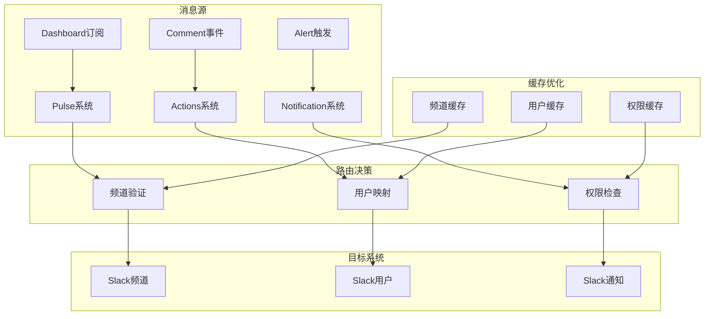

**图表来源**
- [slack_impl.clj](file://src/metabase/channel/impl/slack.clj#L1-L50)
- [pulse_send.clj](file://src/metabase/pulse/send.clj#L1-L50)

### 消息块构建策略

系统使用Slack Block Kit构建复杂的交互式消息：

| 消息类型 | 构建函数 | 特性 | 适用场景 |
|---------|----------|------|----------|
| 卡片通知 | `render-notification` | 图表+文本+参数 | Dashboard订阅 |
| 仪表板通知 | `slack-dashboard-header` | 标题+过滤器+链接 | 定期报告 |
| 文本消息 | `text->markdown-section` | Markdown格式化 | 简单通知 |
| 参数块 | `maybe-append-params-block` | 动态参数显示 | 条件通知 |

**节来源**
- [slack_impl.clj](file://src/metabase/channel/impl/slack.clj#L50-L150)

## 性能监控与调优

### 缓存同步延迟监控

系统提供了多种监控指标来跟踪缓存同步状态：

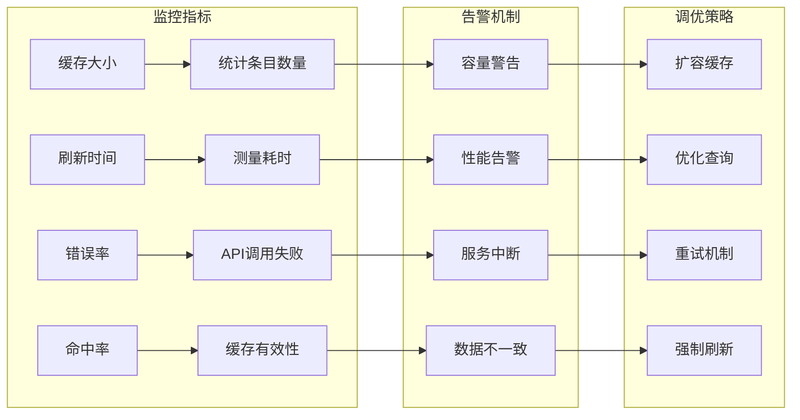

### 性能优化建议

1. **缓存预热策略**
   - 在系统启动时立即执行`RefreshCacheOnStartup`任务
   - 使用随机分钟数避免所有实例同时刷新

2. **并发控制优化**
   - 使用Java对象锁防止重复刷新
   - 实现非阻塞的过期检查机制

3. **API调用优化**
   - 使用分页API限制最大结果数量
   - 实现连接超时和重试机制

4. **内存使用优化**
   - 定期清理过期的缓存条目
   - 使用压缩存储减少内存占用

**节来源**
- [refresh_slack_channel_user_cache.clj](file://src/metabase/channel/task/refresh_slack_channel_user_cache.clj#L15-L35)

## 故障排除指南

### 常见问题诊断

| 问题症状 | 可能原因 | 诊断方法 | 解决方案 |
|---------|----------|----------|----------|
| Slack通知失败 | 令牌无效 | 检查`slack-token-valid?`设置 | 重新配置Slack集成 |
| 用户映射错误 | 缓存过期 | 查看`slack-channels-and-usernames-last-updated` | 强制刷新缓存 |
| 消息路由失败 | 频道不存在 | 验证频道名称配置 | 更新频道设置 |
| 性能下降 | 缓存未命中 | 监控缓存命中率 | 调整刷新频率 |

### 调试工具和技巧

1. **事件日志分析**
   ```clojure
   ;; 启用详细日志记录
   (log/info "Slack API请求:", request)
   (log/debug "缓存状态:", (channel.settings/slack-cached-channels-and-usernames))
   ```

2. **缓存状态检查**
   ```clojure
   ;; 手动刷新缓存
   (slack/refresh-channels-and-usernames!)
   
   ;; 清空缓存强制重建
   (slack/clear-channel-cache!)
   ```

3. **令牌有效性测试**
   ```clojure
   ;; 验证新令牌
   (slack/valid-token? "xoxb-new-token")
   ```

**节来源**
- [slack.clj](file://src/metabase/channel/slack.clj#L180-L220)
- [settings.clj](file://src/metabase/channel/settings.clj#L30-L50)

## 总结

Metabase的事件处理与用户缓存系统展现了现代企业级应用的复杂性和精密性。通过事件驱动架构、智能缓存管理和可靠的调度机制，系统能够在大规模团队环境中提供稳定、高效的消息传递服务。

### 关键特性总结

1. **事件驱动架构**：基于Methodical的事件系统提供了灵活的通知机制
2. **智能缓存管理**：分布式缓存结合增量更新策略，确保数据准确性
3. **可靠的任务调度**：Quartz集成提供了强大的定时任务能力
4. **大规模扩展性**：并发控制和负载均衡确保系统稳定性
5. **完善的监控体系**：多维度监控指标支持系统优化

### 最佳实践建议

- 定期监控缓存命中率和刷新频率
- 建立完善的告警机制
- 实施渐进式部署策略
- 保持配置的版本控制
- 定期备份重要配置数据

这个系统的设计充分体现了现代软件工程的最佳实践，为其他类似系统的设计提供了宝贵的参考价值。