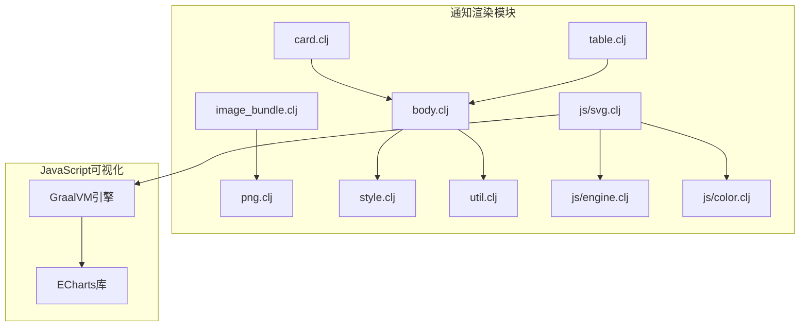
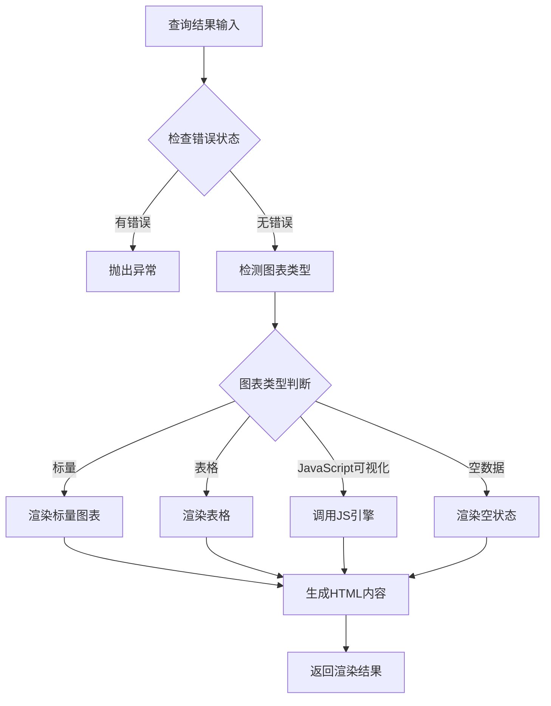
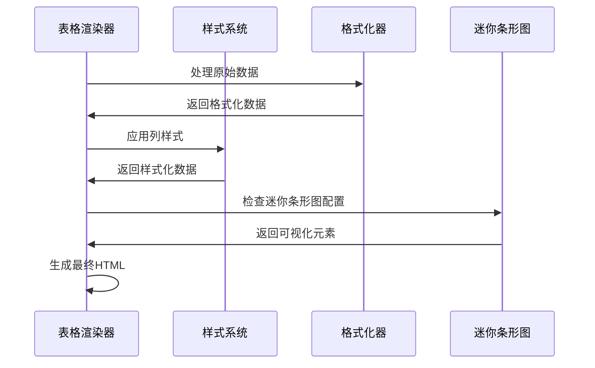
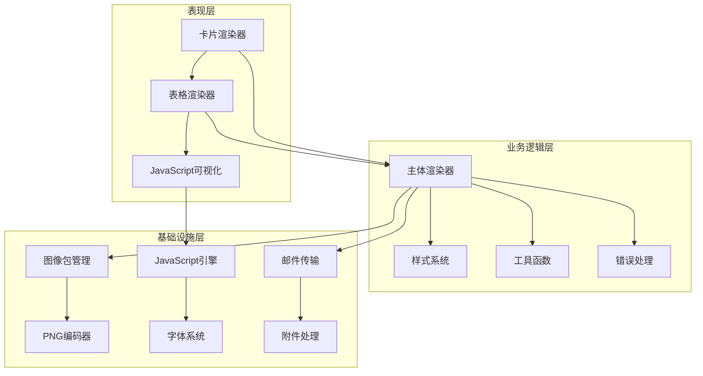
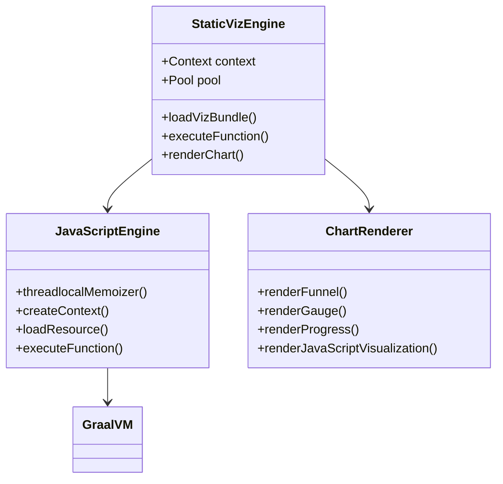
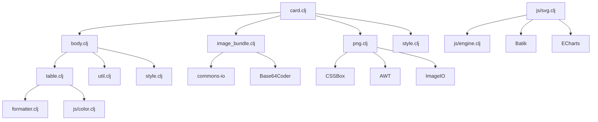

# 可视化组件

<cite>
**本文档中引用的文件**
- [card.clj](file://src/metabase/channel/render/card.clj)
- [table.clj](file://src/metabase/channel/render/table.clj)
- [image_bundle.clj](file://src/metabase/channel/render/image_bundle.clj)
- [png.clj](file://src/metabase/channel/render/png.clj)
- [body.clj](file://src/metabase/channel/render/body.clj)
- [style.clj](file://src/metabase/channel/render/style.clj)
- [util.clj](file://src/metabase/channel/render/util.clj)
- [svg.clj](file://src/metabase/channel/render/js/svg.clj)
- [engine.clj](file://src/metabase/channel/render/js/engine.clj)
- [color.clj](file://src/metabase/channel/render/js/color.clj)
- [settings.clj](file://src/metabase/notification/settings.clj)
</cite>

## 目录
1. [简介](#简介)
2. [项目结构概览](#项目结构概览)
3. [核心组件分析](#核心组件分析)
4. [架构概览](#架构概览)
5. [详细组件分析](#详细组件分析)
6. [依赖关系分析](#依赖关系分析)
7. [性能考虑](#性能考虑)
8. [故障排除指南](#故障排除指南)
9. [结论](#结论)

## 简介

Metabase的通知系统包含了一套完整的数据可视化组件生成机制，用于将查询结果转换为各种形式的可视化内容。该系统主要由四个核心模块组成：卡片渲染器（card.clj）、表格渲染器（table.clj）、图像包管理器（image_bundle.clj）和PNG编码器（png.clj）。这些组件协同工作，为用户提供了丰富的通知内容展示方式。

## 项目结构概览

通知系统的可视化组件位于`src/metabase/channel/render/`目录下，包含以下关键文件：

**图表来源**
- [card.clj](file://src/metabase/channel/render/card.clj#L1-L20)
- [body.clj](file://src/metabase/channel/render/body.clj#L1-L20)
- [table.clj](file://src/metabase/channel/render/table.clj#L1-L20)

## 核心组件分析

### 卡片渲染器（card.clj）

卡片渲染器是通知系统的核心组件，负责将查询结果转换为卡片式布局。它支持多种图表类型，并提供灵活的配置选项。

#### 主要功能特性：
- **图表类型检测**：自动识别查询结果的最适合图表类型
- **多渲染模式**：支持内联渲染和附件渲染两种模式
- **参数化渲染**：支持内联参数显示
- **错误处理**：完善的错误处理和降级机制

#### 关键算法：

**图表来源**
- [card.clj](file://src/metabase/channel/render/card.clj#L130-L180)

**章节来源**
- [card.clj](file://src/metabase/channel/render/card.clj#L1-L282)

### 表格渲染器（table.clj）

表格渲染器专门处理结构化数据的表格展示，支持复杂的样式定制和交互功能。

#### 核心特性：
- **迷你条形图**：支持数值型数据的可视化表示
- **动态样式**：根据数据类型自动应用合适的样式
- **文本包装**：智能的文本截断和包装机制
- **列配置**：灵活的列宽度和对齐方式配置

#### 渲染流程：

**图表来源**
- [table.clj](file://src/metabase/channel/render/table.clj#L150-L200)

**章节来源**
- [table.clj](file://src/metabase/channel/render/table.clj#L1-L332)

### 图像包管理器（image_bundle.clj）

图像包管理器负责处理图像资源的管理和编码，支持内联和附件两种不同的图像传输方式。

#### 核心功能：
- **图像编码**：支持Base64编码和URL引用
- **内容ID管理**：为邮件附件生成唯一的Content-ID
- **多格式支持**：支持字节数组和URL两种输入格式
- **缓存机制**：智能的临时文件管理和缓存策略

**章节来源**
- [image_bundle.clj](file://src/metabase/channel/render/image_bundle.clj#L1-L125)

### PNG编码器（png.clj）

PNG编码器使用CSSBox库将HTML内容转换为高质量的PNG图像，是整个可视化管道的关键环节。

#### 技术特点：
- **CSS盒模型**：精确的CSS样式渲染
- **字体注册**：自动注册和使用自定义字体
- **图像优化**：智能的图像尺寸裁剪和优化
- **异常处理**：完善的错误捕获和报告机制

**章节来源**
- [png.clj](file://src/metabase/channel/render/png.clj#L1-L143)

## 架构概览

通知系统的可视化组件采用分层架构设计，确保了良好的可扩展性和维护性：

**图表来源**
- [body.clj](file://src/metabase/channel/render/body.clj#L1-L30)
- [style.clj](file://src/metabase/channel/render/style.clj#L1-L30)

## 详细组件分析

### JavaScript可视化引擎

JavaScript可视化引擎是系统中最复杂和强大的组件，它利用GraalVM技术实现前端图表库的后端渲染。

#### 技术架构：

**图表来源**
- [svg.clj](file://src/metabase/channel/render/js/svg.clj#L40-L80)
- [engine.clj](file://src/metabase/channel/render/js/engine.clj#L20-L50)

#### 性能优化策略：
- **连接池管理**：使用线程安全的连接池减少初始化开销
- **内存管理**：定期清理过期的JavaScript上下文
- **并发控制**：限制同时运行的可视化实例数量

**章节来源**
- [svg.clj](file://src/metabase/channel/render/js/svg.clj#L1-L259)
- [engine.clj](file://src/metabase/channel/render/js/engine.clj#L1-L74)

### 颜色选择器系统

颜色选择器系统负责为表格单元格和图表元素分配适当的背景颜色，基于用户定义的可视化设置。

#### 工作原理：

**图表来源**
- [color.clj](file://src/metabase/channel/render/js/color.clj#L60-L90)

**章节来源**
- [color.clj](file://src/metabase/channel/render/js/color.clj#L1-L102)

### 样式系统

样式系统提供了统一的CSS样式管理和主题定制功能，确保所有可视化组件具有一致的外观。

#### 核心特性：
- **主题支持**：支持品牌色彩和自定义主题
- **响应式设计**：适应不同设备和屏幕尺寸
- **字体管理**：自动注册和使用Web字体
- **样式组合**：灵活的样式属性组合和继承

**章节来源**
- [style.clj](file://src/metabase/channel/render/style.clj#L1-L178)

## 依赖关系分析

通知系统的可视化组件具有清晰的依赖层次结构：

**图表来源**
- [card.clj](file://src/metabase/channel/render/card.clj#L1-L15)
- [body.clj](file://src/metabase/channel/render/body.clj#L1-L25)

**章节来源**
- [card.clj](file://src/metabase/channel/render/card.clj#L1-L20)
- [body.clj](file://src/metabase/channel/render/body.clj#L1-L25)

## 性能考虑

### 渲染性能优化

1. **缓存策略**：JavaScript引擎上下文采用连接池缓存
2. **内存管理**：定期清理过期的渲染上下文
3. **并发控制**：限制同时执行的可视化数量
4. **图像优化**：智能裁剪和压缩PNG输出

### 内存使用优化

- **GraalVM集成**：利用Truffle VM的高效JIT编译
- **对象池化**：复用昂贵的对象实例
- **垃圾回收友好**：避免长时间持有大对象引用

### 扩展性设计

- **插件架构**：支持新的图表类型的动态添加
- **配置驱动**：通过配置文件控制渲染行为
- **异步处理**：支持非阻塞的通知发送

## 故障排除指南

### 常见问题及解决方案

#### 图表渲染失败
**症状**：通知中显示"无法显示此图表"
**原因**：JavaScript引擎初始化失败或内存不足
**解决方案**：
1. 检查GraalVM环境配置
2. 增加可用内存
3. 重启Metabase服务

#### 字体显示异常
**症状**：图表中文字显示为方框或乱码
**原因**：字体文件缺失或加载失败
**解决方案**：
1. 确认字体文件存在于classpath中
2. 检查字体注册日志
3. 重新部署应用

#### 图像质量下降
**症状**：生成的PNG图像模糊或像素化
**原因**：渲染分辨率设置不当
**解决方案**：
1. 调整SVG渲染宽度参数
2. 检查CSS样式中的固定尺寸
3. 优化图像压缩设置

**章节来源**
- [png.clj](file://src/metabase/channel/render/png.clj#L80-L120)
- [svg.clj](file://src/metabase/channel/render/js/svg.clj#L100-L140)

## 最佳实践

### 自定义通知中的图表嵌入

1. **选择合适的图表类型**：
   - 使用标量图表展示关键指标
   - 使用表格展示详细数据
   - 使用JavaScript可视化展示复杂关系

2. **优化渲染性能**：
   - 限制单个通知中的图表数量
   - 使用适当的图像尺寸
   - 启用适当的缓存策略

3. **确保兼容性**：
   - 测试不同邮件客户端的显示效果
   - 提供文本替代方案
   - 确保移动设备友好的布局

### 表格数据处理最佳实践

1. **数据预处理**：
   - 限制表格行数以避免过大附件
   - 清理和标准化数据格式
   - 应用适当的列过滤规则

2. **样式定制**：
   - 使用一致的颜色方案
   - 设置合理的列宽
   - 实现智能的文本包装

3. **交互性增强**：
   - 提供排序和筛选功能
   - 支持数据导出
   - 实现响应式设计

### 图像编码优化

1. **文件大小控制**：
   - 设置合理的最大文件大小
   - 使用适当的压缩级别
   - 实施渐进式加载

2. **格式选择**：
   - 根据需求选择PNG或JPEG
   - 考虑透明度支持需求
   - 平衡质量和文件大小

3. **传输优化**：
   - 使用CDN加速图像加载
   - 实施缓存策略
   - 优化网络请求

## 结论

Metabase的通知系统可视化组件提供了一个完整、高效且可扩展的数据展示解决方案。通过精心设计的分层架构和先进的技术栈，该系统能够满足各种复杂的通知场景需求。

### 主要优势

1. **技术先进性**：采用GraalVM和CSSBox等前沿技术
2. **性能优异**：通过缓存和优化策略确保高性能
3. **扩展性强**：模块化设计支持新功能的轻松添加
4. **兼容性好**：支持多种邮件客户端和设备

### 发展方向

1. **AI集成**：结合机器学习算法优化图表推荐
2. **实时渲染**：支持实时数据更新和动态图表
3. **交互增强**：提供更多交互式可视化选项
4. **云端优化**：针对云环境进行进一步优化

这个可视化组件系统为Metabase的用户提供了强大而灵活的通知能力，是现代数据分析平台的重要组成部分。