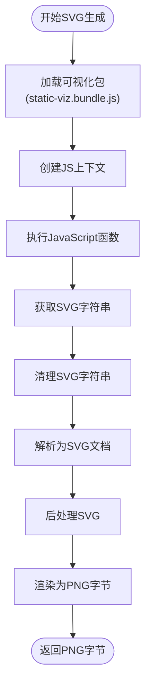

# 样式系统

<cite>
**本文档中引用的文件**  
- [style.clj](file://src/metabase/channel/render/style.clj)
- [color.clj](file://src/metabase/channel/render/js/color.clj)
- [svg.clj](file://src/metabase/channel/render/js/svg.clj)
- [engine.clj](file://src/metabase/channel/render/js/engine.clj)
- [core.clj](file://src/metabase/appearance/core.clj)
- [settings.clj](file://src/metabase/appearance/settings.clj)
- [body.clj](file://src/metabase/channel/render/body.clj)
- [card.clj](file://src/metabase/channel/render/card.clj)
- [core.clj](file://src/metabase/notification/payload/core.clj)
</cite>

## 目录
1. [简介](#简介)
2. [样式系统架构](#样式系统架构)
3. [CSS样式定义与应用](#css样式定义与应用)
4. [配色方案管理](#配色方案管理)
5. [SVG图形生成逻辑](#svg图形生成逻辑)
6. [前端JS资源协调](#前端js资源协调)
7. [通知渠道的视觉一致性](#通知渠道的视觉一致性)
8. [主题配置与自定义](#主题配置与自定义)
9. [系统集成与协调](#系统集成与协调)
10. [结论](#结论)

## 简介
Metabase的通知样式系统是一个复杂的视觉呈现框架，负责在不同通知渠道（如Email、Slack）中保持一致的视觉体验。该系统通过多个Clojure命名空间协同工作，实现了从CSS样式定义、配色方案管理到SVG图形生成的完整流程。核心组件包括style.clj中的CSS样式规则、color.clj中的配色逻辑、svg.clj中的图形生成以及engine.clj对前端JS资源的协调。

**本节不分析具体源文件**

## 样式系统架构
Metabase的样式系统采用分层架构设计，将样式定义、配色管理、图形生成和JS引擎协调分离到不同的命名空间中。系统通过render.core作为入口点，协调各个组件的工作。style.clj负责定义基础CSS样式和颜色常量，color.clj使用Nashorn JavaScript引擎处理复杂的颜色选择逻辑，svg.clj利用GraalVM的JS引擎生成SVG图形，而engine.clj则提供了JS执行环境的管理。

```mermaid
graph TB
subgraph "样式系统"
style[style.clj\nCSS样式定义]
color[color.clj\n配色方案]
svg[svg.clj\nSVG生成]
engine[engine.clj\nJS引擎协调]
appearance[appearance.core\n外观设置]
end
style --> color
style --> svg
color --> svg
engine --> svg
appearance --> style
appearance --> color
appearance --> svg
```

**Diagram sources**
- [style.clj](file://src/metabase/channel/render/style.clj)
- [color.clj](file://src/metabase/channel/render/js/color.clj)
- [svg.clj](file://src/metabase/channel/render/js/svg.clj)
- [engine.clj](file://src/metabase/channel/render/js/engine.clj)
- [core.clj](file://src/metabase/appearance/core.clj)

**Section sources**
- [style.clj](file://src/metabase/channel/render/style.clj)
- [color.clj](file://src/metabase/channel/render/js/color.clj)
- [svg.clj](file://src/metabase/channel/render/js/svg.clj)
- [engine.clj](file://src/metabase/channel/render/js/engine.clj)

## CSS样式定义与应用
style.clj是样式系统的核心，定义了所有CSS样式规则和辅助函数。`style`函数将Clojure风格的样式映射编译为标准CSS字符串，支持合并多个样式映射。系统定义了多个颜色常量，如`color-gold`用于错误提示，`color-error`用于错误消息，以及不同灰度级别的文本颜色。字体样式通过`font-style`函数定义，使用Lato字体族作为默认字体。


**Diagram sources**
- [style.clj](file://src/metabase/channel/render/style.clj#L0-L177)

**Section sources**
- [style.clj](file://src/metabase/channel/render/style.clj#L0-L177)

## 配色方案管理
color.clj通过Nashorn JavaScript引擎实现复杂的配色逻辑，特别是用于脉冲表单元格的背景颜色选择。系统使用`make-color-selector`函数创建一个JavaScript函数对象，该对象根据可视化设置中的规则确定单元格颜色。`get-background-color`函数则用于获取特定单元格的颜色值，返回适合CSS使用的字符串格式（如十六进制或rgba）。


**Diagram sources**
- [color.clj](file://src/metabase/channel/render/js/color.clj#L0-L101)

**Section sources**
- [color.clj](file://src/metabase/channel/render/js/color.clj#L0-L101)

## SVG图形生成逻辑
svg.clj负责通过GraalVM的JS引擎生成SVG图形，用于在通知中呈现图表。系统使用`with-static-viz-context`宏管理JS引擎上下文池，每个引擎实例占用约130MB内存，因此需要谨慎管理。`funnel`、`gauge`、`progress`等函数作为Clojure入口点，调用JavaScript代码生成SVG字符串，然后转换为PNG字节数组。系统还处理SVG的后处理，如修复填充属性和清除不必要的样式节点。



**Diagram sources**
- [svg.clj](file://src/metabase/channel/render/js/svg.clj#L0-L258)

**Section sources**
- [svg.clj](file://src/metabase/channel/render/js/svg.clj#L0-L258)

## 前端JS资源协调
engine.clj提供GraalVM Polyglot上下文的管理，用于执行JavaScript代码。系统使用`context`函数创建JS执行环境，并通过`load-resource`加载JavaScript资源文件。`execute-fn-name`和`execute-fn`函数用于在JS上下文中执行函数，由于GraalVM不支持JS的并发执行，系统使用锁来确保线程安全。`threadlocal-fifo-memoizer`函数实现线程本地的FIFO缓存，优化JS引擎的复用。


**Diagram sources**
- [engine.clj](file://src/metabase/channel/render/js/engine.clj#L0-L73)

**Section sources**
- [engine.clj](file://src/metabase/channel/render/js/engine.clj#L0-L73)

## 通知渠道的视觉一致性
系统通过统一的样式规则确保在不同通知渠道中保持视觉一致性。对于Email和Slack等渠道，系统使用相同的CSS样式和配色方案，但根据渠道特性进行适当调整。例如，在`body.clj`中，不同图表类型的渲染方法（如`:table`、`:scalar`、`:gauge`）都使用相同的样式函数，确保整体外观的一致性。系统还处理不同渠道的特殊需求，如Slack中的文本替代方案。

```mermaid
graph TB
subgraph "通知渠道"
Email[Email]
Slack[Slack]
Other[其他渠道]
end
subgraph "样式应用"
Table[表格渲染]
Scalar[标量渲染]
Gauge[仪表盘渲染]
Funnel[漏斗图渲染]
end
Email --> Table
Email --> Scalar
Email --> Gauge
Email --> Funnel
Slack --> Table
Slack --> Scalar
Slack --> Gauge
Slack --> Funnel
Other --> Table
Other --> Scalar
Other --> Gauge
Other --> Funnel
style.clj --> Table
style.clj --> Scalar
style.clj --> Gauge
style.clj --> Funnel
```

**Diagram sources**
- [body.clj](file://src/metabase/channel/render/body.clj#L0-L659)
- [style.clj](file://src/metabase/channel/render/style.clj#L0-L177)

**Section sources**
- [body.clj](file://src/metabase/channel/render/body.clj#L0-L659)

## 主题配置与自定义
appearance命名空间提供主题配置和自定义功能，允许用户通过设置自定义通知的整体外观。`application-color`和`secondary-chart-color`函数从appearance.settings中获取应用颜色，支持白标化配置。用户可以通过JSON格式的设置更改界面颜色和图表颜色，系统提供默认颜色方案作为回退。`application-font`设置允许替换默认的Lato字体族。


**Diagram sources**
- [settings.clj](file://src/metabase/appearance/settings.clj#L98-L149)
- [core.clj](file://src/metabase/appearance/core.clj#L0-L38)

**Section sources**
- [settings.clj](file://src/metabase/appearance/settings.clj#L98-L149)
- [core.clj](file://src/metabase/appearance/core.clj#L0-L38)

## 系统集成与协调
样式系统通过多个组件的紧密集成实现完整的功能。render.core作为集成点，导入各个组件的功能。card.clj中的`render-pulse-card`函数协调样式、颜色和图形生成，根据图表类型选择适当的渲染方法。系统还处理错误情况，如结果过大或渲染错误，提供一致的错误消息和视觉反馈。通知系统通过`notification-payload`函数将样式信息包含在通知上下文中。


**Diagram sources**
- [card.clj](file://src/metabase/channel/render/card.clj#L0-L281)
- [body.clj](file://src/metabase/channel/render/body.clj#L0-L659)
- [core.clj](file://src/metabase/notification/payload/core.clj#L0-L161)

**Section sources**
- [card.clj](file://src/metabase/channel/render/card.clj#L0-L281)
- [body.clj](file://src/metabase/channel/render/body.clj#L0-L659)
- [core.clj](file://src/metabase/notification/payload/core.clj#L0-L161)

## 结论
Metabase的通知样式系统通过精心设计的架构实现了跨渠道的视觉一致性。系统将CSS样式定义、配色方案管理、SVG图形生成和JS引擎协调分离到不同的组件中，同时通过统一的接口进行集成。appearance命名空间提供的主题配置功能允许用户自定义整体外观，而JS引擎的池化管理确保了性能和资源使用的平衡。整个系统展示了如何在复杂的应用中实现可维护且灵活的样式管理。

**本节不分析具体源文件**