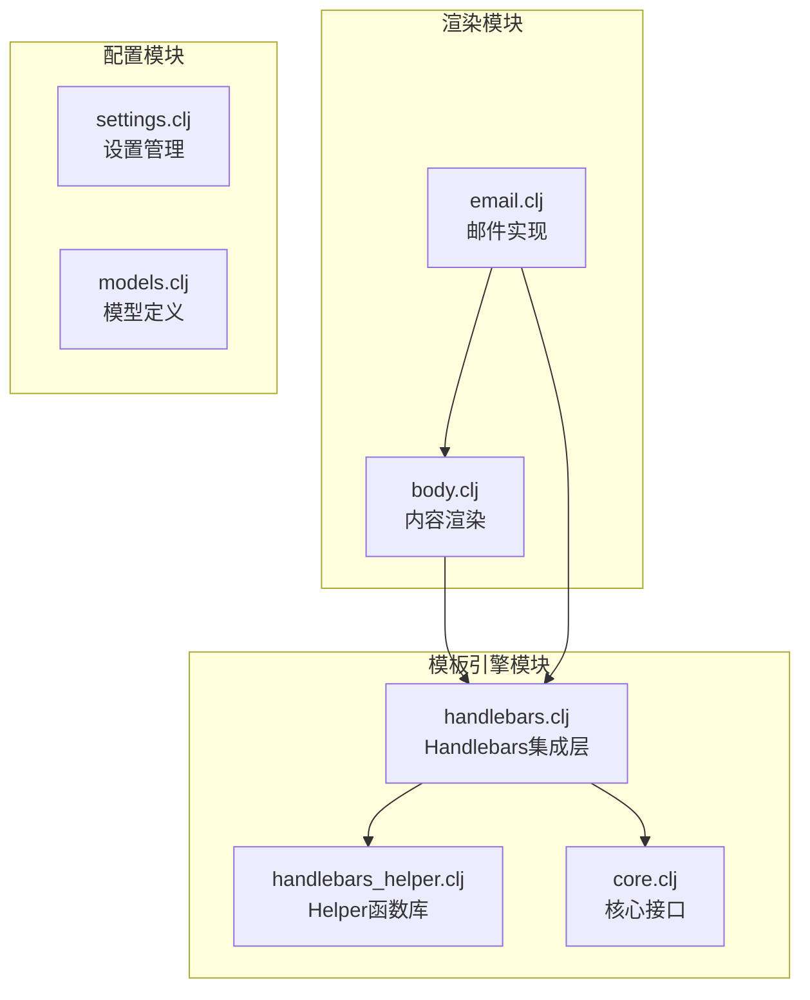
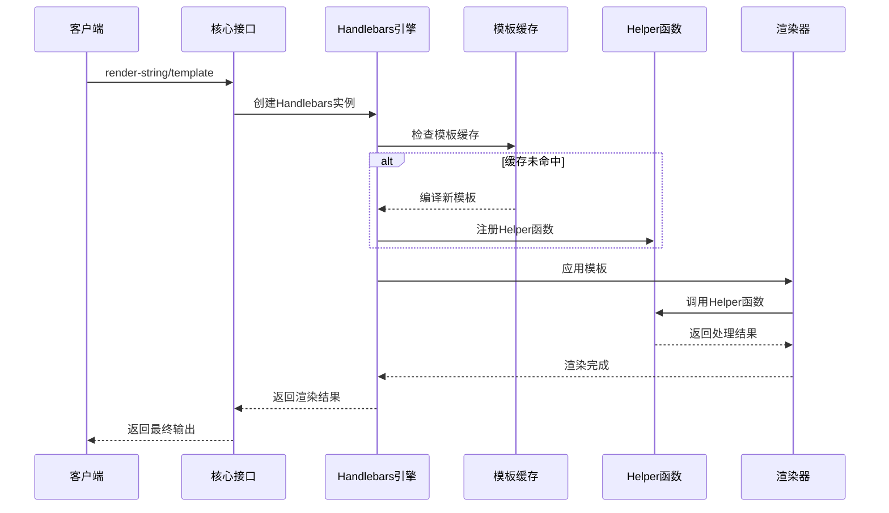
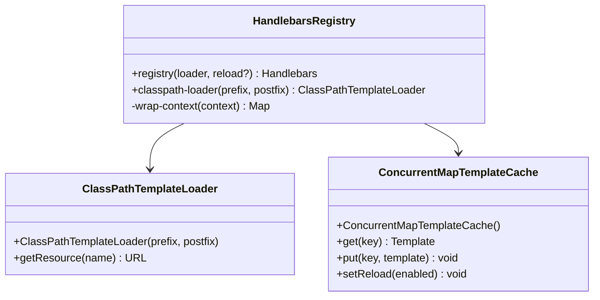
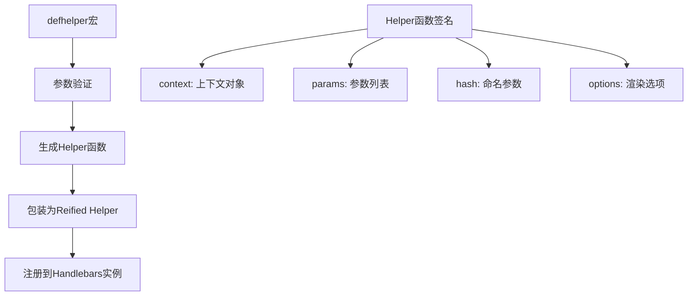
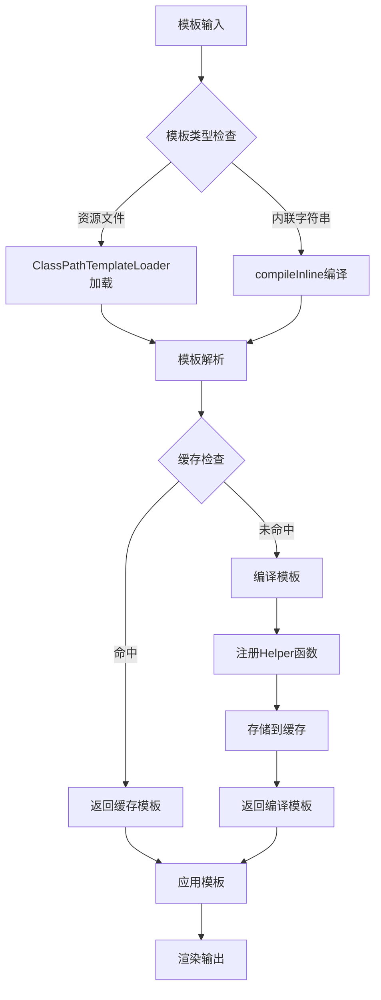
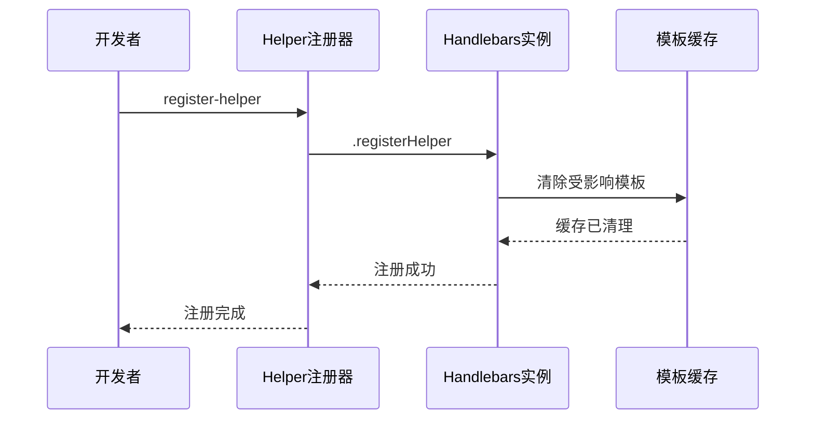
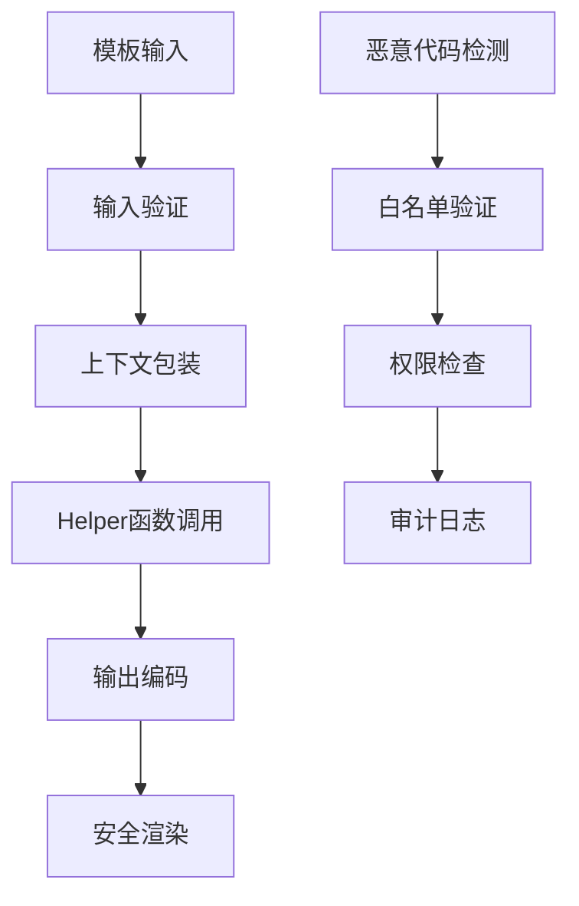

# 模板引擎

<cite>
**本文档中引用的文件**
- [handlebars.clj](file://src/metabase/channel/template/handlebars.clj)
- [handlebars_helper.clj](file://src/metabase/channel/template/handlebars_helper.clj)
- [core.clj](file://src/metabase/channel/template/core.clj)
- [body.clj](file://src/metabase/channel/render/body.clj)
- [email.clj](file://src/metabase/channel/impl/email.clj)
- [settings.clj](file://src/metabase/channel/settings.clj)
- [models.clj](file://src/metabase/channel/models/channel.clj)
</cite>

## 目录
1. [简介](#简介)
2. [项目结构](#项目结构)
3. [核心组件](#核心组件)
4. [架构概览](#架构概览)
5. [详细组件分析](#详细组件分析)
6. [模板编译与缓存机制](#模板编译与缓存机制)
7. [自定义Helper函数系统](#自定义helper函数系统)
8. [模板安全沙箱实现](#模板安全沙箱实现)
9. [使用示例](#使用示例)
10. [性能考虑](#性能考虑)
11. [故障排除指南](#故障排除指南)
12. [结论](#结论)

## 简介

Metabase的通知系统采用基于Handlebars的模板引擎来处理动态内容生成。该系统提供了强大的模板渲染能力，支持复杂的条件逻辑、数据格式化和自定义Helper函数。模板引擎不仅用于电子邮件通知，还广泛应用于仪表板订阅、提醒消息等场景。

核心特性包括：
- 基于Java的Handlebars.Java引擎集成
- 高效的模板编译与缓存机制
- 安全的沙箱环境防止恶意代码注入
- 丰富的内置Helper函数库
- 支持资源文件和内联模板两种模式

## 项目结构

模板引擎相关文件主要位于`src/metabase/channel/template/`目录下：



**图表来源**
- [handlebars.clj](file://src/metabase/channel/template/handlebars.clj#L1-L73)
- [handlebars_helper.clj](file://src/metabase/channel/template/handlebars_helper.clj#L1-L137)
- [core.clj](file://src/metabase/channel/template/core.clj#L1-L10)

**章节来源**
- [handlebars.clj](file://src/metabase/channel/template/handlebars.clj#L1-L73)
- [handlebars_helper.clj](file://src/metabase/channel/template/handlebars_helper.clj#L1-L137)
- [core.clj](file://src/metabase/channel/template/core.clj#L1-L10)

## 核心组件

### Handlebars集成层

Handlebars集成层负责与Java的Handlebars.Java库进行交互，提供Clojure风格的API接口。

主要功能：
- 创建Handlebars实例和模板加载器
- 实现模板编译与缓存机制
- 提供模板渲染接口
- 处理上下文数据转换

### Helper函数系统

Helper函数系统提供了丰富的预定义函数，支持日期格式化、字符串处理、URL生成等功能。

核心Helper函数：
- `equals`: 值比较
- `format-date`: 日期格式化
- `now`: 获取当前时间
- `initials`: 获取姓名首字母
- `card-url`: 生成卡片链接
- `dashboard-url`: 生成仪表板链接

### 缓存机制

系统实现了高效的模板缓存机制，避免重复编译相同的模板。

**章节来源**
- [handlebars.clj](file://src/metabase/channel/template/handlebars.clj#L15-L45)
- [handlebars_helper.clj](file://src/metabase/channel/template/handlebars_helper.clj#L95-L137)

## 架构概览



**图表来源**
- [handlebars.clj](file://src/metabase/channel/template/handlebars.clj#L50-L71)
- [core.clj](file://src/metabase/channel/template/core.clj#L1-L10)

## 详细组件分析

### Handlebars集成层详细分析

Handlebars集成层是整个模板系统的核心，负责与Java Handlebars库的桥接工作。

#### 模板加载器配置



**图表来源**
- [handlebars.clj](file://src/metabase/channel/template/handlebars.clj#L15-L35)

#### 默认模板实例

系统维护了一个延迟初始化的默认Handlebars实例，确保在需要时才创建：

- 使用类路径模板加载器
- 启用并发安全的模板缓存
- 自动注册所有默认Helper函数
- 开发环境下支持热重载

**章节来源**
- [handlebars.clj](file://src/metabase/channel/template/handlebars.clj#L35-L45)

### Helper函数系统详细分析

Helper函数系统提供了强大的模板扩展能力，支持各种业务逻辑处理。

#### Helper函数定义宏



**图表来源**
- [handlebars_helper.clj](file://src/metabase/channel/template/handlebars_helper.clj#L35-L60)

#### 内置Helper函数详解

| Helper名称 | 功能描述 | 参数示例 | 使用场景 |
|------------|----------|----------|----------|
| `equals` | 值相等比较 | `{{equals product.name "Hot Dog"}}` | 条件渲染 |
| `format-date` | 日期格式化 | `{{format-date date "YYYY-MM-DD"}}` | 时间显示 |
| `now` | 当前时间 | `{{format-date (now) "HH:mm:ss"}}` | 实时更新 |
| `initials` | 获取首字母 | `{{initials "John Doe"}}` | 用户头像 |
| `card-url` | 卡片链接 | `{{card-url 10}}` | 导航链接 |
| `dashboard-url` | 仪表板链接 | `{{dashboard-url 5}}` | 页面跳转 |

**章节来源**
- [handlebars_helper.clj](file://src/metabase/channel/template/handlebars_helper.clj#L70-L137)

## 模板编译与缓存机制

### 缓存策略

系统采用多层缓存策略来优化性能：

1. **模板级缓存**: 编译后的模板对象缓存
2. **上下文缓存**: 处理后的渲染上下文缓存
3. **Helper缓存**: Helper函数实例缓存

### 编译流程



**图表来源**
- [handlebars.clj](file://src/metabase/channel/template/handlebars.clj#L50-L71)

### 开发环境热重载

系统在开发环境中提供了模板热重载功能：

- 监听Helper函数变化
- 自动重新注册Helper
- 错误恢复机制
- 日志记录

**章节来源**
- [handlebars.clj](file://src/metabase/channel/template/handlebars.clj#L40-L50)

## 自定义Helper函数系统

### Helper函数注册机制

系统提供了灵活的Helper函数注册机制，支持运行时动态添加：



**图表来源**
- [handlebars_helper.clj](file://src/metabase/channel/template/handlebars_helper.clj#L65-L75)

### Helper函数开发规范

自定义Helper函数需要遵循特定的开发规范：

1. **参数签名**: 固定的四个参数：context、params、hash、options
2. **错误处理**: 适当的异常处理和验证
3. **性能优化**: 避免重复计算和不必要的操作
4. **安全性**: 输入验证和输出编码

**章节来源**
- [handlebars_helper.clj](file://src/metabase/channel/template/handlebars_helper.clj#L35-L60)

## 模板安全沙箱实现

### 安全机制概述

虽然当前代码中没有显式的沙箱实现，但系统通过以下方式确保模板安全：

1. **上下文包装**: 自动转换关键字为字符串
2. **Helper限制**: 受控的Helper函数集合
3. **输入验证**: Malli Schema验证
4. **输出编码**: 自动HTML实体编码

### 安全最佳实践



**图表来源**
- [handlebars.clj](file://src/metabase/channel/template/handlebars.clj#L35-L45)

### 模板验证机制

系统通过Malli Schema对模板数据进行严格验证：

- 类型检查
- 结构验证
- 权限控制
- 审计跟踪

**章节来源**
- [models.clj](file://src/metabase/channel/models/channel.clj#L66-L102)

## 使用示例

### 基本模板渲染

以下是模板渲染的基本使用模式：

#### 内联模板示例

```clojure
;; 基础文本渲染
(render-string "Hello {{name}}" {:name "World"})

;; 条件渲染
(render-string "{{#if isAdmin}}Admin Panel{{else}}User Panel{{/if}}" 
               {:isAdmin true})

;; 循环渲染
(render-string "{{#each users}}{{this.name}}{{/each}}" 
               {:users [{:name "Alice"} {:name "Bob"}]})
```

#### 资源模板示例

```clojure
;; 使用资源文件模板
(render "/templates/notification.hbs" 
        {:user {:name "John" :email "john@example.com"}
         :timestamp (now)
         :action "login"})
```

### 高级模板示例

#### 日期格式化模板

```clojure
;; 日期格式化
(render-string "{{format-date timestamp \"YYYY-MM-DD HH:mm:ss\"}}" 
               {:timestamp (now)})

;; 相对时间格式化
(render-string "{{format-date timestamp \"relative\"}}" 
               {:timestamp (t/instant)})
```

#### 条件逻辑模板

```clojure
;; 复杂条件判断
(render-string "{{#if (equals role \"admin\")}}"
               "{{#if (equals permission \"full\")}}"
               "Full Access Granted"
               "{{else}}"
               "Limited Access"
               "{{/if}}"
               "{{else}}"
               "Standard Access"
               "{{/if}}"
               {:role "admin" :permission "limited"})
```

### 上下文数据绑定

#### 数据结构示例

```clojure
;; 复杂上下文结构
{
  :user {:id 123 :name "Alice" :email "alice@example.com"}
  :dashboard {:id 456 :name "Sales Report"}
  :metrics {:revenue 100000 :growth 0.15}
  :timestamp (now)
  :settings {:timezone "UTC" :locale "en-US"}
}
```

#### 模板访问示例

```clojure
;; 访问嵌套字段
"Welcome {{user.name}}!"

;; 访问数组元素
"Last sale: {{metrics.revenue}}"

;; 访问设置值
"Timezone: {{settings.timezone}}"
```

**章节来源**
- [handlebars.clj](file://src/metabase/channel/template/handlebars.clj#L50-L71)
- [email.clj](file://src/metabase/channel/impl/email.clj#L90-L110)

## 性能考虑

### 缓存策略优化

1. **模板缓存**: 编译后模板长期缓存
2. **上下文缓存**: 处理后的数据结构缓存
3. **Helper缓存**: 函数实例缓存
4. **LRU淘汰**: 过期模板自动清理

### 渲染性能优化

- **延迟加载**: 按需编译模板
- **批量处理**: 批量渲染相似模板
- **内存管理**: 及时释放不用的模板实例
- **并发安全**: 线程安全的缓存实现

### 监控指标

系统监控以下关键性能指标：
- 模板编译时间
- 缓存命中率
- 渲染响应时间
- 内存使用情况

## 故障排除指南

### 常见问题及解决方案

#### 模板编译错误

**问题**: 模板语法错误导致编译失败
**解决方案**: 
- 检查Handlebars语法
- 验证Helper函数存在性
- 确认上下文数据结构

#### 缓存问题

**问题**: 模板更新不生效
**解决方案**:
- 清理模板缓存
- 检查缓存配置
- 验证热重载设置

#### 性能问题

**问题**: 模板渲染速度慢
**解决方案**:
- 分析缓存命中率
- 优化复杂模板逻辑
- 减少Helper函数调用

### 调试工具

系统提供了多种调试工具：

- 模板编译日志
- 缓存状态监控
- 渲染性能分析
- 错误堆栈跟踪

**章节来源**
- [handlebars.clj](file://src/metabase/channel/template/handlebars.clj#L40-L50)

## 结论

Metabase的通知系统模板引擎是一个功能强大且设计精良的解决方案。它成功地将Java的Handlebars.Java库与Clojure生态系统相结合，提供了高性能、安全可靠的模板渲染能力。

### 主要优势

1. **高性能**: 多层缓存机制确保快速渲染
2. **安全性**: 受控的Helper函数和输入验证
3. **可扩展性**: 易于添加自定义Helper函数
4. **易用性**: 简洁的API设计和丰富的内置功能
5. **可靠性**: 完善的错误处理和监控机制

### 最佳实践建议

1. **合理使用缓存**: 充分利用模板缓存机制
2. **安全编码**: 始终对用户输入进行验证
3. **性能监控**: 定期检查渲染性能指标
4. **错误处理**: 实现完善的异常处理机制
5. **测试覆盖**: 对模板逻辑进行全面测试

该模板引擎为Metabase的通知系统提供了坚实的基础，支持复杂的业务场景需求，同时保持了良好的性能和可维护性。