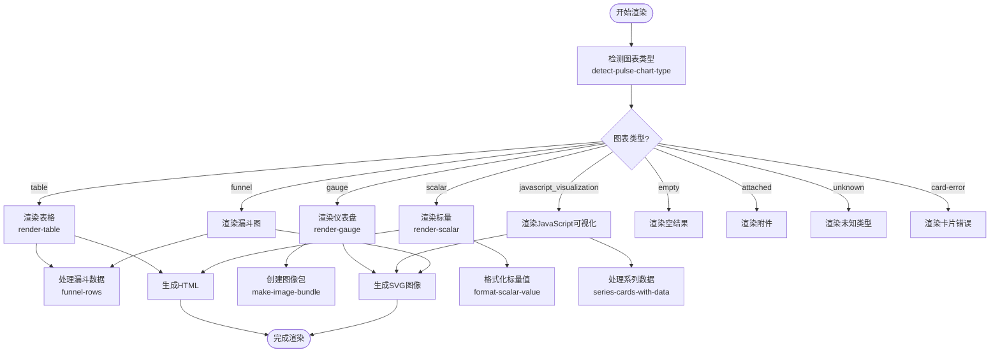

# 渲染管道

<cite>
**本文档中引用的文件**  
- [core.clj](file://src/metabase/channel/render/core.clj)
- [body.clj](file://src/metabase/channel/render/body.clj)
- [preview.clj](file://src/metabase/channel/render/preview.clj)
- [util.clj](file://src/metabase/channel/render/util.clj)
- [card.clj](file://src/metabase/channel/render/card.clj)
- [image_bundle.clj](file://src/metabase/channel/render/image_bundle.clj)
- [png.clj](file://src/metabase/channel/render/png.clj)
- [style.clj](file://src/metabase/channel/render/style.clj)
- [table.clj](file://src/metabase/channel/render/table.clj)
</cite>

## 目录
1. [渲染管道概述](#渲染管道概述)
2. [核心协调机制](#核心协调机制)
3. [通知主体结构构建](#通知主体结构构建)
4. [预览内容生成](#预览内容生成)
5. [通用渲染辅助函数](#通用渲染辅助函数)
6. [错误处理与降级机制](#错误处理与降级机制)
7. [渲染策略与数据流](#渲染策略与数据流)
8. [模板引擎集成](#模板引擎集成)

## 渲染管道概述

Metabase系统中的通知渲染管道是一个复杂的系统，负责将数据查询结果转换为最终的可视化通知内容。该管道通过多个组件的协同工作，实现了从原始数据到最终HTML/PNG输出的完整转换过程。渲染管道的核心目标是确保通知内容在各种情况下都能正确、美观地呈现，同时提供灵活的定制选项和可靠的错误处理机制。

**Section sources**
- [core.clj](file://src/metabase/channel/render/core.clj#L1-L35)
- [body.clj](file://src/metabase/channel/render/body.clj#L1-L660)

## 核心协调机制

渲染管道的核心协调工作由`core.clj`文件中的组件完成。该文件通过`potemkin/import-vars`宏导入了多个关键命名空间的函数，实现了对整个渲染系统的统一协调。核心协调机制主要包括模板引擎、数据上下文和渲染策略的整合。

`core.clj`文件导入了`image-bundle`、`style`、`render.preview`、`render.card`和`js.svg`等关键组件，这些组件共同构成了渲染管道的基础。通过这种模块化的设计，系统能够灵活地组合不同的渲染策略，同时保持代码的清晰性和可维护性。

**Diagram sources**
- [core.clj](file://src/metabase/channel/render/core.clj#L1-L35)

**Section sources**
- [core.clj](file://src/metabase/channel/render/core.clj#L1-L35)

## 通知主体结构构建

通知主体结构的构建主要由`body.clj`文件负责。该文件定义了`render`多方法，根据不同的图表类型（如`:table`、`:gauge`、`:scalar`等）采用相应的渲染策略。`body.clj`通过Hiccup库生成HTML结构，确保输出的HTML既符合语义化标准，又具有良好的可读性。

`body.clj`文件中的`render`多方法是整个渲染管道的核心。它根据图表类型分发到不同的实现方法，每个实现方法负责将数据转换为特定的HTML结构。例如，`:table`类型的图表会调用`render-table`函数，而`:gauge`类型的图表则会生成SVG图像。

**Diagram sources**
- [body.clj](file://src/metabase/channel/render/body.clj#L1-L660)

**Section sources**
- [body.clj](file://src/metabase/channel/render/body.clj#L1-L660)

## 预览内容生成

预览内容的生成由`preview.clj`文件负责。该文件提供了`render-dashboard-to-html`函数，用于将仪表板转换为HTML预览。预览功能对于用户在发送通知前查看最终效果至关重要，它提供了一个快速的反馈循环。

`preview.clj`文件中的`render-dashboard-to-hiccup`函数是预览生成的核心。它遍历仪表板中的所有卡片，使用`render-one-dashcard`函数将每个卡片渲染为Hiccup数据结构。然后，这些Hiccup结构被组合成一个完整的HTML文档。

**Diagram sources**
- [preview.clj](file://src/metabase/channel/render/preview.clj#L1-L167)

**Section sources**
- [preview.clj](file://src/metabase/channel/render/preview.clj#L1-L167)

## 通用渲染辅助函数

`util.clj`文件提供了多种通用的渲染辅助函数，这些函数在渲染管道的各个阶段都被广泛使用。这些辅助函数包括视觉化工具判断、数据合并、参数渲染等功能，极大地增强了渲染系统的灵活性和可扩展性。

`util.clj`中的`is-visualizer-dashcard?`函数用于判断一个仪表板卡片是否为视觉化工具类型，这对于正确选择渲染策略至关重要。`merge-visualizer-data`函数则负责将多个卡片的数据合并为一个统一的数据集，这对于复杂的视觉化图表（如漏斗图）是必需的。

**Diagram sources**
- [util.clj](file://src/metabase/channel/render/util.clj#L1-L202)

**Section sources**
- [util.clj](file://src/metabase/channel/render/util.clj#L1-L202)

## 错误处理与降级机制

渲染管道具有完善的错误处理与降级机制，确保在模板或数据异常时仍能生成可读的通知。这些机制由多个组件共同实现，包括`body.clj`中的错误渲染方法和`card.clj`中的异常捕获逻辑。

`body.clj`文件定义了多个错误渲染方法，如`:card-error`、`:card-error/results-too-large`和`:render-error`。这些方法提供了不同级别的错误处理，从简单的错误消息到详细的错误信息展示。当渲染过程中发生异常时，系统会优雅地降级到这些错误渲染方法，而不是完全失败。

**Diagram sources**
- [body.clj](file://src/metabase/channel/render/body.clj#L1-L660)
- [card.clj](file://src/metabase/channel/render/card.clj#L1-L282)

**Section sources**
- [body.clj](file://src/metabase/channel/render/body.clj#L1-L660)
- [card.clj](file://src/metabase/channel/render/card.clj#L1-L282)

## 渲染策略与数据流

渲染管道的数据流和策略选择是一个复杂但有序的过程。从数据查询结果到最终的HTML/PNG输出，数据经过多个处理阶段，每个阶段都有明确的职责和输出格式。

数据流始于`card.clj`文件中的`render-pulse-card`函数，该函数接收卡片、仪表板卡片和查询结果作为输入。首先，系统通过`detect-pulse-chart-type`函数检测图表类型，然后根据类型选择相应的渲染策略。对于表格类型，数据会经过`prep-for-html-rendering`函数处理；对于图表类型，数据会转换为SVG或PNG图像。

**Diagram sources**
- [card.clj](file://src/metabase/channel/render/card.clj#L1-L282)
- [body.clj](file://src/metabase/channel/render/body.clj#L1-L660)
- [png.clj](file://src/metabase/channel/render/png.clj#L1-L143)

**Section sources**
- [card.clj](file://src/metabase/channel/render/card.clj#L1-L282)
- [body.clj](file://src/metabase/channel/render/body.clj#L1-L660)
- [png.clj](file://src/metabase/channel/render/png.clj#L1-L143)

## 模板引擎集成

渲染管道与模板引擎的集成主要通过`image_bundle.clj`和`png.clj`文件实现。`image_bundle.clj`文件负责处理图像资源的管理和嵌入，而`png.clj`文件则负责将HTML内容渲染为PNG图像。

`image_bundle.clj`文件中的`make-image-bundle`多方法是图像资源管理的核心。它根据渲染类型（`:inline`或`:attachment`）和资源类型（URL或字节数组）选择适当的实现方法。对于内联渲染，图像数据会被编码为Base64 URI；对于附件渲染，图像会被分配一个内容ID并作为邮件附件。

**Diagram sources**
- [image_bundle.clj](file://src/metabase/channel/render/image_bundle.clj#L1-L125)
- [png.clj](file://src/metabase/channel/render/png.clj#L1-L143)
- [style.clj](file://src/metabase/channel/render/style.clj#L1-L178)

**Section sources**
- [image_bundle.clj](file://src/metabase/channel/render/image_bundle.clj#L1-L125)
- [png.clj](file://src/metabase/channel/render/png.clj#L1-L143)
- [style.clj](file://src/metabase/channel/render/style.clj#L1-L178)