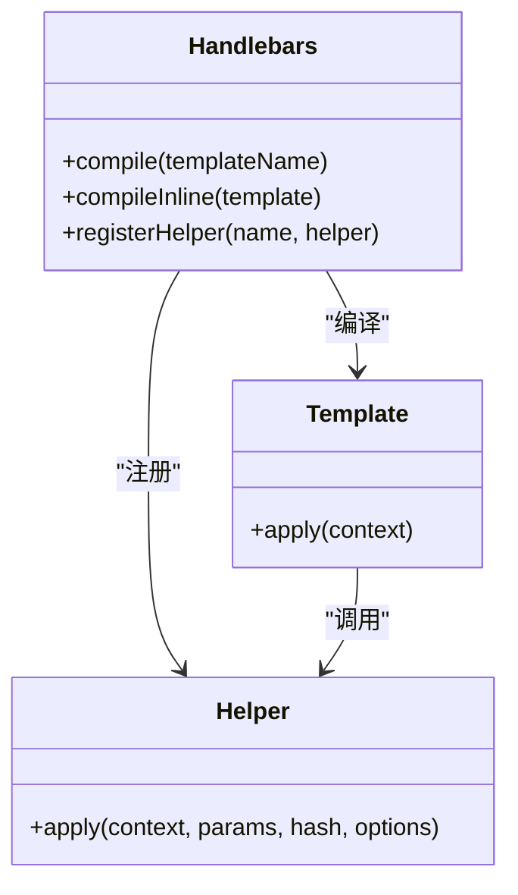
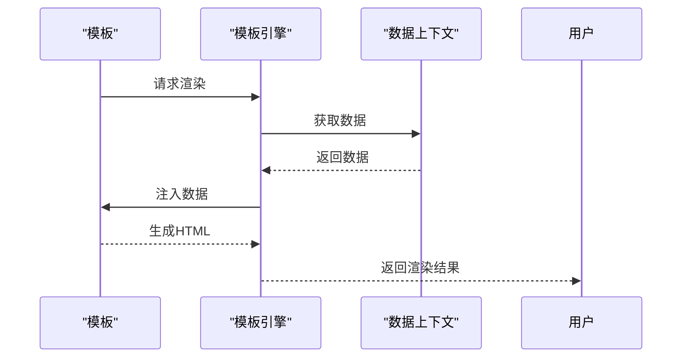
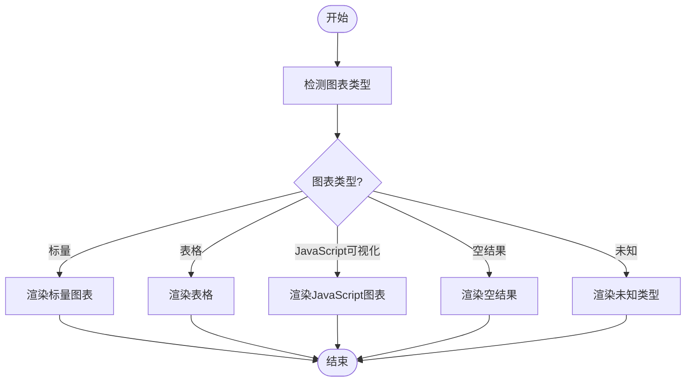
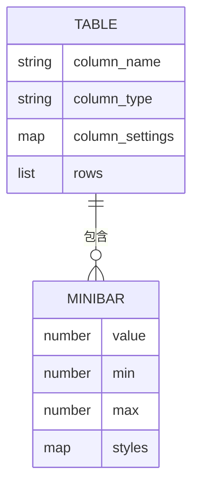
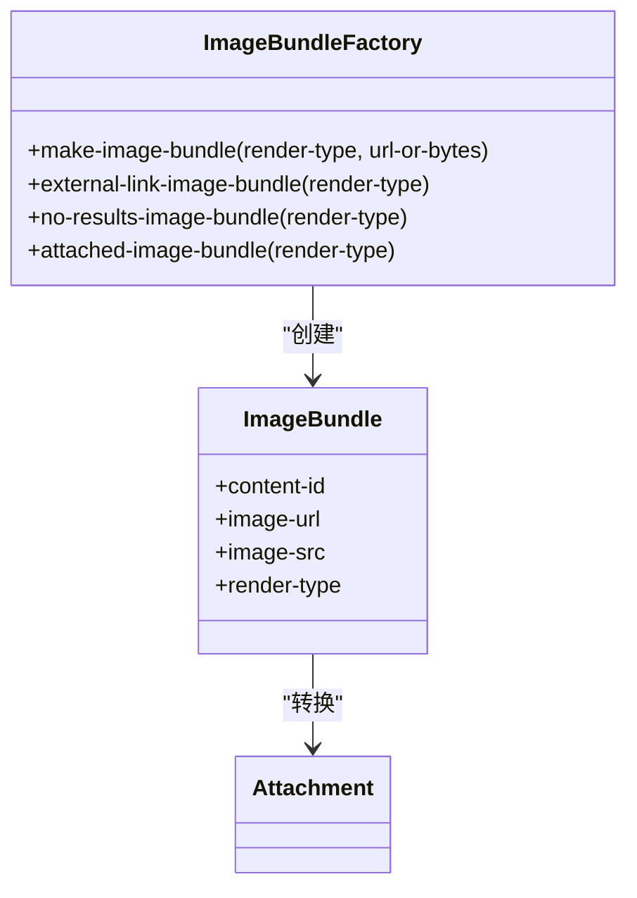
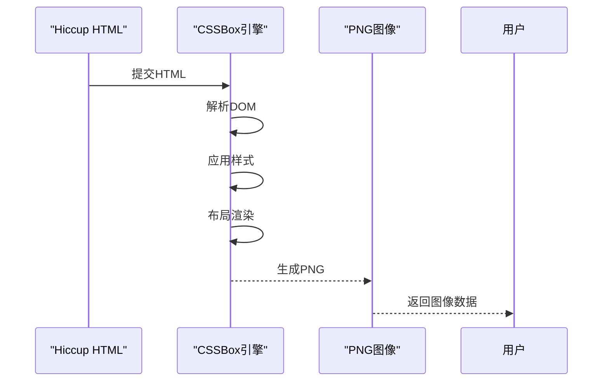
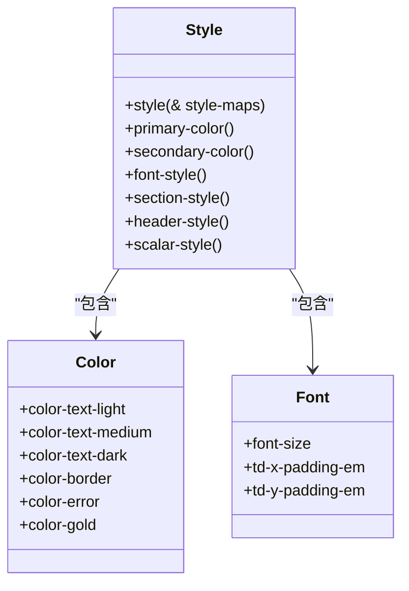
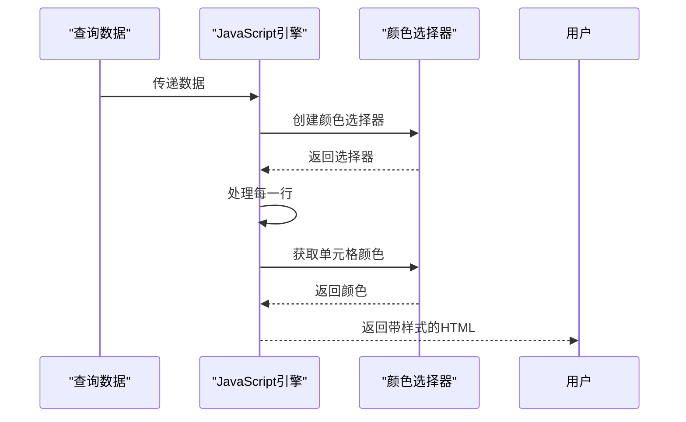
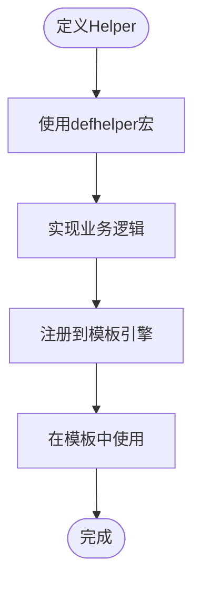
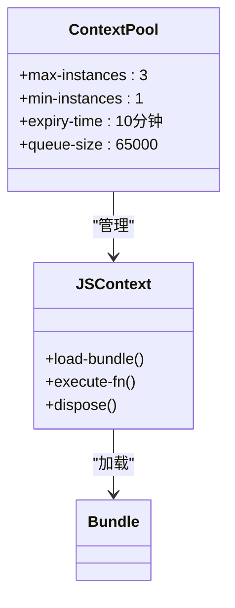

# 通知内容渲染

<cite>
**本文档中引用的文件**
- [core.clj](file://src/metabase/channel/render/core.clj)
- [card.clj](file://src/metabase/channel/render/card.clj)
- [table.clj](file://src/metabase/channel/render/table.clj)
- [image_bundle.clj](file://src/metabase/channel/render/image_bundle.clj)
- [style.clj](file://src/metabase/channel/render/style.clj)
- [body.clj](file://src/metabase/channel/render/body.clj)
- [handlebars.clj](file://src/metabase/channel/template/handlebars.clj)
- [handlebars_helper.clj](file://src/metabase/channel/template/handlebars_helper.clj)
- [png.clj](file://src/metabase/channel/render/png.clj)
- [util.clj](file://src/metabase/channel/render/util.clj)
- [svg.clj](file://src/metabase/channel/render/js/svg.clj)
- [color.clj](file://src/metabase/channel/render/js/color.clj)
</cite>

## 目录
1. [引言](#引言)
2. [渲染管道架构](#渲染管道架构)
3. [模板引擎与数据绑定](#模板引擎与数据绑定)
4. [可视化片段生成](#可视化片段生成)
5. [图表图像生成与嵌入](#图表图像生成与嵌入)
6. [样式系统与视觉一致性](#样式系统与视觉一致性)
7. [自定义模板开发指南](#自定义模板开发指南)
8. [结论](#结论)

## 引言

Metabase的通知内容渲染系统是一个复杂的管道，负责将查询结果转换为跨渠道的可视化通知内容。该系统通过一系列精心设计的组件，实现了从数据查询到最终可视化输出的完整流程。本深度文档将详细解析render/core.clj中的渲染管道设计，包括模板引擎与数据上下文的绑定机制，以及各种可视化组件的工作原理。

**Section sources**
- [core.clj](file://src/metabase/channel/render/core.clj)

## 渲染管道架构

通知内容渲染系统的核心是render/core.clj文件，它定义了整个渲染管道的架构和主要组件。该系统采用模块化设计，通过多个命名空间协同工作，实现从数据到可视化的转换。

**Diagram sources**
- [core.clj](file://src/metabase/channel/render/core.clj)

**Section sources**
- [core.clj](file://src/metabase/channel/render/core.clj)

## 模板引擎与数据绑定

### Handlebars模板引擎

通知系统使用Handlebars模板引擎来处理内容渲染。handlebars.clj文件定义了模板渲染的核心功能，包括模板编译、上下文绑定和安全字符串处理。

**Diagram sources**
- [handlebars.clj](file://src/metabase/channel/template/handlebars.clj)

### 数据上下文绑定机制

模板引擎通过上下文绑定机制将数据注入到模板中。当调用render函数时，系统会创建一个包含所有必要数据的上下文对象，并将其传递给模板引擎。

**Diagram sources**
- [handlebars.clj](file://src/metabase/channel/template/handlebars.clj)
- [handlebars_helper.clj](file://src/metabase/channel/template/handlebars_helper.clj)

**Section sources**
- [handlebars.clj](file://src/metabase/channel/template/handlebars.clj)
- [handlebars_helper.clj](file://src/metabase/channel/template/handlebars_helper.clj)

## 可视化片段生成

### 卡片渲染机制

card.clj文件负责将查询结果转换为可视化卡片。系统通过detect-pulse-chart-type函数检测图表类型，并根据不同的图表类型调用相应的渲染方法。

**Diagram sources**
- [card.clj](file://src/metabase/channel/render/card.clj)

### 表格渲染实现

table.clj文件实现了表格的详细渲染逻辑，包括表头、表体和迷你条形图的生成。系统通过column->viz-setting-styles函数根据可视化设置生成列样式。

**Diagram sources**
- [table.clj](file://src/metabase/channel/render/table.clj)

**Section sources**
- [card.clj](file://src/metabase/channel/render/card.clj)
- [table.clj](file://src/metabase/channel/render/table.clj)

## 图表图像生成与嵌入

### 图像包生成流程

image_bundle.clj文件负责处理图像的生成和嵌入。系统通过make-image-bundle多态函数根据渲染类型创建图像包，支持内联和附件两种模式。

**Diagram sources**
- [image_bundle.clj](file://src/metabase/channel/render/image_bundle.clj)

### PNG图像渲染

png.clj文件实现了HTML到PNG图像的转换。系统使用CSSBox库将Hiccup格式的HTML渲染为PNG图像，支持字体注册和字符编码处理。

**Diagram sources**
- [png.clj](file://src/metabase/channel/render/png.clj)

**Section sources**
- [image_bundle.clj](file://src/metabase/channel/render/image_bundle.clj)
- [png.clj](file://src/metabase/channel/render/png.clj)

## 样式系统与视觉一致性

### 样式管理机制

style.clj文件定义了整个通知系统的样式规范，确保跨渠道的视觉一致性。系统通过style函数将CSS样式映射编译为字符串。

**Diagram sources**
- [style.clj](file://src/metabase/channel/render/style.clj)

### 数据可视化中的颜色应用

svg.clj和color.clj文件共同实现了数据可视化中的颜色应用。系统使用GraalJS引擎执行JavaScript代码来确定表格单元格的背景颜色。

**Diagram sources**
- [svg.clj](file://src/metabase/channel/render/js/svg.clj)
- [color.clj](file://src/metabase/channel/render/js/color.clj)

**Section sources**
- [style.clj](file://src/metabase/channel/render/style.clj)
- [svg.clj](file://src/metabase/channel/render/js/svg.clj)
- [color.clj](file://src/metabase/channel/render/js/color.clj)

## 自定义模板开发指南

### Helper函数扩展

开发者可以通过defhelper宏定义自定义Helper函数来扩展模板功能。每个Helper函数接受四个参数：上下文、参数、哈希和选项。

**Diagram sources**
- [handlebars_helper.clj](file://src/metabase/channel/template/handlebars_helper.clj)

### 安全沙箱配置

系统通过延迟加载和内存池管理来确保模板渲染的安全性。静态可视化上下文池(static-viz-context-pool)限制了JS引擎实例的数量，防止内存溢出。

**Diagram sources**
- [svg.clj](file://src/metabase/channel/render/js/svg.clj)

**Section sources**
- [handlebars_helper.clj](file://src/metabase/channel/template/handlebars_helper.clj)
- [svg.clj](file://src/metabase/channel/render/js/svg.clj)

## 结论

Metabase的通知内容渲染系统是一个高度模块化和可扩展的架构，通过精心设计的组件协同工作，实现了从数据查询到最终可视化输出的完整流程。系统的核心优势在于其灵活性和可定制性，开发者可以通过扩展Helper函数和自定义模板来满足各种业务需求。同时，系统通过安全沙箱配置和内存管理机制确保了渲染过程的稳定性和安全性。