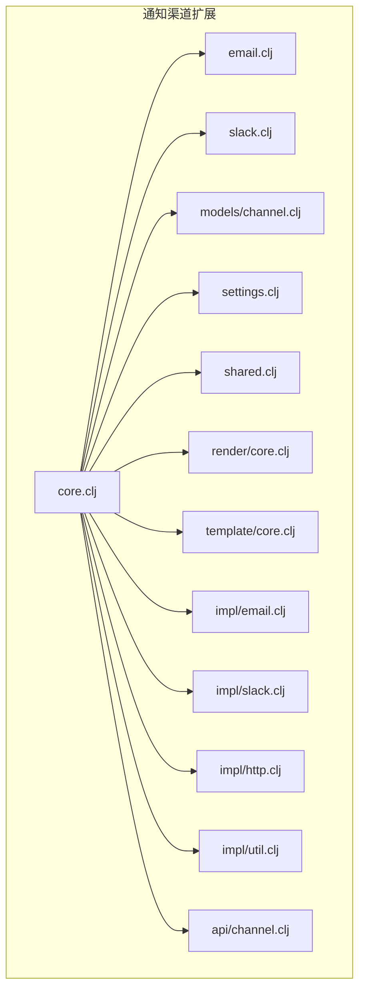
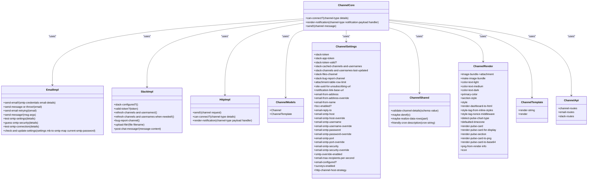
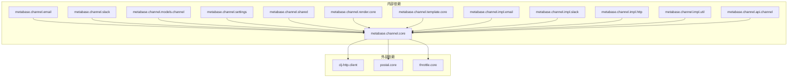

# 通知渠道扩展

<cite>
**本文档中引用的文件**  
- [core.clj](file://src/metabase/channel/core.clj)
- [email.clj](file://src/metabase/channel/email.clj)
- [slack.clj](file://src/metabase/channel/slack.clj)
- [models/channel.clj](file://src/metabase/channel/models/channel.clj)
- [settings.clj](file://src/metabase/channel/settings.clj)
- [shared.clj](file://src/metabase/channel/shared.clj)
- [render/core.clj](file://src/metabase/channel/render/core.clj)
- [template/core.clj](file://src/metabase/channel/template/core.clj)
- [impl/email.clj](file://src/metabase/channel/impl/email.clj)
- [impl/slack.clj](file://src/metabase/channel/impl/slack.clj)
- [impl/http.clj](file://src/metabase/channel/impl/http.clj)
- [impl/util.clj](file://src/metabase/channel/impl/util.clj)
- [api/channel.clj](file://src/metabase/channel/api/channel.clj)
</cite>

## 目录
1. [简介](#简介)
2. [项目结构](#项目结构)
3. [核心组件](#核心组件)
4. [架构概述](#架构概述)
5. [详细组件分析](#详细组件分析)
6. [依赖分析](#依赖分析)
7. [性能考虑](#性能考虑)
8. [故障排除指南](#故障排除指南)
9. [结论](#结论)

## 简介
本文档全面介绍了Metabase中的通知渠道扩展系统。该系统提供了一个灵活的框架，用于通过多种渠道（如电子邮件、Slack和Webhook）发送通知。文档详细说明了渠道抽象的定义、消息格式、传输协议和错误处理机制。此外，还涵盖了邮件和Slack集成的具体实现细节，包括模板渲染、附件处理和API调用。文档还解释了通知渠道的注册和配置流程，以及如何扩展支持新的通知方式（如Webhook、SMS等）。最后，文档提供了消息序列化、异步发送和失败重试策略的最佳实践，并结合pulse_channel模型，说明了通知渠道与定时报告系统的集成方式。

## 项目结构
Metabase的通知渠道扩展系统位于`src/metabase/channel`目录下，包含多个子模块，每个模块负责不同的功能。主要模块包括`core.clj`、`email.clj`、`slack.clj`、`models/channel.clj`、`settings.clj`、`shared.clj`、`render/core.clj`、`template/core.clj`、`impl/email.clj`、`impl/slack.clj`、`impl/http.clj`、`impl/util.clj`和`api/channel.clj`。这些模块共同构成了一个完整的通知渠道扩展系统。

**图表来源**
- [core.clj](file://src/metabase/channel/core.clj)
- [email.clj](file://src/metabase/channel/email.clj)
- [slack.clj](file://src/metabase/channel/slack.clj)
- [models/channel.clj](file://src/metabase/channel/models/channel.clj)
- [settings.clj](file://src/metabase/channel/settings.clj)
- [shared.clj](file://src/metabase/channel/shared.clj)
- [render/core.clj](file://src/metabase/channel/render/core.clj)
- [template/core.clj](file://src/metabase/channel/template/core.clj)
- [impl/email.clj](file://src/metabase/channel/impl/email.clj)
- [impl/slack.clj](file://src/metabase/channel/impl/slack.clj)
- [impl/http.clj](file://src/metabase/channel/impl/http.clj)
- [impl/util.clj](file://src/metabase/channel/impl/util.clj)
- [api/channel.clj](file://src/metabase/channel/api/channel.clj)

**章节来源**
- [core.clj](file://src/metabase/channel/core.clj)
- [email.clj](file://src/metabase/channel/email.clj)
- [slack.clj](file://src/metabase/channel/slack.clj)
- [models/channel.clj](file://src/metabase/channel/models/channel.clj)
- [settings.clj](file://src/metabase/channel/settings.clj)
- [shared.clj](file://src/metabase/channel/shared.clj)
- [render/core.clj](file://src/metabase/channel/render/core.clj)
- [template/core.clj](file://src/metabase/channel/template/core.clj)
- [impl/email.clj](file://src/metabase/channel/impl/email.clj)
- [impl/slack.clj](file://src/metabase/channel/impl/slack.clj)
- [impl/http.clj](file://src/metabase/channel/impl/http.clj)
- [impl/util.clj](file://src/metabase/channel/impl/util.clj)
- [api/channel.clj](file://src/metabase/channel/api/channel.clj)

## 核心组件
通知渠道扩展系统的核心组件包括`core.clj`、`email.clj`、`slack.clj`、`models/channel.clj`、`settings.clj`、`shared.clj`、`render/core.clj`、`template/core.clj`、`impl/email.clj`、`impl/slack.clj`、`impl/http.clj`、`impl/util.clj`和`api/channel.clj`。这些组件共同实现了通知渠道的定义、配置、发送和管理功能。

**章节来源**
- [core.clj](file://src/metabase/channel/core.clj)
- [email.clj](file://src/metabase/channel/email.clj)
- [slack.clj](file://src/metabase/channel/slack.clj)
- [models/channel.clj](file://src/metabase/channel/models/channel.clj)
- [settings.clj](file://src/metabase/channel/settings.clj)
- [shared.clj](file://src/metabase/channel/shared.clj)
- [render/core.clj](file://src/metabase/channel/render/core.clj)
- [template/core.clj](file://src/metabase/channel/template/core.clj)
- [impl/email.clj](file://src/metabase/channel/impl/email.clj)
- [impl/slack.clj](file://src/metabase/channel/impl/slack.clj)
- [impl/http.clj](file://src/metabase/channel/impl/http.clj)
- [impl/util.clj](file://src/metabase/channel/impl/util.clj)
- [api/channel.clj](file://src/metabase/channel/api/channel.clj)

## 架构概述
通知渠道扩展系统的架构基于多态分发机制，通过`defmulti`和`defmethod`定义了多个多态函数，如`can-connect?`、`render-notification`和`send!`。这些函数根据不同的渠道类型（如`:channel/email`、`:channel/slack`、`:channel/http`）进行分发，实现了不同渠道的具体逻辑。系统还通过`models/channel.clj`定义了渠道模型，通过`settings.clj`管理渠道配置，通过`shared.clj`提供共享工具函数，通过`render/core.clj`和`template/core.clj`处理消息渲染，通过`impl/email.clj`、`impl/slack.clj`和`impl/http.clj`实现具体渠道的发送逻辑，通过`impl/util.clj`提供辅助工具函数，通过`api/channel.clj`提供API接口。

**图表来源**
- [core.clj](file://src/metabase/channel/core.clj)
- [email.clj](file://src/metabase/channel/email.clj)
- [slack.clj](file://src/metabase/channel/slack.clj)
- [impl/email.clj](file://src/metabase/channel/impl/email.clj)
- [impl/slack.clj](file://src/metabase/channel/impl/slack.clj)
- [impl/http.clj](file://src/metabase/channel/impl/http.clj)
- [models/channel.clj](file://src/metabase/channel/models/channel.clj)
- [settings.clj](file://src/metabase/channel/settings.clj)
- [shared.clj](file://src/metabase/channel/shared.clj)
- [render/core.clj](file://src/metabase/channel/render/core.clj)
- [template/core.clj](file://src/metabase/channel/template/core.clj)
- [api/channel.clj](file://src/metabase/channel/api/channel.clj)

## 详细组件分析

### 核心组件分析
通知渠道扩展系统的核心组件是`core.clj`，它定义了三个多态函数：`can-connect?`、`render-notification`和`send!`。这些函数根据不同的渠道类型进行分发，实现了不同渠道的具体逻辑。

#### can-connect?
`can-connect?`函数用于检查是否可以连接到指定的渠道。它接受两个参数：`channel-type`和`details`。`channel-type`是渠道类型，如`:channel/email`、`:channel/slack`、`:channel/http`。`details`是渠道的详细配置信息。函数返回`true`表示可以连接，否则返回`falsy`或抛出适当的异常。如果连接失败，可以通过返回或抛出`:errors`映射来提供字段特定的错误消息。

#### render-notification
`render-notification`函数用于将通知负载转换为特定于处理程序的消息序列。消息格式是渠道特定的，但必须与`send!`多态函数期望的格式相同。函数接受三个参数：`channel-type`、`notification-payload`和`handler`。`channel-type`是渠道类型，`notification-payload`是通知负载，`handler`是处理程序。

#### send!
`send!`函数用于向渠道发送消息。它接受两个参数：`channel`和`message`。`channel`是渠道实例，`message`是要发送的消息。

**章节来源**
- [core.clj](file://src/metabase/channel/core.clj)

### 电子邮件集成分析
电子邮件集成由`email.clj`和`impl/email.clj`实现。`email.clj`提供了发送电子邮件的内部函数，如`send-email!`、`send-message-or-throw!`、`send-email-retrying!`和`send-message!`。`impl/email.clj`实现了`send!`多态函数，用于发送电子邮件。

#### send-email!
`send-email!`函数是内部函数，用于发送消息。它接受两个参数：`smtp-credentials`和`email-details`。`smtp-credentials`是SMTP凭据，`email-details`是电子邮件详细信息。如果设置了`email-rate-limit-per-second`，该函数将根据收件人总数对电子邮件发送进行节流。

#### send-message-or-throw!
`send-message-or-throw!`函数用于向一个或多个收件人发送电子邮件。成功时，返回刚刚发送的`message`。该函数不会捕获和吞下抛出的异常，异常将冒泡。除非调用者有自己的重试逻辑，否则应优先使用`send-email-retrying!`。

#### send-email-retrying!
`send-email-retrying!`函数类似于`send-message-or-throw!`，但在错误时根据重试设置重试发送。

#### send-message!
`send-message!`函数用于向一个或多个收件人发送电子邮件。成功时，返回刚刚发送的`message`。该函数将捕获并记录任何异常，返回`SMTPStatus`。

**章节来源**
- [email.clj](file://src/metabase/channel/email.clj)
- [impl/email.clj](file://src/metabase/channel/impl/email.clj)

### Slack集成分析
Slack集成由`slack.clj`和`impl/slack.clj`实现。`slack.clj`提供了与Slack API交互的函数，如`slack-configured?`、`valid-token?`、`refresh-channels-and-usernames!`、`refresh-channels-and-usernames-when-needed!`、`bug-report-channel`、`upload-file!`和`post-chat-message!`。`impl/slack.clj`实现了`send!`多态函数，用于发送Slack消息。

#### slack-configured?
`slack-configured?`函数用于检查Slack集成是否已配置。

#### valid-token?
`valid-token?`函数用于检查Slack令牌是否有效。

#### refresh-channels-and-usernames!
`refresh-channels-and-usernames!`函数用于刷新Slack缓存中的用户和对话。

#### refresh-channels-and-usernames-when-needed!
`refresh-channels-and-usernames-when-needed!`函数用于在需要时刷新Slack缓存中的用户和对话。

#### bug-report-channel
`bug-report-channel`函数用于检查是否存在预期名称的Slack频道。如果存在，返回频道详细信息；如果不存在，抛出错误。

#### upload-file!
`upload-file!`函数用于调用Slack API的`files.getUploadURLExternal`和`files.completeUploadExternal`端点上传文件，并返回上传文件的URL。

#### post-chat-message!
`post-chat-message!`函数用于调用Slack API的`chat.postMessage`端点向频道发送消息。

**章节来源**
- [slack.clj](file://src/metabase/channel/slack.clj)
- [impl/slack.clj](file://src/metabase/channel/impl/slack.clj)

### HTTP集成分析
HTTP集成由`impl/http.clj`实现。`impl/http.clj`实现了`send!`和`can-connect?`多态函数，用于发送HTTP请求和测试HTTP渠道连接。

#### send!
`send!`函数用于向HTTP渠道发送消息。它接受两个参数：`channel`和`request`。`channel`是渠道实例，`request`是要发送的请求。

#### can-connect?
`can-connect?`函数用于测试HTTP渠道连接。它接受两个参数：`channel-type`和`details`。`channel-type`是渠道类型，`details`是渠道的详细配置信息。

**章节来源**
- [impl/http.clj](file://src/metabase/channel/impl/http.clj)

## 依赖分析
通知渠道扩展系统依赖于多个外部库和内部模块。外部库包括`clj-http.client`、`postal.core`、`throttle.core`等。内部模块包括`metabase.channel.core`、`metabase.channel.email`、`metabase.channel.slack`、`metabase.channel.models.channel`、`metabase.channel.settings`、`metabase.channel.shared`、`metabase.channel.render.core`、`metabase.channel.template.core`、`metabase.channel.impl.email`、`metabase.channel.impl.slack`、`metabase.channel.impl.http`、`metabase.channel.impl.util`和`metabase.channel.api.channel`。

**图表来源**
- [email.clj](file://src/metabase/channel/email.clj)
- [slack.clj](file://src/metabase/channel/slack.clj)
- [impl/email.clj](file://src/metabase/channel/impl/email.clj)
- [impl/slack.clj](file://src/metabase/channel/impl/slack.clj)
- [impl/http.clj](file://src/metabase/channel/impl/http.clj)

**章节来源**
- [email.clj](file://src/metabase/channel/email.clj)
- [slack.clj](file://src/metabase/channel/slack.clj)
- [impl/email.clj](file://src/metabase/channel/impl/email.clj)
- [impl/slack.clj](file://src/metabase/channel/impl/slack.clj)
- [impl/http.clj](file://src/metabase/channel/impl/http.clj)

## 性能考虑
通知渠道扩展系统在设计时考虑了性能因素。例如，`send-email!`函数在发送电子邮件时会根据收件人总数进行节流，以防止发送过多的电子邮件。`refresh-channels-and-usernames!`函数在刷新Slack缓存时会并行获取用户和对话，以提高性能。`upload-file!`函数在上传文件时会分步进行，以确保文件上传成功。

## 故障排除指南
如果通知渠道扩展系统出现问题，可以参考以下故障排除指南：

1. **检查渠道配置**：确保渠道的详细配置信息正确无误。
2. **测试渠道连接**：使用`test-smtp-connection`或`valid-token?`函数测试渠道连接。
3. **查看日志**：查看系统日志，查找可能的错误信息。
4. **检查依赖**：确保所有外部依赖和内部模块都已正确安装和配置。

**章节来源**
- [email.clj](file://src/metabase/channel/email.clj)
- [slack.clj](file://src/metabase/channel/slack.clj)
- [impl/email.clj](file://src/metabase/channel/impl/email.clj)
- [impl/slack.clj](file://src/metabase/channel/impl/slack.clj)
- [impl/http.clj](file://src/metabase/channel/impl/http.clj)

## 结论
本文档全面介绍了Metabase中的通知渠道扩展系统。该系统提供了一个灵活的框架，用于通过多种渠道（如电子邮件、Slack和Webhook）发送通知。文档详细说明了渠道抽象的定义、消息格式、传输协议和错误处理机制。此外，还涵盖了邮件和Slack集成的具体实现细节，包括模板渲染、附件处理和API调用。文档还解释了通知渠道的注册和配置流程，以及如何扩展支持新的通知方式（如Webhook、SMS等）。最后，文档提供了消息序列化、异步发送和失败重试策略的最佳实践，并结合pulse_channel模型，说明了通知渠道与定时报告系统的集成方式。