# 通知渠道核心抽象技术文档

<cite>
**本文档引用的文件**
- [core.clj](file://src/metabase/channel/core.clj)
- [params.clj](file://src/metabase/channel/params.clj)
- [shared.clj](file://src/metabase/channel/shared.clj)
- [init.clj](file://src/metabase/channel/init.clj)
- [settings.clj](file://src/metabase/channel/settings.clj)
- [email.clj](file://src/metabase/channel/impl/email.clj)
- [slack.clj](file://src/metabase/channel/impl/slack.clj)
- [http.clj](file://src/metabase/channel/impl/http.clj)
- [send.clj](file://src/metabase/notification/send.clj)
- [core.clj](file://src/metabase/notification/core.clj)
- [models.clj](file://src/metabase/channel/models/channel.clj)
</cite>

## 目录
1. [简介](#简介)
2. [系统架构概览](#系统架构概览)
3. [核心协议与多态分发机制](#核心协议与多态分发机制)
4. [渠道类型注册与管理](#渠道类型注册与管理)
5. [参数验证与数据结构](#参数验证与数据结构)
6. [跨渠道共享组件](#跨渠道共享组件)
7. [具体渠道实现分析](#具体渠道实现分析)
8. [错误处理与异常传播](#错误处理与异常传播)
9. [通知发送流程](#通知发送流程)
10. [扩展开发指南](#扩展开发指南)
11. [最佳实践与性能考虑](#最佳实践与性能考虑)
12. [总结](#总结)

## 简介

Metabase的通知渠道核心抽象系统是一个高度模块化和可扩展的通知分发框架。该系统通过Clojure的多态分发机制（multimethods）实现了统一的渠道接口，支持多种通知渠道（邮件、Slack、HTTP Webhook等），为Metabase提供了灵活且可扩展的通知能力。

系统的核心设计理念是通过协议抽象将不同渠道的具体实现解耦，使得新增渠道类型变得简单而标准化。这种设计不仅提高了代码的可维护性，还确保了各种渠道在功能上的一致性和可靠性。

## 系统架构概览

通知渠道系统采用分层架构设计，从底层的渠道实现到顶层的通知发送，形成了清晰的职责分离：

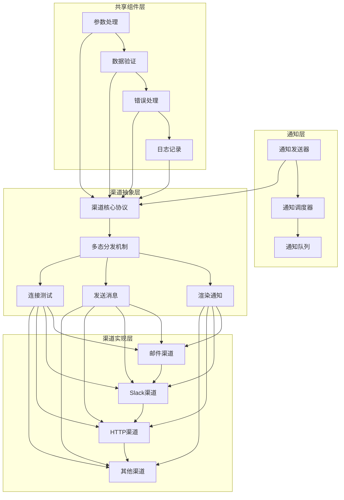

**图表来源**
- [core.clj](file://src/metabase/channel/core.clj#L1-L43)
- [send.clj](file://src/metabase/notification/send.clj#L1-L50)

**章节来源**
- [core.clj](file://src/metabase/channel/core.clj#L1-L43)
- [send.clj](file://src/metabase/notification/send.clj#L1-L100)

## 核心协议与多态分发机制

### 渠道核心协议

系统定义了三个核心的多态方法，构成了渠道协议的基础：

#### can-connect? 多态方法

`can-connect?` 方法用于测试渠道连接的有效性，支持字段级错误信息返回：

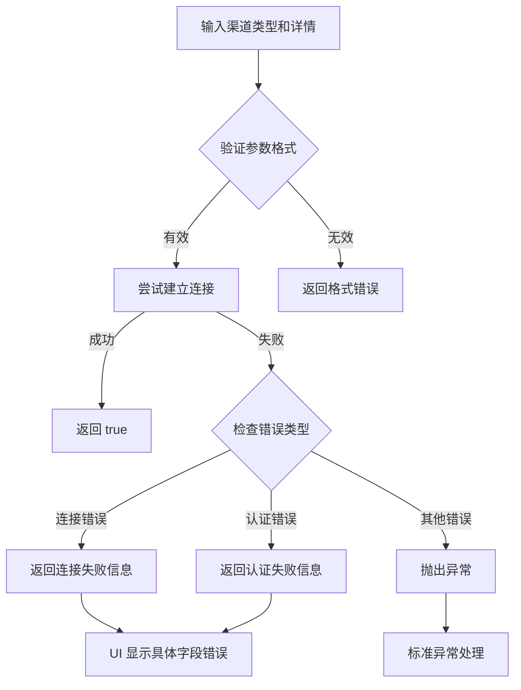

**图表来源**
- [core.clj](file://src/metabase/channel/core.clj#L10-L25)

#### render-notification 多态方法

`render-notification` 方法负责将通知负载转换为特定渠道的消息格式：

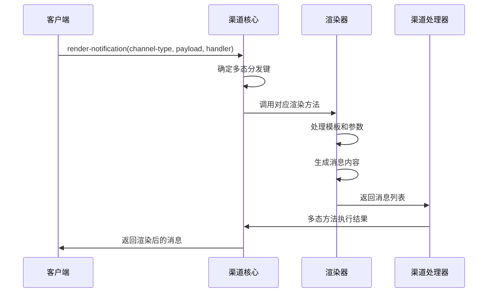

**图表来源**
- [core.clj](file://src/metabase/channel/core.clj#L27-L35)

#### send! 多态方法

`send!` 方法是渠道消息发送的核心入口点：

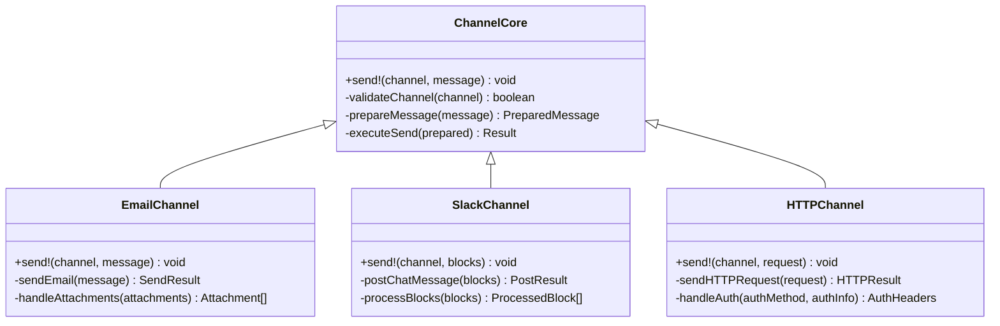

**图表来源**
- [core.clj](file://src/metabase/channel/core.clj#L37-L43)
- [email.clj](file://src/metabase/channel/impl/email.clj#L35-L45)
- [slack.clj](file://src/metabase/channel/impl/slack.clj#L95-L105)
- [http.clj](file://src/metabase/channel/impl/http.clj#L45-L65)

**章节来源**
- [core.clj](file://src/metabase/channel/core.clj#L10-L43)

## 渠道类型注册与管理

### 渠道初始化机制

系统通过 `metabase.channel.init` 命名空间实现渠道类型的自动加载：

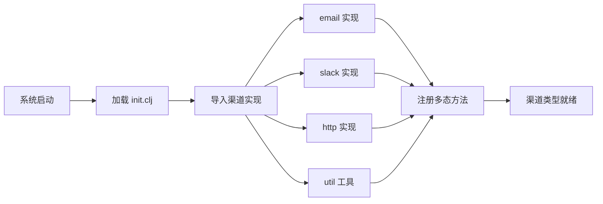

**图表来源**
- [init.clj](file://src/metabase/channel/init.clj#L1-L13)

### 渠道类型枚举

系统定义了标准的渠道类型，每种类型都有其特定的配置要求和行为特征：

| 渠道类型 | 描述 | 主要特性 | 配置要求 |
|---------|------|----------|----------|
| `:channel/email` | 邮件通知渠道 | 支持附件、HTML/文本格式 | SMTP服务器配置 |
| `:channel/slack` | Slack消息渠道 | 支持Block Kit、图片上传 | Bot Token |
| `:channel/http` | HTTP Webhook渠道 | 自定义请求格式 | 目标URL、认证方式 |

**章节来源**
- [init.clj](file://src/metabase/channel/init.clj#L1-L13)
- [settings.clj](file://src/metabase/channel/settings.clj#L1-L50)

## 参数验证与数据结构

### Malli Schema 验证系统

系统使用Malli库构建了完整的数据验证体系：

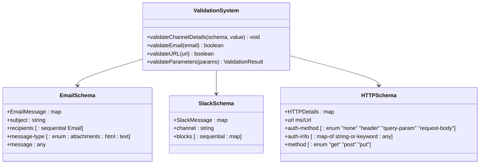

**图表来源**
- [shared.clj](file://src/metabase/channel/shared.clj#L15-L25)
- [email.clj](file://src/metabase/channel/impl/email.clj#L30-L40)
- [slack.clj](file://src/metabase/channel/impl/slack.clj#L90-L100)
- [http.clj](file://src/metabase/channel/impl/http.clj#L25-L45)

### 参数替换机制

系统提供了强大的参数替换功能，支持Handlebars语法的模板渲染：

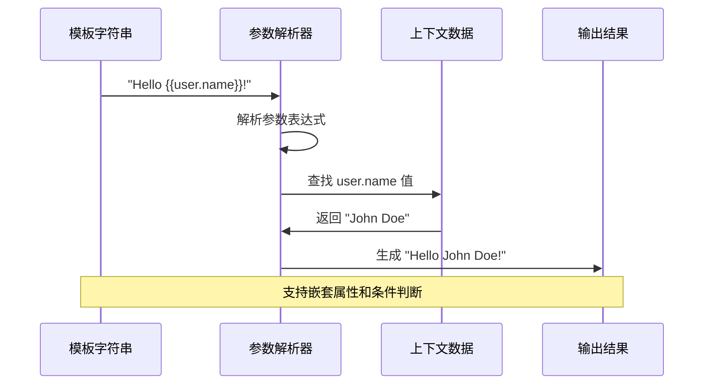

**图表来源**
- [params.clj](file://src/metabase/channel/params.clj#L15-L30)

**章节来源**
- [shared.clj](file://src/metabase/channel/shared.clj#L15-L30)
- [params.clj](file://src/metabase/channel/params.clj#L15-L32)

## 跨渠道共享组件

### 共享工具函数

系统提供了一系列跨渠道共享的工具函数，确保各渠道实现之间的一致性：

#### 数据行实现实时化

`maybe-realize-data-rows` 函数负责处理大数据量的结果集，防止内存溢出：

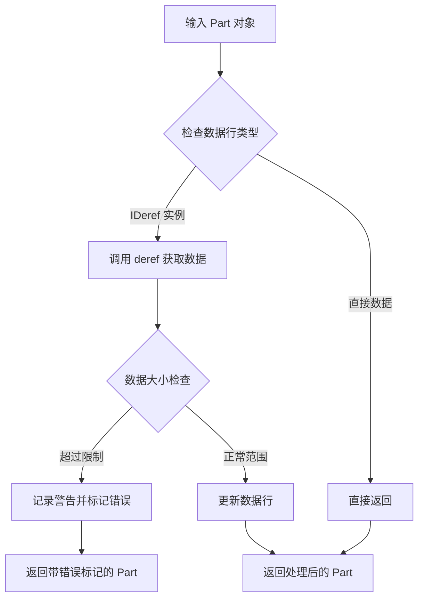

**图表来源**
- [shared.clj](file://src/metabase/channel/shared.clj#L35-L60)

#### Cron 表达式友好描述

系统提供了人性化的 Cron 表达式描述功能：

| Cron 类型 | 示例 | 友好描述 |
|-----------|------|----------|
| 小时级 | `0 0 * * * ?` | "Run hourly UTC" |
| 日级 | `0 30 14 * * ?` | "Run daily at 2:30 PM UTC" |
| 周级 | `0 0 14 ? * 2` | "Run weekly on Tuesday at 2 PM UTC" |
| 月级 | `0 0 12 15 * ?` | "Run monthly on the 15th at 12 PM UTC" |

### 错误处理契约

系统定义了统一的错误处理契约，确保异常信息的一致性：

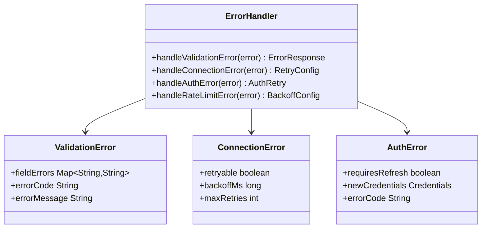

**图表来源**
- [shared.clj](file://src/metabase/channel/shared.clj#L15-L30)

**章节来源**
- [shared.clj](file://src/metabase/channel/shared.clj#L35-L143)

## 具体渠道实现分析

### 邮件渠道实现

邮件渠道是最复杂的渠道实现，支持多种消息格式和附件处理：

#### 邮件消息结构

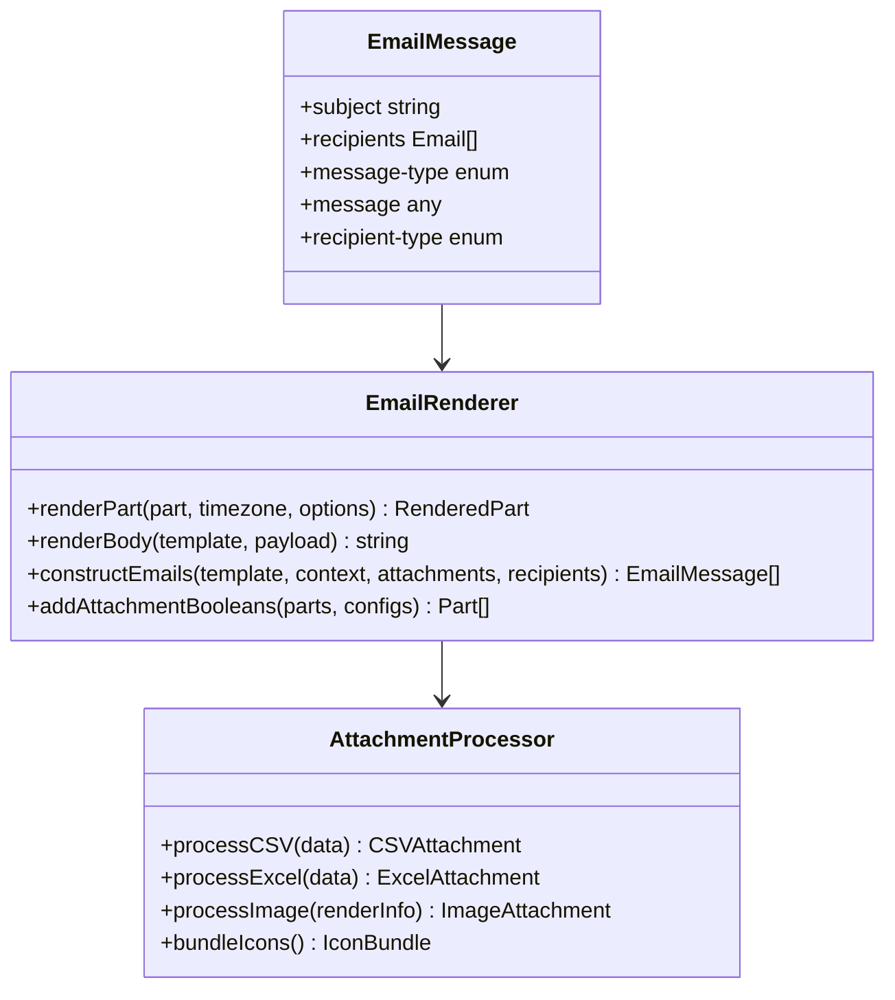

**图表来源**
- [email.clj](file://src/metabase/channel/impl/email.clj#L25-L45)

#### 邮件模板系统

邮件渠道支持两种模板类型：
- `:email/handlebars-resource`：基于资源文件的模板
- `:email/handlebars-text`：基于文本内容的模板

### Slack 渠道实现

Slack渠道利用Block Kit API提供丰富的消息格式：

#### Slack Block 结构

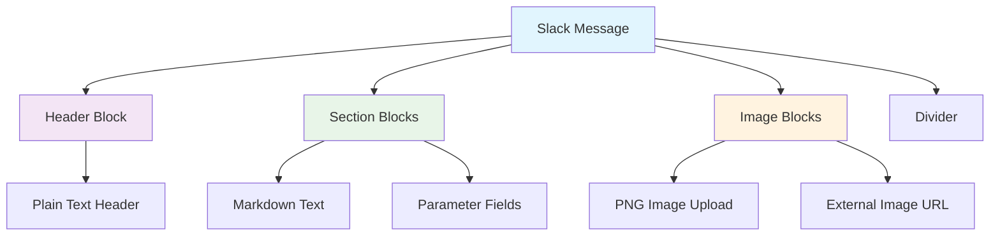

**图表来源**
- [slack.clj](file://src/metabase/channel/impl/slack.clj#L110-L140)

#### Slack 特殊处理

Slack渠道实现了多项特殊处理逻辑：
- Markdown 转义和长度限制
- 文件上传和链接处理
- 参数块的动态添加
- 响应式布局适配

### HTTP 渠道实现

HTTP渠道提供了最灵活的自定义选项：

#### HTTP 请求处理

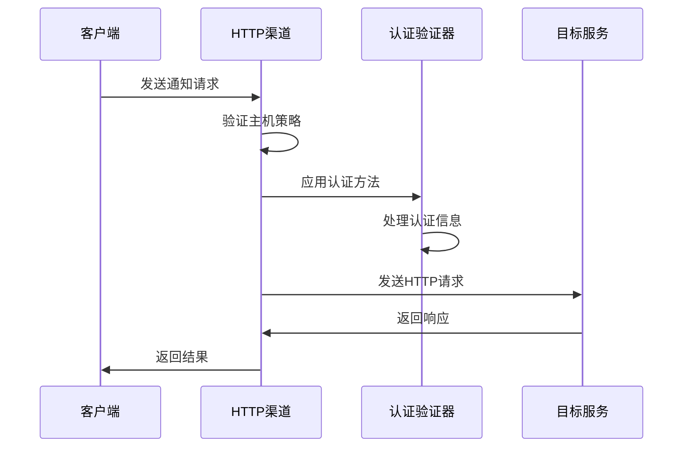

**图表来源**
- [http.clj](file://src/metabase/channel/impl/http.clj#L45-L70)

**章节来源**
- [email.clj](file://src/metabase/channel/impl/email.clj#L1-L326)
- [slack.clj](file://src/metabase/channel/impl/slack.clj#L1-L204)
- [http.clj](file://src/metabase/channel/impl/http.clj#L1-L112)

## 错误处理与异常传播

### 异常分类与处理策略

系统对异常进行了细致的分类，并针对不同类型的异常采用了不同的处理策略：

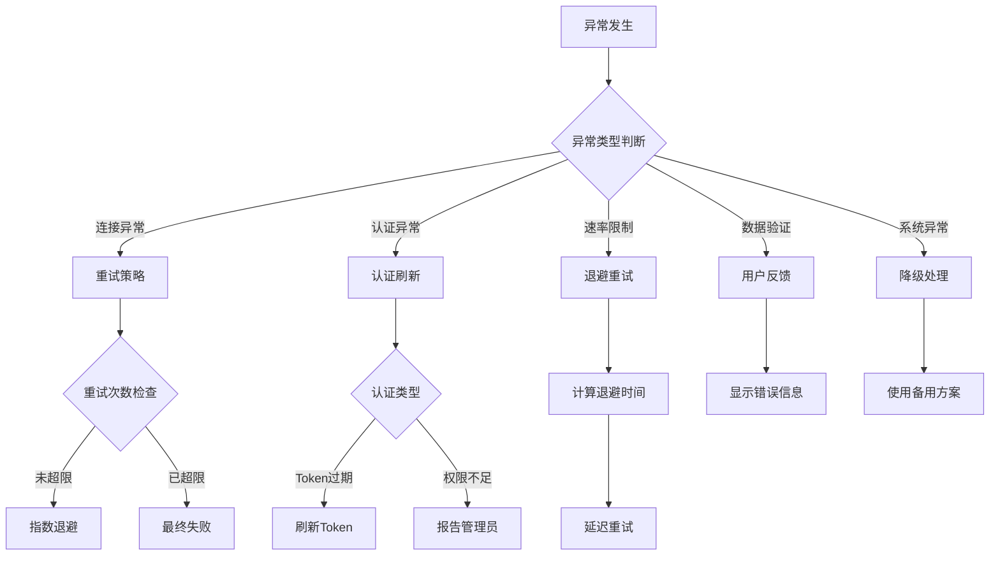

**图表来源**
- [send.clj](file://src/metabase/notification/send.clj#L40-L60)

### 日志记录规范

系统实现了统一的日志记录规范，确保错误信息的完整性和可追溯性：

#### 日志上下文管理

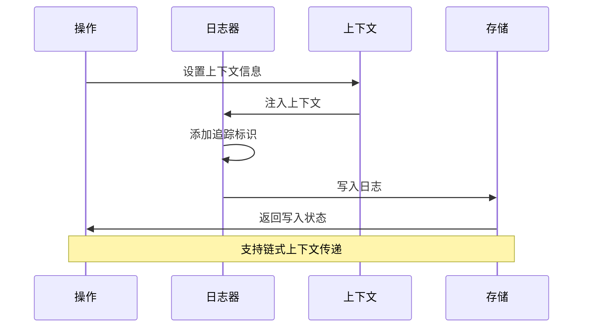

**图表来源**
- [send.clj](file://src/metabase/notification/send.clj#L100-L130)

**章节来源**
- [send.clj](file://src/metabase/notification/send.clj#L40-L150)

## 通知发送流程

### 异步发送架构

系统采用了异步发送架构，通过优先级队列和线程池实现高效的并发处理：

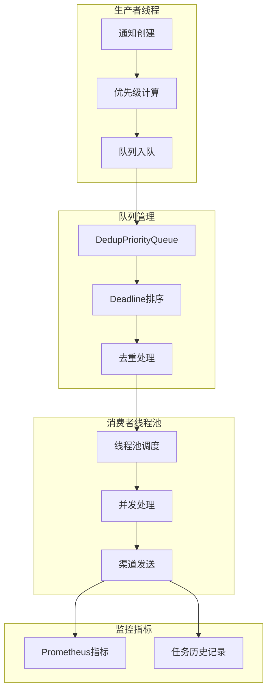

**图表来源**
- [send.clj](file://src/metabase/notification/send.clj#L300-L400)

### 重试机制

系统实现了智能的重试机制，根据异常类型和渠道特性调整重试策略：

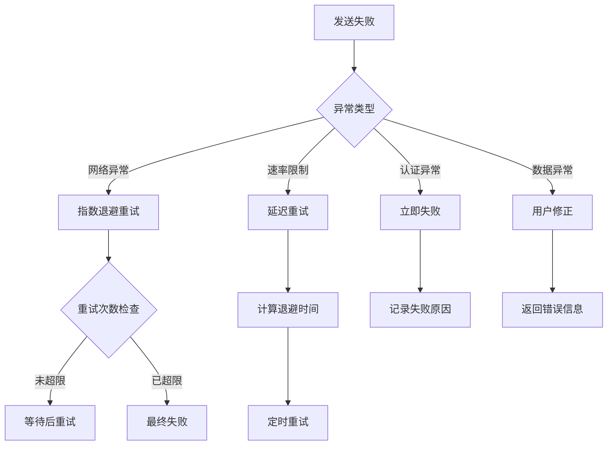

**图表来源**
- [send.clj](file://src/metabase/notification/send.clj#L60-L100)

**章节来源**
- [send.clj](file://src/metabase/notification/send.clj#L100-L464)

## 扩展开发指南

### 实现新渠道的步骤

要实现一个新的通知渠道，需要遵循以下步骤：

#### 1. 定义渠道类型

```clojure
(ns metabase.channel.impl.custom
  (:require [metabase.channel.core :as channel]))
  
(defn- custom-channel-type
  "自定义渠道类型标识符"
  []
  :channel/custom)
```

#### 2. 实现核心协议

##### 实现 can-connect? 方法

```clojure
(defmethod channel/can-connect? (custom-channel-type)
  [_channel-type details]
  (channel.shared/validate-channel-details CUSTOM-DETAILS-SCHEMA details)
  (try
    ;; 尝试连接测试
    (custom/test-connection details)
    true
    (catch Exception e
      (let [error-data (ex-data e)]
        (if (= :custom/connection-error (:type error-data))
          (throw (ex-info "连接测试失败" {:connection-result {:error "连接失败"}}))
          (throw e))))))
```

##### 实现 render-notification 方法

```clojure
(defmethod channel/render-notification [(custom-channel-type) :notification/card]
  [_channel-type notification-payload handler]
  (let [{:keys [payload]} notification-payload
        {:keys [card]} payload
        message (custom/render-card-message card handler)]
    [{:type "custom/message"
      :content message
      :metadata {:card-id (:id card)
                 :timestamp (now)}}]))
```

##### 实现 send! 方法

```clojure
(defmethod channel/send! (custom-channel-type)
  [_channel {:keys [content metadata]}]
  (custom/send-message content metadata))
```

#### 3. 注册渠道实现

在 `metabase.channel.init` 中添加新的实现：

```clojure
(ns metabase.channel.init
  (:require
   [metabase.channel.impl.custom]))
```

#### 4. 定义配置模式

```clojure
(def ^:private CUSTOM-DETAILS-SCHEMA
  [:map
   [:api-key string?]
   [:endpoint-url ms/Url]
   [:timeout {:optional true} pos-int?]])
```

### 必需接口实现

每个新渠道必须实现以下核心接口：

| 接口方法 | 功能描述 | 返回值要求 |
|---------|----------|------------|
| `can-connect?` | 测试连接有效性 | `true` 或错误映射 |
| `render-notification` | 渲染通知消息 | 消息对象序列 |
| `send!` | 发送消息 | 无返回值或异常 |

### 异常传播机制

新渠道应遵循系统的异常传播机制：

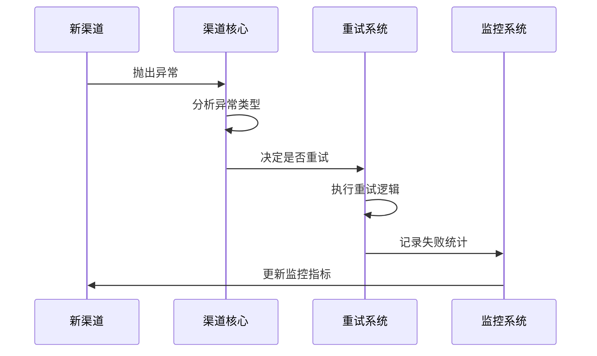

**图表来源**
- [send.clj](file://src/metabase/notification/send.clj#L60-L100)

### 日志记录规范

新渠道应遵循统一的日志记录规范：

```clojure
(log/with-context {:channel_type (custom-channel-type)
                   :notification_id notification-id}
  (log/info "开始发送通知到自定义渠道")
  (try
    (custom/send-message message)
    (log/info "通知发送成功")
    (catch Exception e
      (log/warn e "通知发送失败")
      (throw e))))
```

**章节来源**
- [core.clj](file://src/metabase/channel/core.clj#L1-L43)
- [shared.clj](file://src/metabase/channel/shared.clj#L15-L30)

## 最佳实践与性能考虑

### 性能优化策略

#### 1. 连接池管理

对于需要网络连接的渠道，建议实现连接池：

```clojure
(def ^:private connection-pool
  (atom (custom/create-connection-pool)))
```

#### 2. 缓存机制

实现适当的缓存机制以提高性能：

```clojure
(def ^:private template-cache
  (memoize custom/render-template))
```

#### 3. 并发控制

合理设置并发度避免资源竞争：

```clojure
(def ^:private max-concurrent-requests 10)
```

### 错误处理最佳实践

#### 1. 分层错误处理

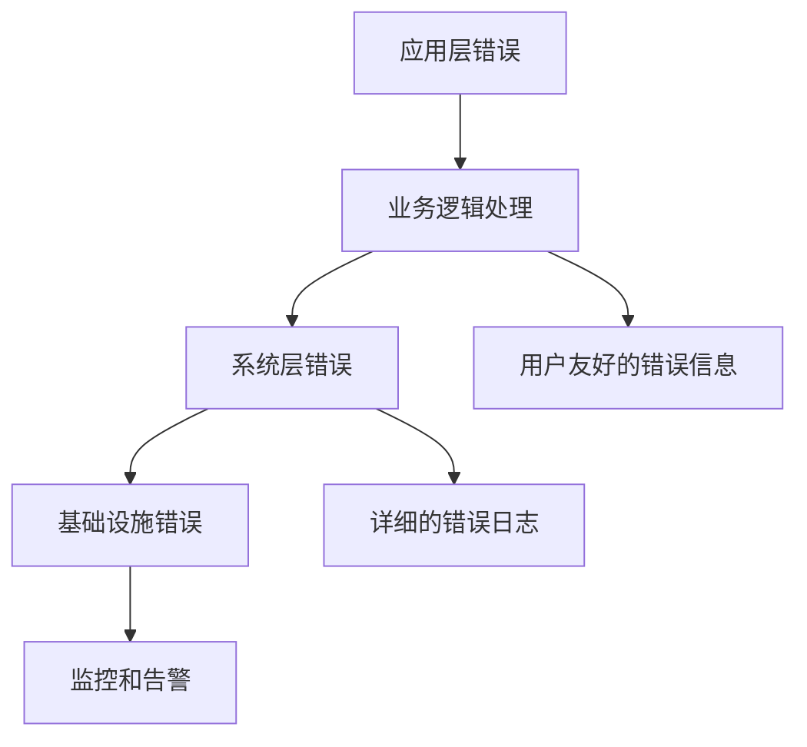

#### 2. 优雅降级

```clojure
(defn send-notification-with-fallback
  [primary-channel fallback-channel message]
  (try
    (channel/send! primary-channel message)
    (catch Exception e
      (log/warn e "主渠道发送失败，尝试备用渠道")
      (channel/send! fallback-channel message))))
```

### 监控与可观测性

#### Prometheus 指标

```clojure
(prometheus/inc! :metabase-notification/channel-send-ok
                 {:channel_type (custom-channel-type)
                  :payload_type payload-type})
```

#### 任务历史记录

```clojure
(task-history/with-task-history
  {:task "custom-channel-send"
   :task_details {:channel_id channel-id
                  :message_size (count message)}}
  (custom/send-message message))
```

## 总结

Metabase的通知渠道核心抽象系统展现了优秀的软件架构设计原则：

### 设计优势

1. **高度模块化**：通过多态分发机制实现了渠道实现的完全解耦
2. **可扩展性强**：新增渠道类型只需实现几个核心接口
3. **错误处理完善**：提供了统一的异常处理和重试机制
4. **性能优化**：异步发送架构支持高并发处理
5. **可观测性**：完整的监控指标和日志记录体系

### 技术特色

- **协议驱动**：基于Clojure多态方法的协议设计
- **Schema 验证**：使用Malli进行强类型验证
- **智能重试**：根据异常类型动态调整重试策略
- **资源管理**：完善的连接池和资源生命周期管理
- **监控集成**：深度集成Prometheus和任务历史记录

### 扩展价值

该系统不仅为Metabase提供了可靠的通知能力，更为其他需要类似功能的项目提供了优秀的参考架构。其设计理念和实现方式可以广泛应用于各种消息通知场景，具有很高的学习和借鉴价值。

通过深入理解这个系统的设计思想和实现细节，开发者可以更好地构建自己的通知系统，或者在此基础上进行二次开发和定制。