# 邮件传输与交付

<cite>
**本文档引用的文件**
- [impl/email.clj](file://src/metabase/channel/impl/email.clj)
- [email.clj](file://src/metabase/channel/email.clj)
- [params.clj](file://src/metabase/channel/params.clj)
- [settings.clj](file://src/metabase/channel/settings.clj)
- [messages.clj](file://src/metabase/channel/email/messages.clj)
- [result_attachment.clj](file://src/metabase/channel/email/result_attachment.clj)
- [send.clj](file://src/metabase/notification/send.clj)
- [retry.clj](file://src/metabase/util/retry.clj)
</cite>

## 目录
1. [简介](#简介)
2. [系统架构概览](#系统架构概览)
3. [SMTP客户端核心实现](#smtp客户端核心实现)
4. [连接池与安全配置](#连接池与安全配置)
5. [邮件发送与渲染](#邮件发送与渲染)
6. [速率限制与重试策略](#速率限制与重试策略)
7. [监控与指标收集](#监控与指标收集)
8. [配置管理](#配置管理)
9. [性能优化指南](#性能优化指南)
10. [故障排除](#故障排除)

## 简介

Metabase的邮件传输系统是一个高度可配置的企业级邮件发送解决方案，支持多种邮件服务提供商，具备完善的错误处理、重试机制和监控功能。该系统采用分层架构设计，从底层的SMTP协议到高层的通知服务，提供了完整的邮件生命周期管理。

## 系统架构概览

邮件传输系统采用模块化设计，主要包含以下核心组件：

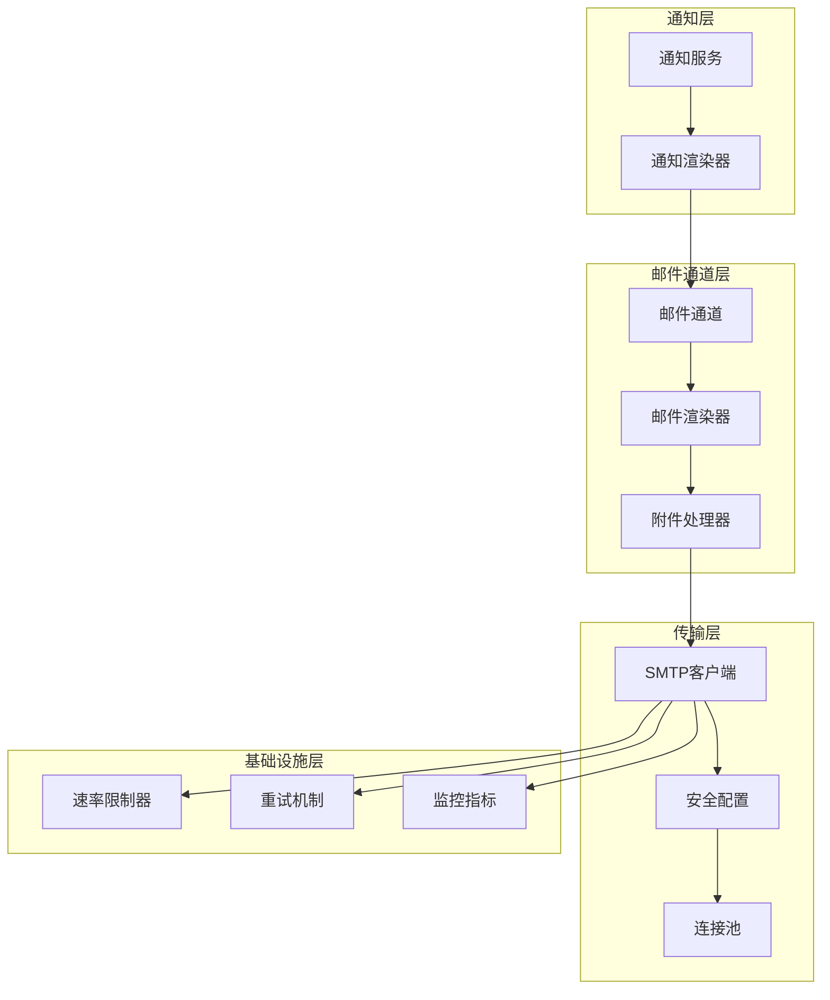

**图表来源**
- [send.clj](file://src/metabase/notification/send.clj#L1-L50)
- [impl/email.clj](file://src/metabase/channel/impl/email.clj#L1-L50)
- [email.clj](file://src/metabase/channel/email.clj#L1-L50)

**章节来源**
- [send.clj](file://src/metabase/notification/send.clj#L1-L100)
- [impl/email.clj](file://src/metabase/channel/impl/email.clj#L1-L100)

## SMTP客户端核心实现

### 核心SMTP客户端架构

Metabase的SMTP客户端基于JavaMail API构建，通过Postal库进行封装，提供了完整的邮件传输功能。

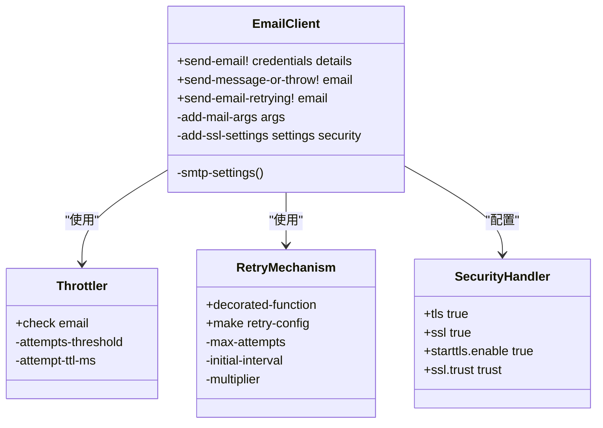

**图表来源**
- [email.clj](file://src/metabase/channel/email.clj#L65-L120)
- [retry.clj](file://src/metabase/util/retry.clj#L80-L120)

### 连接建立流程

SMTP连接的建立遵循严格的验证和配置流程：

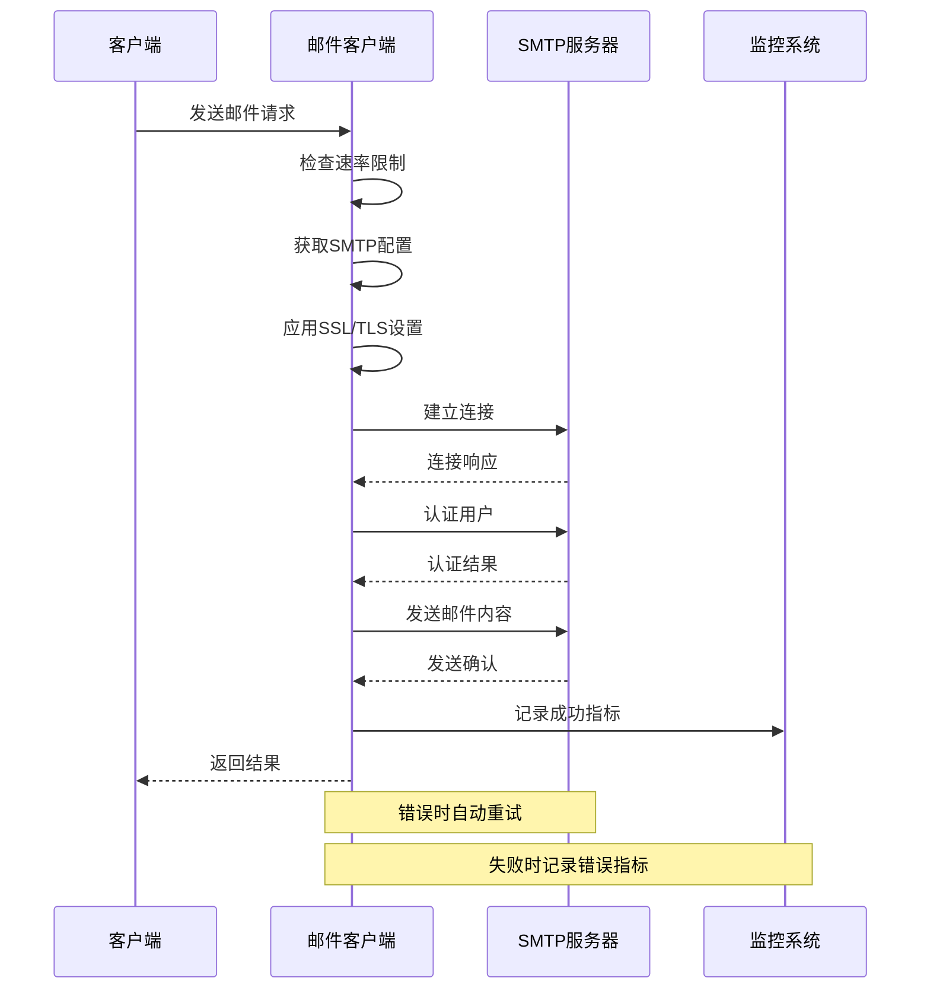

**图表来源**
- [email.clj](file://src/metabase/channel/email.clj#L120-L180)
- [send.clj](file://src/metabase/notification/send.clj#L50-L100)

**章节来源**
- [email.clj](file://src/metabase/channel/email.clj#L65-L200)

## 连接池与安全配置

### TLS/SSL加密配置

系统支持多种安全协议，具有智能的安全协议选择机制：

| 安全协议 | 端口 | 描述 | 使用场景 |
|---------|------|------|----------|
| TLS | 587 | 传输层安全协议 | 现代邮件服务器推荐 |
| STARTTLS | 587 | 启动传输层安全 | 支持升级的SMTP连接 |
| SSL | 465 | 安全套接字层协议 | 传统加密连接 |
| None | 25 | 明文连接 | 内部网络或测试环境 |

### 自动安全协议检测

系统实现了智能的安全协议检测机制，当初始连接失败时会自动尝试其他协议：

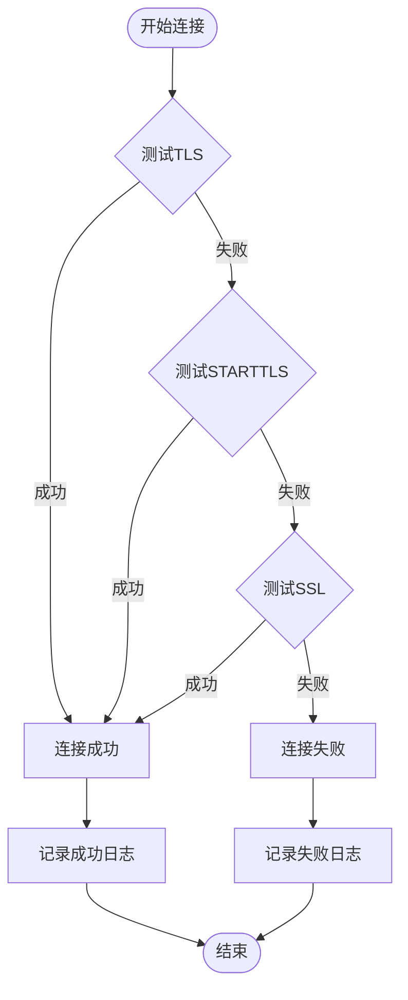

**图表来源**
- [email.clj](file://src/metabase/channel/email.clj#L229-L257)

### OAuth2认证支持

虽然当前版本主要支持传统的用户名密码认证，但系统架构已为OAuth2认证预留了扩展接口：

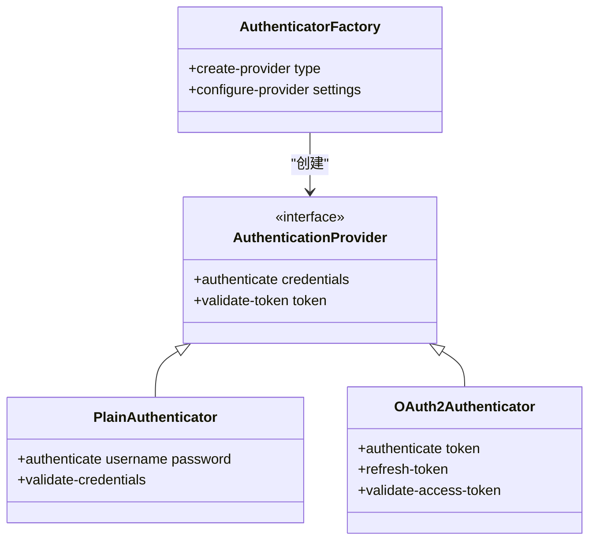

**章节来源**
- [email.clj](file://src/metabase/channel/email.clj#L201-L281)

## 邮件发送与渲染

### 邮件模板系统

Metabase采用Handlebars模板引擎，支持动态内容渲染和参数替换：

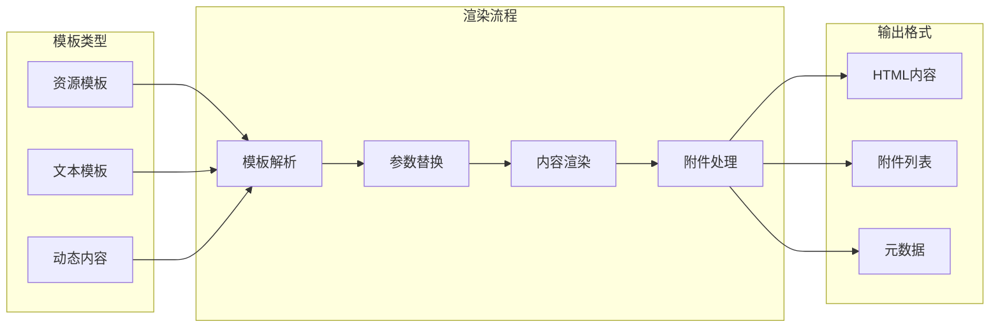

**图表来源**
- [impl/email.clj](file://src/metabase/channel/impl/email.clj#L95-L120)

### 邮件内容渲染

系统支持多种内容类型的渲染，包括卡片、仪表板和文本内容：

| 内容类型 | 渲染方式 | 输出格式 | 附件支持 |
|---------|----------|----------|----------|
| 卡片 | Hiccup结构转换 | HTML + 图表 | CSV/XLSX |
| 仪表板 | 分块渲染 | HTML组合 | 图片附件 |
| 文本 | Markdown处理 | HTML格式 | 参数嵌入 |
| 标题 | 样式化渲染 | HTML标题 | 无附件 |

### 附件处理机制

邮件附件处理采用流式处理，避免内存溢出：

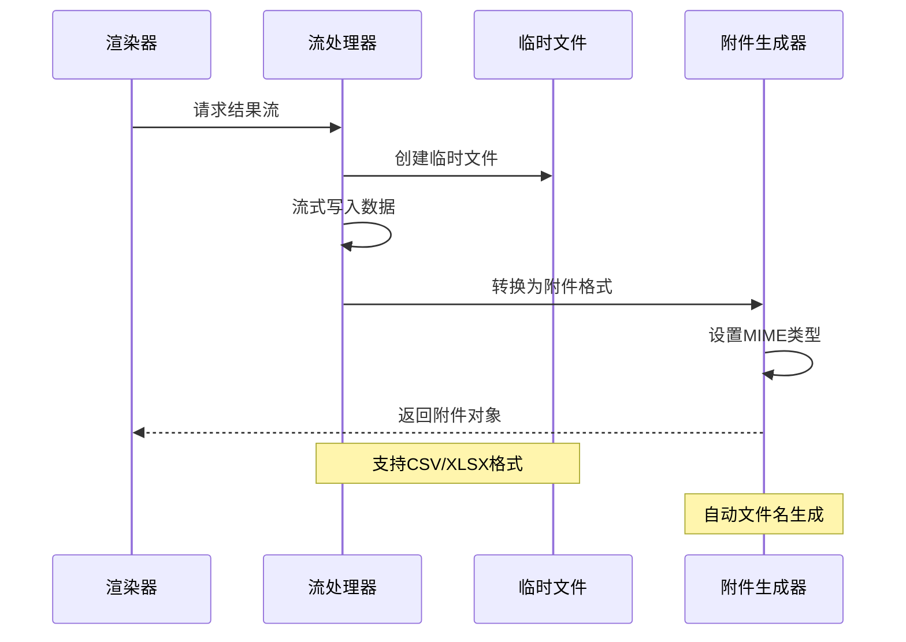

**图表来源**
- [result_attachment.clj](file://src/metabase/channel/email/result_attachment.clj#L40-L80)

**章节来源**
- [impl/email.clj](file://src/metabase/channel/impl/email.clj#L78-L185)
- [result_attachment.clj](file://src/metabase/channel/email/result_attachment.clj#L1-L112)

## 速率限制与重试策略

### 速率限制机制

系统实现了智能的速率限制机制，防止邮件服务器过载：

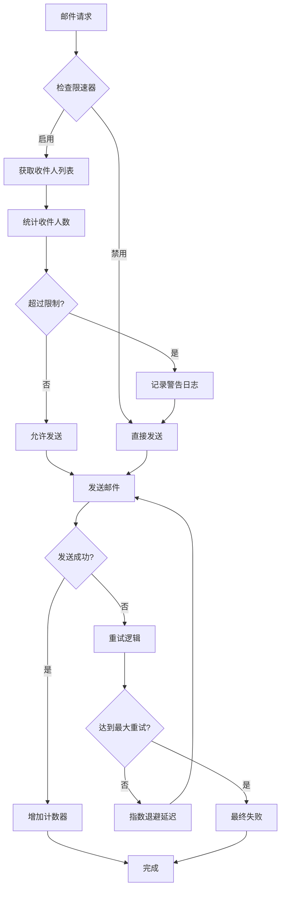

**图表来源**
- [email.clj](file://src/metabase/channel/email.clj#L38-L67)

### 重试策略配置

系统采用指数退避算法实现智能重试：

| 配置项 | 默认值 | 描述 | 生产环境建议 |
|-------|--------|------|-------------|
| 最大重试次数 | 7 | 总重试次数限制 | 5-10次 |
| 初始间隔 | 500ms | 第一次重试间隔 | 500ms-1s |
| 退避倍数 | 2.0 | 间隔增长倍数 | 1.5-2.0 |
| 随机化因子 | 0.1 | 避免重试风暴 | 0.05-0.2 |
| 最大间隔 | 30s | 最大重试间隔 | 30-60s |

### 错误分类与处理

系统对不同类型的错误采用不同的处理策略：

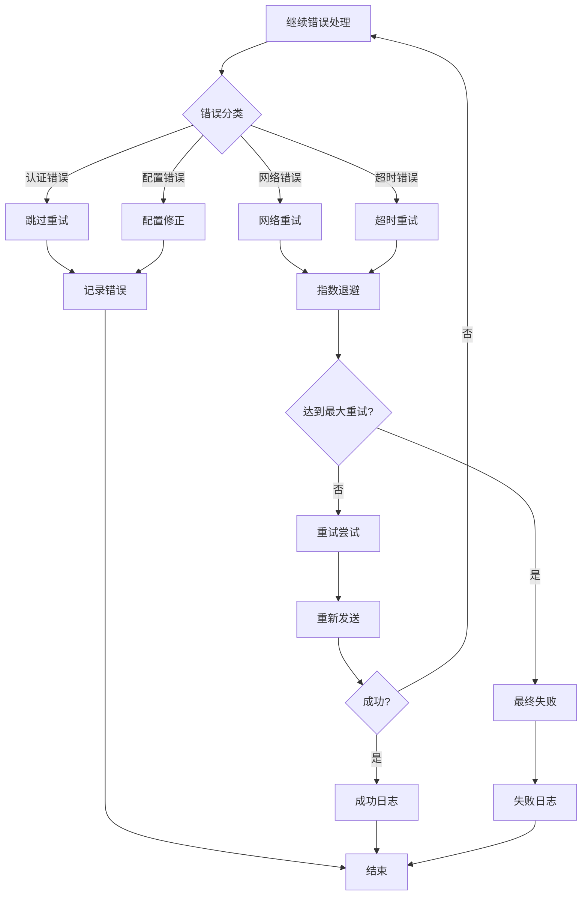

**图表来源**
- [send.clj](file://src/metabase/notification/send.clj#L34-L67)
- [retry.clj](file://src/metabase/util/retry.clj#L80-L120)

**章节来源**
- [email.clj](file://src/metabase/channel/email.clj#L38-L98)
- [send.clj](file://src/metabase/notification/send.clj#L34-L100)
- [retry.clj](file://src/metabase/util/retry.clj#L1-L121)

## 监控与指标收集

### 监控指标体系

系统建立了全面的监控指标体系，涵盖邮件传输的各个环节：

| 指标类别 | 指标名称 | 描述 | 数据类型 |
|---------|----------|------|----------|
| 成功率 | email/send-ok | 成功发送的邮件数量 | Counter |
| 失败率 | email/send-error | 发送失败的邮件数量 | Counter |
| 延迟 | email/send-duration-ms | 邮件发送耗时 | Histogram |
| 等待时间 | email/wait-duration-ms | 队列等待时间 | Histogram |
| 总耗时 | email/total-duration-ms | 整体处理耗时 | Histogram |

### Prometheus集成

系统与Prometheus监控系统深度集成，提供实时指标监控：

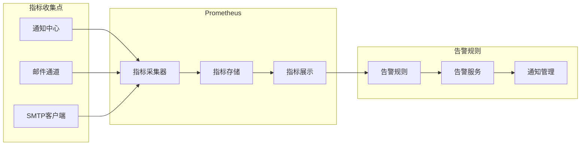

**图表来源**
- [send.clj](file://src/metabase/notification/send.clj#L100-L150)

### 日志记录策略

系统采用分级日志记录，确保问题追踪和性能监控：

| 日志级别 | 记录内容 | 触发条件 | 输出目标 |
|---------|----------|----------|----------|
| DEBUG | 详细执行信息 | 开发模式 | 文件/控制台 |
| INFO | 关键操作记录 | 正常流程 | 文件 |
| WARN | 异常情况警告 | 重试失败 | 文件 |
| ERROR | 错误异常 | 发送失败 | 文件+告警 |

**章节来源**
- [send.clj](file://src/metabase/notification/send.clj#L100-L150)

## 配置管理

### 配置项详解

邮件系统的核心配置项及其影响：

| 配置项 | 类型 | 默认值 | 影响范围 | 生产环境建议 |
|-------|------|--------|----------|-------------|
| email-smtp-host | 字符串 | - | SMTP服务器地址 | 使用专用邮件服务 |
| email-smtp-port | 整数 | 587 | 通信端口 | TLS:587, SSL:465 |
| email-smtp-security | 枚举 | :none | 安全协议 | :tls |
| email-max-recipients-per-second | 整数 | - | 速率限制 | 根据服务商设置 |
| smtp-override-enabled | 布尔 | false | 自定义配置 | 云环境启用 |

### 配置验证机制

系统实现了完整的配置验证机制，确保配置的有效性：

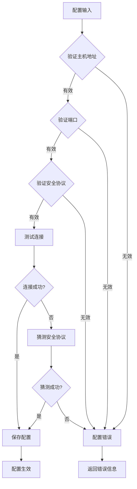

**图表来源**
- [email.clj](file://src/metabase/channel/email.clj#L255-L281)

### 动态配置更新

系统支持运行时配置更新，无需重启服务：

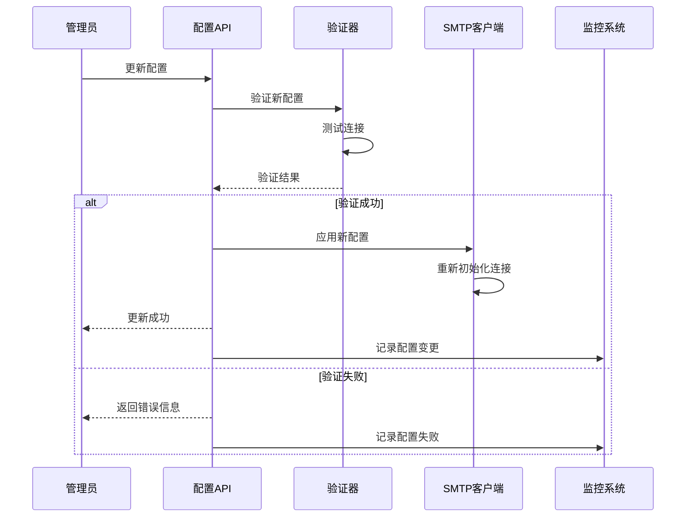

**图表来源**
- [settings.clj](file://src/metabase/channel/settings.clj#L280-L320)

**章节来源**
- [settings.clj](file://src/metabase/channel/settings.clj#L1-L321)
- [email.clj](file://src/metabase/channel/email.clj#L255-L361)

## 性能优化指南

### 连接池优化

针对高并发场景的连接池配置建议：

| 场景类型 | 连接池大小 | 超时设置 | 保持连接 | 其他建议 |
|---------|------------|----------|----------|----------|
| 小型企业 | 5-10个 | 30秒 | 启用 | 使用连接复用 |
| 中型企业 | 10-20个 | 60秒 | 启用 | 定期清理空闲连接 |
| 大型企业 | 20-50个 | 120秒 | 启用 | 实施连接健康检查 |

### 内存优化策略

为了避免内存溢出，系统采用了多项内存优化措施：

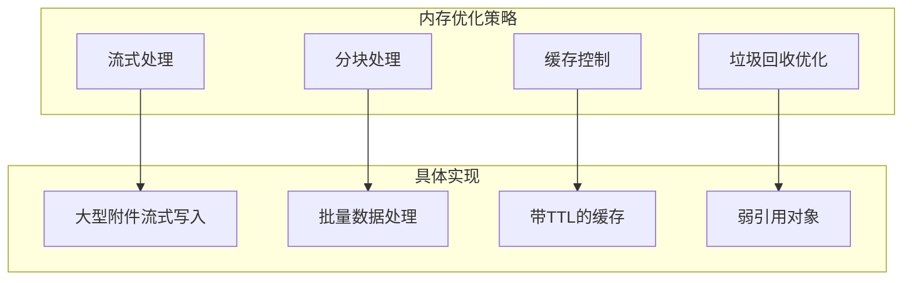

### 并发处理优化

系统采用多线程并发处理提升性能：

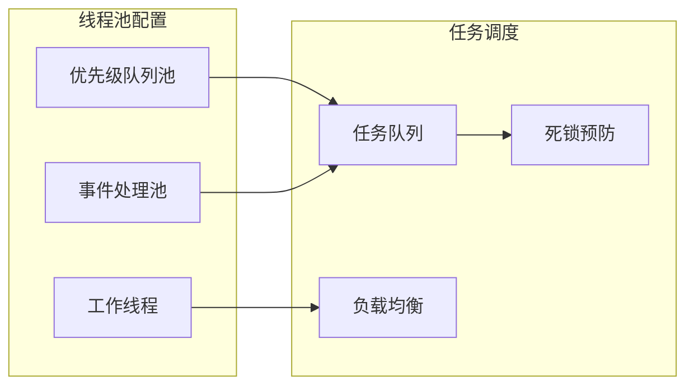

**章节来源**
- [send.clj](file://src/metabase/notification/send.clj#L300-L400)

## 故障排除

### 常见问题诊断

| 问题类型 | 症状描述 | 可能原因 | 解决方案 |
|---------|----------|----------|----------|
| 连接超时 | 邮件发送缓慢或失败 | 网络延迟、服务器负载 | 调整超时设置、检查网络 |
| 认证失败 | 435 4.7.8错误 | 用户名密码错误 | 验证凭据有效性 |
| SSL握手失败 | TLS连接被拒绝 | 证书问题、协议不匹配 | 检查SSL配置、更新证书 |
| 速率限制 | 发送被阻止 | 超出服务商限制 | 调整速率限制设置 |

### 日志分析指南

系统日志的关键分析点：

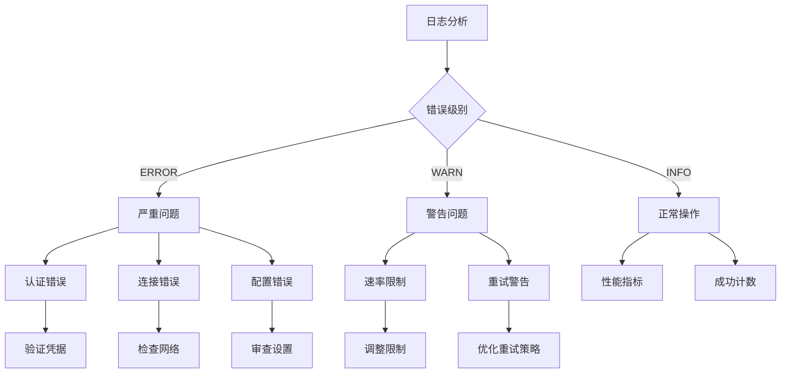

### 性能调优建议

针对不同场景的性能调优建议：

| 场景 | 调优重点 | 具体措施 | 预期效果 |
|------|----------|----------|----------|
| 高并发发送 | 连接池优化 | 增加连接数、调整超时 | 提升吞吐量 |
| 大附件处理 | 内存管理 | 启用流式处理、限制附件大小 | 避免OOM |
| 长时间运行 | 资源清理 | 定期清理连接、监控内存 | 保持稳定性 |
| 故障恢复 | 快速恢复 | 优化重试策略、监控健康状态 | 提高可用性 |

**章节来源**
- [email.clj](file://src/metabase/channel/email.clj#L281-L361)
- [send.clj](file://src/metabase/notification/send.clj#L400-L464)

## 结论

Metabase的邮件传输系统是一个功能完备、性能优异的企业级邮件解决方案。通过合理的架构设计、完善的错误处理机制和全面的监控体系，该系统能够满足各种规模企业的邮件发送需求。

系统的主要优势包括：
- **高可靠性**：多重重试机制和错误处理
- **高性能**：智能速率限制和并发处理
- **易维护**：清晰的配置管理和监控指标
- **可扩展**：模块化设计支持功能扩展

在生产环境中部署时，建议根据实际业务需求调整相关配置，并建立完善的监控和告警机制，以确保邮件服务的稳定性和可靠性。