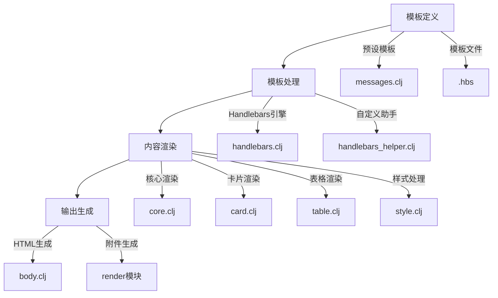
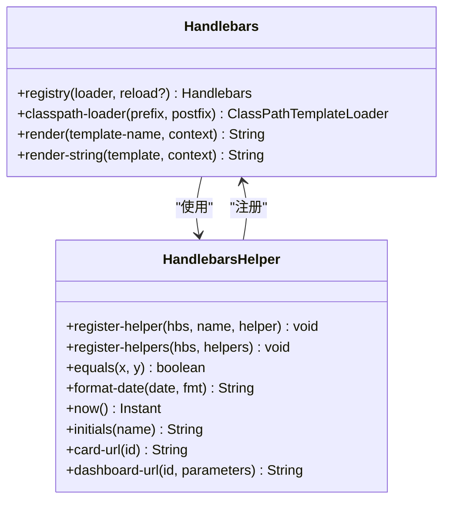
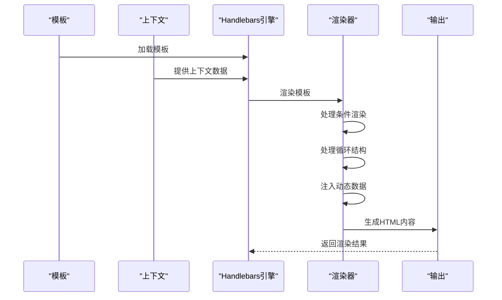
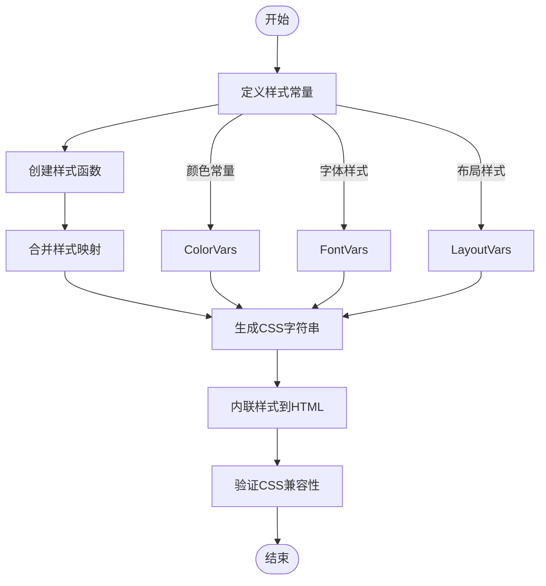
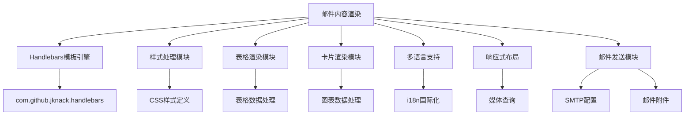

# 邮件内容渲染

<cite>
**本文档引用的文件**
- [messages.clj](file://src/metabase/channel/email/messages.clj)
- [core.clj](file://src/metabase/channel/template/core.clj)
- [handlebars.clj](file://src/metabase/channel/template/handlebars.clj)
- [handlebars_helper.clj](file://src/metabase/channel/template/handlebars_helper.clj)
- [body.clj](file://src/metabase/channel/render/body.clj)
- [card.clj](file://src/metabase/channel/render/card.clj)
- [style.clj](file://src/metabase/channel/render/style.clj)
- [util.clj](file://src/metabase/channel/render/util.clj)
- [_header.hbs](file://src/metabase/channel/email/_header.hbs)
- [_footer.hbs](file://src/metabase/channel/email/_footer.hbs)
- [notification_card.hbs](file://src/metabase/channel/email/notification_card.hbs)
</cite>

## 目录
1. [简介](#简介)
2. [项目结构](#项目结构)
3. [核心组件](#核心组件)
4. [架构概述](#架构概述)
5. [详细组件分析](#详细组件分析)
6. [依赖分析](#依赖分析)
7. [性能考虑](#性能考虑)
8. [故障排除指南](#故障排除指南)
9. [结论](#结论)

## 简介
本文档详细阐述了Metabase系统中邮件内容渲染机制的实现。该机制通过Handlebars模板引擎实现动态内容生成，支持多语言、响应式布局和邮件客户端兼容性。系统采用模块化设计，将模板管理、内容渲染、样式处理和附件生成等功能分离，确保了代码的可维护性和扩展性。

## 项目结构
邮件内容渲染功能主要分布在`src/metabase/channel`目录下，采用分层架构设计。核心功能模块包括模板引擎集成、内容渲染、样式处理和邮件发送等。

```mermaid
graph TB
subgraph "模板层"
messages["messages.clj<br>模板定义"]
templates[".hbs<br>模板文件"]
end
subgraph "渲染层"
core["core.clj<br>核心渲染"]
body["body.clj<br>内容渲染"]
card["card.clj<br>卡片渲染"]
style["style.clj<br>样式处理"]
table["table.clj<br>表格渲染"]
end
subgraph "模板引擎"
handlebars["handlebars.clj<br>Handlebars集成"]
helpers["handlebars_helper.clj<br>自定义助手"]
end
subgraph "邮件发送"
email["email.clj<br>邮件配置"]
impl["impl/email.clj<br>发送实现"]
end
messages --> core
templates --> handlebars
handlebars --> core
helpers --> handlebars
core --> body
core --> card
core --> style
body --> table
card --> style
style --> body
core --> impl
email --> impl
```

**图源**
- [messages.clj](file://src/metabase/channel/email/messages.clj)
- [core.clj](file://src/metabase/channel/template/core.clj)
- [handlebars.clj](file://src/metabase/channel/template/handlebars.clj)
- [body.clj](file://src/metabase/channel/render/body.clj)
- [card.clj](file://src/metabase/channel/render/card.clj)
- [style.clj](file://src/metabase/channel/render/style.clj)

**本节源码**
- [messages.clj](file://src/metabase/channel/email/messages.clj)
- [core.clj](file://src/metabase/channel/template/core.clj)
- [handlebars.clj](file://src/metabase/channel/template/handlebars.clj)

## 核心组件
邮件内容渲染系统由多个核心组件构成，包括模板引擎集成、动态数据注入、样式内联处理和多语言支持等。系统通过`messages.clj`文件定义预设模板，使用Handlebars模板引擎进行内容渲染，并通过`render`模块生成最终的HTML内容。

**本节源码**
- [messages.clj](file://src/metabase/channel/email/messages.clj)
- [core.clj](file://src/metabase/channel/template/core.clj)
- [handlebars.clj](file://src/metabase/channel/template/handlebars.clj)

## 架构概述
邮件内容渲染系统采用分层架构，从上到下分为模板定义、模板处理、内容渲染和输出生成四个层次。系统通过Handlebars模板引擎实现动态内容注入，支持条件渲染和循环结构。



**图源**
- [messages.clj](file://src/metabase/channel/email/messages.clj)
- [handlebars.clj](file://src/metabase/channel/template/handlebars.clj)
- [handlebars_helper.clj](file://src/metabase/channel/template/handlebars_helper.clj)
- [core.clj](file://src/metabase/channel/render/core.clj)
- [card.clj](file://src/metabase/channel/render/card.clj)
- [table.clj](file://src/metabase/channel/render/table.clj)
- [style.clj](file://src/metabase/channel/render/style.clj)
- [body.clj](file://src/metabase/channel/render/body.clj)

## 详细组件分析

### 模板引擎集成分析
系统通过`handlebars.clj`文件集成Handlebars模板引擎，实现了模板的加载、编译和渲染功能。引擎支持从类路径加载模板文件，并提供了缓存机制以提高性能。



**图源**
- [handlebars.clj](file://src/metabase/channel/template/handlebars.clj)
- [handlebars_helper.clj](file://src/metabase/channel/template/handlebars_helper.clj)

### 内容渲染机制分析
内容渲染机制通过`render`模块实现，支持多种图表类型和数据格式的渲染。系统能够根据数据特征自动检测图表类型，并生成相应的HTML内容。



**图源**
- [messages.clj](file://src/metabase/channel/email/messages.clj)
- [core.clj](file://src/metabase/channel/template/core.clj)
- [handlebars.clj](file://src/metabase/channel/template/handlebars.clj)
- [body.clj](file://src/metabase/channel/render/body.clj)

### 样式处理分析
样式处理模块负责内联CSS样式，确保邮件在不同客户端中的显示一致性。系统通过`style.clj`文件定义了统一的样式规范，并提供了样式合并和压缩功能。



**图源**
- [style.clj](file://src/metabase/channel/render/style.clj)
- [body.clj](file://src/metabase/channel/render/body.clj)
- [card.clj](file://src/metabase/channel/render/card.clj)

**本节源码**
- [style.clj](file://src/metabase/channel/render/style.clj)
- [body.clj](file://src/metabase/channel/render/body.clj)
- [card.clj](file://src/metabase/channel/render/card.clj)
- [util.clj](file://src/metabase/channel/render/util.clj)

## 依赖分析
邮件内容渲染系统依赖于多个内部和外部组件，形成了复杂的依赖关系网络。系统通过合理的依赖管理确保了模块间的松耦合和高内聚。



**图源**
- [core.clj](file://src/metabase/channel/template/core.clj)
- [handlebars.clj](file://src/metabase/channel/template/handlebars.clj)
- [style.clj](file://src/metabase/channel/render/style.clj)
- [table.clj](file://src/metabase/channel/render/table.clj)
- [card.clj](file://src/metabase/channel/render/card.clj)
- [email.clj](file://src/metabase/channel/email.clj)

**本节源码**
- [core.clj](file://src/metabase/channel/template/core.clj)
- [handlebars.clj](file://src/metabase/channel/template/handlebars.clj)
- [style.clj](file://src/metabase/channel/render/style.clj)
- [table.clj](file://src/metabase/channel/render/table.clj)
- [card.clj](file://src/metabase/channel/render/card.clj)
- [email.clj](file://src/metabase/channel/email.clj)

## 性能考虑
邮件内容渲染系统在设计时充分考虑了性能因素，通过多种优化策略确保了高效的内容生成。系统采用了模板缓存、样式内联和数据压缩等技术来提升渲染性能。

- **模板缓存**：使用`ConcurrentMapTemplateCache`缓存已编译的模板，避免重复编译
- **样式内联**：将CSS样式内联到HTML元素中，减少HTTP请求
- **数据压缩**：对大型数据集进行分页和截断处理
- **异步渲染**：支持后台线程渲染，避免阻塞主流程
- **资源优化**：对图片和附件进行压缩处理

## 故障排除指南
当邮件内容渲染出现问题时，可以按照以下步骤进行排查：

1. **检查模板文件**：确认模板文件路径和内容是否正确
2. **验证上下文数据**：确保传递给模板的上下文数据完整且格式正确
3. **检查样式定义**：确认CSS样式定义是否符合邮件客户端的兼容性要求
4. **查看日志信息**：检查系统日志中的错误信息和警告
5. **测试渲染结果**：在不同邮件客户端中测试渲染结果的显示效果

**本节源码**
- [handlebars.clj](file://src/metabase/channel/template/handlebars.clj)
- [body.clj](file://src/metabase/channel/render/body.clj)
- [card.clj](file://src/metabase/channel/render/card.clj)

## 结论
Metabase的邮件内容渲染机制通过模块化设计和分层架构，实现了高效、灵活和可扩展的内容生成。系统采用Handlebars模板引擎作为核心渲染技术，结合自定义助手和样式处理模块，能够生成符合现代邮件客户端要求的HTML内容。未来可以进一步优化模板编译性能，增强对复杂数据结构的支持，并提供更丰富的可视化选项。