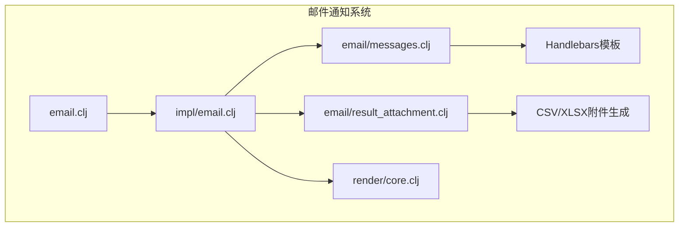
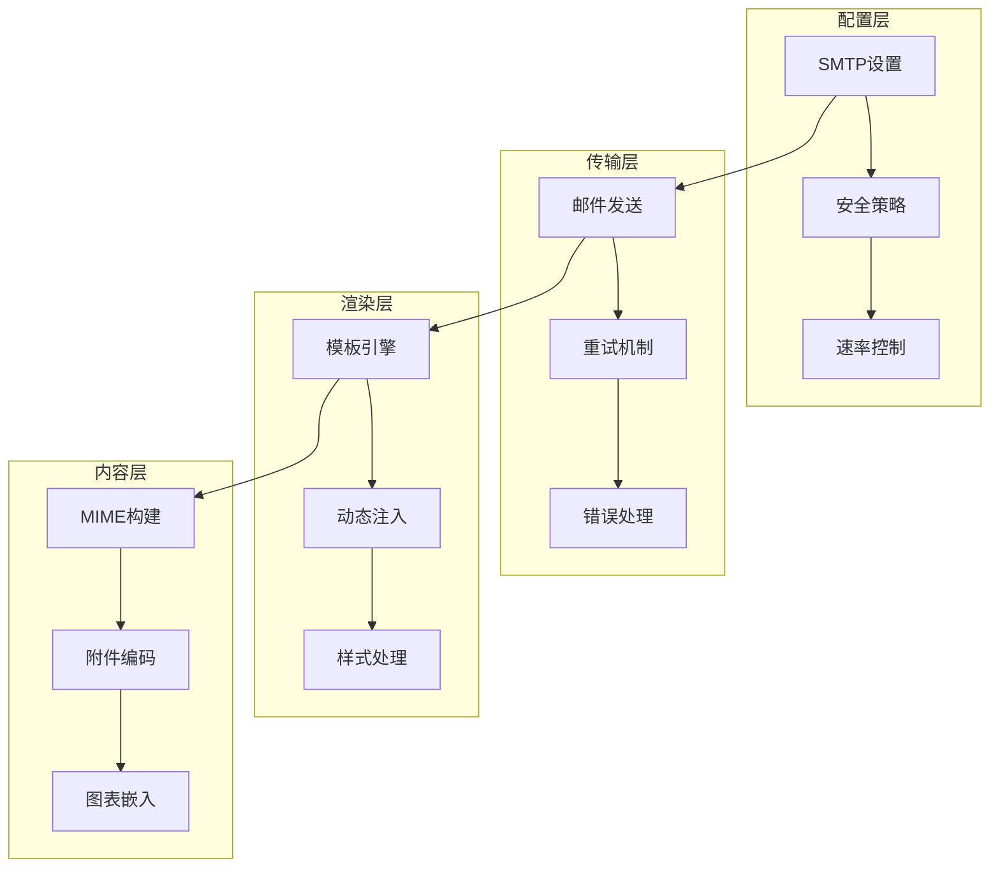
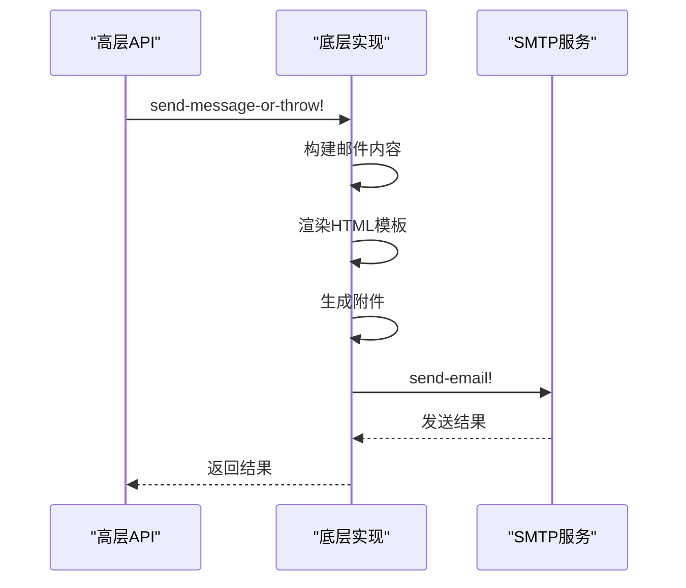
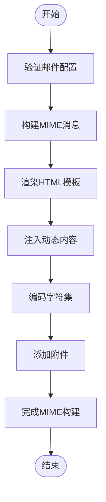
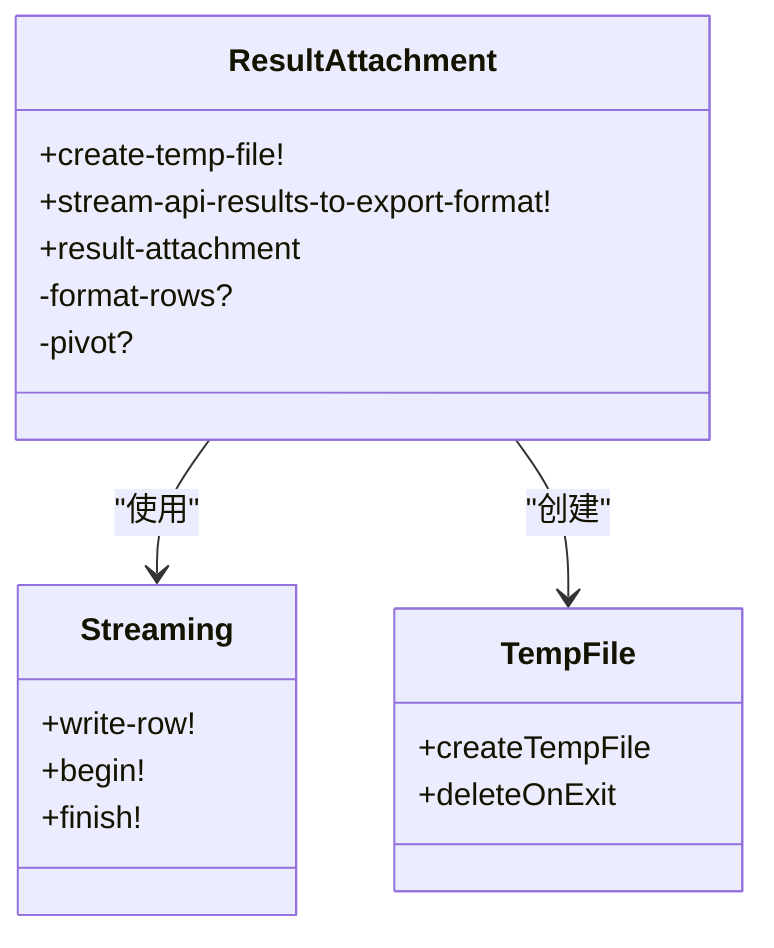
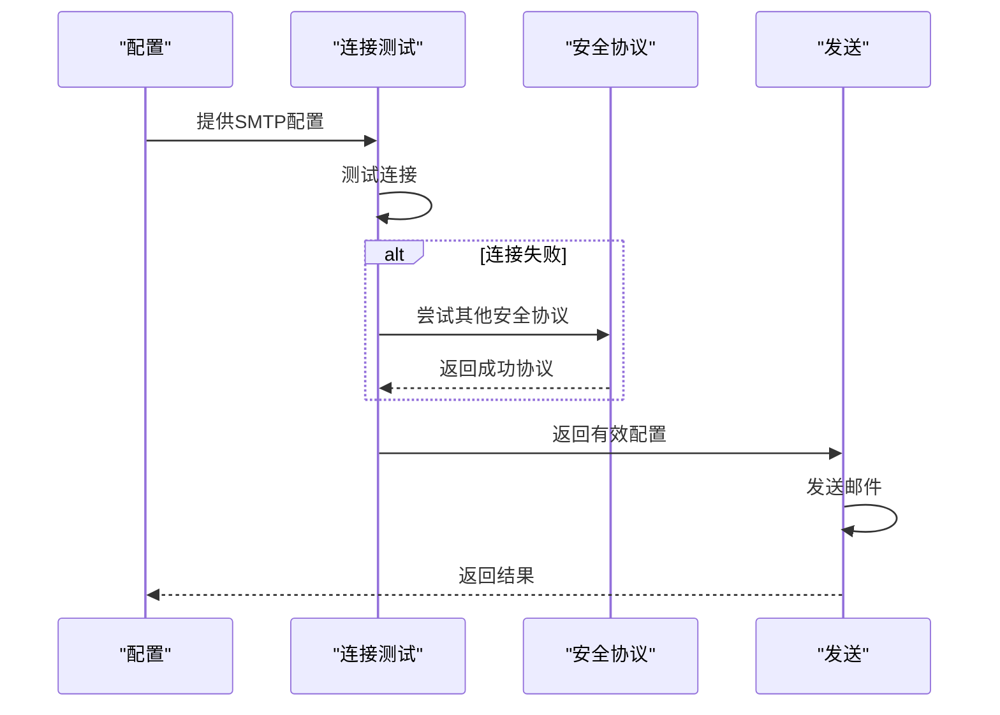
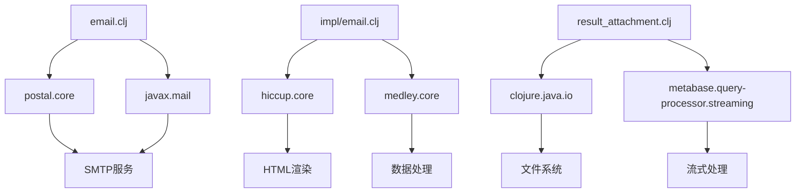
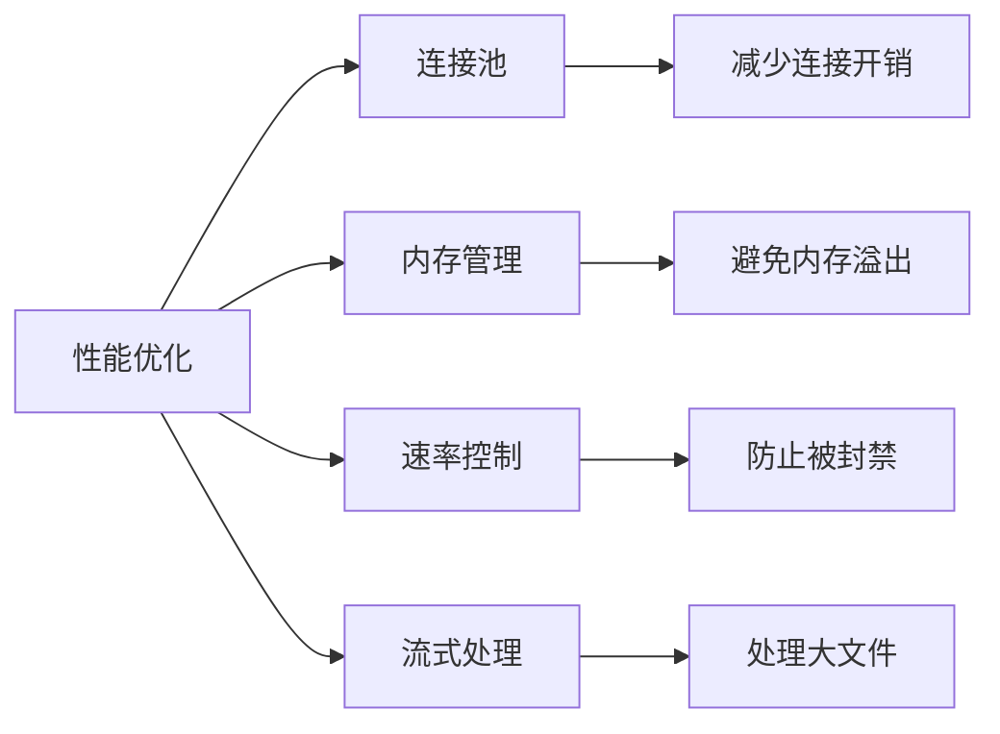
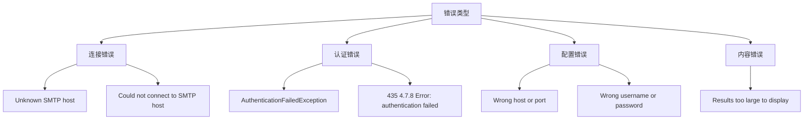

# 邮件通知实现

<cite>
**本文档引用的文件**  
- [email.clj](file://src/metabase/channel/email.clj)
- [impl/email.clj](file://src/metabase/channel/impl/email.clj)
- [messages.clj](file://src/metabase/channel/email/messages.clj)
- [result_attachment.clj](file://src/metabase/channel/email/result_attachment.clj)
- [settings.clj](file://src/metabase/channel/settings.clj)
- [shared.clj](file://src/metabase/channel/shared.clj)
- [render/core.clj](file://src/metabase/channel/render/core.clj)
- [dashboard_subscription.hbs](file://src/metabase/channel/email/dashboard_subscription.hbs)
- [notification_card.hbs](file://src/metabase/channel/email/notification_card.hbs)
</cite>

## 目录
1. [项目结构](#项目结构)
2. [核心组件](#核心组件)
3. [架构概述](#架构概述)
4. [详细组件分析](#详细组件分析)
5. [依赖分析](#依赖分析)
6. [性能考虑](#性能考虑)
7. [故障排除指南](#故障排除指南)
8. [结论](#结论)

## 项目结构

Metabase的邮件通知机制主要位于`src/metabase/channel`目录下，采用分层架构设计。核心组件包括高层封装、底层实现、模板系统和附件处理模块。

**图表来源**
- [email.clj](file://src/metabase/channel/email.clj)
- [impl/email.clj](file://src/metabase/channel/impl/email.clj)
- [messages.clj](file://src/metabase/channel/email/messages.clj)
- [result_attachment.clj](file://src/metabase/channel/email/result_attachment.clj)

**章节来源**
- [email.clj](file://src/metabase/channel/email.clj)
- [impl/email.clj](file://src/metabase/channel/impl/email.clj)

## 核心组件

邮件通知系统由多个核心组件构成，包括SMTP配置管理、MIME消息构建、HTML模板渲染和附件编码等。系统采用分层设计，`email.clj`提供高层API封装，`impl/email.clj`实现具体业务逻辑，`messages.clj`管理预设模板，`result_attachment.clj`处理图表嵌入。

**章节来源**
- [email.clj](file://src/metabase/channel/email.clj#L1-L362)
- [impl/email.clj](file://src/metabase/channel/impl/email.clj#L1-L325)

## 架构概述

邮件通知系统采用分层架构，分为配置层、传输层、渲染层和内容层。配置层管理SMTP设置和安全策略，传输层处理邮件发送和重试机制，渲染层负责HTML模板处理和动态内容注入，内容层管理附件生成和MIME消息构建。

**图表来源**
- [email.clj](file://src/metabase/channel/email.clj#L1-L362)
- [impl/email.clj](file://src/metabase/channel/impl/email.clj#L1-L325)

## 详细组件分析

### 高层封装与底层实现协作

邮件通知系统采用高层封装与底层实现分离的设计模式。`email.clj`作为高层封装，提供简洁的API接口，而`impl/email.clj`作为底层实现，处理具体的业务逻辑。

**图表来源**
- [email.clj](file://src/metabase/channel/email.clj#L1-L362)
- [impl/email.clj](file://src/metabase/channel/impl/email.clj#L1-L325)

**章节来源**
- [email.clj](file://src/metabase/channel/email.clj#L1-L362)
- [impl/email.clj](file://src/metabase/channel/impl/email.clj#L1-L325)

### MIME消息构建与HTML模板渲染

系统使用MIME标准构建多部分邮件消息，支持文本、HTML和附件等多种内容类型。HTML模板采用Handlebars引擎，支持动态内容注入。

**图表来源**
- [email.clj](file://src/metabase/channel/email.clj#L146)
- [impl/email.clj](file://src/metabase/channel/impl/email.clj#L110)
- [settings.clj](file://src/metabase/channel/settings.clj)

**章节来源**
- [email.clj](file://src/metabase/channel/email.clj#L146)
- [impl/email.clj](file://src/metabase/channel/impl/email.clj#L110)

### 附件编码与图表嵌入

附件处理模块负责生成CSV和XLSX格式的附件，支持大文件处理和内存优化。图表嵌入通过临时文件和流式处理实现，确保大附件的可靠传输。

**图表来源**
- [result_attachment.clj](file://src/metabase/channel/email/result_attachment.clj#L1-L111)
- [shared.clj](file://src/metabase/channel/shared.clj#L1-L142)

**章节来源**
- [result_attachment.clj](file://src/metabase/channel/email/result_attachment.clj#L1-L111)

### SMTP传输流程

SMTP传输流程包括连接测试、安全协议协商、身份验证和邮件发送等步骤。系统支持TLS、SSL和STARTTLS等多种安全协议，并提供自动协商机制。

**图表来源**
- [email.clj](file://src/metabase/channel/email.clj#L201-L257)
- [settings.clj](file://src/metabase/channel/settings.clj#L237-L266)

**章节来源**
- [email.clj](file://src/metabase/channel/email.clj#L201-L257)

## 依赖分析

邮件通知系统依赖多个外部组件和内部模块，包括SMTP库、模板引擎、文件处理和安全加密等。

**图表来源**
- [email.clj](file://src/metabase/channel/email.clj#L1-L362)
- [impl/email.clj](file://src/metabase/channel/impl/email.clj#L1-L325)
- [result_attachment.clj](file://src/metabase/channel/email/result_attachment.clj#L1-L111)

**章节来源**
- [email.clj](file://src/metabase/channel/email.clj#L1-L362)
- [impl/email.clj](file://src/metabase/channel/impl/email.clj#L1-L325)

## 性能考虑

系统在性能方面进行了多项优化，包括连接池管理、内存优化和速率控制等。通过流式处理大文件，避免内存溢出；通过速率控制防止邮件服务器被封禁。

**图表来源**
- [email.clj](file://src/metabase/channel/email.clj#L27)
- [result_attachment.clj](file://src/metabase/channel/email/result_attachment.clj#L1-L111)

## 故障排除指南

邮件通知系统提供了详细的错误处理和日志记录机制，便于故障排查和系统维护。

**图表来源**
- [email.clj](file://src/metabase/channel/email.clj#L281-L308)
- [settings.clj](file://src/metabase/channel/settings.clj)

**章节来源**
- [email.clj](file://src/metabase/channel/email.clj#L281-L308)

## 结论

Metabase的邮件通知机制采用分层架构设计，实现了高效、安全和可扩展的邮件发送功能。系统通过高层封装与底层实现分离，提供了灵活的API接口和强大的功能支持。MIME消息构建、HTML模板渲染、附件编码和SMTP传输等核心组件协同工作，确保了邮件通知的可靠性和用户体验。通过合理的性能优化和错误处理机制，系统能够稳定运行在各种生产环境中。