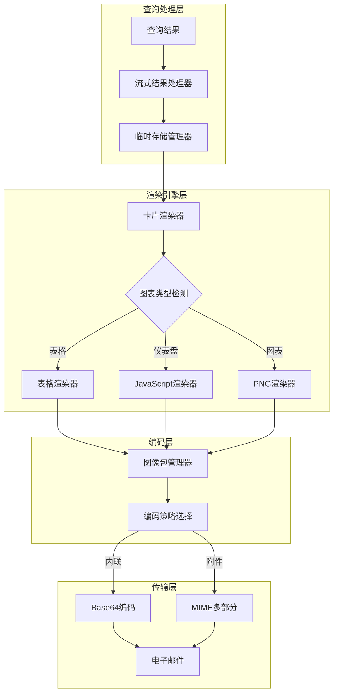
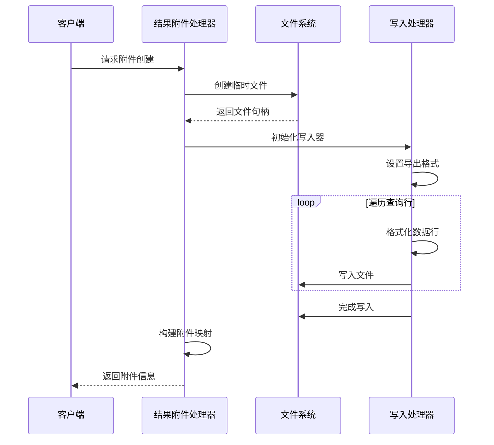
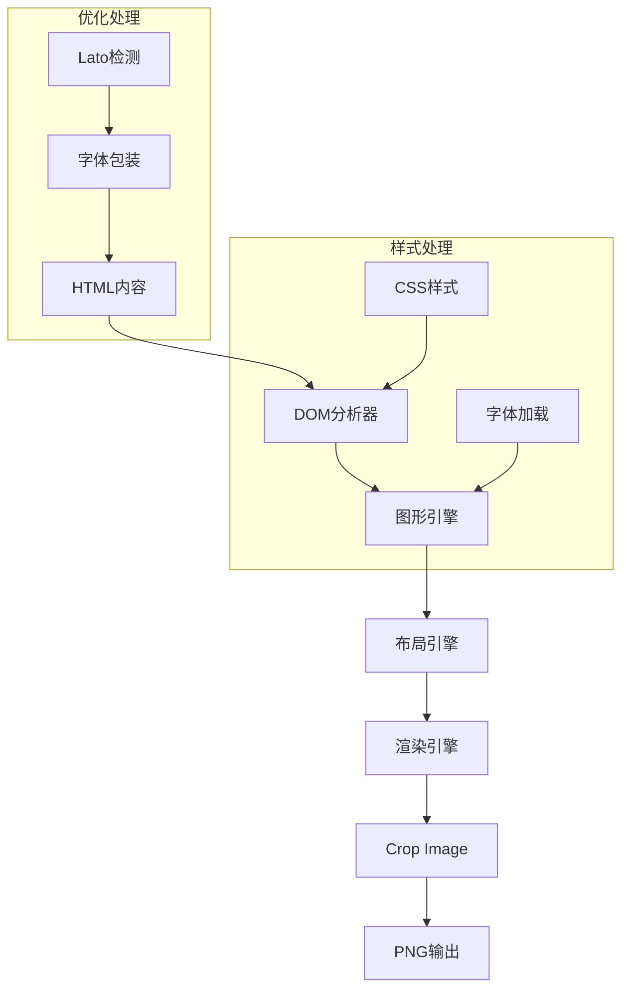
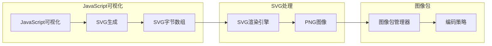
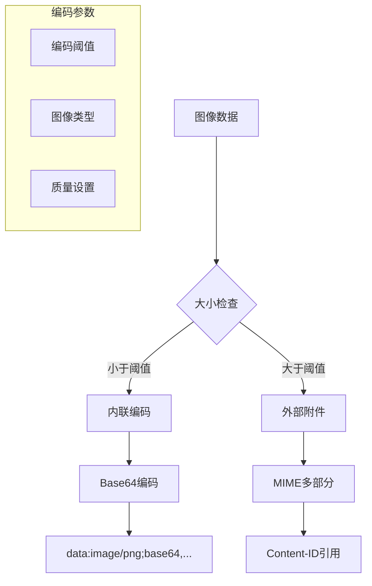
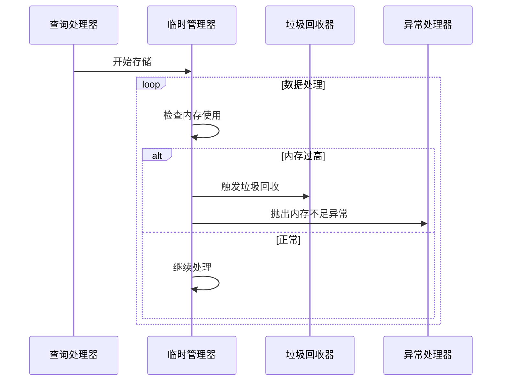

# 附件处理与图表嵌入

<cite>
**本文档引用的文件**
- [result_attachment.clj](file://src/metabase/channel/email/result_attachment.clj)
- [core.clj](file://src/metabase/channel/render/core.clj)
- [png.clj](file://src/metabase/channel/render/png.clj)
- [image_bundle.clj](file://src/metabase/channel/render/image_bundle.clj)
- [card.clj](file://src/metabase/channel/render/card.clj)
- [body.clj](file://src/metabase/channel/render/body.clj)
- [shared.clj](file://src/metabase/channel/shared.clj)
- [email.clj](file://src/metabase/channel/impl/email.clj)
- [settings.clj](file://src/metabase/channel/settings.clj)
- [temp_storage.clj](file://src/metabase/notification/payload/temp_storage.clj)
</cite>

## 目录
1. [简介](#简介)
2. [系统架构概览](#系统架构概览)
3. [查询结果附件处理](#查询结果附件处理)
4. [PNG图像渲染引擎](#png图像渲染引擎)
5. [JavaScript渲染与SVG转换](#javascript渲染与svg转换)
6. [图像编码策略](#图像编码策略)
7. [内存优化与大文件处理](#内存优化与大文件处理)
8. [性能调优建议](#性能调优建议)
9. [故障排除指南](#故障排除指南)
10. [总结](#总结)

## 简介

Metabase的附件处理与图表嵌入系统是一个复杂的多层架构，负责将查询结果转换为可嵌入电子邮件的图像附件。该系统支持多种图表类型（表格、仪表板、仪表盘等）的渲染，并提供了灵活的编码策略来处理不同大小的数据集。

核心功能包括：
- 查询结果到PNG图像的转换
- JavaScript可视化图表的SVG渲染
- 内联图像与外部附件的智能选择
- 大文件压缩与内存优化
- 超时控制与错误处理机制

## 系统架构概览

**图表来源**
- [card.clj](file://src/metabase/channel/render/card.clj#L1-L50)
- [png.clj](file://src/metabase/channel/render/png.clj#L1-L30)
- [image_bundle.clj](file://src/metabase/channel/render/image_bundle.clj#L1-L40)

## 查询结果附件处理

### result_attachment.clj 核心功能

查询结果附件处理是整个系统的基础，负责将数据库查询结果转换为CSV或Excel格式的文件附件。

#### 主要组件

1. **流式结果处理器**：使用`stream-api-results-to-export-format!`函数将查询结果直接流式写入文件
2. **临时文件管理**：自动创建和清理临时文件，防止磁盘空间泄漏
3. **导出格式支持**：同时支持CSV和Excel格式输出

#### 关键特性

- **内存安全**：通过流式处理避免大量数据占用内存
- **格式兼容**：支持标准的CSV和Excel格式
- **错误处理**：完善的异常捕获和用户友好的错误消息

**章节来源**
- [result_attachment.clj](file://src/metabase/channel/email/result_attachment.clj#L1-L112)

### 附件创建流程

**图表来源**
- [result_attachment.clj](file://src/metabase/channel/email/result_attachment.clj#L40-L70)

## PNG图像渲染引擎

### 渲染架构

PNG渲染引擎基于CSSBox库构建，提供了高质量的HTML到PNG转换能力。

#### 核心组件

1. **DOM分析器**：解析HTML内容并应用CSS样式
2. **图形引擎**：处理字体渲染和布局计算
3. **图像生成器**：将渲染结果转换为PNG格式

#### 渲染管道

**图表来源**
- [png.clj](file://src/metabase/channel/render/png.clj#L40-L80)

### 字体处理机制

系统实现了智能的字体处理机制来解决国际化字符显示问题：

1. **Lato字体检测**：自动检测系统中可用的Lato字体
2. **字符兼容性检查**：验证字符串是否能被当前字体正确渲染
3. **字体回退策略**：对不支持的字符使用sans-serif字体

**章节来源**
- [png.clj](file://src/metabase/channel/render/png.clj#L80-L143)

## JavaScript渲染与SVG转换

### JavaScript可视化渲染

对于复杂的JavaScript可视化图表，系统采用两阶段渲染策略：

1. **第一阶段**：生成SVG字符串
2. **第二阶段**：将SVG转换为PNG图像

#### 渲染流程

**图表来源**
- [body.clj](file://src/metabase/channel/render/body.clj#L400-L450)

### SVG优化策略

系统对SVG内容进行了多项优化：

1. **字符清理**：移除无效的Unicode字符
2. **尺寸控制**：动态调整渲染尺寸以提高质量
3. **内存管理**：及时释放SVG解析资源

**章节来源**
- [body.clj](file://src/metabase/channel/render/body.clj#L300-L350)

## 图像编码策略

### 内联图像 vs 外部附件

系统根据图像大小和类型智能选择编码策略：

#### 编码策略决策树

**图表来源**
- [image_bundle.clj](file://src/metabase/channel/render/image_bundle.clj#L40-L80)

### Base64编码实现

Base64编码用于小尺寸图像的内联传输：

1. **字节数组处理**：直接将PNG字节数组转换为Base64字符串
2. **MIME类型声明**：包含正确的Content-Type头信息
3. **URL格式化**：生成标准的data URI格式

### MIME多部分编码

对于大型图像附件，系统使用MIME多部分格式：

1. **Content-ID生成**：基于哈希算法生成唯一标识符
2. **临时文件管理**：自动创建和清理临时文件
3. **附件引用**：通过Content-ID在HTML中引用

**章节来源**
- [image_bundle.clj](file://src/metabase/channel/render/image_bundle.clj#L1-L125)

## 内存优化与大文件处理

### 流式处理架构

系统采用多层次的流式处理来优化内存使用：

#### 内存层次结构

**图表来源**
- [temp_storage.clj](file://src/metabase/notification/payload/temp_storage.clj#L200-L250)

### 大文件压缩机制

系统实现了智能的大文件压缩策略：

1. **行数限制**：默认限制为20行，可通过设置调整
2. **截断警告**：向用户明确显示数据被截断
3. **附件补充**：提供完整数据的文件附件

### 内存监控与保护

**图表来源**
- [shared.clj](file://src/metabase/channel/shared.clj#L30-L60)

**章节来源**
- [temp_storage.clj](file://src/metabase/notification/payload/temp_storage.clj#L1-L300)
- [shared.clj](file://src/metabase/channel/shared.clj#L1-L143)

## 性能调优建议

### 渲染性能优化

1. **图表类型选择**
   - 对于简单数据，优先使用表格渲染
   - 复杂可视化考虑使用JavaScript渲染
   - 避免过度复杂的图表配置

2. **内存配置优化**
   - 调整`notification-temp-file-size-max-bytes`设置
   - 优化`attachment-table-row-limit`参数
   - 监控JVM堆内存使用情况

3. **并发处理**
   - 合理配置线程池大小
   - 使用异步处理减少阻塞
   - 实施适当的超时控制

### 存储优化策略

1. **临时文件管理**
   - 定期清理过期的临时文件
   - 监控临时目录空间使用
   - 实施文件生命周期管理

2. **缓存策略**
   - 利用图像包缓存减少重复渲染
   - 实施适当的缓存失效机制
   - 监控缓存命中率

## 故障排除指南

### 常见渲染失败问题

#### 1. 内存不足错误

**症状**：`OutOfMemoryError`或类似异常

**解决方案**：
- 减少`attachment-table-row-limit`设置
- 增加JVM堆内存大小
- 启用磁盘流式处理

#### 2. 字体渲染问题

**症状**：国际化字符显示为方框或问号

**解决方案**：
- 确保系统安装了Lato字体
- 检查字体文件完整性
- 使用字体回退机制

#### 3. 图像渲染超时

**症状**：渲染过程长时间无响应

**解决方案**：
- 调整渲染超时设置
- 简化图表复杂度
- 分批处理大数据集

### 调试工具和技术

1. **日志分析**
   - 启用详细日志记录
   - 监控渲染时间统计
   - 跟踪内存使用模式

2. **性能监控**
   - 监控CPU使用率
   - 跟踪I/O操作延迟
   - 分析网络传输效率

3. **错误诊断**
   - 收集异常堆栈信息
   - 分析内存转储文件
   - 检查系统资源使用

**章节来源**
- [settings.clj](file://src/metabase/channel/settings.clj#L70-L110)

## 总结

Metabase的附件处理与图表嵌入系统是一个高度优化的多层架构，具备以下核心优势：

### 技术特点

1. **高性能渲染**：基于CSSBox的高质量HTML到PNG转换
2. **智能编码**：根据内容大小自动选择最优编码策略
3. **内存安全**：多层次的流式处理确保大文件安全处理
4. **扩展性强**：支持多种图表类型和渲染方式

### 最佳实践

1. **合理配置参数**：根据实际需求调整内存和性能参数
2. **监控系统状态**：定期检查内存使用和渲染性能
3. **备份重要数据**：确保临时文件的安全管理和清理
4. **测试渲染效果**：在生产环境前充分测试各种图表类型

### 发展方向

随着数据量的增长和用户需求的变化，系统将继续优化：
- 更高效的压缩算法
- 更智能的缓存策略
- 更强大的并发处理能力
- 更丰富的图表类型支持

这个系统为Metabase提供了强大的可视化能力，使用户能够通过电子邮件和其他渠道方便地分享数据分析结果。