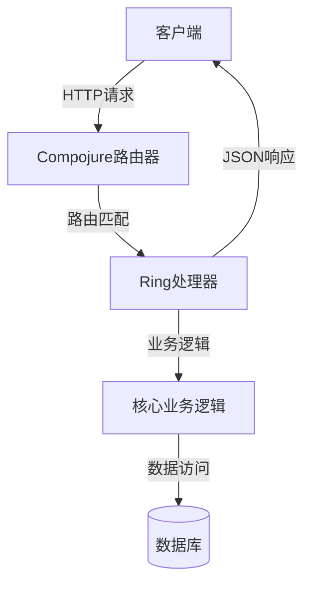
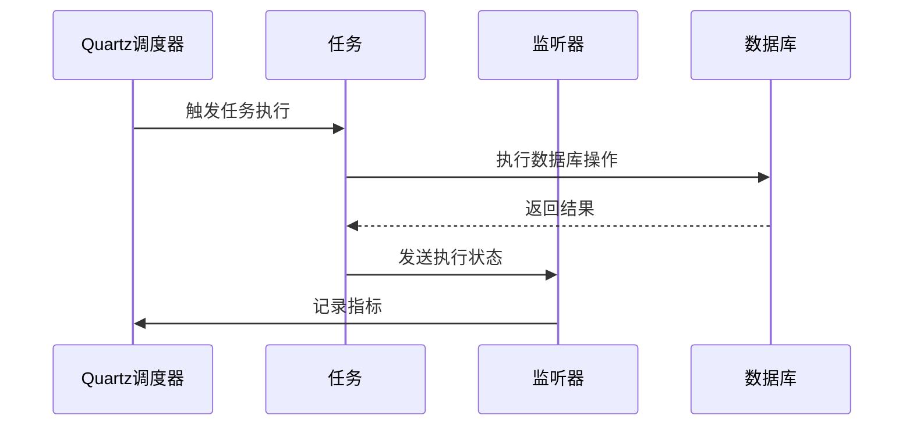

# 技术栈与依赖

<cite>
**本文档中引用的文件**   
- [core.clj](file://src/metabase/core/core.clj)
- [driver.clj](file://src/metabase/driver.clj)
- [app_db/core.clj](file://src/metabase/app_db/core.clj)
- [app_db/liquibase.clj](file://src/metabase/app_db/liquibase.clj)
- [task/core.clj](file://src/metabase/task/core.clj)
- [analytics/prometheus.clj](file://src/metabase/analytics/prometheus.clj)
- [analytics/snowplow.clj](file://src/metabase/analytics/snowplow.clj)
- [server/core.clj](file://src/metabase/server/core.clj)
- [app_db/connection_pool_setup.clj](file://src/metabase/app_db/connection_pool_setup.clj)
- [cmd/core.clj](file://src/metabase/cmd/core.clj)
</cite>

## 目录
1. [Clojure语言与项目架构](#clojure语言与项目架构)
2. [HTTP服务与RESTful API](#http服务与restful-api)
3. [数据库迁移与模式管理](#数据库迁移与模式管理)
4. [任务调度系统](#任务调度系统)
5. [监控与分析集成](#监控与分析集成)
6. [多数据库支持与JDBC驱动](#多数据库支持与jdbc驱动)
7. [依赖管理与最佳实践](#依赖管理与最佳实践)

## Clojure语言与项目架构

Metabase项目采用Clojure语言构建，这是一种基于JVM的Lisp方言，以其函数式编程特性、不可变数据结构和强大的宏系统而著称。项目架构遵循模块化设计原则，通过命名空间（namespace）组织代码，每个命名空间负责特定的功能领域。核心架构组件包括`metabase.core.core`，它作为应用的主入口点，负责初始化和启动整个系统。

Clojure的动态特性使得Metabase能够实现灵活的依赖注入和运行时配置。通过`defmethod`和多态分派机制，系统实现了高度可扩展的插件架构，允许开发者轻松地为新的数据库类型添加支持。项目利用Clojure的`require`和`import`机制来管理命名空间依赖，确保代码的清晰性和可维护性。

**Section sources**
- [core.clj](file://src/metabase/core/core.clj#L1-L280)

## HTTP服务与RESTful API

Metabase使用Ring和Compojure框架构建其HTTP服务和RESTful API。Ring是一个轻量级的Web抽象层，提供了处理HTTP请求和响应的标准接口。Compojure则在此基础上提供了路由功能，允许开发者通过简洁的DSL定义URL路由和请求处理逻辑。

在Metabase中，`metabase.server.core`命名空间是HTTP服务的API入口点，它集成了Ring和Compojure，并通过`make-handler`和`make-routes`函数构建了应用的主处理器和路由表。API端点通过`defendpoint`宏定义，该宏生成符合Ring规范的处理器函数，支持参数验证、错误处理和响应格式化。

**Diagram sources**
- [server/core.clj](file://src/metabase/server/core.clj#L1-L34)

## 数据库迁移与模式管理

Metabase使用Liquibase进行数据库迁移和模式管理。Liquibase是一个开源的数据库变更管理工具，它通过版本化的变更日志（changelog）文件来跟踪和应用数据库模式的变更。在Metabase中，`metabase.app_db.liquibase`命名空间提供了对Liquibase API的Clojure封装，使得数据库迁移过程更加自动化和可靠。

Liquibase的变更日志文件（如`liquibase.yaml`）以YAML格式定义了数据库的变更集（changeset），包括创建表、修改列、添加约束等操作。Metabase在启动时会自动检查并应用任何未运行的变更集，确保数据库模式与应用代码保持同步。此外，Liquibase还支持回滚操作，允许在必要时将数据库恢复到之前的版本。

**Section sources**
- [app_db/liquibase.clj](file://src/metabase/app_db/liquibase.clj#L1-L594)
- [app_db/core.clj](file://src/metabase/app_db/core.clj#L1-L164)

## 任务调度系统

Metabase的任务调度系统基于Quartz实现，用于执行周期性任务，如同步数据库、发送报表和清理过期数据。`metabase.task.core`命名空间提供了对Quartz调度器的高级封装，包括`init-scheduler!`、`start-scheduler!`和`stop-scheduler!`等函数，用于初始化、启动和停止调度器。

任务通过`defjob`宏定义，并通过`schedule-task!`函数注册到调度器中。Quartz支持复杂的调度表达式（cron expressions），允许精确控制任务的执行时间。此外，Metabase还实现了任务监听器和触发器监听器，用于监控任务的执行状态和性能指标。

**Diagram sources**
- [task/core.clj](file://src/metabase/task/core.clj#L1-L31)
- [analytics/prometheus.clj](file://src/metabase/analytics/prometheus.clj#L1-L667)

## 监控与分析集成

Metabase集成了Prometheus和Snowplow等监控与分析工具，以提供全面的系统可观测性和用户行为分析。Prometheus用于收集和暴露应用的性能指标，如JVM内存使用、数据库连接池状态和HTTP请求延迟。`metabase.analytics.prometheus`命名空间负责初始化Prometheus注册表和Web服务器，并定义了多个自定义收集器来监控关键业务指标。

Snowplow则用于收集和分析用户行为数据，帮助团队了解用户如何与产品交互。`metabase.analytics.snowplow`命名空间实现了Snowplow跟踪器，能够发送自定义事件到Snowplow收集器。这些事件包括用户登录、仪表板浏览和查询执行等，为产品优化和市场决策提供数据支持。

**Section sources**
- [analytics/prometheus.clj](file://src/metabase/analytics/prometheus.clj#L1-L667)
- [analytics/snowplow.clj](file://src/metabase/analytics/snowplow.clj#L1-L161)

## 多数据库支持与JDBC驱动

Metabase通过`driver`模块实现对多种数据库的广泛支持。`metabase.driver`命名空间定义了一个多态接口，允许为不同的数据库类型（如PostgreSQL、MySQL、H2）实现特定的驱动程序。每个驱动程序都实现了`can-connect?`、`describe-database`和`execute-reducible-query`等方法，以提供一致的数据库访问API。

JDBC驱动通过`metabase.driver.sql-jdbc`父驱动进行管理，该驱动提供了通用的SQL和JDBC功能实现。连接池使用c3p0库，通过`metabase.app_db.connection_pool_setup`命名空间配置，确保数据库连接的高效复用和资源管理。驱动程序的注册和初始化由`register!`函数处理，支持动态加载和延迟初始化。

**Section sources**
- [driver.clj](file://src/metabase/driver.clj#L1-L1663)
- [app_db/connection_pool_setup.clj](file://src/metabase/app_db/connection_pool_setup.clj#L1-L151)

## 依赖管理与最佳实践

Metabase的依赖管理遵循Clojure社区的最佳实践，使用Leiningen或Clojure CLI工具管理项目依赖。项目依赖在`project.clj`或`deps.edn`文件中声明，包括核心库、数据库驱动和第三方服务集成。为了确保依赖的一致性和可重复性，建议使用版本锁定机制，如`deps.edn`中的`:override-deps`。

在开发过程中，应定期审查和更新依赖，以修复安全漏洞和利用新功能。对于生产环境，建议使用私有Maven仓库或Nexus来缓存和管理依赖，减少对外部网络的依赖。此外，通过`metabase.cmd.core`提供的命令行工具，可以方便地执行数据库迁移、数据导入导出等运维任务，提高系统的可维护性。

**Section sources**
- [cmd/core.clj](file://src/metabase/cmd/core.clj#L1-L317)