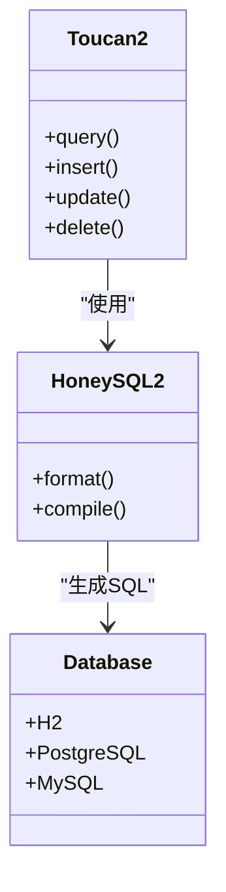
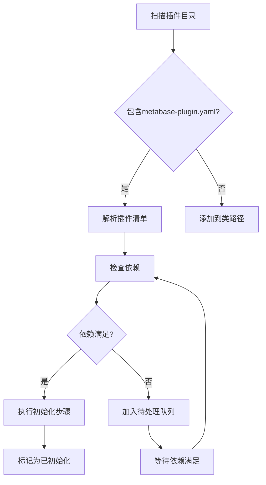
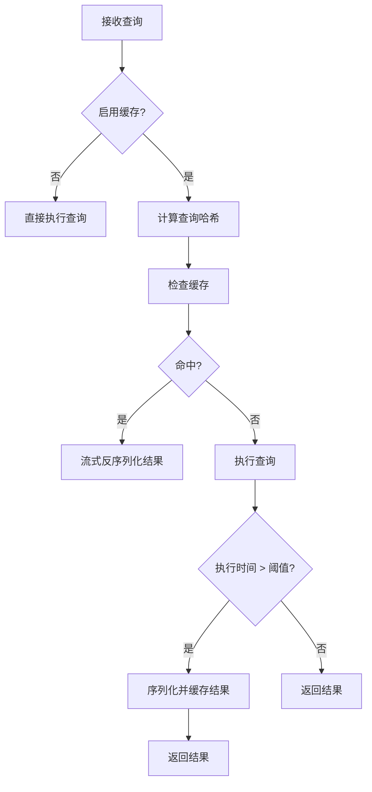

# 技术栈与依赖

<cite>
**本文档中引用的文件**  
- [actions.clj](file://src/metabase/actions/actions.clj)
- [app_db.clj](file://src/metabase/app_db/query.clj)
- [setup.clj](file://src/metabase/app_db/setup.clj)
- [connection_pool_setup.clj](file://src/metabase/app_db/connection_pool_setup.clj)
- [core.clj](file://src/metabase/server/core.clj)
- [instance.clj](file://src/metabase/server/instance.clj)
- [handler.clj](file://src/metabase/server/handler.clj)
- [json.clj](file://src/metabase/util/json.clj)
- [plugins/core.clj](file://src/metabase/plugins/core.clj)
- [plugins/impl.clj](file://src/metabase/plugins/impl.clj)
- [plugins/initialize.clj](file://src/metabase/plugins/initialize.clj)
- [plugins/dependencies.clj](file://src/metabase/plugins/dependencies.clj)
- [cache.clj](file://src/metabase/query_processor/middleware/cache.clj)
- [cache_backend/db.clj](file://src/metabase/query_processor/middleware/cache_backend/db.clj)
- [query_cache.clj](file://src/metabase/cache/models/query_cache.clj)
- [settings.clj](file://src/metabase/cache/settings.clj)
- [core.clj](file://src/metabase/cache/core.clj)
</cite>

## 目录
1. [引言](#引言)
2. [编程语言与核心框架](#编程语言与核心框架)
3. [数据库访问与ORM](#数据库访问与orm)
4. [插件系统与依赖管理](#插件系统与依赖管理)
5. [Web服务器与中间件](#web服务器与中间件)
6. [序列化与JSON处理](#序列化与json处理)
7. [缓存机制](#缓存机制)
8. [性能优化与最佳实践](#性能优化与最佳实践)
9. [结论](#结论)

## 引言

Metabase是一个基于Clojure语言构建的开源数据分析平台，其技术栈体现了函数式编程、不可变数据结构和声明式编程范式的精髓。本文档全面介绍Metabase项目的技术架构，涵盖从编程语言选择到核心框架、关键库、依赖管理机制以及基础设施组件的各个方面。通过深入分析代码库，我们将揭示Metabase如何利用Clojure生态系统中的Ring、Compojure、Toucan2和Honey SQL等技术组件构建一个可扩展、高性能的数据分析平台。文档还将详细说明函数式编程范式在项目中的应用，包括不可变数据结构的使用、纯函数的设计以及多态分发的实现，为开发者提供理解技术选型背后决策的全面视角。

## 编程语言与核心框架

Metabase采用Clojure作为主要编程语言，充分利用了其函数式编程特性、不可变数据结构和强大的宏系统。Clojure的Lisp语法和JVM平台支持为Metabase提供了高性能和良好的Java互操作性。项目的核心Web框架基于Ring和Compojure构建，形成了一个轻量级但功能强大的HTTP处理管道。

Ring作为Clojure的Web抽象层，将HTTP请求和响应表示为简单的Clojure数据结构，遵循"请求-响应"的函数式范式。每个HTTP请求被转换为一个包含所有相关信息的map，而响应则是一个包含状态码、头信息和主体的map。这种设计使得中间件可以轻松地以函数式方式处理请求和响应，通过函数组合实现功能的叠加。

Compojure作为构建在Ring之上的路由库，提供了声明式的路由定义语法。在Metabase中，Compojure用于定义API端点，将HTTP方法和URL路径映射到相应的处理函数。这种组合方式使得Web层的代码既简洁又易于理解，同时保持了函数式编程的纯粹性。

**Section sources**
- [core.clj](file://src/metabase/server/core.clj)
- [instance.clj](file://src/metabase/server/instance.clj)
- [handler.clj](file://src/metabase/server/handler.clj)

## 数据库访问与ORM

Metabase使用Toucan2作为其主要的ORM（对象关系映射）框架，结合Honey SQL 2进行SQL查询构建。这种组合提供了类型安全、可组合的数据库访问方式，同时保持了对底层SQL的完全控制。

Toucan2作为Toucan的现代化版本，提供了更强大的类型系统和更好的性能。在Metabase中，Toucan2被用于定义数据模型和执行CRUD操作。通过Toucan2的宏系统，开发者可以声明式地定义数据库表的映射关系，包括字段类型、约束和关联。Toucan2还提供了查询构建器，允许以Clojure数据结构的形式构建复杂的数据库查询。

Honey SQL 2则负责将Clojure数据结构转换为SQL语句。在Metabase的`app_db/query.clj`文件中，可以看到Honey SQL 2被用作Toucan2的后端，将Clojure形式的查询转换为特定数据库方言的SQL语句。这种分层设计使得Metabase能够支持多种数据库后端，包括H2、PostgreSQL和MySQL，同时保持代码的一致性和可维护性。

**Diagram sources**
- [query.clj](file://src/metabase/app_db/query.clj)
- [setup.clj](file://src/metabase/app_db/setup.clj)

**Section sources**
- [query.clj](file://src/metabase/app_db/query.clj)
- [setup.clj](file://src/metabase/app_db/setup.clj)

## 插件系统与依赖管理

Metabase的插件系统是其可扩展性的核心，允许通过外部JAR文件动态加载功能。插件管理机制在`metabase.plugins`命名空间中实现，提供了从插件发现到初始化的完整生命周期管理。

插件系统首先通过`plugins-dir`函数确定插件目录，该目录既包含Metabase自身提供的模块，也支持用户自定义的插件。在启动时，系统会扫描该目录下的所有JAR文件，通过检查是否存在`metabase-plugin.yaml`清单文件来识别有效的插件。对于没有插件清单的JAR文件，系统会直接将其添加到类路径中，这通常用于数据库驱动等依赖库。

插件的初始化过程由`load-plugins!`函数协调，该函数实现了复杂的依赖管理机制。每个插件可以在其清单文件中声明对其他插件、Java类或环境变量的依赖。`dependencies.clj`文件中的`dependency-satisfied?`多态函数负责检查这些依赖是否满足。系统维护一个依赖图，确保插件按照正确的顺序初始化，只有当所有依赖都满足时才会加载特定插件。

**Diagram sources**
- [core.clj](file://src/metabase/plugins/core.clj)
- [impl.clj](file://src/metabase/plugins/impl.clj)
- [initialize.clj](file://src/metabase/plugins/initialize.clj)
- [dependencies.clj](file://src/metabase/plugins/dependencies.clj)

**Section sources**
- [core.clj](file://src/metabase/plugins/core.clj)
- [impl.clj](file://src/metabase/plugins/impl.clj)
- [initialize.clj](file://src/metabase/plugins/initialize.clj)
- [dependencies.clj](file://src/metabase/plugins/dependencies.clj)

## Web服务器与中间件

Metabase的Web服务器基于Jetty构建，通过Ring适配器集成到Clojure的Web生态系统中。服务器实现在`metabase.server.instance`命名空间中，提供了启动、停止和配置嵌入式Web服务器的功能。

Web请求处理管道由一系列中间件函数组成，这些函数按照特定顺序应用到请求处理链中。每个中间件负责处理特定的横切关注点，如JSON序列化、身份验证和错误处理。在`metabase.server.handler`中，`make-handler`函数负责将路由和中间件组合成最终的请求处理函数。

服务器配置支持多种选项，包括端口、主机、线程池大小和SSL设置。这些配置通过环境变量或配置文件进行管理，使得Metabase可以在不同环境中灵活部署。对于开发环境，系统还提供了热重载功能，当代码发生变化时自动重新构建处理管道，极大地提高了开发效率。

**Section sources**
- [core.clj](file://src/metabase/server/core.clj)
- [instance.clj](file://src/metabase/server/instance.clj)
- [handler.clj](file://src/metabase/server/handler.clj)

## 序列化与JSON处理

Metabase的序列化机制在`metabase.util.json`命名空间中实现，提供了一个抽象层来处理JSON编码和解码。该实现基于Cheshire库，但通过自定义编码器和生成器提供了更精细的控制。

系统为各种Java和Clojure类型注册了自定义JSON编码器，确保复杂对象能够正确序列化。例如，`Temporal`类型（Java时间类）被格式化为ISO-8601标准的日期时间字符串，而二进制数组则被编码为十六进制字符串。这种可扩展的编码器系统允许开发者为自定义类型添加序列化逻辑，而无需修改核心序列化代码。

对于流式JSON响应，Metabase实现了高效的处理机制，避免将整个响应加载到内存中。通过`streamed-json-response`函数，系统可以将大型数据集逐步写入输出流，这对于处理大量查询结果的API端点尤为重要。这种设计显著降低了内存使用，提高了系统处理大数据集的能力。

**Section sources**
- [json.clj](file://src/metabase/util/json.clj)

## 缓存机制

Metabase实现了多层次的查询结果缓存机制，旨在提高性能并减少数据库负载。缓存系统在`metabase.query_processor.middleware.cache`命名空间中实现，作为查询处理管道的中间件存在。

缓存后端通过可插拔的接口设计，目前主要使用数据库后端（`:db`）将序列化的查询结果存储在`query_cache`表中。每个缓存条目由查询哈希标识，并包含压缩的序列化结果。系统定期清理过期的缓存条目，确保缓存不会无限增长。

缓存策略由查询的`cache-strategy`参数控制，支持多种缓存条件，如最小执行时间阈值。只有当查询执行时间超过指定阈值时，结果才会被缓存，这避免了为快速查询浪费存储空间。缓存系统还实现了流式反序列化，允许在不解压整个结果集的情况下逐步处理缓存数据，进一步优化了内存使用。

**Diagram sources**
- [cache.clj](file://src/metabase/query_processor/middleware/cache.clj)
- [db.clj](file://src/metabase/query_processor/middleware/cache_backend/db.clj)
- [query_cache.clj](file://src/metabase/cache/models/query_cache.clj)

**Section sources**
- [cache.clj](file://src/metabase/query_processor/middleware/cache.clj)
- [db.clj](file://src/metabase/query_processor/middleware/cache_backend/db.clj)
- [query_cache.clj](file://src/metabase/cache/models/query_cache.clj)
- [settings.clj](file://src/metabase/cache/settings.clj)
- [core.clj](file://src/metabase/cache/core.clj)

## 性能优化与最佳实践

Metabase通过多种机制实现性能优化，涵盖了从连接池管理到查询执行的各个方面。在数据库连接管理方面，系统使用c3p0连接池，并配置了合理的空闲连接测试和超时策略。`connection_pool_setup.clj`文件中的配置确保连接不会无限期保持打开状态，同时通过`DISCARD ALL`命令在PostgreSQL连接归还时清理会话状态，防止内存泄漏。

查询处理管道采用了中间件设计模式，允许功能的灵活组合和性能监控。每个中间件可以独立测量执行时间，为性能分析提供详细数据。系统还实现了查询计划缓存和结果缓存，避免重复执行相同的查询。

对于大型数据集的处理，Metabase强调流式处理和内存效率。序列化和反序列化过程设计为流式操作，避免将整个数据集加载到内存中。这种设计使得系统能够处理远超可用内存大小的数据集，同时保持稳定的性能表现。

配置方面，建议根据部署环境调整关键参数，如连接池大小、缓存最大大小和查询超时时间。监控系统提供了Prometheus指标集成，可以跟踪连接池状态、查询执行时间和缓存命中率等关键性能指标，帮助运维人员及时发现和解决性能瓶颈。

**Section sources**
- [connection_pool_setup.clj](file://src/metabase/app_db/connection_pool_setup.clj)
- [cache.clj](file://src/metabase/query_processor/middleware/cache.clj)
- [settings.clj](file://src/metabase/cache/settings.clj)

## 结论

Metabase的技术栈体现了现代函数式编程的最佳实践，通过Clojure语言的强大特性和精心设计的架构组件，构建了一个可扩展、高性能的数据分析平台。从Ring和Compojure的Web框架到Toucan2和Honey SQL的数据库访问层，再到灵活的插件系统和高效的缓存机制，每个技术组件都经过精心选择和集成，共同支持Metabase的核心功能。

函数式编程范式在项目中的应用尤为突出，不可变数据结构确保了线程安全和可预测的行为，纯函数设计简化了测试和调试，而多态分发机制提供了优雅的扩展点。这些设计决策不仅提高了代码质量和可维护性，也为系统的长期演进奠定了坚实基础。

对于开发者而言，理解这些技术组件的交互方式和设计原理，有助于更有效地贡献代码和解决问题。通过遵循文档中提到的最佳实践，可以确保新功能的实现与现有架构保持一致，维护系统的整体质量和性能。