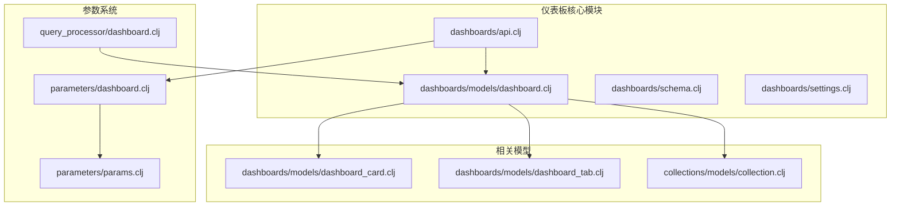
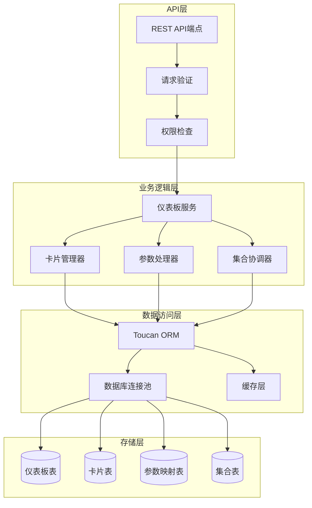
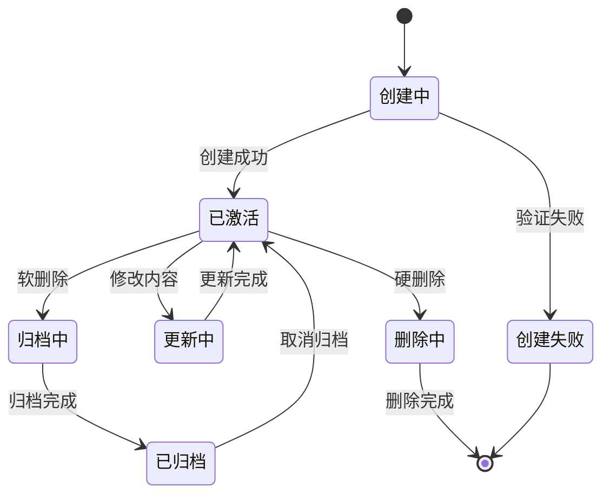
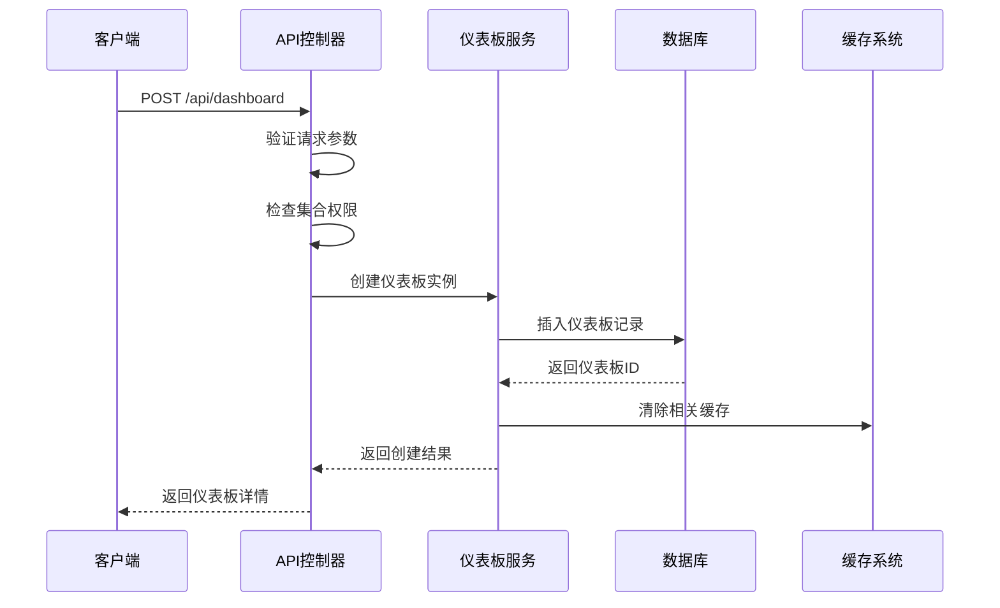
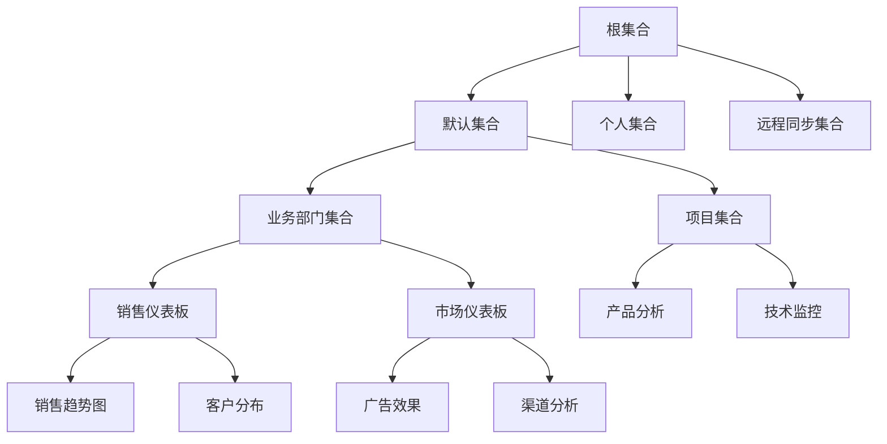
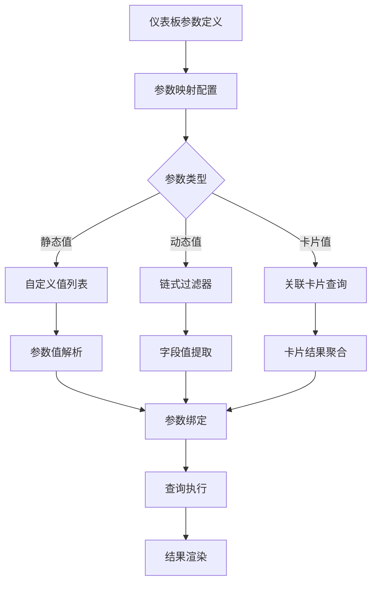
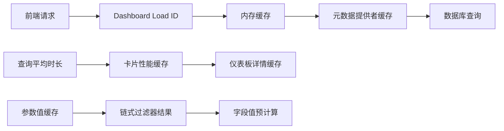
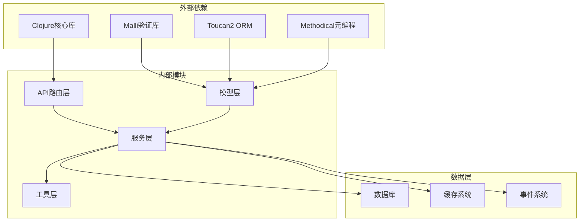

# 仪表板管理

<cite>
**本文档中引用的文件**
- [dashboard.clj](file://src/metabase/dashboards/models/dashboard.clj)
- [api.clj](file://src/metabase/dashboards/api.clj)
- [schema.clj](file://src/metabase/dashboards/schema.clj)
- [dashboard_card.clj](file://src/metabase/dashboards/models/dashboard_card.clj)
- [dashboard_tab.clj](file://src/metabase/dashboards/models/dashboard_tab.clj)
- [collection.clj](file://src/metabase/collections/models/collection.clj)
- [dashboard.clj](file://src/metabase/parameters/dashboard.clj)
- [dashboard.clj](file://src/metabase/query_processor/dashboard.clj)
- [params.clj](file://src/metabase/parameters/params.clj)
- [settings.clj](file://src/metabase/dashboards/settings.clj)
</cite>

## 目录
1. [简介](#简介)
2. [项目结构](#项目结构)
3. [核心组件](#核心组件)
4. [架构概览](#架构概览)
5. [详细组件分析](#详细组件分析)
6. [依赖关系分析](#依赖关系分析)
7. [性能考虑](#性能考虑)
8. [故障排除指南](#故障排除指南)
9. [结论](#结论)

## 简介

Metabase仪表板管理系统是一个复杂而强大的数据可视化平台，提供了完整的仪表板生命周期管理功能。该系统支持仪表板的创建、更新、删除、权限控制以及与集合（Collection）的层级关系管理。仪表板作为数据展示的核心组件，通过参数化查询和卡片组合实现了高度灵活的数据分析体验。

## 项目结构

仪表板管理功能主要分布在以下模块中：

**图表来源**
- [dashboard.clj](file://src/metabase/dashboards/models/dashboard.clj#L1-L50)
- [api.clj](file://src/metabase/dashboards/api.clj#L1-L50)
- [dashboard_card.clj](file://src/metabase/dashboards/models/dashboard_card.clj#L1-L50)

**章节来源**
- [dashboard.clj](file://src/metabase/dashboards/models/dashboard.clj#L1-L100)
- [api.clj](file://src/metabase/dashboards/api.clj#L1-L100)

## 核心组件

### Dashboard实体数据结构

Dashboard实体是仪表板管理的核心数据模型，包含了仪表板的所有基本信息和元数据：

| 字段名 | 类型 | 描述 | 业务含义 |
|--------|------|------|----------|
| id | PositiveInt | 唯一标识符 | 仪表板的唯一ID |
| name | NonBlankString | 名称 | 用户可见的仪表板标题 |
| description | String | 描述 | 仪表板的详细说明 |
| parameters | Parameters | 参数列表 | 仪表板级别的参数定义 |
| collection_id | PositiveInt | 集合ID | 所属集合的引用 |
| creator_id | PositiveInt | 创建者ID | 创建该仪表板的用户ID |
| archived | Boolean | 归档状态 | 是否已归档 |
| width | Integer | 宽度 | 仪表板布局宽度 |
| enable_embedding | Boolean | 嵌入启用 | 是否允许嵌入到其他应用 |
| public_uuid | UUID | 公共UUID | 公开访问的唯一标识 |

### DashboardCard实体

DashboardCard代表仪表板中的单个卡片，是数据展示的基本单元：

| 字段名 | 类型 | 描述 | 业务含义 |
|--------|------|------|----------|
| id | PositiveInt | 唯一标识符 | 卡片的唯一ID |
| dashboard_id | PositiveInt | 仪表板ID | 所属仪表板的引用 |
| card_id | PositiveInt | 卡片ID | 关联的数据卡片ID |
| parameter_mappings | ParameterMappings | 参数映射 | 参数到卡片字段的映射关系 |
| visualization_settings | Map | 可视化设置 | 图表显示配置 |
| size_x | PositiveInt | 横向尺寸 | 卡片在网格中的宽度 |
| size_y | PositiveInt | 纵向尺寸 | 卡片在网格中的高度 |
| row | IntGreaterThanOrEqualToZero | 行位置 | 卡片在仪表板中的行位置 |
| col | IntGreaterThanOrEqualToZero | 列位置 | 卡片在仪表板中的列位置 |

**章节来源**
- [dashboard.clj](file://src/metabase/dashboards/models/dashboard.clj#L150-L250)
- [dashboard_card.clj](file://src/metabase/dashboards/models/dashboard_card.clj#L50-L150)

## 架构概览

仪表板管理系统采用分层架构设计，确保了良好的可扩展性和维护性：

**图表来源**
- [api.clj](file://src/metabase/dashboards/api.clj#L100-L200)
- [dashboard.clj](file://src/metabase/dashboards/models/dashboard.clj#L1-L100)

## 详细组件分析

### 仪表板生命周期管理

仪表板的完整生命周期包括创建、更新、删除和归档四个主要阶段：

#### 创建流程

仪表板创建过程涉及多个验证步骤和权限检查：

**图表来源**
- [api.clj](file://src/metabase/dashboards/api.clj#L150-L200)
- [dashboard.clj](file://src/metabase/dashboards/models/dashboard.clj#L100-L150)

#### 权限控制机制

仪表板系统实现了细粒度的权限控制，支持读写权限分离：

| 权限类型 | 描述 | 应用场景 |
|----------|------|----------|
| 读取权限 | 查看仪表板内容 | 公共仪表板、只读用户 |
| 写入权限 | 修改仪表板内容 | 仪表板创建者、编辑者 |
| 管理权限 | 删除和归档仪表板 | 超级用户、管理员 |
| 嵌入权限 | 允许外部应用嵌入 | 特定仪表板的嵌入配置 |

**章节来源**
- [dashboard.clj](file://src/metabase/dashboards/models/dashboard.clj#L40-L80)
- [api.clj](file://src/metabase/dashboards/api.clj#L600-L650)

### 仪表板与集合的层级关系

仪表板与集合之间存在严格的层级关系，这种设计确保了组织结构的一致性：

**图表来源**
- [collection.clj](file://src/metabase/collections/models/collection.clj#L200-L300)
- [dashboard.clj](file://src/metabase/dashboards/models/dashboard.clj#L150-L200)

#### 集合位置路径管理

集合使用位置路径（Location Path）来表示层级关系，这种设计避免了复杂的外键关联：

| 路径格式 | 示例 | 含义 |
|----------|------|------|
| 根路径 | `/` | 根集合的起始位置 |
| 子集合路径 | `/10/` | ID为10的直接子集合 |
| 深层路径 | `/10/20/30/` | 层级深度为3的集合 |
| 个人集合路径 | `/` | 个人集合始终位于根下 |

**章节来源**
- [collection.clj](file://src/metabase/collections/models/collection.clj#L150-L250)

### 参数系统与跨卡片参数传递

仪表板参数系统是Metabase最强大的功能之一，支持复杂的参数化查询和跨卡片参数传递：

**图表来源**
- [dashboard.clj](file://src/metabase/parameters/dashboard.clj#L50-L150)
- [params.clj](file://src/metabase/parameters/params.clj#L100-L200)

#### 参数映射机制

参数映射是实现跨卡片参数传递的关键机制：

| 映射类型 | 目标格式 | 使用场景 |
|----------|----------|----------|
| 字段ID映射 | `[:field-id 100]` | 直接字段引用 |
| 维度映射 | `[:dimension [:field-id 100]]` | 分组维度参数 |
| 表达式映射 | `[:expression "SUM(price)"]` | 计算字段参数 |
| 模板标签映射 | `[:template-tag "date"]` | 动态参数标记 |

**章节来源**
- [dashboard.clj](file://src/metabase/query_processor/dashboard.clj#L50-L100)
- [params.clj](file://src/metabase/parameters/params.clj#L150-L250)

### 性能优化策略

#### 缓存机制

仪表板系统实现了多层次的缓存策略来提升性能：

**图表来源**
- [api.clj](file://src/metabase/dashboards/api.clj#L270-L330)

#### 懒加载策略

对于大型仪表板，系统采用懒加载策略来优化初始加载性能：

| 加载阶段 | 加载内容 | 延迟加载项 |
|----------|----------|------------|
| 初始加载 | 仪表板基本信息、布局结构 | 卡片数据、参数值 |
| 卡片展开 | 单个卡片的查询结果 | 系列卡片、图表数据 |
| 参数交互 | 动态参数值 | 下拉选项、搜索结果 |
| 导航切换 | 新仪表板内容 | 无（缓存命中） |

**章节来源**
- [api.clj](file://src/metabase/dashboards/api.clj#L290-L350)

## 依赖关系分析

仪表板系统的依赖关系体现了清晰的分层架构设计：

**图表来源**
- [dashboard.clj](file://src/metabase/dashboards/models/dashboard.clj#L1-L50)
- [api.clj](file://src/metabase/dashboards/api.clj#L1-L50)

**章节来源**
- [dashboard.clj](file://src/metabase/dashboards/models/dashboard.clj#L1-L100)
- [api.clj](file://src/metabase/dashboards/api.clj#L1-L100)

## 性能考虑

### 查询优化

仪表板系统针对大数据量场景进行了专门的查询优化：

1. **批量数据获取**：使用批量hydration减少数据库调用次数
2. **条件查询**：根据用户权限动态调整查询范围
3. **索引优化**：在常用查询字段上建立适当索引
4. **分页处理**：对大量数据实施分页加载

### 内存管理

系统实现了智能的内存管理策略：

- **对象池化**：重用频繁创建的对象实例
- **弱引用缓存**：避免内存泄漏
- **垃圾回收优化**：定期清理无用的缓存数据

### 并发控制

仪表板系统支持高并发访问：

- **乐观锁机制**：防止并发更新冲突
- **事务隔离**：确保数据一致性
- **读写分离**：优化读多写少的场景

## 故障排除指南

### 常见问题及解决方案

#### 仪表板加载缓慢

**症状**：仪表板页面加载时间超过5秒

**可能原因**：
1. 卡片数量过多
2. 参数查询复杂度高
3. 数据库连接池耗尽

**解决方案**：
1. 实施卡片分页加载
2. 优化参数查询逻辑
3. 调整数据库连接池配置

#### 参数映射失效

**症状**：参数选择后无法正确过滤数据

**可能原因**：
1. 参数映射配置错误
2. 字段权限不足
3. 查询约束冲突

**解决方案**：
1. 检查参数映射配置
2. 验证字段访问权限
3. 调整查询约束条件

#### 权限访问异常

**症状**：用户无法访问指定的仪表板

**可能原因**：
1. 集合权限配置错误
2. 用户角色权限不足
3. 仪表板归档状态

**解决方案**：
1. 检查集合权限设置
2. 验证用户角色配置
3. 恢复归档的仪表板

**章节来源**
- [dashboard.clj](file://src/metabase/dashboards/models/dashboard.clj#L300-L400)
- [api.clj](file://src/metabase/dashboards/api.clj#L700-L800)

## 结论

Metabase的仪表板管理系统是一个设计精良、功能完备的数据可视化平台。通过合理的架构设计、完善的权限控制和高效的性能优化，它能够满足从简单报表到复杂数据分析的各种需求。

系统的主要优势包括：

1. **模块化设计**：清晰的分层架构便于维护和扩展
2. **灵活的参数系统**：支持复杂的参数化查询和跨卡片交互
3. **强大的权限控制**：细粒度的权限管理确保数据安全
4. **优秀的性能表现**：多层次的缓存和优化策略保证响应速度
5. **丰富的功能特性**：支持嵌入、分享、复制等多种使用场景

未来的发展方向可以考虑：

- 进一步优化大型仪表板的加载性能
- 增强实时数据更新能力
- 扩展移动端的仪表板功能
- 提供更智能的参数推荐机制