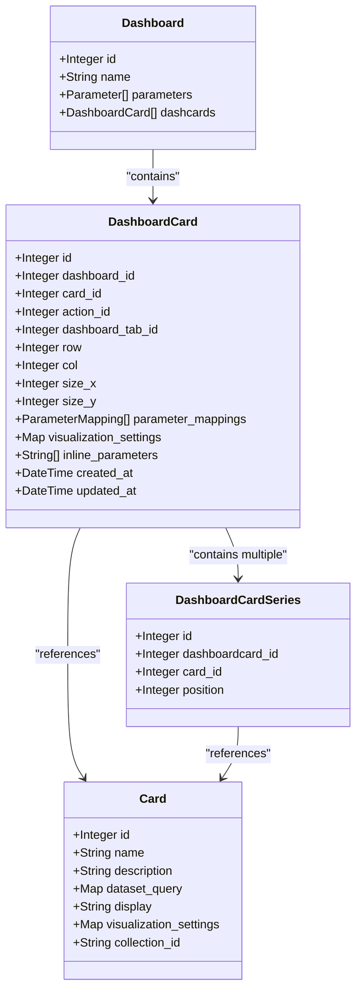
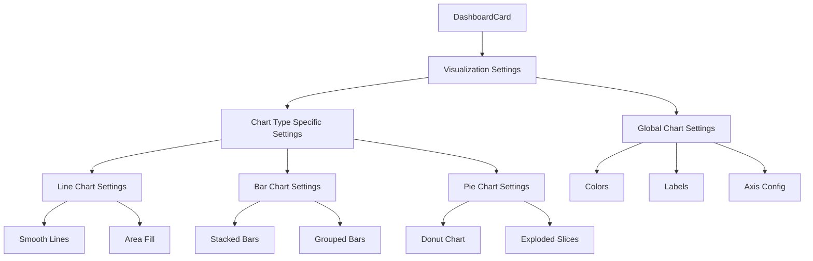
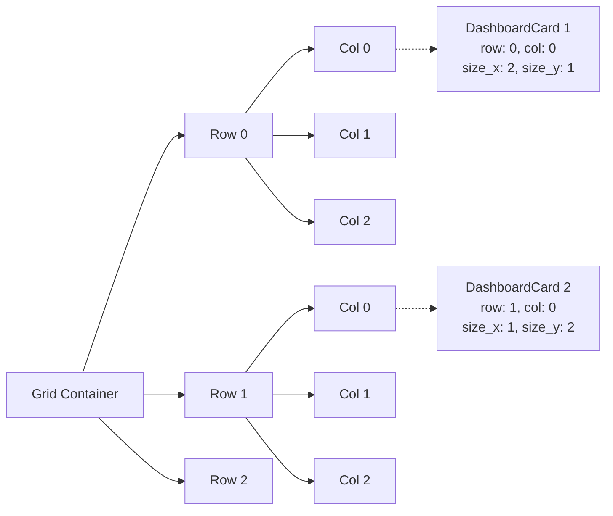
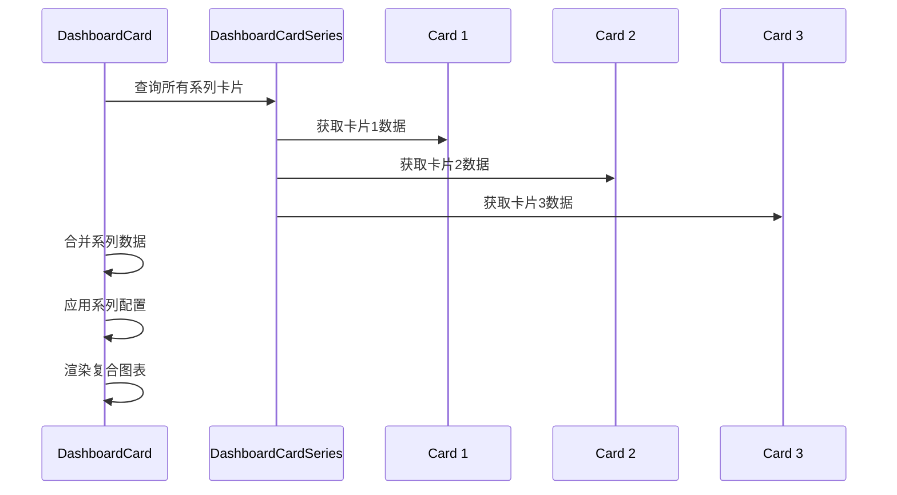
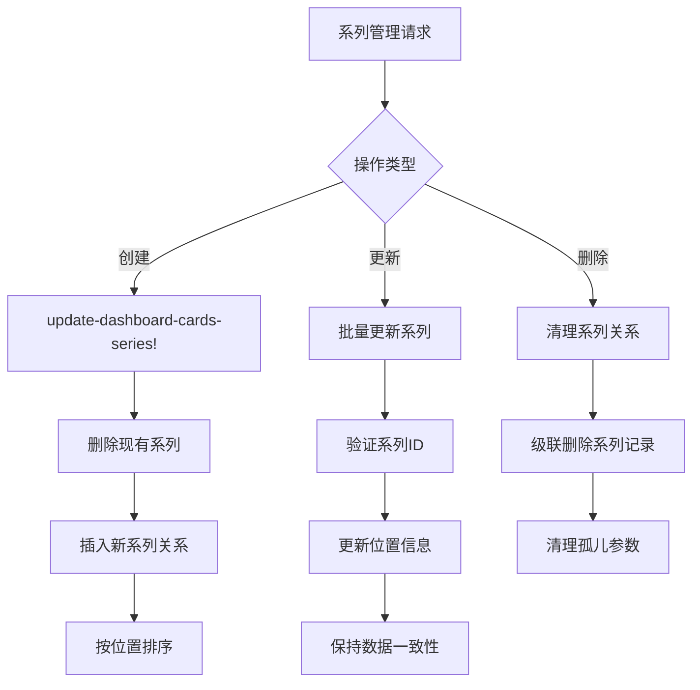
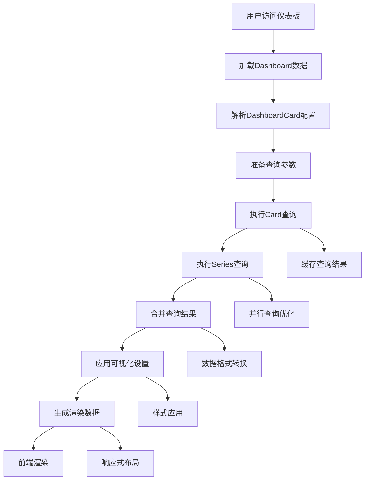
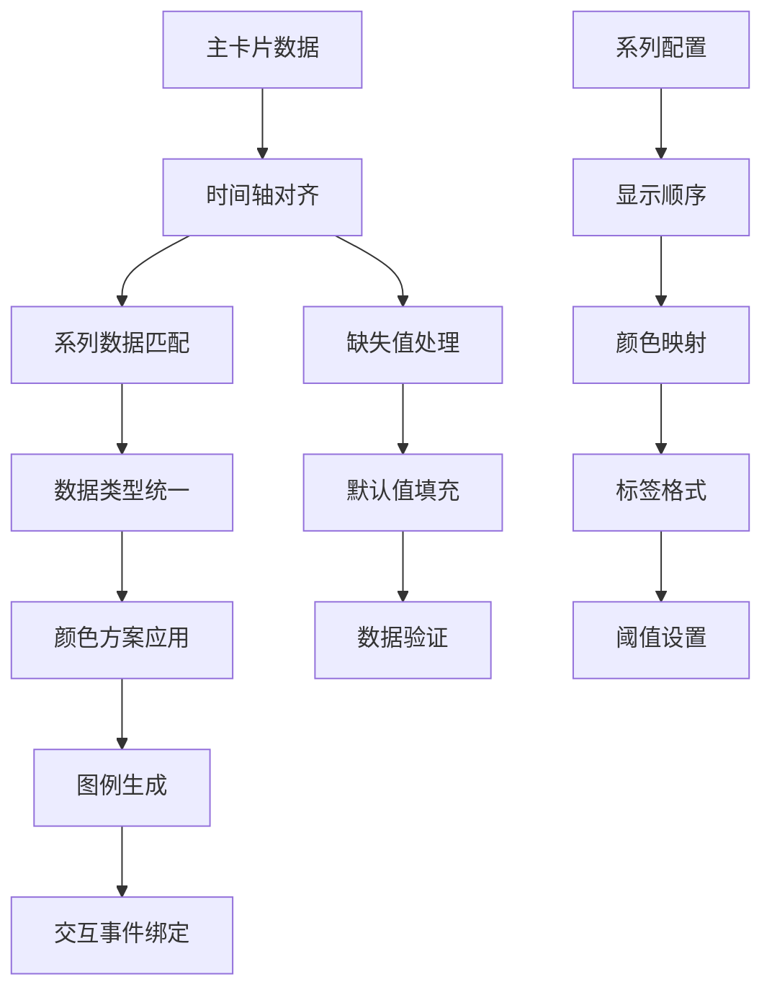
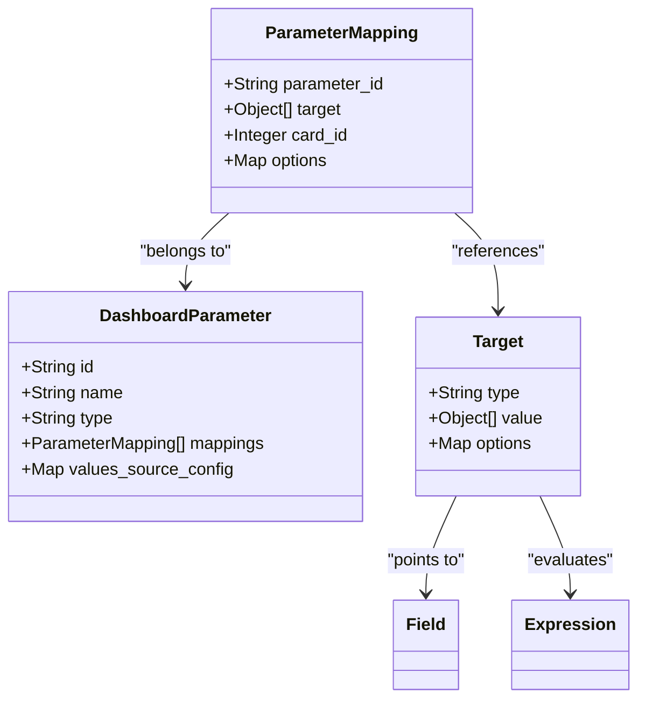
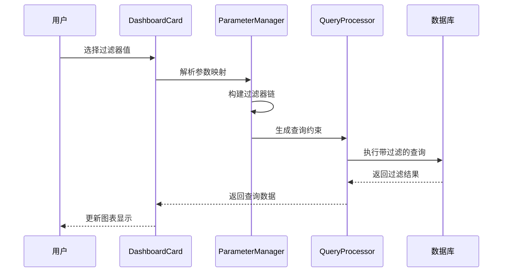

# 仪表板卡片配置详细文档

<cite>
**本文档中引用的文件**
- [dashboard_card.clj](file://src/metabase/dashboards/models/dashboard_card.clj)
- [dashboard_card_series.clj](file://src/metabase/dashboards/models/dashboard_card_series.clj)
- [dashboard.clj](file://src/metabase/dashboards/models/dashboard.clj)
- [dashboard.clj](file://src/metabase/dashboards/schema.clj)
- [api.clj](file://src/metabase/dashboards/api.clj)
- [dashboard.clj](file://src/metabase/query_processor/dashboard.clj)
- [card.clj](file://src/metabase/query_processor/card.clj)
- [dashboard.clj](file://src/metabase/parameters/dashboard.clj)
- [card.clj](file://src/metabase/channel/render/card.clj)
- [body.clj](file://src/metabase/channel/render/body.clj)
- [util.clj](file://src/metabase/channel/render/util.clj)
</cite>

## 目录
1. [简介](#简介)
2. [DashboardCard实体结构](#dashboardcard实体结构)
3. [可视化设置配置](#可视化设置配置)
4. [位置布局属性](#位置布局属性)
5. [系列配置机制](#系列配置机制)
6. [卡片渲染流程](#卡片渲染流程)
7. [多系列图表实现](#多系列图表实现)
8. [参数映射配置](#参数映射配置)
9. [动态过滤与钻取功能](#动态过滤与钻取功能)
10. [API配置示例](#api配置示例)
11. [常见问题排查](#常见问题排查)
12. [总结](#总结)

## 简介

仪表板卡片（DashboardCard）是Metabase仪表板系统的核心组件，它将查询结果以可视化的方式展示在仪表板上。每个DashboardCard都包含查询配置、可视化设置、位置信息和系列数据等关键属性，支持复杂的多系列图表和动态参数过滤功能。

## DashboardCard实体结构

### 基础查询模型关联

DashboardCard实体与基础查询模型（Card）建立了紧密的关联关系：



**图表来源**
- [dashboard_card.clj](file://src/metabase/dashboards/models/dashboard_card.clj#L1-L50)
- [dashboard_card_series.clj](file://src/metabase/dashboards/models/dashboard_card_series.clj#L1-L25)
- [dashboard.clj](file://src/metabase/dashboards/models/dashboard.clj#L1-L50)

### 核心字段定义

DashboardCard实体包含以下核心字段：

| 字段名 | 类型 | 描述 | 必填 |
|--------|------|------|------|
| `id` | Integer | 卡片唯一标识符 | 是 |
| `dashboard_id` | Integer | 所属仪表板ID | 是 |
| `card_id` | Integer | 关联的查询卡片ID | 是 |
| `action_id` | Integer | 关联的操作ID | 否 |
| `dashboard_tab_id` | Integer | 所属标签页ID | 否 |
| `row` | Integer | 在网格中的行位置 | 是 |
| `col` | Integer | 在网格中的列位置 | 是 |
| `size_x` | Integer | 水平尺寸（列数） | 是 |
| `size_y` | Integer | 垂直尺寸（行数） | 是 |
| `parameter_mappings` | List | 参数映射配置 | 否 |
| `visualization_settings` | Map | 可视化设置 | 否 |
| `inline_parameters` | List | 内联参数列表 | 否 |

**节来源**
- [dashboard_card.clj](file://src/metabase/dashboards/models/dashboard_card.clj#L184-L208)

## 可视化设置配置

### 设置结构层次

可视化设置采用分层配置结构，支持不同级别的自定义：



**图表来源**
- [dashboard_card.clj](file://src/metabase/dashboards/models/dashboard_card.clj#L45-L55)

### 常见可视化类型配置

不同图表类型的配置选项：

| 图表类型 | 配置键 | 主要设置项 | 用途 |
|----------|--------|------------|------|
| 折线图 | `line` | `line.interpolate` | 曲线插值方式 |
| 条形图 | `bar` | `bar.stack` | 堆叠模式 |
| 饼图 | `pie` | `pie.explode` | 分离效果 |
| 散点图 | `scatter` | `scatter.size` | 点大小配置 |
| 表格 | `table` | `table.columns` | 列显示配置 |

**节来源**
- [card.clj](file://src/metabase/channel/render/card.clj#L100-L150)

## 位置布局属性

### 网格布局系统

仪表板采用基于网格的布局系统，支持灵活的位置和尺寸配置：



**图表来源**
- [dashboard_card.clj](file://src/metabase/dashboards/models/dashboard_card.clj#L184-L208)

### 布局属性详解

| 属性 | 类型 | 默认值 | 说明 |
|------|------|--------|------|
| `row` | Integer | 0 | 起始行位置（从0开始） |
| `col` | Integer | 0 | 起始列位置（从0开始） |
| `size_x` | Integer | 3 | 水平占用列数 |
| `size_y` | Integer | 3 | 垂直占用行数 |

**节来源**
- [dashboard_card.clj](file://src/metabase/dashboards/models/dashboard_card.clj#L184-L208)

## 系列配置机制

### 多系列卡片架构

DashboardCard支持添加多个系列卡片，实现复合图表展示：



**图表来源**
- [dashboard_card.clj](file://src/metabase/dashboards/models/dashboard_card.clj#L100-L150)
- [dashboard_card_series.clj](file://src/metabase/dashboards/models/dashboard_card_series.clj#L1-L25)

### 系列管理API

系列卡片的创建、更新和删除操作：



**图表来源**
- [dashboard_card.clj](file://src/metabase/dashboards/models/dashboard_card.clj#L150-L200)

**节来源**
- [dashboard_card.clj](file://src/metabase/dashboards/models/dashboard_card.clj#L150-L200)

## 卡片渲染流程

### 查询执行链路

从查询执行到结果展示的完整流程：



**图表来源**
- [dashboard.clj](file://src/metabase/query_processor/dashboard.clj#L150-L196)
- [card.clj](file://src/metabase/channel/render/card.clj#L150-L200)

### 渲染类型检测

系统自动检测最适合的渲染类型：

| 检测条件 | 渲染类型 | 说明 |
|----------|----------|------|
| 结果为空 | `:empty` | 没有数据时的占位显示 |
| 显示类型为`scalar` | `:scalar` | 单值指标显示 |
| 显示类型为表格 | `:table` | 数据表格展示 |
| 显示类型为图表 | `:javascript_visualization` | 交互式图表 |
| 其他情况 | `:table` | 默认表格显示 |

**节来源**
- [card.clj](file://src/metabase/channel/render/card.clj#L80-L130)

## 多系列图表实现

### 数据合并策略

多系列图表的数据合并遵循特定的规则和策略：



**图表来源**
- [body.clj](file://src/metabase/channel/render/body.clj#L380-L420)

### 系列间数据联动

多系列图表支持数据间的智能联动和交互：

| 功能特性 | 实现方式 | 用户体验 |
|----------|----------|----------|
| 数据同步 | 实时查询更新 | 即时反映数据变化 |
| 过滤联动 | 参数映射共享 | 统一控制所有系列 |
| 缩放同步 | 视觉范围一致 | 保持相对比例 |
| 选择同步 | 选中状态传递 | 批量操作支持 |

**节来源**
- [dashboard.clj](file://src/metabase/query_processor/dashboard.clj#L50-L100)

## 参数映射配置

### 参数映射架构

DashboardCard支持灵活的参数映射配置，实现动态过滤：



**图表来源**
- [dashboard.clj](file://src/metabase/parameters/dashboard.clj#L1-L50)

### 参数类型支持

系统支持多种参数类型和映射方式：

| 参数类型 | 映射目标 | 使用场景 | 配置示例 |
|----------|----------|----------|----------|
| `category` | 字段维度 | 分类筛选 | `[:dimension [:field-id 123]]` |
| `string` | 文本字段 | 模糊匹配 | `[:field-id 456]` |
| `number` | 数值字段 | 数值范围 | `[:field-id 789]` |
| `date` | 时间字段 | 日期范围 | `[:dimension [:field-id 101]]` |

**节来源**
- [dashboard.clj](file://src/metabase/parameters/dashboard.clj#L50-L100)

## 动态过滤与钻取功能

### 过滤器链机制

DashboardCard支持构建复杂的过滤器链，实现深度钻取：



**图表来源**
- [dashboard.clj](file://src/metabase/query_processor/dashboard.clj#L100-L150)

### 钻取功能实现

钻取功能允许用户逐层深入数据分析：

| 钻取层级 | 数据源 | 过滤条件 | 显示内容 |
|----------|--------|----------|----------|
| 总体概览 | 年度汇总 | 无过滤 | 整体趋势 |
| 季度详情 | 季度数据 | 按年份过滤 | 季度对比 |
| 月度明细 | 月份数据 | 按季度过滤 | 月度波动 |
| 日度数据 | 日数据 | 按月份过滤 | 详细趋势 |

**节来源**
- [dashboard.clj](file://src/metabase/query_processor/dashboard.clj#L150-L196)

## API配置示例

### 创建基本卡片

以下是通过API创建仪表板卡片的基本示例：

```clojure
;; 创建单个卡片
{
  "dashboard_id": 123,
  "card_id": 456,
  "row": 0,
  "col": 0,
  "size_x": 6,
  "size_y": 4,
  "visualization_settings": {
    "title": "销售趋势",
    "line.interpolate": "linear",
    "colors": ["#509EE3", "#FDB12C", "#CA4626"]
  }
}
```

### 创建多系列卡片

```clojure
;; 创建包含系列的卡片
{
  "dashboard_id": 123,
  "card_id": 456,
  "row": 0,
  "col": 0,
  "size_x": 8,
  "size_y": 6,
  "series": [789, 101, 112],
  "visualization_settings": {
    "title": "产品销售对比",
    "stack": "normal",
    "colors": ["#509EE3", "#FDB12C", "#CA4626", "#963768"]
  }
}
```

### 参数映射配置

```clojure
;; 配置参数映射
{
  "parameter_mappings": [
    {
      "parameter_id": "region_filter",
      "target": [:dimension [:field-id 123]],
      "card_id": 456
    },
    {
      "parameter_id": "date_range",
      "target": [:dimension [:field-id 456]],
      "card_id": 456
    }
  ]
}
```

**节来源**
- [dashboard_card.clj](file://src/metabase/dashboards/models/dashboard_card.clj#L200-L250)

## 常见问题排查

### 数据不刷新问题

**问题现象：** 仪表板卡片显示的数据不是最新的

**可能原因：**
1. 查询缓存未清除
2. 参数映射配置错误
3. 权限不足导致数据过滤

**解决方案：**
```clojure
;; 强制刷新查询缓存
(update-dashboard-card! dashcard-id {:ignore-cache true})

;; 检查参数映射配置
(check-parameter-mapping-permissions parameter-mappings)

;; 验证用户权限
(query-perms/can-query-table? database-id table-id)
```

### 参数未生效问题

**问题现象：** 设置的过滤参数没有影响查询结果

**排查步骤：**
1. 验证参数映射是否正确配置
2. 检查参数类型是否匹配
3. 确认目标字段存在且可访问

**调试代码：**
```clojure
;; 检查参数映射解析
(resolve-param-for-card card-id dashcard-id param-id->param param)

;; 验证参数类型兼容性
(check-allowed-parameter-value-type param-name widget-type param-type)
```

### 系列数据异常

**问题现象：** 多系列图表显示异常或数据错位

**解决方法：**
```clojure
;; 验证系列配置
(update-dashboard-cards-series! {dashcard-id series-ids})

;; 检查数据对齐
(series-cards-with-data dashcard card data)

;; 清理系列关系
(delete-dashboard-cards! dashcard-ids)
```

**节来源**
- [dashboard_card.clj](file://src/metabase/dashboards/models/dashboard_card.clj#L300-L350)

## 总结

仪表板卡片配置是Metabase仪表板系统的核心功能，它通过灵活的配置机制实现了丰富的可视化展示能力。主要特点包括：

1. **模块化设计**：DashboardCard实体与Card、Series等组件协同工作
2. **灵活布局**：基于网格的布局系统支持精确定位和尺寸控制
3. **强大可视化**：支持多种图表类型和自定义配置
4. **动态交互**：参数映射和过滤链实现智能数据交互
5. **扩展性强**：多系列配置支持复杂的数据分析场景

通过深入理解这些配置机制，开发者可以构建出功能丰富、用户体验优秀的仪表板应用，满足各种业务分析需求。