# 可视化模型

<cite>
**本文档中引用的文件**  
- [dashboard.clj](file://src/metabase/dashboards/models/dashboard.clj)
- [dashboard_card.clj](file://src/metabase/dashboards/models/dashboard_card.clj)
- [dashboard_tab.clj](file://src/metabase/dashboards/models/dashboard_tab.clj)
- [dashboard_card_series.clj](file://src/metabase/dashboards/models/dashboard_card_series.clj)
- [schema.clj](file://src/metabase/dashboards/schema.clj)
- [autoplace.clj](file://src/metabase/dashboards/autoplace.clj)
- [api.clj](file://src/metabase/dashboards/api.clj)
- [revision.clj](file://src/metabase/revisions/models/revision.clj)
- [parameters.clj](file://src/metabase/parameters/dashboard.clj)
- [settings.clj](file://src/metabase/dashboards/settings.clj)
</cite>

## 目录
1. [引言](#引言)
2. [核心实体结构](#核心实体结构)
3. [布局与排序机制](#布局与排序机制)
4. [参数映射与过滤](#参数映射与过滤)
5. [标签页管理](#标签页管理)
6. [版本控制与变更追踪](#版本控制与变更追踪)
7. [序列化与迁移](#序列化与迁移)
8. [性能优化策略](#性能优化策略)
9. [高级功能实现](#高级功能实现)

## 引言

Metabase的可视化模型以Dashboard为核心，提供了一个强大的数据展示平台。该模型通过Dashboard、DashboardCard、DashboardTab等实体的协同工作，实现了复杂的数据可视化需求。仪表板不仅支持多种图表类型的展示，还提供了参数化查询、自动布局、标签页管理等高级功能。本文档深入解析这些核心组件的结构与关系，阐述其集成方式和工作机制。

## 核心实体结构

可视化模型的核心由Dashboard、DashboardCard、DashboardTab和DashboardCardSeries四个主要实体构成。这些实体通过明确的关系定义，形成了一个层次化的数据展示结构。

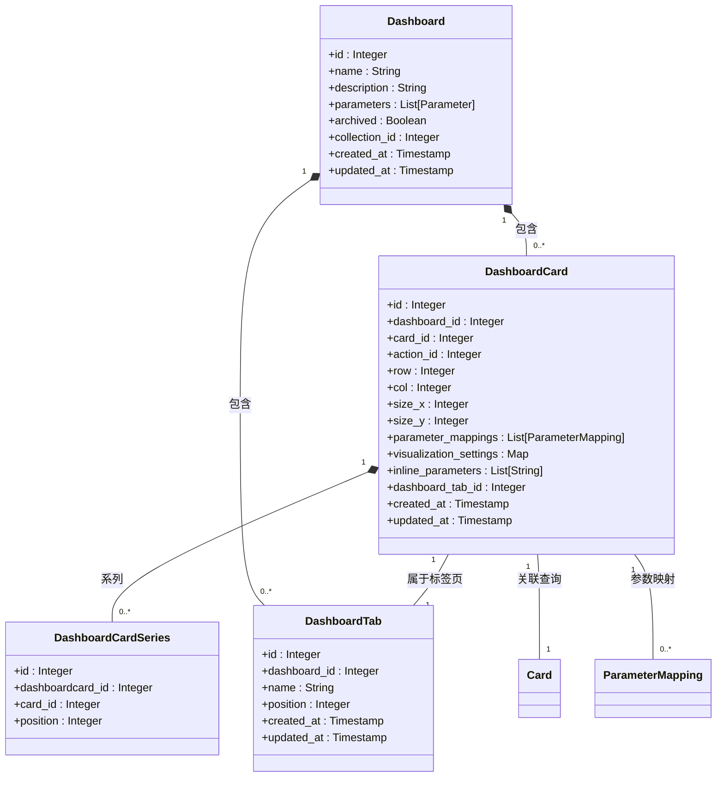

**Diagram sources**
- [dashboard.clj](file://src/metabase/dashboards/models/dashboard.clj#L1-L503)
- [dashboard_card.clj](file://src/metabase/dashboards/models/dashboard_card.clj#L1-L411)
- [dashboard_tab.clj](file://src/metabase/dashboards/models/dashboard_tab.clj#L1-L133)
- [dashboard_card_series.clj](file://src/metabase/dashboards/models/dashboard_card_series.clj#L1-L25)

**Section sources**
- [dashboard.clj](file://src/metabase/dashboards/models/dashboard.clj#L1-L503)
- [dashboard_card.clj](file://src/metabase/dashboards/models/dashboard_card.clj#L1-L411)

## 布局与排序机制

仪表板的布局系统采用网格化设计，通过行（row）、列（col）、宽度（size_x）和高度（size_y）四个维度来定位卡片。这种设计确保了卡片在仪表板上的精确排列和响应式布局。

### 自动布局算法

自动布局功能通过`autoplace.clj`文件中的`get-position-for-new-dashcard`函数实现。该算法在添加新卡片时，会扫描现有卡片的位置，寻找第一个可用的空间。

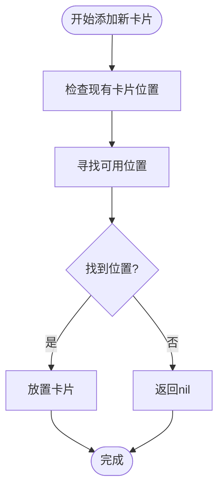

**Diagram sources**
- [autoplace.clj](file://src/metabase/dashboards/autoplace.clj#L1-L56)

### 卡片排序

卡片的排序遵循从左到右、从上到下的原则，通过`dashcard-comparator`函数实现。该函数比较两个卡片的行和列坐标，确定它们在布局中的相对位置。

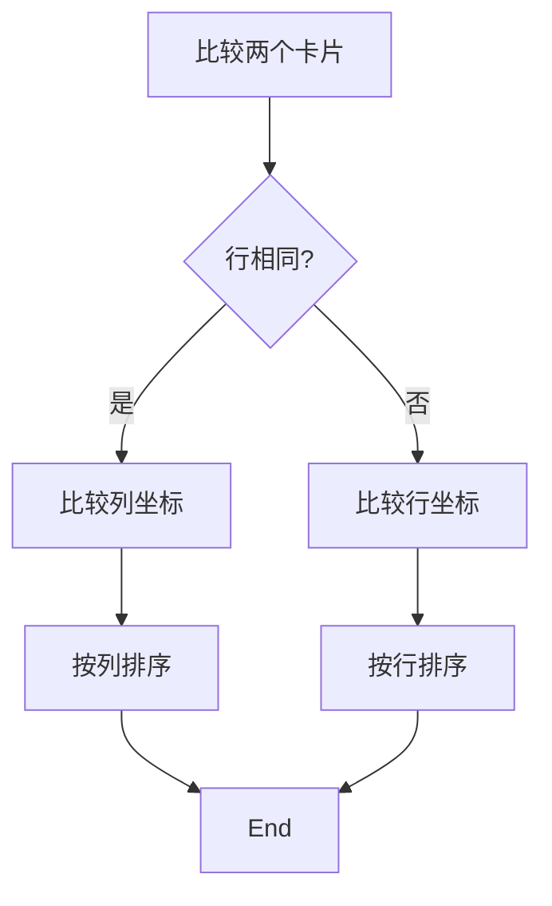

**Diagram sources**
- [dashboard_card.clj](file://src/metabase/dashboards/models/dashboard_card.clj#L370-L385)

**Section sources**
- [dashboard_card.clj](file://src/metabase/dashboards/models/dashboard_card.clj#L370-L385)

## 参数映射与过滤

参数映射是仪表板实现交互式数据展示的核心机制。通过将仪表板参数与卡片参数关联，用户可以在仪表板级别设置过滤条件，影响多个卡片的数据展示。

### 参数映射结构

参数映射通过`parameter_mappings`字段实现，每个映射包含参数ID、卡片ID和目标字段。这种设计允许一个仪表板参数影响多个卡片的不同字段。

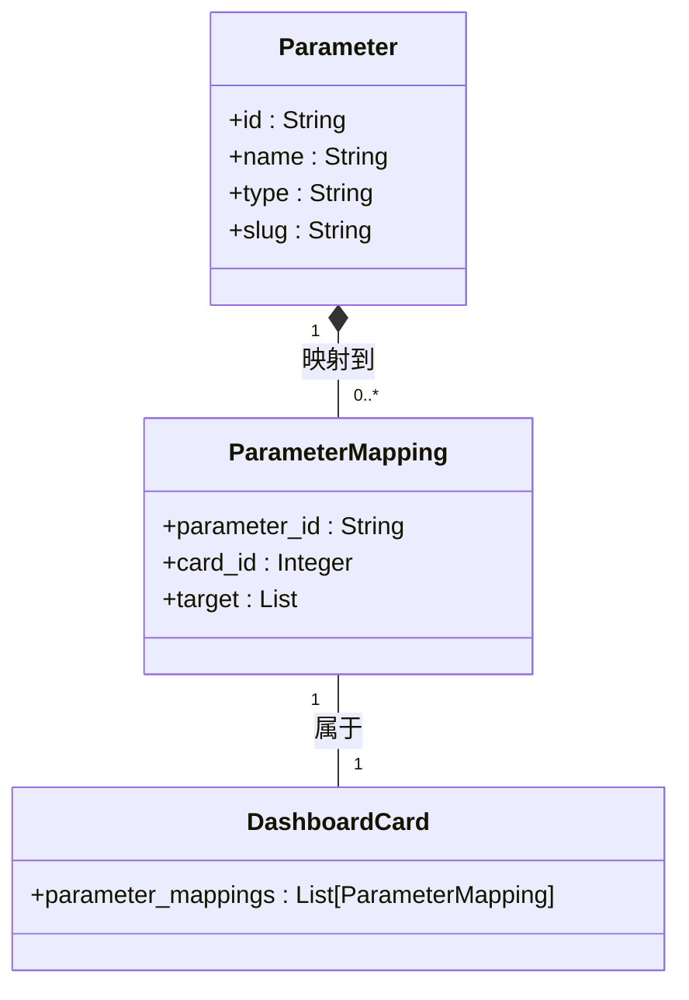

**Diagram sources**
- [dashboard_card.clj](file://src/metabase/dashboards/models/dashboard_card.clj#L1-L411)
- [parameters.clj](file://src/metabase/parameters/dashboard.clj#L1-L223)

### 链式过滤

链式过滤功能允许参数之间相互约束，实现更复杂的过滤逻辑。当一个参数的值发生变化时，它会影响其他相关参数的可选值范围。

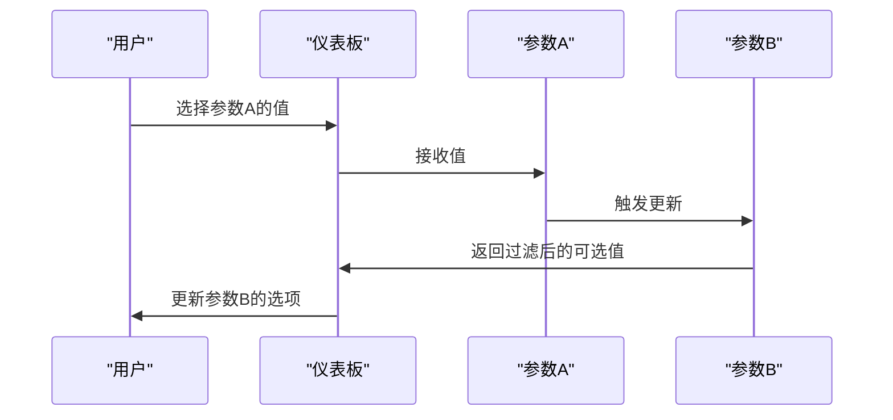

**Diagram sources**
- [parameters.clj](file://src/metabase/parameters/dashboard.clj#L1-L223)

**Section sources**
- [parameters.clj](file://src/metabase/parameters/dashboard.clj#L1-L223)

## 标签页管理

标签页功能通过`DashboardTab`实体实现，允许将相关卡片组织在不同的标签页中，提高仪表板的可管理性和用户体验。

### 标签页操作

标签页的创建、更新和删除通过`do-update-tabs!`函数统一处理。该函数比较当前标签页和新标签页的差异，执行相应的创建、更新或删除操作。

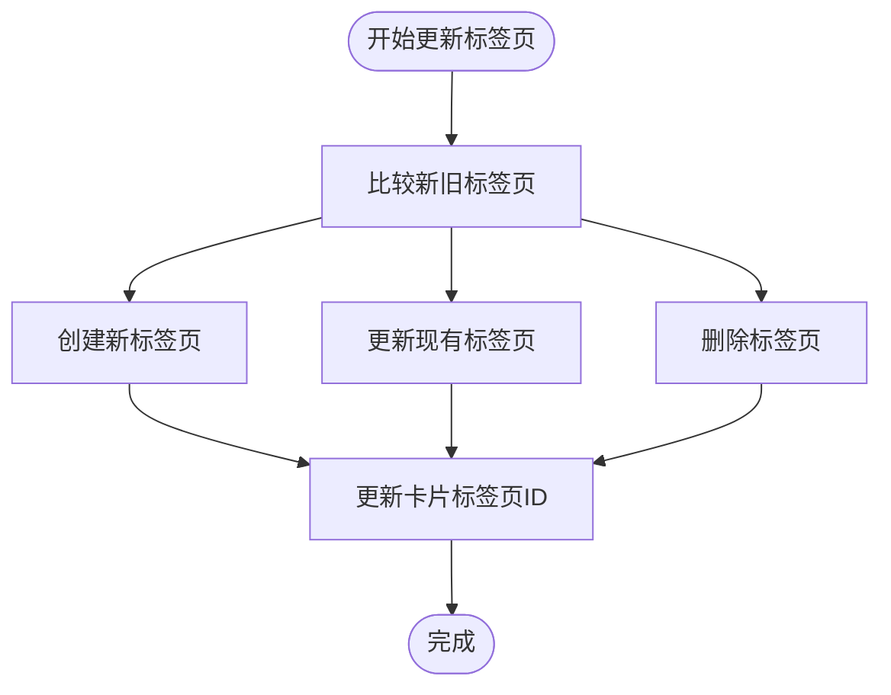

**Diagram sources**
- [dashboard_tab.clj](file://src/metabase/dashboards/models/dashboard_tab.clj#L1-L133)

### 标签页与卡片关系

每个`DashboardCard`通过`dashboard_tab_id`字段关联到特定的标签页。当标签页被删除时，其下的所有卡片会被移动到默认标签页或被删除。

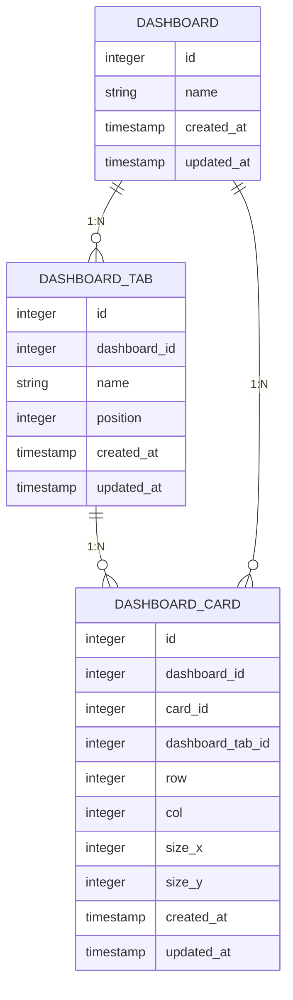

**Diagram sources**
- [dashboard_tab.clj](file://src/metabase/dashboards/models/dashboard_tab.clj#L1-L133)
- [dashboard_card.clj](file://src/metabase/dashboards/models/dashboard_card.clj#L1-L411)

**Section sources**
- [dashboard_tab.clj](file://src/metabase/dashboards/models/dashboard_tab.clj#L1-L133)

## 版本控制与变更追踪

仪表板的版本控制通过修订系统（Revisions）实现，记录每次变更的历史，支持回滚到之前的版本。

### 修订模型

`Revision`实体记录了每次变更的详细信息，包括变更对象、用户、时间戳和变更内容。每个修订都有一个`most_recent`标志，指示是否为最新版本。

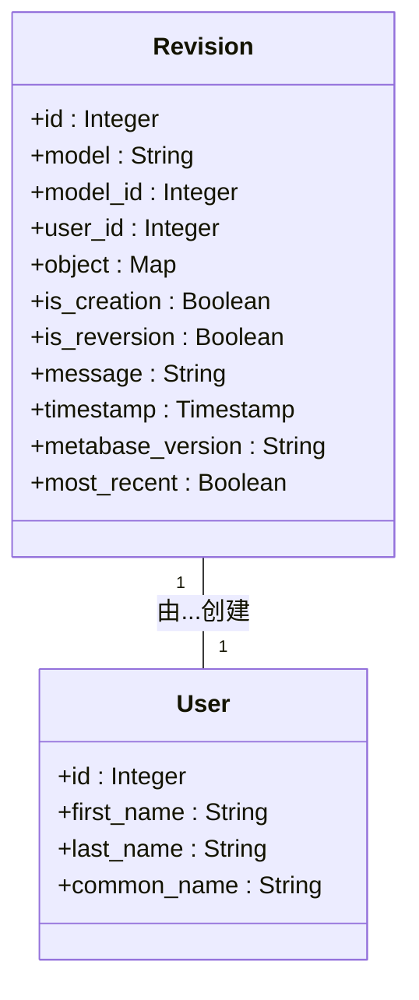

**Diagram sources**
- [revision.clj](file://src/metabase/revisions/models/revision.clj#L1-L254)

### 变更追踪流程

当仪表板发生变更时，系统会创建一个新的修订记录。如果变更内容与上一个修订相同，则不会创建新的修订。

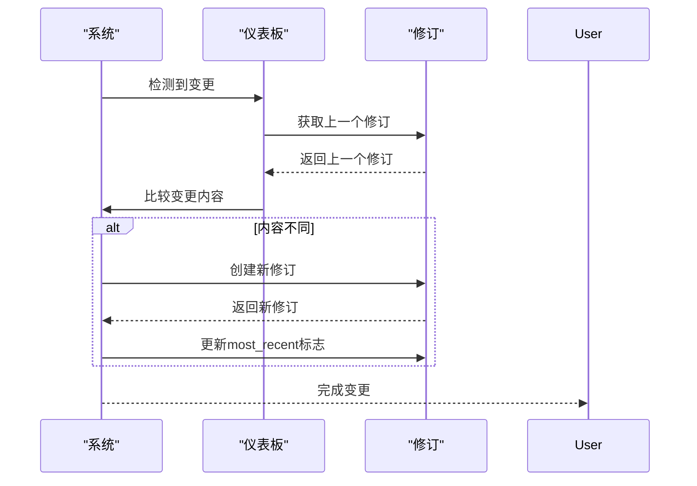

**Diagram sources**
- [revision.clj](file://src/metabase/revisions/models/revision.clj#L1-L254)

**Section sources**
- [revision.clj](file://src/metabase/revisions/models/revision.clj#L1-L254)

## 序列化与迁移

仪表板的序列化格式支持在不同环境间的迁移，确保配置的一致性和可移植性。

### 序列化配置

序列化配置通过`make-spec`函数定义，指定了哪些字段需要复制、跳过或转换。这种配置确保了关键数据的完整迁移。

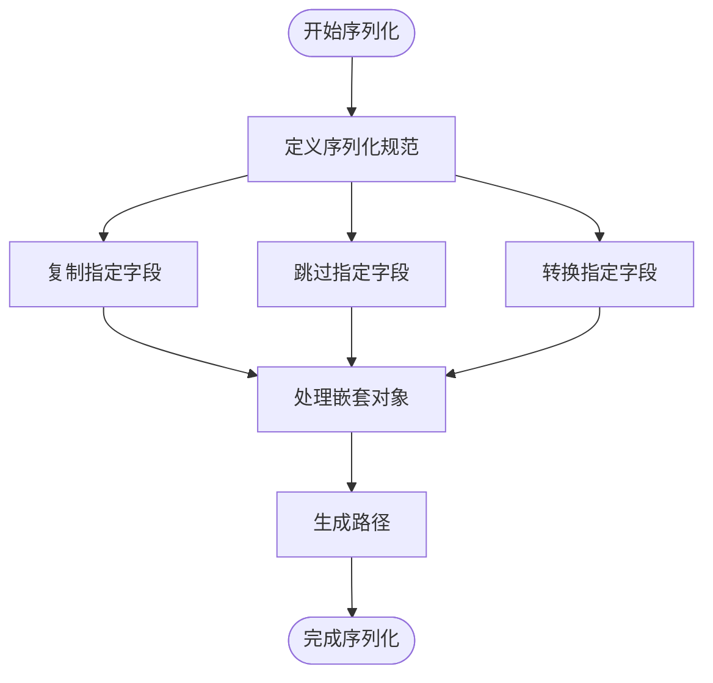

**Diagram sources**
- [dashboard.clj](file://src/metabase/dashboards/models/dashboard.clj#L406-L450)

### 依赖关系

序列化过程中会分析对象间的依赖关系，确保所有相关对象都被正确迁移。依赖关系包括卡片、集合、动作等。

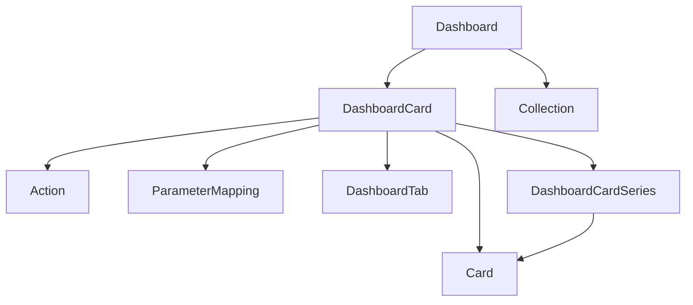

**Diagram sources**
- [dashboard.clj](file://src/metabase/dashboards/models/dashboard.clj#L431-L450)

**Section sources**
- [dashboard.clj](file://src/metabase/dashboards/models/dashboard.clj#L406-L450)

## 性能优化策略

针对大型仪表板的性能优化，系统提供了多种策略，包括缓存机制、批量加载和自动刷新配置。

### 缓存机制

系统使用`dashboard-load-id`作为缓存键，对仪表板加载过程中的元数据进行缓存，减少重复的数据库查询。

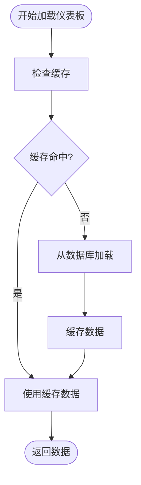

**Diagram sources**
- [api.clj](file://src/metabase/dashboards/api.clj#L272-L328)

### 自动刷新配置

自动刷新功能允许仪表板定期更新数据，保持信息的实时性。刷新间隔可以通过`dashboard.settings`进行配置。

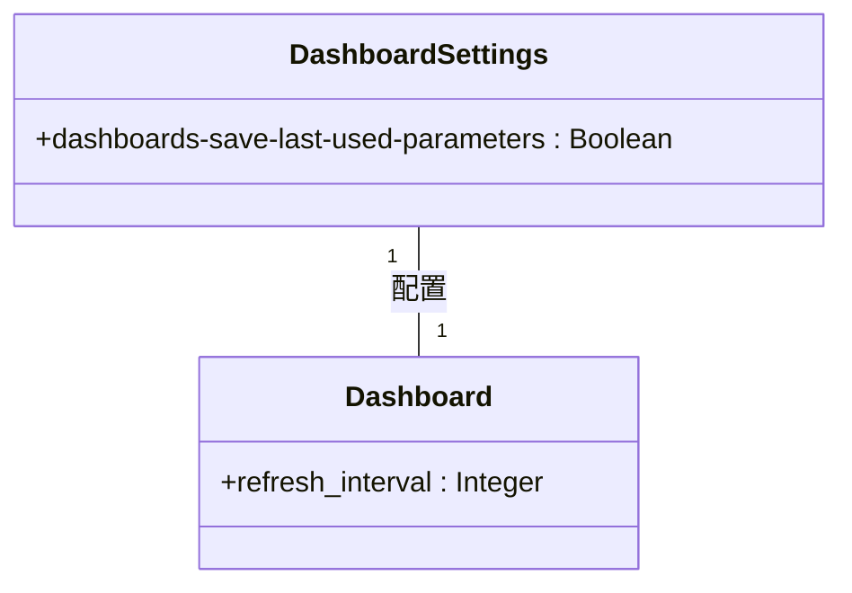

**Diagram sources**
- [settings.clj](file://src/metabase/dashboards/settings.clj#L1-L12)

**Section sources**
- [settings.clj](file://src/metabase/dashboards/settings.clj#L1-L12)

## 高级功能实现

### 自动布局实现

自动布局功能通过`get-position-for-new-dashcard`函数实现，该函数在添加新卡片时自动寻找最佳位置。

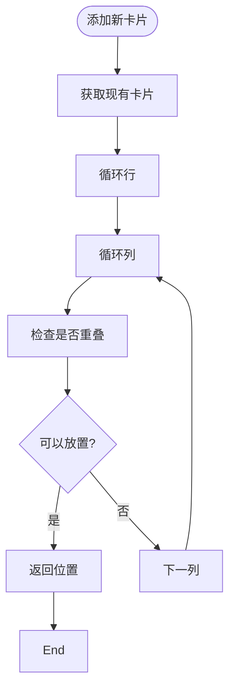

**Diagram sources**
- [autoplace.clj](file://src/metabase/dashboards/autoplace.clj#L1-L56)

### 标签页管理实现

标签页管理通过`do-update-tabs!`函数实现，该函数处理标签页的创建、更新和删除操作。

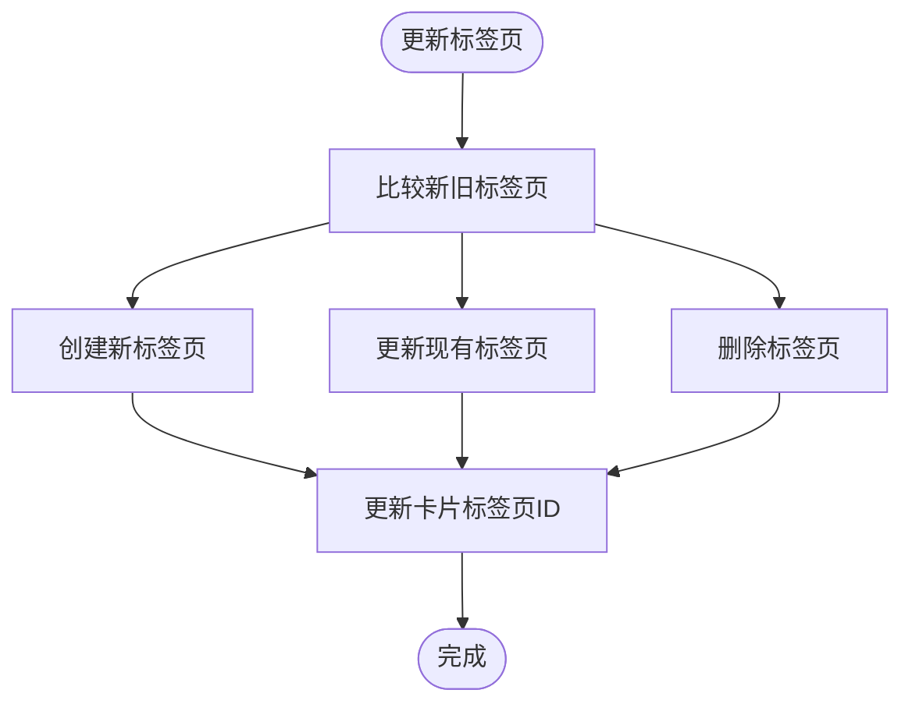

**Diagram sources**
- [dashboard_tab.clj](file://src/metabase/dashboards/models/dashboard_tab.clj#L1-L133)

**Section sources**
- [autoplace.clj](file://src/metabase/dashboards/autoplace.clj#L1-L56)
- [dashboard_tab.clj](file://src/metabase/dashboards/models/dashboard_tab.clj#L1-L133)