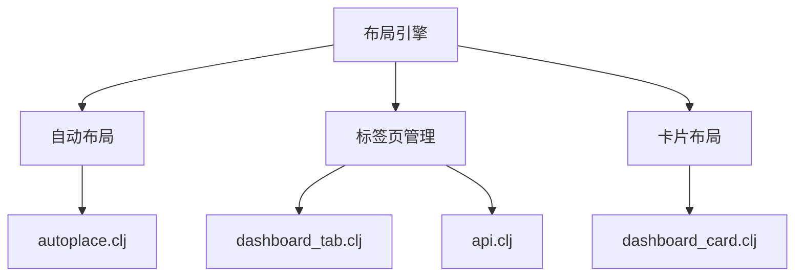
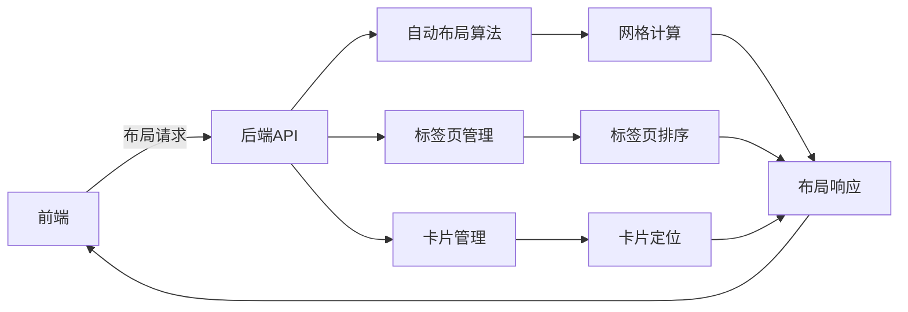
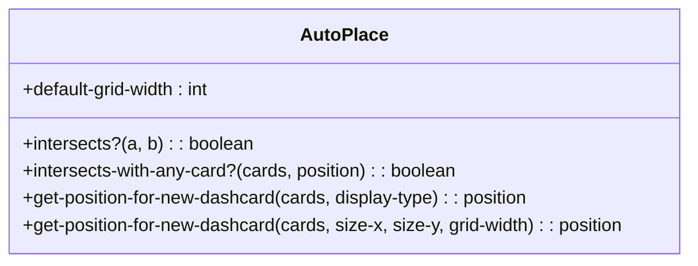
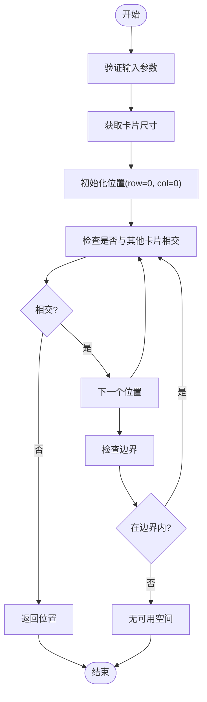
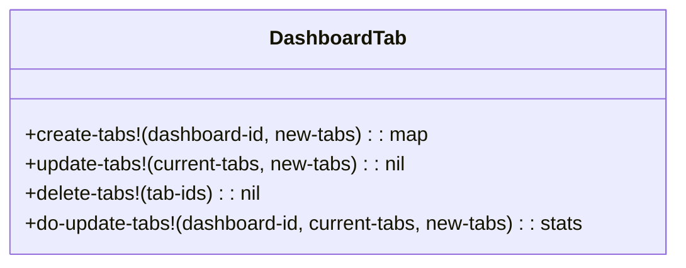
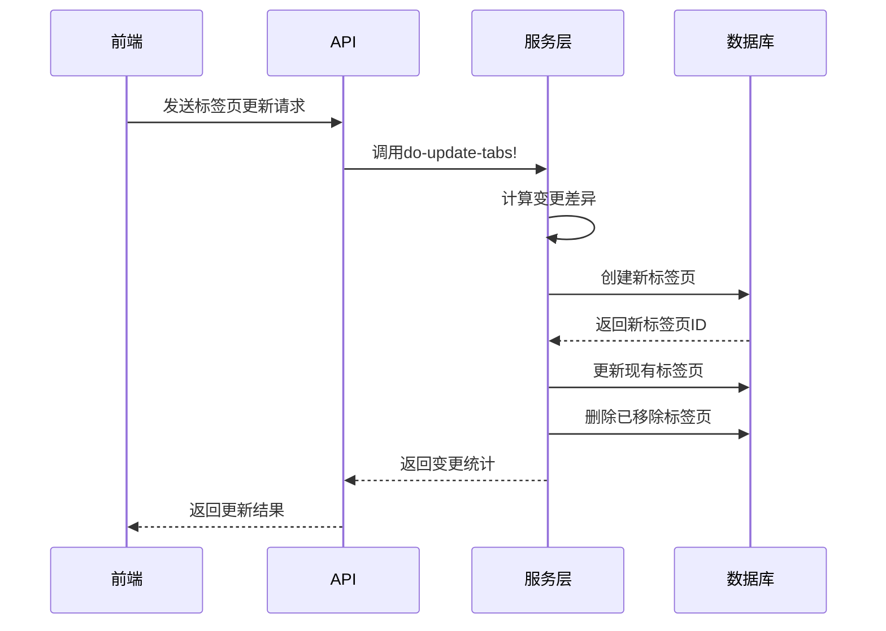
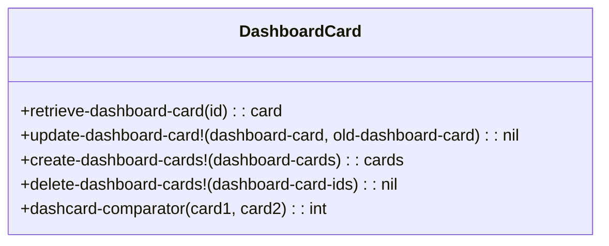
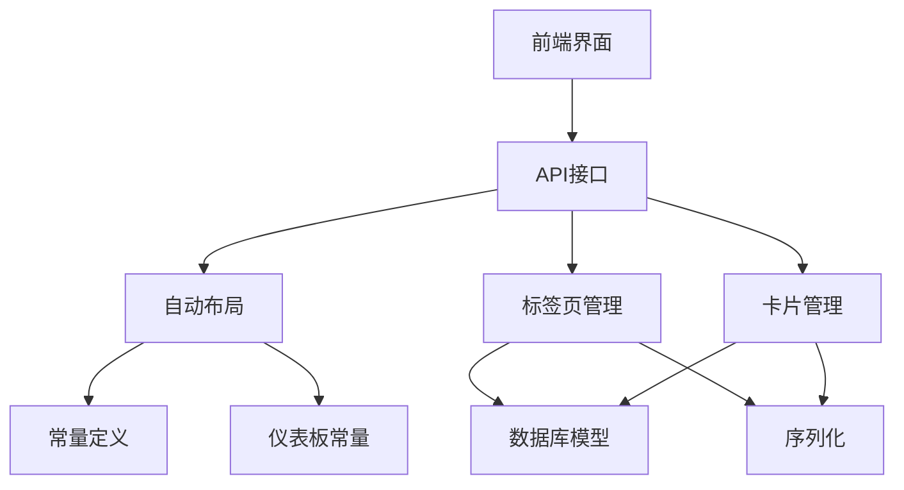

# 布局引擎

<cite>
**本文档引用的文件**
- [autoplace.clj](file://src/metabase/dashboards/autoplace.clj)
- [dashboard_tab.clj](file://src/metabase/dashboards/models/dashboard_tab.clj)
- [dashboard_card.clj](file://src/metabase/dashboards/models/dashboard_card.clj)
- [api.clj](file://src/metabase/dashboards/api.clj)
- [settings.clj](file://src/metabase/dashboards/settings.clj)
</cite>

## 目录
1. [简介](#简介)
2. [项目结构](#项目结构)
3. [核心组件](#核心组件)
4. [架构概述](#架构概述)
5. [详细组件分析](#详细组件分析)
6. [依赖分析](#依赖分析)
7. [性能考虑](#性能考虑)
8. [故障排除指南](#故障排除指南)
9. [结论](#结论)

## 简介
本文档详细说明Metabase布局引擎的设计原理与实现逻辑，包括自动布局算法、标签页管理、布局同步机制和持久化处理。文档还提供布局性能优化建议和高级配置选项。

## 项目结构
Metabase的布局引擎主要位于`src/metabase/dashboards`目录下，包含自动布局、标签页管理和卡片布局等核心功能。

**图示来源**
- [autoplace.clj](file://src/metabase/dashboards/autoplace.clj)
- [dashboard_tab.clj](file://src/metabase/dashboards/models/dashboard_tab.clj)
- [dashboard_card.clj](file://src/metabase/dashboards/models/dashboard_card.clj)

**章节来源**
- [autoplace.clj](file://src/metabase/dashboards/autoplace.clj)
- [dashboard_tab.clj](file://src/metabase/dashboards/models/dashboard_tab.clj)

## 核心组件
布局引擎的核心组件包括自动布局算法、标签页管理功能和卡片布局系统。这些组件协同工作，为用户提供灵活的仪表板布局能力。

**章节来源**
- [autoplace.clj](file://src/metabase/dashboards/autoplace.clj)
- [dashboard_tab.clj](file://src/metabase/dashboards/models/dashboard_tab.clj)
- [dashboard_card.clj](file://src/metabase/dashboards/models/dashboard_card.clj)

## 架构概述
布局引擎采用前后端协同工作的架构，确保布局的一致性和响应性。

**图示来源**
- [autoplace.clj](file://src/metabase/dashboards/autoplace.clj)
- [api.clj](file://src/metabase/dashboards/api.clj)

## 详细组件分析

### 自动布局算法分析
自动布局算法负责为新添加的卡片计算最佳位置，避免与其他卡片重叠。

#### 自动布局算法

**图示来源**
- [autoplace.clj](file://src/metabase/dashboards/autoplace.clj#L1-L55)

#### 布局计算流程

**图示来源**
- [autoplace.clj](file://src/metabase/dashboards/autoplace.clj#L1-L55)

**章节来源**
- [autoplace.clj](file://src/metabase/dashboards/autoplace.clj#L1-L55)

### 标签页管理分析
标签页管理功能支持仪表板内多页组织结构，提供标签页的创建、切换和排序行为。

#### 标签页管理类

**图示来源**
- [dashboard_tab.clj](file://src/metabase/dashboards/models/dashboard_tab.clj#L1-L132)

#### 标签页操作流程

**图示来源**
- [dashboard_tab.clj](file://src/metabase/dashboards/models/dashboard_tab.clj#L1-L132)
- [api.clj](file://src/metabase/dashboards/api.clj#L900-L1099)

**章节来源**
- [dashboard_tab.clj](file://src/metabase/dashboards/models/dashboard_tab.clj#L1-L132)
- [api.clj](file://src/metabase/dashboards/api.clj#L900-L1099)

### 卡片布局分析
卡片布局系统管理仪表板中卡片的定位、尺寸和排列。

#### 卡片管理类

**图示来源**
- [dashboard_card.clj](file://src/metabase/dashboards/models/dashboard_card.clj#L1-L410)

**章节来源**
- [dashboard_card.clj](file://src/metabase/dashboards/models/dashboard_card.clj#L1-L410)

## 依赖分析
布局引擎组件之间的依赖关系如下：

**图示来源**
- [autoplace.clj](file://src/metabase/dashboards/autoplace.clj)
- [dashboard_tab.clj](file://src/metabase/dashboards/models/dashboard_tab.clj)
- [dashboard_card.clj](file://src/metabase/dashboards/models/dashboard_card.clj)
- [api.clj](file://src/metabase/dashboards/api.clj)

**章节来源**
- [autoplace.clj](file://src/metabase/dashboards/autoplace.clj)
- [dashboard_tab.clj](file://src/metabase/dashboards/models/dashboard_tab.clj)
- [dashboard_card.clj](file://src/metabase/dashboards/models/dashboard_card.clj)
- [api.clj](file://src/metabase/dashboards/api.clj)

## 性能考虑
布局引擎在设计时考虑了多种性能优化策略：

1. **批量操作**：使用事务处理批量创建、更新和删除操作
2. **缓存机制**：缓存常用的布局计算结果
3. **索引优化**：在数据库中为常用查询字段创建索引
4. **懒加载**：按需加载标签页和卡片数据
5. **前端优化**：使用虚拟滚动处理大量卡片的渲染

## 故障排除指南
常见问题及解决方案：

1. **布局错乱**：检查网格宽度配置是否一致
2. **标签页丢失**：验证标签页ID映射是否正确
3. **性能问题**：监控数据库查询性能，优化索引
4. **同步失败**：检查前后端布局算法是否同步
5. **持久化问题**：验证数据库事务是否正确提交

**章节来源**
- [autoplace.clj](file://src/metabase/dashboards/autoplace.clj)
- [dashboard_tab.clj](file://src/metabase/dashboards/models/dashboard_tab.clj)
- [api.clj](file://src/metabase/dashboards/api.clj)

## 结论
Metabase布局引擎提供了一套完整的仪表板布局解决方案，包括自动布局算法、标签页管理和卡片布局系统。通过前后端协同工作，确保了布局的一致性和响应性。系统设计考虑了性能优化和可扩展性，为用户提供灵活的仪表板组织能力。