# 元数据同步

<cite>
**本文档中引用的文件**
- [sync_metadata.clj](file://src/metabase/sync/sync_metadata.clj)
- [tables.clj](file://src/metabase/sync/sync_metadata/tables.clj)
- [fields.clj](file://src/metabase/sync/sync_metadata/fields.clj)
- [fks.clj](file://src/metabase/sync/sync_metadata/fks.clj)
- [indexes.clj](file://src/metabase/sync/sync_metadata/indexes.clj)
- [metabase_metadata.clj](file://src/metabase/sync/sync_metadata/metabase_metadata.clj)
- [fetch_metadata.clj](file://src/metabase/sync/fetch_metadata.clj)
- [util.clj](file://src/metabase/sync/util.clj)
- [describe_database.clj](file://src/metabase/driver/sql_jdbc/sync/describe_database.clj)
- [describe_table.clj](file://src/metabase/driver/sql_jdbc/sync/describe_table.clj)
- [interface.clj](file://src/metabase/sync/interface.clj)
</cite>

## 目录
1. [简介](#简介)
2. [项目结构](#项目结构)
3. [核心组件](#核心组件)
4. [架构概览](#架构概览)
5. [详细组件分析](#详细组件分析)
6. [依赖关系分析](#依赖关系分析)
7. [性能考虑](#性能考虑)
8. [故障排除指南](#故障排除指南)
9. [结论](#结论)

## 简介

Metabase的元数据同步系统是一个复杂而精密的机制，负责将外部数据库的表结构、字段、主外键、索引等元数据信息同步到Metabase的应用数据库中。该系统通过多个专门的同步步骤（sync-tables、sync-fields、sync-fks、sync-indexes）协调工作，确保数据仓库的结构信息在Metabase中得到准确反映。

核心特性包括：
- **分层同步策略**：按表格、字段、外键、索引的顺序进行同步
- **特殊表处理**：支持`_metabase_metadata`特殊表的映射规则
- **错误恢复机制**：完善的异常处理和重试策略
- **性能优化**：支持大型模式的分批处理和并行操作

## 项目结构

元数据同步功能主要分布在以下目录结构中：

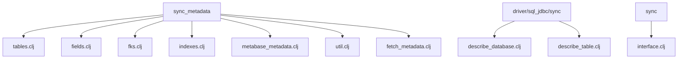

**图表来源**
- [sync_metadata.clj](file://src/metabase/sync/sync_metadata.clj#L1-L79)
- [tables.clj](file://src/metabase/sync/sync_metadata/tables.clj#L1-L409)

## 核心组件

### 主同步入口点

`sync-db-metadata!`函数是整个元数据同步过程的入口点，它协调所有子任务的执行：

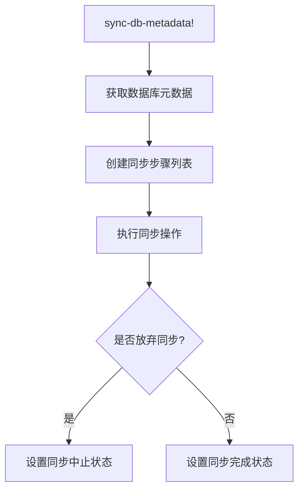

**图表来源**
- [sync_metadata.clj](file://src/metabase/sync/sync_metadata.clj#L58-L71)

### 同步步骤流水线

系统通过`create-sync-step`函数构建同步流水线，每个步骤都有独立的执行器和摘要函数：

| 步骤名称 | 执行函数 | 摘要函数 | 依赖关系 |
|---------|----------|----------|----------|
| sync-dbms-version | sync-dbms-ver/sync-dbms-version! | sync-dbms-version-summary | 无 |
| sync-timezone | sync-tz/sync-timezone! | sync-timezone-summary | 无 |
| sync-tables | sync-tables/sync-tables-and-database! | sync-tables-summary | 无 |
| sync-fields | sync-fields/sync-fields! | sync-fields-summary | sync-tables |
| sync-fks | sync-fks/sync-fks! | sync-fks-summary | sync-fields |
| sync-indexes | sync-indexes/maybe-sync-indexes! | sync-indexes-summary | 无 |
| sync-metabase-metadata | metabase-metadata/sync-metabase-metadata! | 无 | 无 |

**节来源**
- [sync_metadata.clj](file://src/metabase/sync/sync_metadata.clj#L44-L57)

## 架构概览

元数据同步系统采用模块化设计，每个组件负责特定的同步任务：

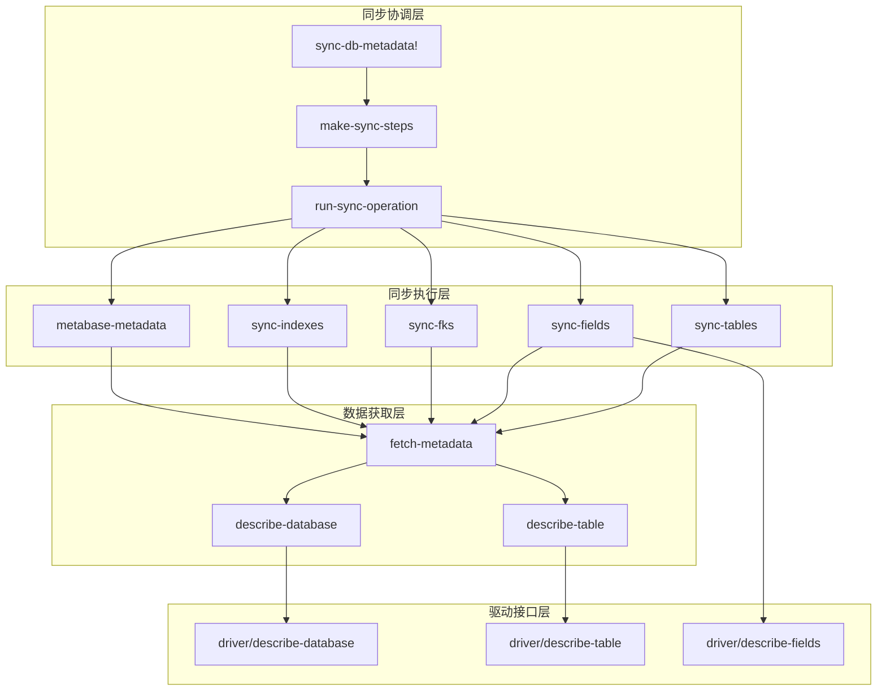

**图表来源**
- [sync_metadata.clj](file://src/metabase/sync/sync_metadata.clj#L1-L79)
- [fetch_metadata.clj](file://src/metabase/sync/fetch_metadata.clj#L1-L127)

## 详细组件分析

### 表同步 (sync-tables)

表同步负责管理数据库中表的生命周期，包括创建新表、激活已存在的表和停用不存在的表：

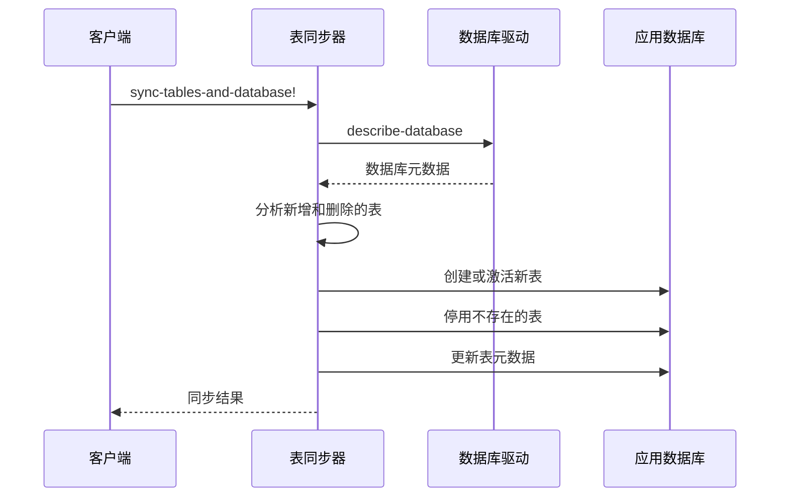

**图表来源**
- [tables.clj](file://src/metabase/sync/sync_metadata/tables.clj#L350-L408)

**节来源**
- [tables.clj](file://src/metabase/sync/sync_metadata/tables.clj#L1-L409)

### 字段同步 (sync-fields)

字段同步是最复杂的同步步骤，需要在外键同步之前完成，因为外键同步依赖于目标字段的存在：

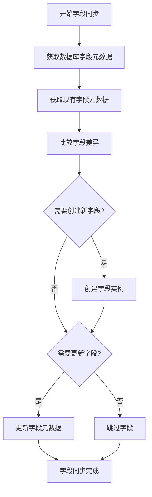

**图表来源**
- [fields.clj](file://src/metabase/sync/sync_metadata/fields.clj#L50-L70)

字段同步的关键特性：
- **字段实例管理**：创建、激活、停用字段实例
- **元数据更新**：更新字段的基础类型、数据库类型、语义类型等
- **嵌套字段支持**：处理JSON字段中的嵌套结构

**节来源**
- [fields.clj](file://src/metabase/sync/sync_metadata/fields.clj#L1-L148)

### 外键同步 (sync-fks)

外键同步必须在字段同步完成后执行，因为它需要确保目标字段已经存在：

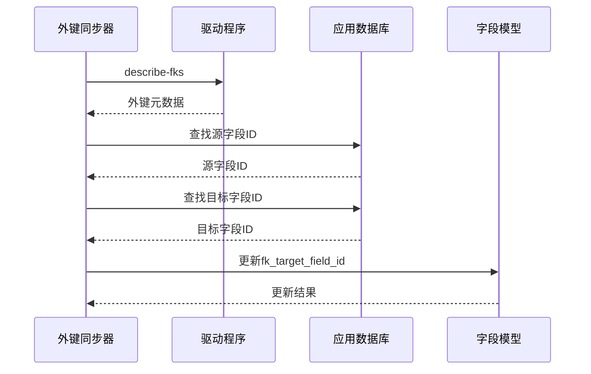

**图表来源**
- [fks.clj](file://src/metabase/sync/sync_metadata/fks.clj#L40-L80)

**节来源**
- [fks.clj](file://src/metabase/sync/sync_metadata/fks.clj#L1-L150)

### 索引同步 (sync-indexes)

索引同步根据数据库支持情况选择不同的同步策略：

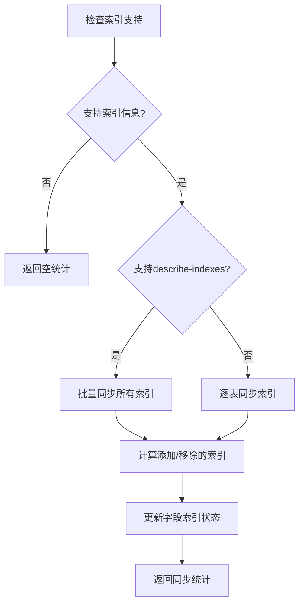

**图表来源**
- [indexes.clj](file://src/metabase/sync/sync_metadata/indexes.clj#L20-L40)

**节来源**
- [indexes.clj](file://src/metabase/sync/sync_metadata/indexes.clj#L1-L120)

### 特殊表处理 (_metabase_metadata)

`_metabase_metadata`表是一个特殊的配置表，用于预设表和字段的元数据属性：

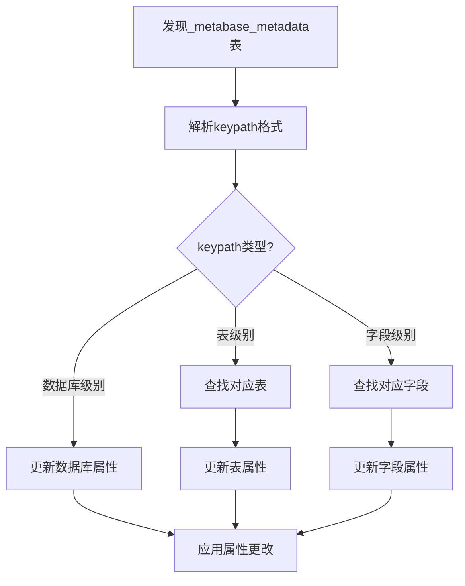

**图表来源**
- [metabase_metadata.clj](file://src/metabase/sync/sync_metadata/metabase_metadata.clj#L30-L60)

**节来源**
- [metabase_metadata.clj](file://src/metabase/sync/sync_metadata/metabase_metadata.clj#L1-L110)

### 驱动接口调用

系统通过标准化的驱动接口获取数据库元数据：

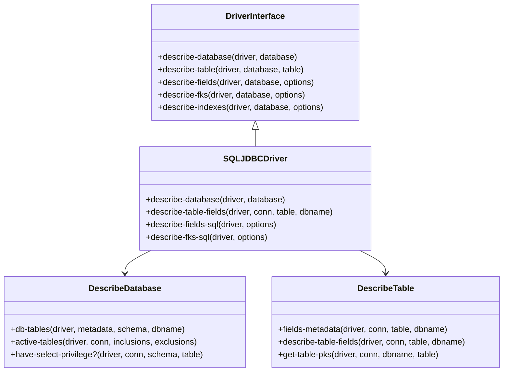

**图表来源**
- [describe_database.clj](file://src/metabase/driver/sql_jdbc/sync/describe_database.clj#L258-L290)
- [describe_table.clj](file://src/metabase/driver/sql_jdbc/sync/describe_table.clj#L322-L385)

**节来源**
- [describe_database.clj](file://src/metabase/driver/sql_jdbc/sync/describe_database.clj#L1-L291)
- [describe_table.clj](file://src/metabase/driver/sql_jdbc/sync/describe_table.clj#L1-L772)

## 依赖关系分析

元数据同步系统的依赖关系呈现严格的层次结构：

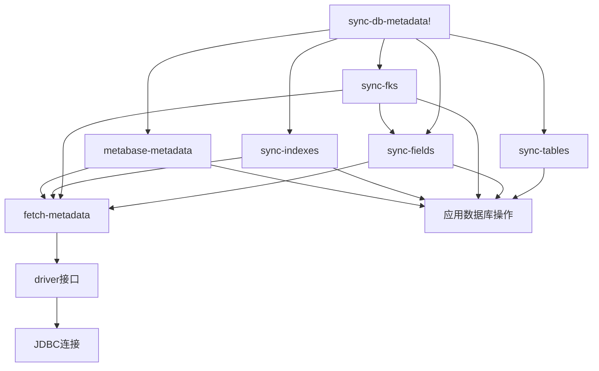

**图表来源**
- [sync_metadata.clj](file://src/metabase/sync/sync_metadata.clj#L1-L20)

关键依赖关系：
1. **字段同步依赖表同步**：字段同步需要先知道表的存在
2. **外键同步依赖字段同步**：外键同步需要确保目标字段已存在
3. **索引同步相对独立**：可以在任何时间点执行
4. **特殊表处理最后执行**：作为配置补充

**节来源**
- [sync_metadata.clj](file://src/metabase/sync/sync_metadata.clj#L44-L57)

## 性能考虑

### 大型模式的分批处理

系统针对大型数据库模式进行了优化：

| 优化策略 | 实现方式 | 性能提升 |
|---------|----------|----------|
| 分批更新 | `*batch-size*`动态变量控制 | 减少内存占用 |
| 并行查询 | `partition-all`分割查询 | 提高并发性 |
| 连接池管理 | `do-with-connection-with-options` | 减少连接开销 |
| 查询优化 | `reducible-query`延迟执行 | 降低I/O等待 |

### 错误处理策略

系统实现了多层次的错误处理机制：

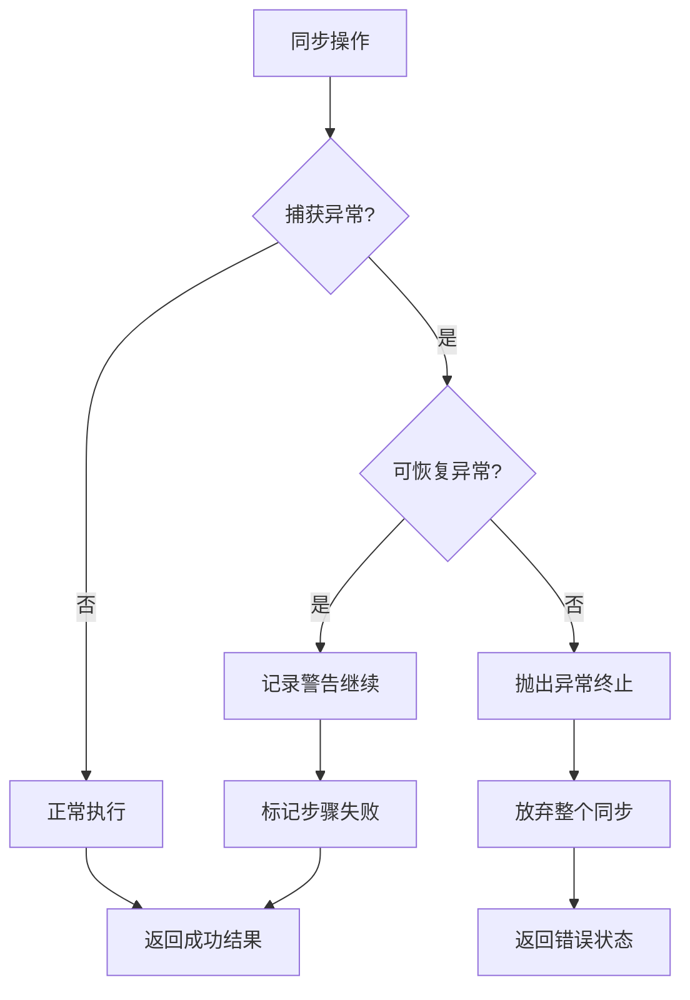

**图表来源**
- [util.clj](file://src/metabase/sync/util.clj#L180-L220)

### 内存优化

- **流式处理**：使用`reducible`避免一次性加载大量数据
- **延迟求值**：通过`eduction`组合转换器减少中间集合
- **连接复用**：在同一个事务中执行多个操作

**节来源**
- [util.clj](file://src/metabase/sync/util.clj#L1-L651)

## 故障排除指南

### 常见问题及解决方案

| 问题类型 | 症状 | 可能原因 | 解决方案 |
|---------|------|----------|----------|
| 权限不足 | 表无法访问 | SELECT权限缺失 | 检查数据库用户权限 |
| 类型映射错误 | 字段类型不正确 | 数据库类型未识别 | 更新类型映射规则 |
| 外键同步失败 | 外键关联丢失 | 目标字段不存在 | 确保字段同步优先完成 |
| 性能问题 | 同步耗时过长 | 大量表或字段 | 启用分批处理 |
| 特殊表错误 | _metabase_metadata处理失败 | 表结构不匹配 | 验证表结构和驱动支持 |

### 调试技巧

1. **启用详细日志**：设置日志级别为DEBUG查看详细执行过程
2. **监控进度条**：使用`with-emoji-progress-bar`跟踪同步进度
3. **检查事件发布**：监听同步事件了解执行状态
4. **验证驱动兼容性**：确认驱动支持所需的元数据功能

**节来源**
- [util.clj](file://src/metabase/sync/util.clj#L280-L320)

## 结论

Metabase的元数据同步系统是一个高度模块化和容错的设计，通过精心设计的同步流水线确保数据库结构信息的准确同步。系统的核心优势包括：

1. **严格的依赖管理**：确保同步步骤按照正确的顺序执行
2. **强大的错误恢复**：在遇到可恢复错误时继续执行其他步骤
3. **灵活的扩展性**：通过驱动接口支持多种数据库类型
4. **性能优化**：针对大型数据库模式进行了专门优化

该系统为Metabase提供了可靠的数据仓库元数据管理能力，是整个平台稳定运行的重要基础。通过持续的优化和扩展，它能够适应不断增长的数据规模和多样化的数据库环境。