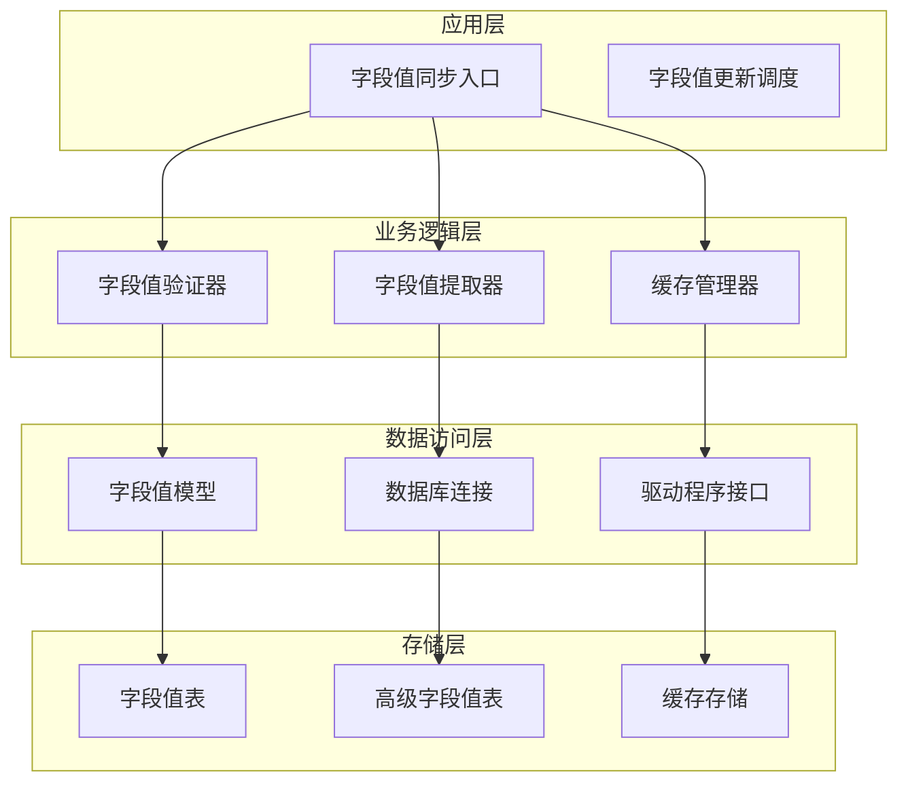
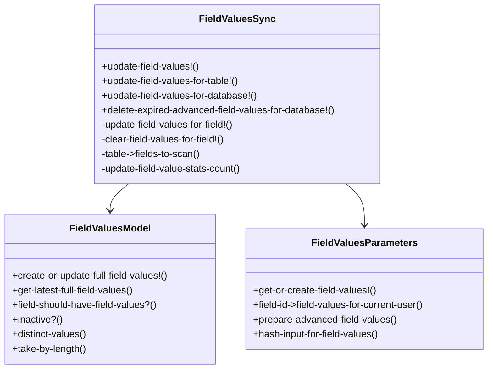
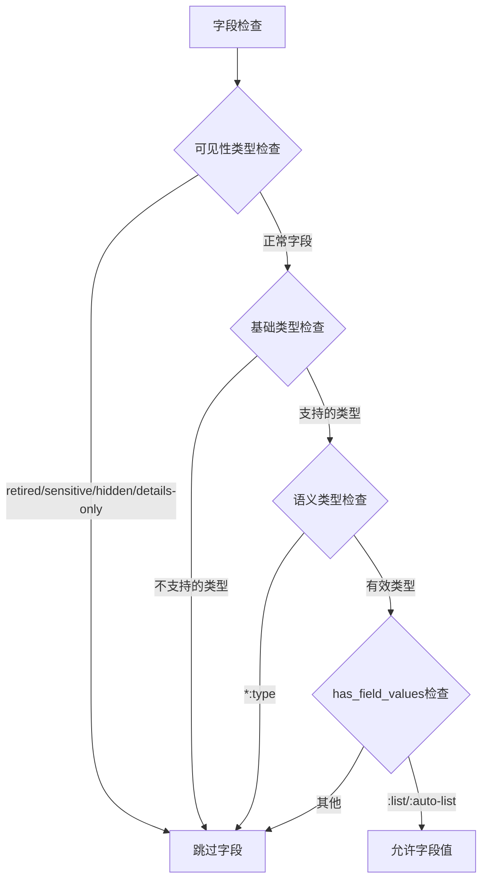
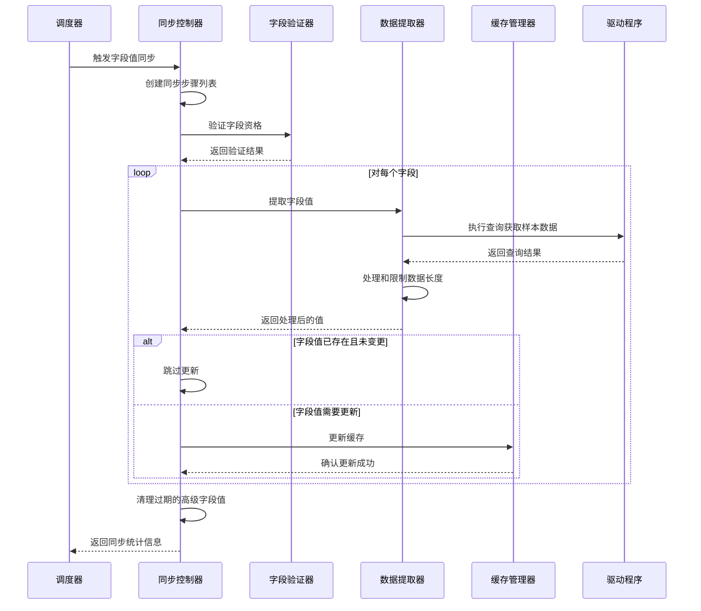
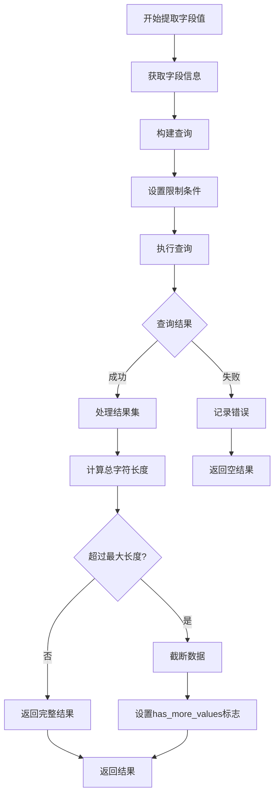
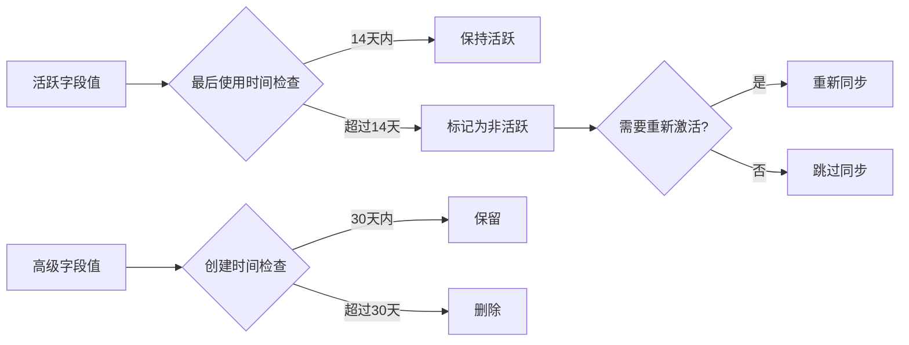
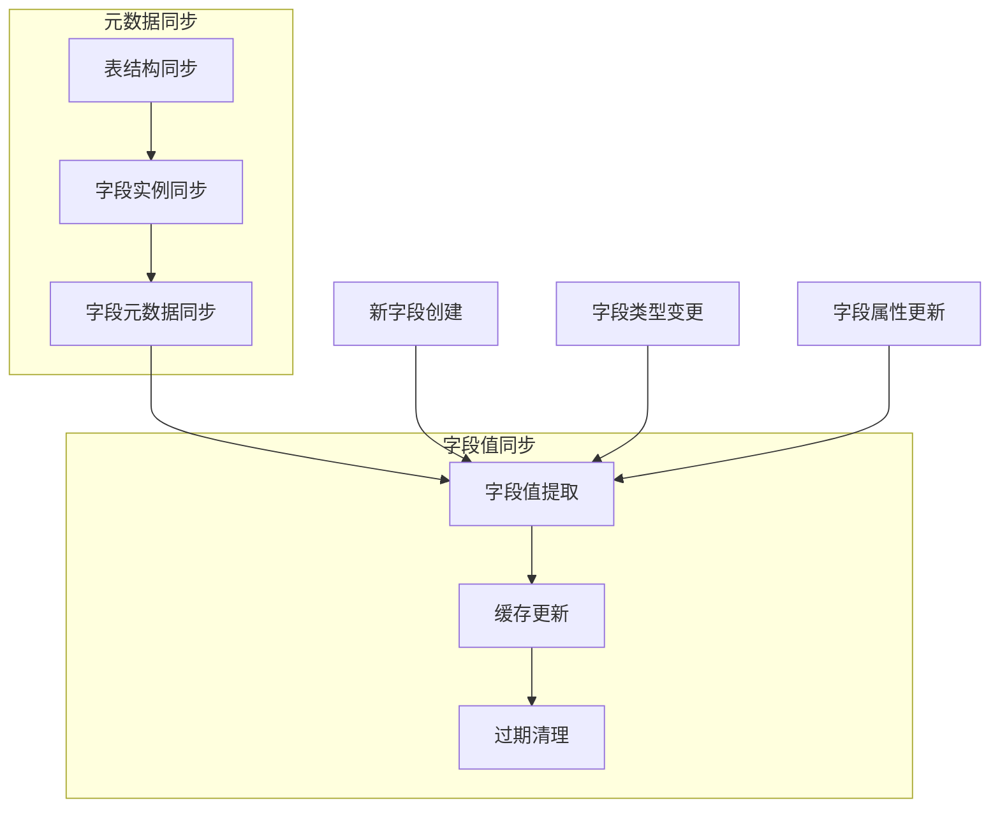
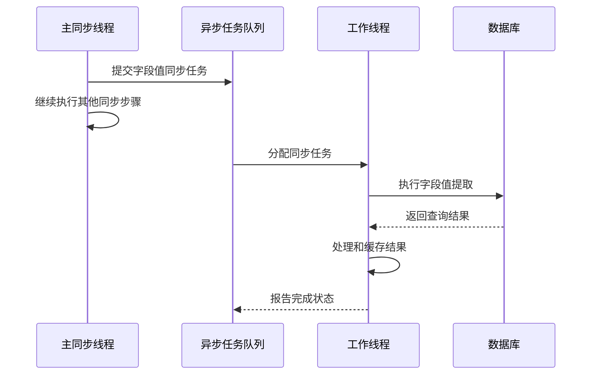
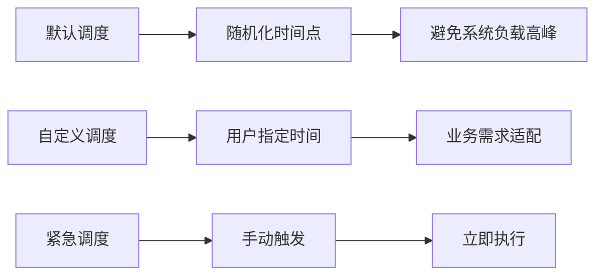

# 字段值同步

<cite>
**本文档中引用的文件**
- [field_values.clj](file://src/metabase/sync/field_values.clj)
- [field_values.clj](file://src/metabase/warehouse_schema/models/field_values.clj)
- [field_values.clj](file://src/metabase/parameters/field_values.clj)
- [util.clj](file://src/metabase/sync/util.clj)
- [schedules.clj](file://src/metabase/sync/schedules.clj)
- [sync.clj](file://src/metabase/driver/sql_jdbc/sync.clj)
- [settings.clj](file://src/metabase/driver/settings.clj)
</cite>

## 目录
1. [简介](#简介)
2. [系统架构概览](#系统架构概览)
3. [核心组件分析](#核心组件分析)
4. [字段值同步执行流程](#字段值同步执行流程)
5. [字段值缓存机制](#字段值缓存机制)
6. [字段值同步与元数据同步的协作](#字段值同步与元数据同步的协作)
7. [性能调优策略](#性能调优策略)
8. [故障排除指南](#故障排除指南)
9. [总结](#总结)

## 简介

Metabase的字段值同步功能是其元数据管理系统的核心组成部分，负责为维度字段（如分类字段）提取唯一值并建立缓存，以支持过滤器功能。该系统通过`field-values/sync-field-values!`函数实现，能够根据字段类型智能决定是否进行值提取，并通过驱动层接口获取样本数据。

字段值同步的主要目标是：
- 为分类字段建立高效的值缓存
- 支持仪表板和卡片的过滤器功能
- 优化查询性能和用户体验
- 实现智能的缓存管理和过期策略

## 系统架构概览

字段值同步系统采用分层架构设计，包含以下主要层次：

**图表来源**
- [field_values.clj](file://src/metabase/sync/field_values.clj#L1-L130)
- [field_values.clj](file://src/metabase/warehouse_schema/models/field_values.clj#L1-L618)

## 核心组件分析

### 字段值同步控制器

字段值同步的核心控制器位于`metabase.sync.field-values`命名空间中，提供了完整的同步生命周期管理：

**图表来源**
- [field_values.clj](file://src/metabase/sync/field_values.clj#L1-L130)
- [field_values.clj](file://src/metabase/warehouse_schema/models/field_values.clj#L1-L618)
- [field_values.clj](file://src/metabase/parameters/field_values.clj#L1-L193)

### 字段值类型系统

Metabase定义了两种主要的字段值类型：

| 类型 | 描述 | 存储位置 | 使用场景 |
|------|------|----------|----------|
| `:full` | 完整字段值，无约束条件 | 主要字段值表 | 基础过滤器功能 |
| `:advanced` | 高级字段值，带约束条件 | 高级字段值表 | 沙盒权限、参数链接等 |

**节来源**
- [field_values.clj](file://src/metabase/warehouse_schema/models/field_values.clj#L80-L94)

### 字段值验证机制

字段值同步系统实现了严格的验证机制，确保只有符合条件的字段才会进行值提取：

**图表来源**
- [field_values.clj](file://src/metabase/warehouse_schema/models/field_values.clj#L280-L310)

**节来源**
- [field_values.clj](file://src/metabase/warehouse_schema/models/field_values.clj#L280-L310)

## 字段值同步执行流程

### 主同步流程

字段值同步的主流程由`update-field-values!`函数控制，包含以下步骤：

**图表来源**
- [field_values.clj](file://src/metabase/sync/field_values.clj#L110-L128)
- [field_values.clj](file://src/metabase/warehouse_schema/models/field_values.clj#L457-L509)

### 字段值提取逻辑

字段值提取过程通过`distinct-values`函数实现，该函数负责从数据库中获取字段的唯一值：

**图表来源**
- [field_values.clj](file://src/metabase/warehouse_schema/models/field_values.clj#L380-L420)

**节来源**
- [field_values.clj](file://src/metabase/warehouse_schema/models/field_values.clj#L380-L420)

## 字段值缓存机制

### 缓存存储结构

字段值缓存采用多层次存储结构，支持不同类型和用途的字段值：

| 存储层级 | 表名 | 主要用途 | 过期策略 |
|----------|------|----------|----------|
| 主缓存 | `metabase_fieldvalues` | 全量字段值 | 活跃度检查 |
| 高级缓存 | `metabase_fieldvalues` | 带约束字段值 | 时间过期 |
| 用户缓存 | `metabase_fieldvalues` | 用户特定字段值 | 权限控制 |

### 缓存过期策略

系统实现了智能的缓存过期机制：

**图表来源**
- [field_values.clj](file://src/metabase/warehouse_schema/models/field_values.clj#L75-L85)
- [field_values.clj](file://src/metabase/warehouse_schema/models/field_values.clj#L224-L251)

### 查询优化机制

字段值查询采用了多种优化技术：

1. **字符长度限制**：通过`take-by-length`函数限制单个字段值的最大字符长度
2. **总数限制**：通过`*absolute-max-distinct-values-limit*`控制最大值数量
3. **批量处理**：支持批量获取多个字段的值
4. **缓存命中**：优先使用现有缓存，避免重复查询

**节来源**
- [field_values.clj](file://src/metabase/warehouse_schema/models/field_values.clj#L66-L94)
- [field_values.clj](file://src/metabase/warehouse_schema/models/field_values.clj#L320-L350)

## 字段值同步与元数据同步的协作

### 协作关系

字段值同步与元数据同步形成了紧密的协作关系：

**图表来源**
- [field_values.clj](file://src/metabase/sync/field_values.clj#L61-L86)
- [sync_instances.clj](file://src/metabase/sync/sync_metadata/fields/sync_instances.clj#L108-L149)

### 触发时机

字段值同步在以下情况下会被触发：

1. **新字段创建**：当元数据同步检测到新字段时
2. **字段类型变更**：当字段的基础类型或语义类型发生变化时
3. **字段属性更新**：当字段的`has_field_values`属性被修改时
4. **定期调度**：按照预定的时间表自动运行
5. **手动触发**：管理员主动触发同步操作

**节来源**
- [field_values.clj](file://src/metabase/sync/field_values.clj#L61-L86)

## 性能调优策略

### 设置field-values-sync-limit

为了控制大型数据集的采样规模，系统提供了`field-values-sync-limit`配置选项：

| 参数 | 默认值 | 描述 | 影响范围 |
|------|--------|------|----------|
| `field-values-sync-limit` | 1000 | 最大字符长度限制 | 单字段值长度 |
| `*absolute-max-distinct-values-limit*` | 1000 | 最大值数量限制 | 字段值总数 |
| `*batch-size*` | 20000 | 批处理大小 | 数据库查询批次 |

### 异步任务优化

系统支持异步字段值同步以避免阻塞主同步流程：

**图表来源**
- [util.clj](file://src/metabase/sync/util.clj#L150-L200)

### 调度策略优化

系统提供了灵活的调度策略：

**图表来源**
- [schedules.clj](file://src/metabase/sync/schedules.clj#L55-L73)

**节来源**
- [schedules.clj](file://src/metabase/sync/schedules.clj#L55-L73)

## 故障排除指南

### 常见问题及解决方案

1. **字段值同步失败**
   - 检查数据库连接状态
   - 验证字段权限设置
   - 查看同步日志详情

2. **缓存命中率低**
   - 调整缓存过期时间
   - 优化查询性能
   - 检查字段值更新频率

3. **内存使用过高**
   - 减少`*absolute-max-distinct-values-limit*`设置
   - 优化字符长度限制
   - 启用增量同步

### 监控指标

关键监控指标包括：

| 指标名称 | 描述 | 正常范围 |
|----------|------|----------|
| 同步成功率 | 字段值同步成功的百分比 | >95% |
| 缓存命中率 | 缓存命中的查询比例 | >80% |
| 平均同步时间 | 单次同步操作耗时 | <30秒 |
| 内存使用量 | 字段值缓存占用内存 | <系统可用内存的50% |

**节来源**
- [field_values.clj](file://src/metabase/sync/field_values.clj#L75-L86)

## 总结

Metabase的字段值同步系统是一个高度优化的元数据管理解决方案，具有以下特点：

1. **智能字段识别**：通过严格的验证机制确保只对合适的字段进行值提取
2. **高效缓存策略**：多层次的缓存架构支持不同类型的字段值需求
3. **灵活调度机制**：支持定时、事件触发和手动等多种触发方式
4. **性能优化**：通过限制、批量处理和异步执行提升系统性能
5. **容错处理**：完善的错误处理和恢复机制保证系统稳定性

该系统为Metabase的过滤器功能和用户体验提供了坚实的技术基础，同时通过合理的配置和监控确保了系统的可维护性和扩展性。