# 数据库同步机制

<cite>
**本文档中引用的文件**
- [sync_databases.clj](file://src/metabase/sync/task/sync_databases.clj)
- [sync_metadata.clj](file://src/metabase/sync/sync_metadata.clj)
- [fetch_metadata.clj](file://src/metabase/sync/fetch_metadata.clj)
- [util.clj](file://src/metabase/sync/util.clj)
- [schedules.clj](file://src/metabase/sync/schedules.clj)
- [field_values.clj](file://src/metabase/sync/field_values.clj)
- [notify.clj](file://src/metabase/sync/api/notify.clj)
- [interface.clj](file://src/metabase/sync/interface.clj)
- [driver.clj](file://src/metabase/driver.clj)
- [describe_table.clj](file://src/metabase/driver/sql_jdbc/sync/describe_table.clj)
</cite>

## 目录
1. [概述](#概述)
2. [系统架构](#系统架构)
3. [定时任务调度机制](#定时任务调度机制)
4. [元数据同步流程](#元数据同步流程)
5. [驱动程序接口](#驱动程序接口)
6. [同步类型与判断逻辑](#同步类型与判断逻辑)
7. [错误处理与重试策略](#错误处理与重试策略)
8. [UI状态展示](#ui状态展示)
9. [性能优化策略](#性能优化策略)
10. [故障排除指南](#故障排除指南)

## 概述

Metabase的数据库同步机制是一个复杂而精密的系统，负责维护Metabase实例与外部数据库之间的元数据一致性。该系统通过定时任务和手动触发两种方式实现数据库元数据的同步，包括表结构、字段定义、主键、外键、索引等信息的实时更新。

核心功能包括：
- **定时同步**：基于Quartz调度器的定期元数据同步
- **手动同步**：用户主动触发的即时同步操作  
- **增量同步**：仅同步发生变化的元数据部分
- **全量同步**：重新同步整个数据库的所有元数据
- **字段值缓存**：维护字段值的统计信息和唯一值列表

## 系统架构

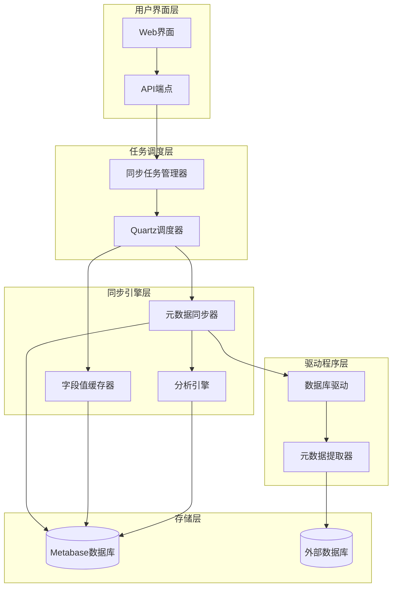

**图表来源**
- [sync_databases.clj](file://src/metabase/sync/task/sync_databases.clj#L1-L50)
- [sync_metadata.clj](file://src/metabase/sync/sync_metadata.clj#L1-L30)

## 定时任务调度机制

### 任务类型与配置

Metabase定义了两种主要的同步任务：

1. **同步与分析任务** (`SyncAndAnalyzeDatabase`)
   - 同步数据库元数据
   - 执行数据分析和指纹识别
   - 支持并发执行限制

2. **字段值缓存任务** (`UpdateFieldValues`)
   - 更新字段的统计信息
   - 维护字段值的唯一值列表
   - 支持可选的增量更新

### 调度配置

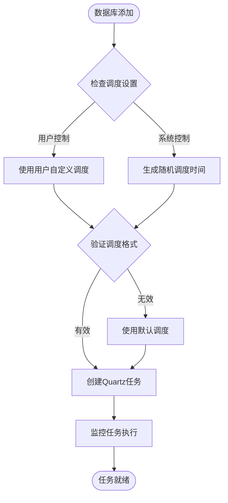

**图表来源**
- [sync_databases.clj](file://src/metabase/sync/task/sync_databases.clj#L300-L367)
- [schedules.clj](file://src/metabase/sync/schedules.clj#L40-L74)

### 执行周期配置

系统提供了灵活的调度配置选项：

| 任务类型 | 默认调度 | 随机化策略 | 最小间隔 |
|---------|---------|-----------|---------|
| 元数据同步 | 每小时一次 | 避开50分钟 | 1小时 |
| 字段值缓存 | 每天一次 | 随机小时 | 1天 |

**节来源**
- [sync_databases.clj](file://src/metabase/sync/task/sync_databases.clj#L300-L367)
- [schedules.clj](file://src/metabase/sync/schedules.clj#L40-L74)

## 元数据同步流程

### 同步步骤分解

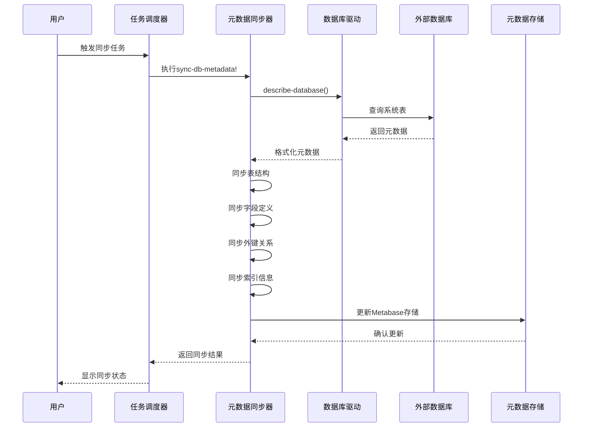

**图表来源**
- [sync_metadata.clj](file://src/metabase/sync/sync_metadata.clj#L40-L78)
- [fetch_metadata.clj](file://src/metabase/sync/fetch_metadata.clj#L25-L50)

### 同步步骤详解

1. **数据库版本检测** (`sync-dbms-version`)
   - 获取数据库管理系统版本信息
   - 存储到数据库记录中
   - 用于兼容性判断

2. **时区信息同步** (`sync-timezone`)
   - 检测数据库时区设置
   - 确保查询结果的时间准确性

3. **表结构同步** (`sync-tables`)
   - 创建或更新表模型
   - 处理表的可见性和权限
   - 同步表的描述信息

4. **字段信息同步** (`sync-fields`)
   - 分析字段的数据类型
   - 设置字段的语义类型
   - 处理嵌套字段结构

5. **外键关系同步** (`sync-fks`)
   - 建立表间关联关系
   - 验证外键约束完整性
   - 更新字段的FK属性

6. **索引信息同步** (`sync-indexes`)
   - 检测和同步索引定义
   - 优化查询性能分析
   - 处理复合索引和函数索引

**节来源**
- [sync_metadata.clj](file://src/metabase/sync/sync_metadata.clj#L40-L78)

## 驱动程序接口

### describe-database接口

所有数据库驱动必须实现的核心接口：

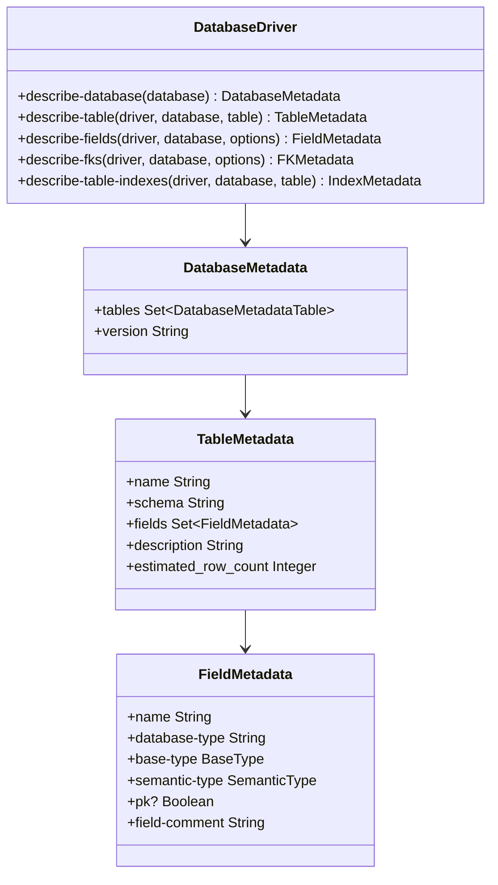

**图表来源**
- [interface.clj](file://src/metabase/sync/interface.clj#L10-L49)
- [driver.clj](file://src/metabase/driver.clj#L286-L313)

### 元数据提取流程

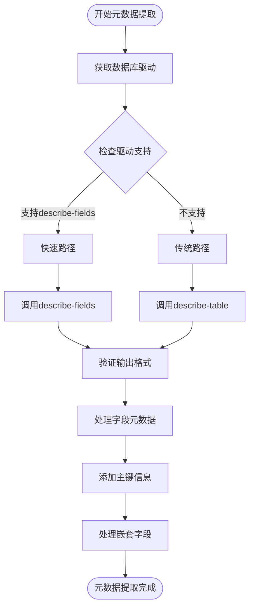

**图表来源**
- [fetch_metadata.clj](file://src/metabase/sync/fetch_metadata.clj#L50-L126)
- [describe_table.clj](file://src/metabase/driver/sql_jdbc/sync/describe_table.clj#L354-L385)

**节来源**
- [fetch_metadata.clj](file://src/metabase/sync/fetch_metadata.clj#L25-L126)
- [driver.clj](file://src/metabase/driver.clj#L286-L313)

## 同步类型与判断逻辑

### 全量同步 vs 增量同步

Metabase根据不同的场景采用不同的同步策略：

| 同步类型 | 触发条件 | 包含内容 | 性能影响 |
|---------|---------|---------|---------|
| 全量同步 | 数据库首次连接、手动触发 | 所有元数据、字段值、分析结果 | 高 |
| 增量同步 | 定时任务、字段值缓存 | 变更的元数据、新增字段 | 中等 |
| 表级同步 | 单表更新、新表发现 | 特定表的完整元数据 | 低 |

### is_full_sync判断逻辑

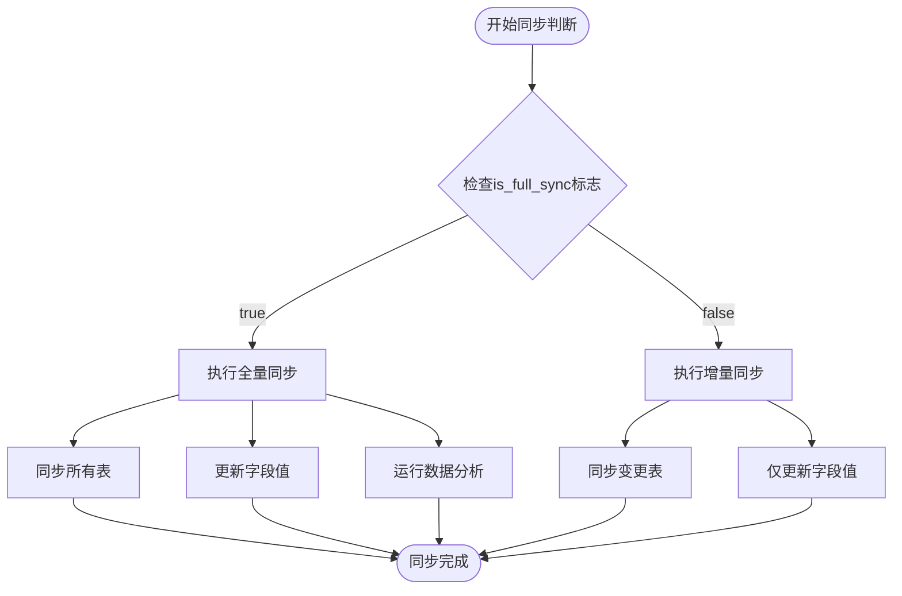

**图表来源**
- [sync_databases.clj](file://src/metabase/sync/task/sync_databases.clj#L106-L132)

**节来源**
- [sync_databases.clj](file://src/metabase/sync/task/sync_databases.clj#L106-L132)

## 错误处理与重试策略

### 异常分类与处理

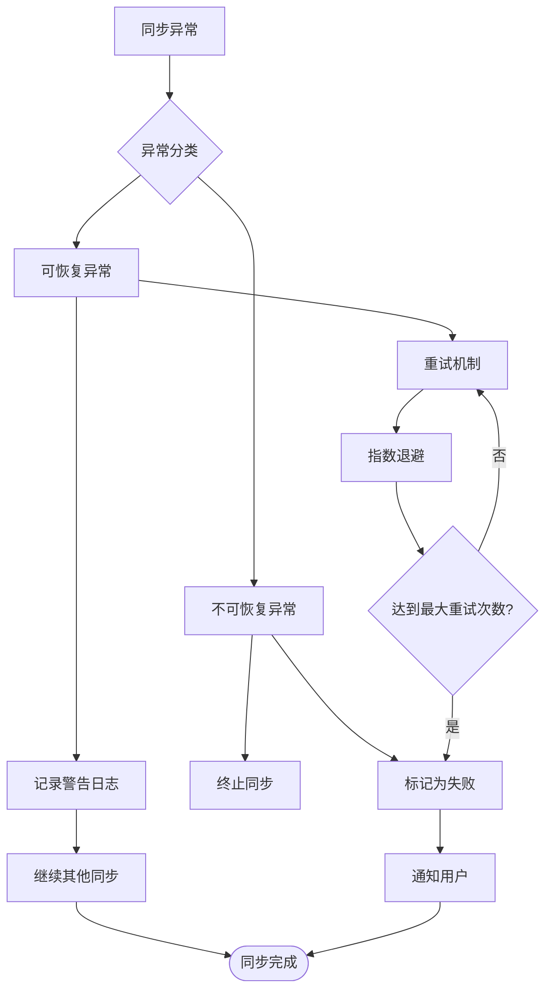

**图表来源**
- [util.clj](file://src/metabase/sync/util.clj#L180-L242)

### 重试策略配置

系统预定义了不可重试的异常类型：

| 异常类型 | 描述 | 处理策略 |
|---------|------|---------|
| ConnectException | 连接超时 | 立即终止 |
| NoRouteToHostException | 网络不通 | 立即终止 |
| UnknownHostException | DNS解析失败 | 立即终止 |
| SSLHandshakeException | SSL握手失败 | 立即终止 |
| CannotAcquireResourceException | 连接池耗尽 | 立即终止 |

### 错误恢复机制

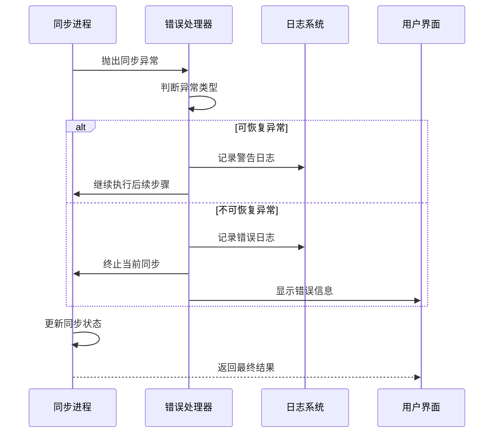

**图表来源**
- [util.clj](file://src/metabase/sync/util.clj#L180-L242)

**节来源**
- [util.clj](file://src/metabase/sync/util.clj#L180-L242)

## UI状态展示

### 同步状态跟踪

Metabase提供了完整的同步状态可视化：

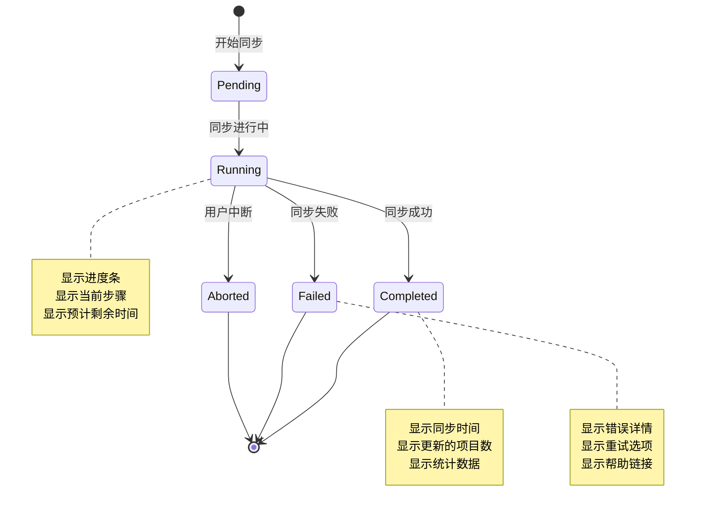

### 进度指示器

系统使用表情符号进度条提供直观的进度反馈：

| 进度范围 | 表情符号 | 含义 |
|---------|---------|------|
| 0-10% | 😱 | 同步开始，压力山大 |
| 10-30% | 😢 | 进度缓慢，耐心等待 |
| 30-50% | 😞 | 中途状态，继续努力 |
| 50-70% | 😐 | 半程完成，即将结束 |
| 70-90% | 😊 | 接近完成，再坚持一下 |
| 90-100% | 😎 | 快速完成，完美收尾 |

### 状态持久化

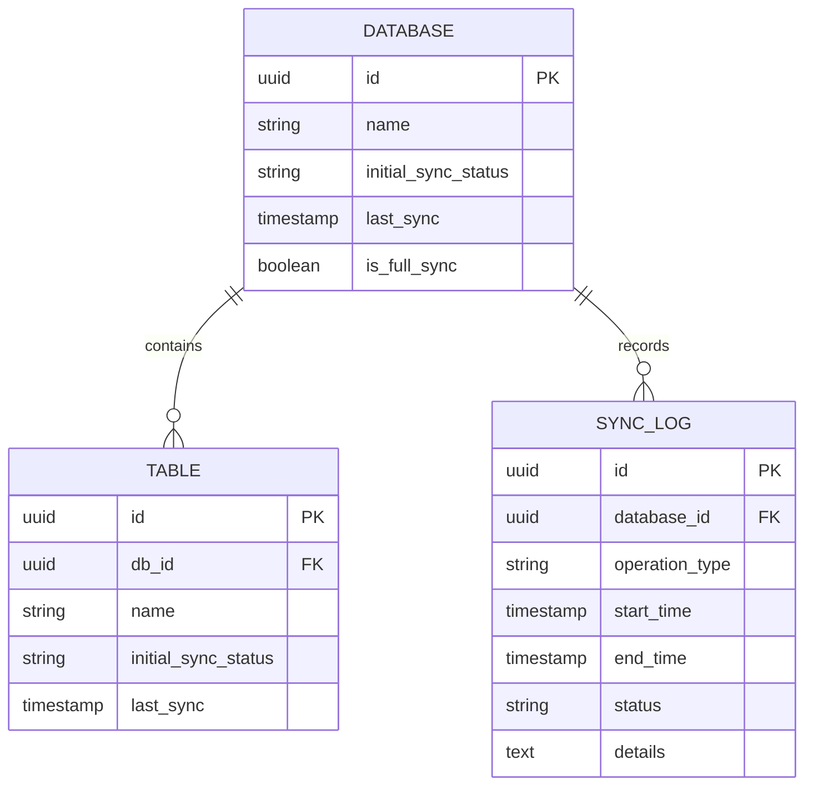

**图表来源**
- [util.clj](file://src/metabase/sync/util.clj#L343-L368)

**节来源**
- [util.clj](file://src/metabase/sync/util.clj#L261-L319)
- [util.clj](file://src/metabase/sync/util.clj#L343-L368)

## 性能优化策略

### 大型数据库的分批处理

对于包含大量表的大数据库，系统采用了智能的分批处理策略：

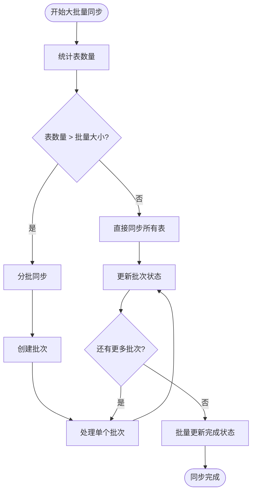

**图表来源**
- [util.clj](file://src/metabase/sync/util.clj#L330-L342)

### 字段值缓存策略

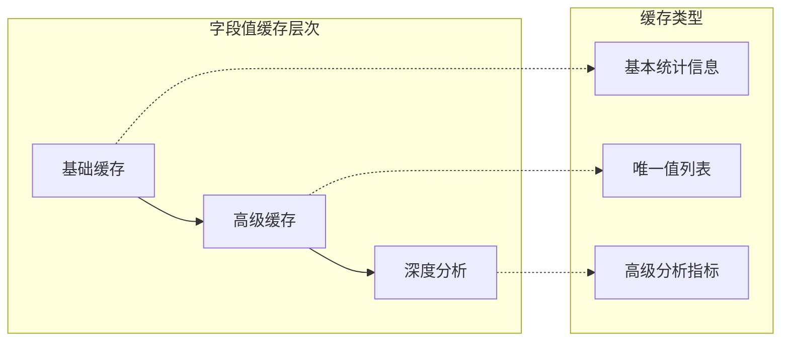

### 性能优化配置

| 优化项 | 默认值 | 可调参数 | 影响范围 |
|-------|-------|---------|---------|
| 批量大小 | 20000 | *batch-size* | 表更新性能 |
| 并发连接数 | 动态 | 驱动程序配置 | 网络I/O效率 |
| 超时时间 | 30秒 | 驱动程序配置 | 网络稳定性 |
| 重试次数 | 3次 | 内置逻辑 | 错误恢复能力 |

**节来源**
- [util.clj](file://src/metabase/sync/util.clj#L330-L342)
- [field_values.clj](file://src/metabase/sync/field_values.clj#L1-L129)

## 故障排除指南

### 常见问题诊断

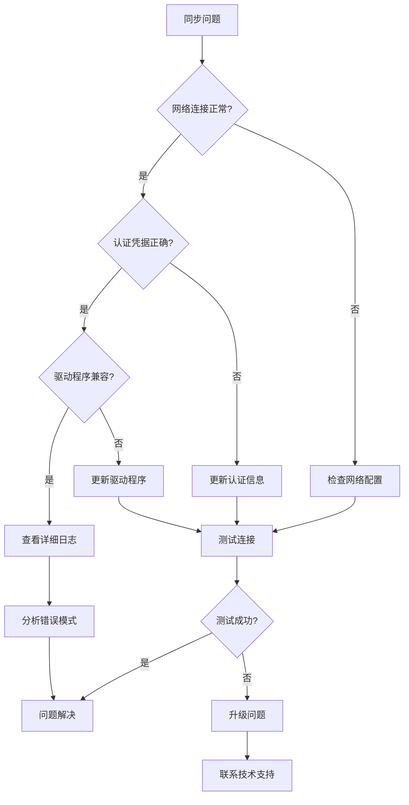

### 调试工具与技巧

1. **启用详细日志**
   ```clojure
   (binding [sync-util/*log-exceptions-and-continue?* false]
     ;; 执行同步操作
     )
   ```

2. **检查同步状态**
   ```sql
   SELECT id, name, initial_sync_status, last_sync 
   FROM metabase_database 
   WHERE id = ?;
   ```

3. **监控任务队列**
   - 查看Quartz调度器状态
   - 检查任务执行历史
   - 监控内存使用情况

### 性能监控指标

| 指标名称 | 正常范围 | 警告阈值 | 监控方法 |
|---------|---------|---------|---------|
| 同步时间 | < 30分钟 | > 1小时 | 任务历史记录 |
| 错误率 | < 5% | > 20% | 错误日志统计 |
| 内存使用 | < 80% | > 90% | JVM监控 |
| CPU使用 | < 70% | > 90% | 系统监控 |

**节来源**
- [util.clj](file://src/metabase/sync/util.clj#L180-L242)
- [sync_databases.clj](file://src/metabase/sync/task/sync_databases.clj#L60-L100)

## 结论

Metabase的数据库同步机制是一个高度模块化和可扩展的系统，通过精心设计的架构实现了高效、可靠的元数据同步功能。该系统不仅支持多种数据库类型的无缝集成，还提供了完善的错误处理、性能优化和用户体验保障机制。

关键特性总结：
- **自动化程度高**：支持定时自动同步和手动触发同步
- **容错能力强**：完善的错误处理和重试机制
- **性能优化好**：分批处理和缓存策略提升大数据库处理能力
- **用户体验佳**：实时状态反馈和详细的进度指示
- **扩展性强**：标准化的驱动程序接口支持新数据库类型接入

通过持续的优化和改进，该同步机制能够满足从小型项目到企业级大数据环境的各种需求，为用户提供稳定可靠的数据库元数据管理服务。