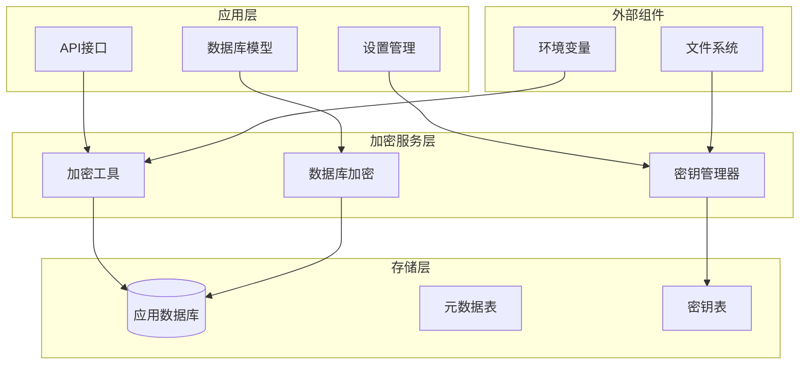
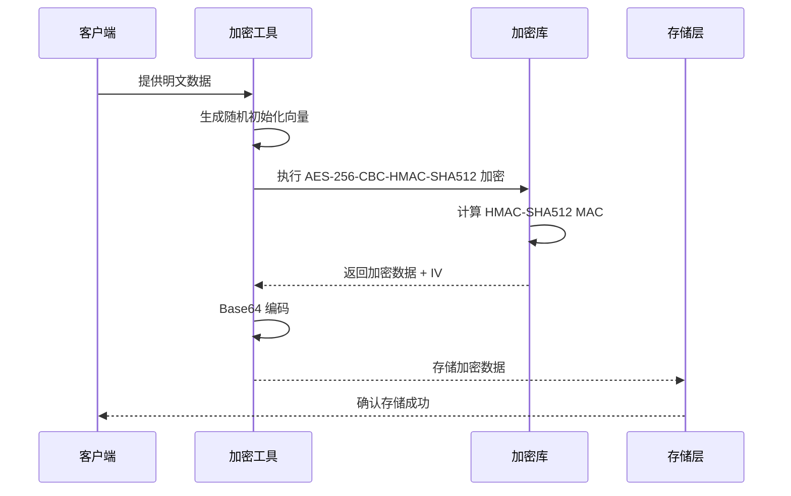
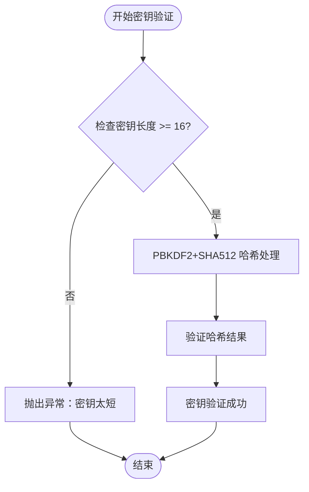
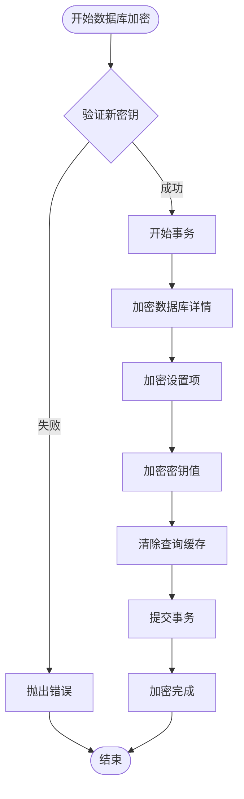
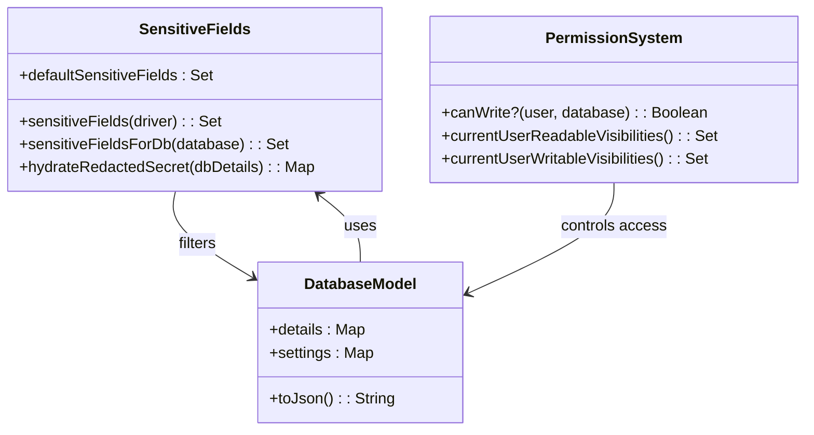
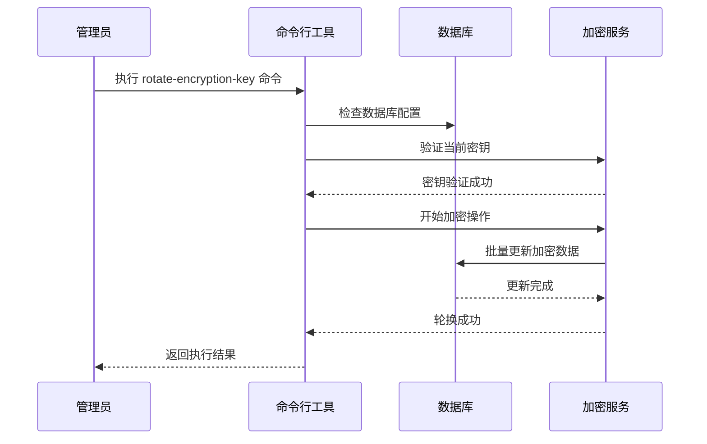

# 数据库安全与加密

<cite>
**本文档中引用的文件**
- [encryption.clj](file://src/metabase/util/encryption.clj)
- [app_db_encryption.clj](file://src/metabase/app_db/encryption.clj)
- [secret.clj](file://src/metabase/secrets/models/secret.clj)
- [database.clj](file://src/metabase/warehouses/models/database.clj)
- [util.clj](file://src/metabase/driver/util.clj)
- [rotate_encryption_key.clj](file://src/metabase/cmd/rotate_encryption_key.clj)
- [remove_encryption.clj](file://src/metabase/cmd/remove_encryption.clj)
- [setting.clj](file://src/metabase/settings/models/setting.clj)
- [interface.clj](file://src/metabase/models/interface.clj)
</cite>

## 目录
1. [简介](#简介)
2. [加密架构概述](#加密架构概述)
3. [核心加密机制](#核心加密机制)
4. [密钥管理](#密钥管理)
5. [数据库加密操作](#数据库加密操作)
6. [API响应脱敏](#api响应脱敏)
7. [密钥轮换与移除](#密钥轮换与移除)
8. [安全注意事项](#安全注意事项)
9. [故障排除指南](#故障排除指南)
10. [最佳实践](#最佳实践)

## 简介

Metabase 实现了一套完整的数据库安全与加密机制，用于保护敏感信息（如数据库密码、API密钥等）的安全存储。该系统基于 AES-256-CBC-HMAC-SHA512 加密算法，通过 `MB_ENCRYPTION_SECRET_KEY` 环境变量提供加密密钥，并实现了多层次的安全防护策略。

### 主要特性

- **强加密算法**：采用 AES-256-CBC-HMAC-SHA512 标准
- **密钥管理**：基于 PBKDF2+SHA512 的密钥派生机制
- **数据库级加密**：支持整个应用数据库的加密与解密
- **API响应脱敏**：基于用户权限的动态敏感字段过滤
- **密钥轮换**：支持加密密钥的安全更新
- **细粒度权限控制**：基于用户角色的访问权限管理

## 加密架构概述

**图表来源**
- [encryption.clj](file://src/metabase/util/encryption.clj#L1-L50)
- [app_db_encryption.clj](file://src/metabase/app_db/encryption.clj#L1-L30)

## 核心加密机制

### AES-256-CBC-HMAC-SHA512 算法

Metabase 使用经过认证的加密模式（Authenticated Encryption with Associated Data, AEAD），具体实现为 AES-256-CBC-HMAC-SHA512 算法组合。

#### 加密流程

**图表来源**
- [encryption.clj](file://src/metabase/util/encryption.clj#L80-L100)

#### 密钥派生机制

系统使用 PBKDF2+SHA512 算法从原始密钥派生出 64 字节的加密密钥：

- **迭代次数**：100,000 次（约 160ms 计算时间）
- **输出长度**：64 字节（AES-256 需要 32 字节，HMAC-SHA512 需要 32 字节）
- **安全性**：防止暴力破解攻击

**章节来源**
- [encryption.clj](file://src/metabase/util/encryption.clj#L35-L45)

### 加密函数实现

#### encrypt-bytes 函数

`encrypt-bytes` 函数负责字节数组的加密处理：

- **输入**：字节数组和可选的自定义密钥
- **输出**：Base64 编码的加密字符串
- **IV 处理**：自动添加 16 字节初始化向量到加密结果前部

#### encrypt 函数

`encrypt` 函数处理字符串加密：

- **字符串转换**：将输入字符串转换为字节数组
- **加密执行**：调用底层加密函数
- **编码格式**：返回 Base64 编码的加密结果

**章节来源**
- [encryption.clj](file://src/metabase/util/encryption.clj#L80-L120)

## 密钥管理

### MB_ENCRYPTION_SECRET_KEY 环境变量

系统通过 `MB_ENCRYPTION_SECRET_KEY` 环境变量管理加密密钥：

#### 密钥验证机制

**图表来源**
- [encryption.clj](file://src/metabase/util/encryption.clj#L47-L55)

#### 密钥状态检测

系统提供以下密钥状态检测功能：

- **default-encryption-enabled?**：检查是否启用了默认加密
- **密钥日志记录**：在启动时记录加密状态（启用/禁用）
- **运行时验证**：确保密钥在使用前已正确配置

**章节来源**
- [encryption.clj](file://src/metabase/util/encryption.clj#L60-L75)

### 密钥哈希处理

#### PBKDF2+SHA512 参数

- **算法选择**：PBKDF2+SHA512
- **迭代次数**：100,000 次
- **输出长度**：64 字节
- **计算时间**：约 160ms（平衡安全性和性能）

#### 密钥缓存机制

系统使用 `default-secret-key` 变量缓存已验证的密钥哈希值，避免重复计算：

- **内存缓存**：减少重复验证开销
- **惰性加载**：仅在需要时计算
- **类型注解**：明确指定字节数组类型

**章节来源**
- [encryption.clj](file://src/metabase/util/encryption.clj#L35-L50)

## 数据库加密操作

### 整体加密流程

**图表来源**
- [app_db_encryption.clj](file://src/metabase/app_db/encryption.clj#L15-L50)

### 具体加密操作

#### encrypt-db 函数

`encrypt-db` 函数执行数据库的整体加密：

- **参数验证**：检查目标密钥的有效性
- **批量处理**：同时处理数据库详情、设置和密钥
- **事务保证**：确保所有操作的原子性
- **密钥转换**：支持从当前密钥切换到新密钥

#### decrypt-db 函数

`decrypt-db` 函数执行数据库的解密操作：

- **身份验证**：验证当前密钥的有效性
- **无操作模式**：使用身份函数进行解密
- **数据恢复**：将加密数据还原为原始格式

**章节来源**
- [app_db_encryption.clj](file://src/metabase/app_db/encryption.clj#L45-L61)

### 加密范围

数据库加密涉及以下数据表：

#### details 字段加密

- **目标表**：metabase_database 表
- **处理内容**：数据库连接详情的 JSON 结构
- **加密方式**：字符串加密后重新存储
- **验证机制**：检查是否存在未加密的数据

#### secret 表加密

- **目标表**：secret 表
- **处理内容**：所有密钥值字段
- **批量更新**：一次性更新所有密钥实例
- **版本兼容**：支持多版本密钥的批量处理

#### 设置项加密

- **目标设置**：所有非特殊设置项
- **特殊处理**：
  - `settings-last-updated`：使用数据库原生类型
  - `encryption-check`：生成测试加密数据

**章节来源**
- [app_db_encryption.clj](file://src/metabase/app_db/encryption.clj#L25-L50)

## API响应脱敏

### 敏感字段识别机制

**图表来源**
- [database.clj](file://src/metabase/warehouses/models/database.clj#L475-L495)
- [util.clj](file://src/metabase/driver/util.clj#L650-L670)

### 默认敏感字段

系统预定义了一组通用的敏感字段：

- **密码类字段**：`:password`, `:pass`, `:tunnel-pass`
- **私钥类字段**：`:tunnel-private-key`, `:tunnel-private-key-passphrase`
- **令牌类字段**：`:access-token`, `:refresh-token`
- **证书类字段**：`:service-account-json`

### 动态敏感字段检测

#### 驱动程序集成

系统通过驱动程序连接属性检测特定的敏感字段：

- **连接属性扫描**：遍历所有连接属性
- **类型匹配**：识别 `:password` 和 `:secret` 类型
- **字段提取**：提取对应的字段名称

#### 数据库特定检测

对于给定的数据库实例，系统会：

1. **驱动程序识别**：确定数据库驱动类型
2. **属性映射**：获取驱动程序的连接属性
3. **字段合并**：将默认字段与驱动特定字段合并

**章节来源**
- [util.clj](file://src/metabase/driver/util.clj#L650-L670)
- [database.clj](file://src/metabase/warehouses/models/database.clj#L475-L485)

### 权限控制的脱敏策略

#### 用户权限级别

系统根据用户权限级别实施不同的脱敏策略：

| 权限级别 | 可见字段 | 脱敏程度 | 说明 |
|---------|---------|---------|------|
| 超级用户 | 完整详情 | 无脱敏 | 完全可见所有信息 |
| 写权限用户 | 部分详情 | 敏感字段替换 | 保留基本信息，隐藏密码 |
| 读权限用户 | 无详情 | 完全隐藏 | 不显示任何详情信息 |
| 匿名用户 | 无详情 | 完全隐藏 | 不显示任何敏感信息 |

#### 设置项权限控制

系统还控制设置项的可见性：

- **public**：所有人可见
- **authenticated**：登录用户可见  
- **settings-manager**：设置管理员可见
- **admin**：超级用户可见
- **internal**：内部设置，不可见

**章节来源**
- [database.clj](file://src/metabase/warehouses/models/database.clj#L485-L520)
- [setting.clj](file://src/metabase/settings/models/setting.clj#L1230-L1260)

### 密钥值脱敏

#### Secret 模型处理

系统对 Secret 模型实施特殊的脱敏策略：

- **JSON 序列化**：完全排除 `:value` 字段
- **客户端兼容**：保持其他字段完整
- **临时文件处理**：对文件路径进行特殊处理

#### 敏感值替换

系统使用统一的占位符替换敏感值：

- **protected-password**：`**MetabasePass**`
- **替换时机**：序列化过程中自动替换
- **恢复机制**：客户端请求时恢复原始值

**章节来源**
- [secret.clj](file://src/metabase/secrets/models/secret.clj#L40-L50)
- [secret.clj](file://src/metabase/secrets/models/secret.clj#L325-L340)

## 密钥轮换与移除

### 密钥轮换机制

**图表来源**
- [rotate_encryption_key.clj](file://src/metabase/cmd/rotate_encryption_key.clj#L8-L16)

#### rotate-encryption-key 命令

`rotate-encryption-key!` 函数提供密钥轮换功能：

- **参数支持**：接受新密钥作为参数
- **空密钥处理**：空密钥参数触发解密操作
- **配置检查**：确保数据库已正确配置
- **连接验证**：验证数据库连接状态

#### 轮换流程

1. **配置验证**：检查数据库是否已设置
2. **密钥验证**：验证当前和新密钥的有效性
3. **数据迁移**：批量更新所有加密数据
4. **完整性检查**：确保数据一致性

**章节来源**
- [rotate_encryption_key.clj](file://src/metabase/cmd/rotate_encryption_key.clj#L8-L16)

### 移除加密功能

#### remove-encryption 命令

`remove-encryption!` 函数提供移除加密的功能：

- **单向操作**：只能从加密状态转换为未加密状态
- **密钥要求**：必须提供当前有效的加密密钥
- **数据破坏**：移除加密后无法恢复原始数据

#### 使用场景

- **开发环境**：便于调试和数据导出
- **迁移需求**：从加密系统迁移到其他系统
- **故障恢复**：在密钥丢失情况下恢复数据访问

**章节来源**
- [remove_encryption.clj](file://src/metabase/cmd/remove_encryption.clj#L8-L14)

### 安全注意事项

#### 密钥管理安全

- **密钥备份**：轮换前必须备份当前密钥
- **密钥存储**：使用安全的密钥管理系统
- **访问控制**：限制密钥的访问权限
- **审计日志**：记录所有密钥操作

#### 数据完整性保护

- **事务保证**：确保密钥轮换的原子性
- **回滚机制**：提供操作失败时的回滚能力
- **验证检查**：轮换后验证数据完整性
- **监控告警**：监控密钥操作的异常情况

## 安全注意事项

### 密钥安全

#### 密钥生成建议

- **最小长度**：至少 16 个字符
- **熵要求**：使用强随机源生成
- **存储安全**：避免硬编码在代码中
- **传输安全**：使用加密通道传输

#### 密钥轮换策略

- **定期轮换**：建议每 90 天轮换一次
- **计划停机**：轮换期间可能需要短暂停机
- **测试验证**：轮换后立即验证系统功能
- **回滚准备**：准备好回滚方案

### 数据保护

#### 加密强度

- **算法选择**：使用经过认证的加密算法
- **密钥长度**：确保足够的密钥长度
- **初始化向量**：每次加密使用唯一 IV
- **完整性校验**：使用 HMAC 进行完整性保护

#### 访问控制

- **最小权限**：遵循最小权限原则
- **角色分离**：分离加密管理和数据访问
- **审计跟踪**：记录所有敏感操作
- **监控告警**：监控异常访问行为

### 性能考虑

#### 加密性能影响

- **CPU 开销**：加密操作增加 CPU 使用
- **I/O 影响**：加密数据可能增加磁盘 I/O
- **网络延迟**：加密可能增加网络传输时间
- **缓存策略**：合理设计缓存策略

#### 优化建议

- **批量处理**：使用批量操作减少开销
- **异步处理**：对非关键操作使用异步处理
- **硬件加速**：利用硬件加密支持
- **负载均衡**：分散加密负载

## 故障排除指南

### 常见问题诊断

#### 加密密钥相关问题

**问题**：无法启动应用或数据库连接失败
**原因**：`MB_ENCRYPTION_SECRET_KEY` 环境变量缺失或无效
**解决方案**：
1. 检查环境变量设置
2. 验证密钥长度和格式
3. 重新设置正确的密钥值

**问题**：数据库加密状态不一致
**原因**：部分数据已加密但密钥不匹配
**解决方案**：
1. 使用 `decrypt-db` 命令解密
2. 重新设置正确的密钥
3. 重新执行加密操作

#### 权限相关问题

**问题**：API 响应中包含敏感信息
**原因**：权限配置不当或脱敏逻辑失效
**解决方案**：
1. 检查用户权限设置
2. 验证脱敏规则配置
3. 清理相关缓存

**问题**：设置项可见性异常
**原因**：权限系统配置错误
**解决方案**：
1. 检查设置项的可见性配置
2. 验证用户权限级别
3. 重置权限配置

### 调试工具

#### 日志分析

系统提供了详细的日志信息：

- **加密状态**：记录加密功能的启用状态
- **操作日志**：记录加密和解密操作
- **错误信息**：记录加密相关的错误
- **性能指标**：记录加密操作的性能数据

#### 命令行工具

系统提供了多个命令行工具用于维护：

- **encrypt-db**：手动执行数据库加密
- **decrypt-db**：手动执行数据库解密
- **rotate-encryption-key**：执行密钥轮换
- **remove-encryption**：移除加密功能

**章节来源**
- [encryption.clj](file://src/metabase/util/encryption.clj#L64-L70)

### 监控和告警

#### 关键指标监控

- **加密状态**：监控加密功能的运行状态
- **密钥有效性**：监控密钥的可用性
- **操作频率**：监控加密操作的频率
- **错误率**：监控加密操作的错误率

#### 告警配置

- **密钥丢失**：密钥验证失败时告警
- **操作异常**：加密操作异常时告警
- **性能下降**：加密性能显著下降时告警
- **安全事件**：可疑的加密操作时告警

## 最佳实践

### 部署安全

#### 生产环境配置

- **密钥管理**：使用专业的密钥管理服务
- **环境隔离**：开发、测试、生产环境使用不同密钥
- **访问控制**：严格控制密钥的访问权限
- **定期审计**：定期审计密钥使用情况

#### 备份策略

- **密钥备份**：定期备份加密密钥
- **数据备份**：加密状态下备份数据库
- **恢复测试**：定期测试备份恢复流程
- **异地存储**：将备份存储在安全位置

### 运维管理

#### 日常维护

- **定期检查**：定期检查加密功能状态
- **性能监控**：监控加密操作的性能影响
- **日志分析**：分析加密相关的日志信息
- **版本升级**：及时升级到最新版本

#### 安全加固

- **漏洞扫描**：定期扫描安全漏洞
- **渗透测试**：进行定期的安全测试
- **威胁监控**：监控潜在的安全威胁
- **应急响应**：建立安全事件应急响应机制

### 开发指导

#### 代码安全

- **敏感数据处理**：避免在代码中硬编码敏感信息
- **加密库使用**：使用经过验证的加密库
- **错误处理**：妥善处理加密相关的错误
- **日志记录**：记录必要的安全日志

#### 测试策略

- **单元测试**：测试加密功能的正确性
- **集成测试**：测试加密功能的集成效果
- **安全测试**：测试加密功能的安全性
- **性能测试**：测试加密功能的性能影响

### 合规要求

#### 数据保护法规

- **GDPR**：遵守欧盟通用数据保护条例
- **CCPA**：遵守加州消费者隐私法案
- **其他法规**：遵守适用的数据保护法规

#### 审计要求

- **访问审计**：记录所有敏感操作
- **变更审计**：记录所有配置变更
- **合规报告**：生成合规性报告
- **第三方审核**：接受第三方安全审核

通过遵循这些最佳实践，可以确保 Metabase 数据库安全与加密机制的有效性和可靠性，为组织提供强大的数据保护能力。