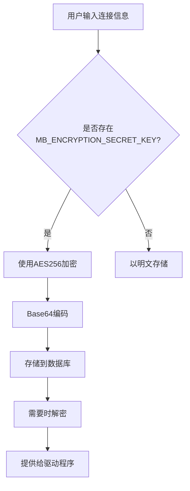

# 数据库模型

<cite>
**本文档中引用的文件**  
- [database.clj](file://src\metabase\warehouses\models\database.clj)
- [encryption.clj](file://src\metabase\app_db\encryption.clj)
- [util.clj](file://src\metabase\util\encryption.clj)
- [api.clj](file://src\metabase\warehouses\api.clj)
</cite>

## 目录
1. [引言](#引言)
2. [数据库实体结构](#数据库实体结构)
3. [数据库与表、字段的关系](#数据库与表字段的关系)
4. [连接信息加密机制](#连接信息加密机制)
5. [数据库状态生命周期管理](#数据库状态生命周期管理)
6. [数据库配置序列化格式](#数据库配置序列化格式)
7. [性能优化建议](#性能优化建议)
8. [结论](#结论)

## 引言

Metabase是一个开源的数据分析平台，允许用户通过简单的界面查询和可视化数据。本文档深入解析Metabase中的数据库连接模型，重点分析`Database`实体的结构、关系、安全存储机制以及生命周期管理。通过对核心组件的详细剖析，帮助开发者和管理员更好地理解Metabase如何管理数据库连接，并提供最佳实践建议。

## 数据库实体结构

Metabase中的`Database`实体是连接外部数据源的核心模型，包含多个关键字段用于定义和管理数据库连接。这些字段不仅描述了数据库的基本属性，还控制着同步行为和安全设置。

### 核心字段解析

`Database`实体的关键字段包括：

- **name**: 数据库的名称，作为唯一标识符用于序列化和路径生成。
- **engine**: 数据库引擎类型（如PostgreSQL、MySQL等），决定了连接协议和功能支持。
- **details**: 包含实际的连接信息（如主机、端口、用户名、密码等），该字段经过加密存储以确保安全性。
- **is_full_sync**: 布尔值，指示是否对数据库进行完整同步，影响元数据抓取的范围和频率。
- **is_on_demand**: 布尔值，表示是否按需同步，适用于大型或频繁变化的数据库。
- **settings**: 存储数据库特定的配置选项，同样经过加密处理。
- **metadata_sync_schedule** 和 **cache_field_values_schedule**: 定义元数据同步和字段值缓存的计划任务，支持cron表达式格式。

这些字段共同构成了数据库连接的完整描述，确保Metabase能够正确地与外部数据源交互。

**Section sources**
- [database.clj](file://src\metabase\warehouses\models\database.clj#L1-L615)

## 数据库与表、字段的关系

在Metabase中，`Database`、`Table`和`Field`之间存在明确的层次关系，这种关系通过外键和批量加载机制实现高效的数据访问和权限控制。

### 层次结构与依赖关系

- **Database → Table**: 每个数据库包含多个表，通过`db_id`字段建立关联。`Database`模型提供了`tables`函数来获取其所有表的集合。
- **Table → Field**: 每个表包含多个字段，通过`table_id`字段建立关联。`Table`模型提供了`fields`函数来获取其所有字段的集合。
- **反向查询**: 通过`field-id->table-id`和`table-id->database-id`函数可以实现从字段到数据库的反向查询，支持跨层级的数据分析。

### 批量加载与性能优化

Metabase使用`batched-hydrate`方法实现高效的批量加载：
- `batched-hydrate`方法允许一次性加载多个数据库的表或字段，减少数据库查询次数。
- 通过`instances-with-hydrated-data`辅助函数，确保数据的一致性和完整性。

这种设计不仅提高了查询效率，还减少了系统资源的消耗，特别适合处理大规模数据集。

**Section sources**
- [database.clj](file://src\metabase\warehouses\models\database.clj#L1-L615)
- [table.clj](file://src\metabase\warehouse_schema\models\table.clj#L1-L343)
- [field.clj](file://src\metabase\warehouse_schema\models\field.clj#L1-L438)

## 连接信息加密机制

Metabase采用AES256-CBC-HMAC-SHA512算法对数据库连接信息进行加密，确保敏感数据在静态存储时的安全性。加密过程依赖于环境变量`MB_ENCRYPTION_SECRET_KEY`。

### 加密策略详解

#### 密钥管理
- **密钥生成**: 使用PBKDF2+SHA512算法对`MB_ENCRYPTION_SECRET_KEY`进行100,000次迭代哈希，生成64字节的密钥。
- **密钥验证**: 系统启动时检查`MB_ENCRYPTION_SECRET_KEY`是否存在且长度至少为16个字符。
- **默认行为**: 如果未设置`MB_ENCRYPTION_SECRET_KEY`，则连接信息以明文存储，但系统会记录警告日志。

#### 加密实现
- **字符串加密**: 使用`encrypt`函数将连接信息（JSON格式）转换为Base64编码的加密字符串。
- **字节加密**: 使用`encrypt-bytes`函数处理二进制数据，如证书文件。
- **流式加密**: 支持大文件的流式加密，避免内存溢出。

#### 安全保障
- **自动清理**: 在JSON序列化过程中，`clean-secret-properties-from-database`函数会移除所有敏感属性，防止意外泄露。
- **权限控制**: 只有具有写权限的用户才能查看完整的连接详情，其他用户只能看到红acted的信息。



**Diagram sources**
- [util.clj](file://src\metabase\util\encryption.clj#L1-L262)
- [encryption.clj](file://src\metabase\app_db\encryption.clj#L1-L61)

**Section sources**
- [util.clj](file://src\metabase\util\encryption.clj#L1-L262)
- [encryption.clj](file://src\metabase\app_db\encryption.clj#L1-L61)

## 数据库状态生命周期管理

Metabase提供了完整的数据库生命周期管理功能，包括添加、测试、同步、停用和删除操作。每个阶段都有相应的事件触发和错误处理机制。

### 生命周期操作流程

#### 添加数据库
1. 用户提交连接信息
2. 系统验证`MB_ENCRYPTION_SECRET_KEY`
3. 测试连接可用性
4. 加密并存储连接信息
5. 创建初始权限设置

#### 测试连接
- 调用`can-connect?`方法验证连接参数
- 记录连接健康状态用于监控
- 失败时返回详细的错误信息

#### 同步元数据
- **自动同步**: 根据`schedules`配置定期执行
- **手动同步**: 通过API触发即时同步
- **增量同步**: 仅更新变化的表和字段

#### 停用与删除
- **停用**: 设置`is_active`标志，保留数据但禁止查询
- **删除**: 彻底移除数据库记录及其所有子资源（表、字段等）

### 事件驱动架构
- **事件发布**: 每个操作都会发布相应的事件（如`:event/database-create`）
- **任务调度**: 使用Quartz调度器管理同步任务
- **健康检查**: 定期执行连接健康检查，及时发现并报告问题

**Section sources**
- [database.clj](file://src\metabase\warehouses\models\database.clj#L1-L615)
- [api.clj](file://src\metabase\warehouses\api.clj#L1-L1387)

## 数据库配置序列化格式

Metabase支持将数据库配置导出为可移植的YAML格式，便于跨环境迁移和版本控制。序列化过程遵循特定的规范，确保数据的一致性和可读性。

### 序列化格式示例

```yaml
model: "Database"
name: "Production PostgreSQL"
engine: "postgres"
details:
  host: "db.example.com"
  port: 5432
  dbname: "analytics"
  user: "metabase"
is_full_sync: true
is_on_demand: false
metadata_sync_schedule: "0 50 * * * ?"
cache_field_values_schedule: "0 50 0 * * ?"
```

### 序列化特性
- **路径生成**: 使用`generate-path`方法创建唯一的路径标识符
- **依赖管理**: 自动包含所有相关的表和字段定义
- **加密处理**: 敏感信息在导出时保持加密状态
- **版本兼容**: 支持向后兼容的格式演变

### 跨环境迁移应用
- **开发到生产**: 将测试环境的配置安全地迁移到生产环境
- **备份与恢复**: 定期导出配置作为灾难恢复计划的一部分
- **团队协作**: 共享标准化的数据库配置模板

**Section sources**
- [database.clj](file://src\metabase\warehouses\models\database.clj#L1-L615)
- [serialization.clj](file://src\metabase\models\serialization.clj#L1-L420)

## 性能优化建议

为了确保Metabase在高负载下的稳定运行，建议根据实际需求调整以下性能相关配置。

### 连接池配置

使用环境变量`MB_JDBC_DATA_WAREHOUSE_MAX_CONNECTION_POOL_SIZE`控制连接池大小：
- **默认值**: 15个连接
- **调整建议**: 
  - 对于高并发场景，可增加至50-100
  - 对于资源受限环境，可降低至5-10
- **监控指标**: 观察连接等待时间和池利用率

### 查询超时设置

通过`MB_DB_QUERY_TIMEOUT_MINUTES`配置查询超时：
- **默认值**: 生产环境20分钟，开发环境3分钟
- **调整建议**:
  - 复杂分析查询可适当延长
  - 实时仪表板建议保持较短超时
- **配套设置**: `jdbc-data-warehouse-unreturned-connection-timeout-seconds`应与查询超时保持一致

### 其他优化措施
- **定期同步**: 避免频繁的手动同步操作
- **缓存策略**: 合理配置字段值缓存计划
- **索引优化**: 确保应用数据库的关键字段有适当索引

**Section sources**
- [settings.clj](file://src\metabase\driver\settings.clj#L1-L143)
- [connection.clj](file://src\metabase\driver\sql_jdbc\connection.clj#L1-L154)

## 结论

Metabase的数据库连接模型设计充分考虑了安全性、可扩展性和易用性。通过深入理解`Database`实体的结构、关系、加密机制和生命周期管理，管理员可以更有效地部署和维护Metabase实例。建议在生产环境中始终启用`MB_ENCRYPTION_SECRET_KEY`，并根据工作负载调整连接池和超时设置，以实现最佳性能和安全性平衡。