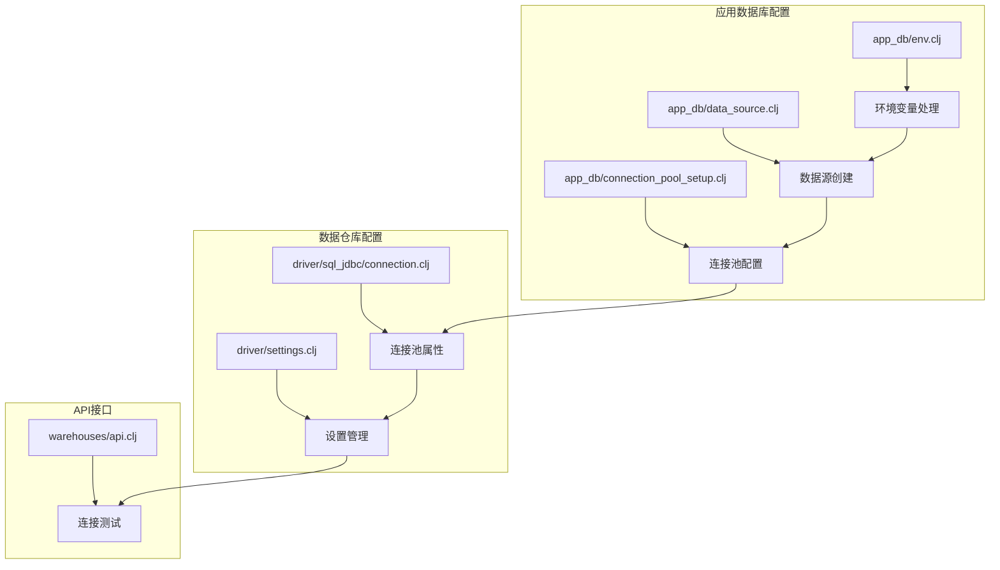
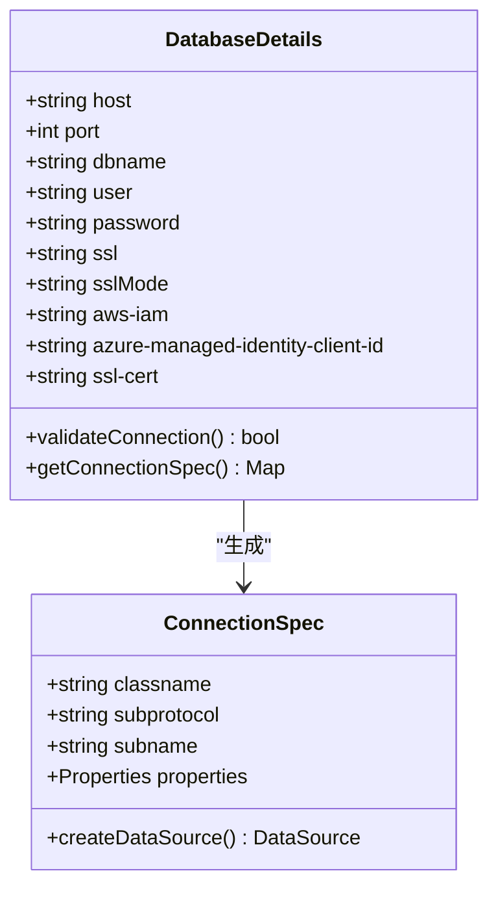
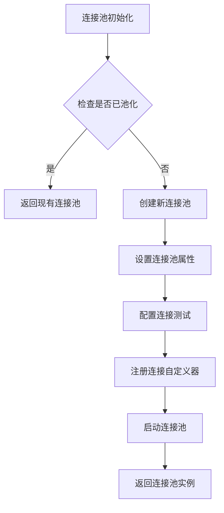
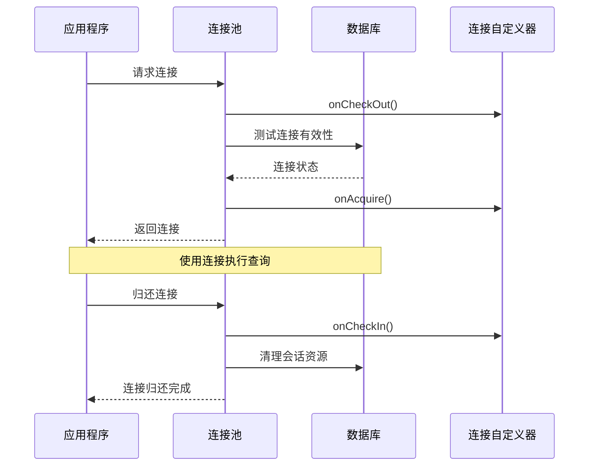
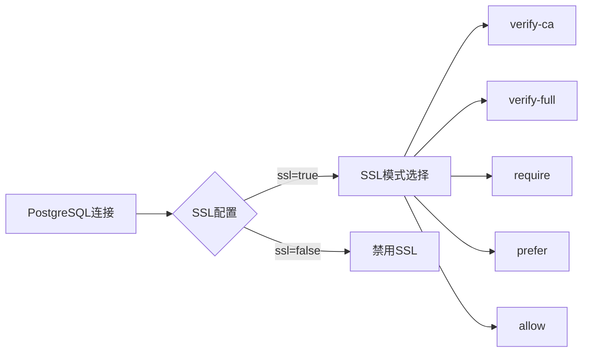
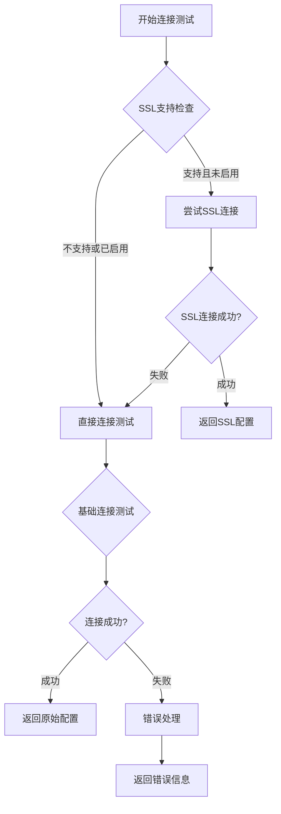
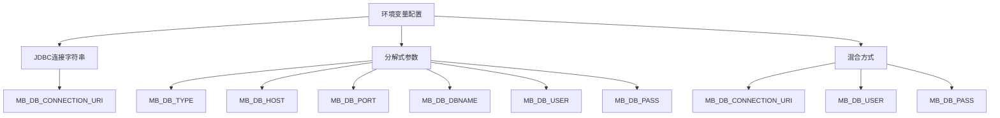
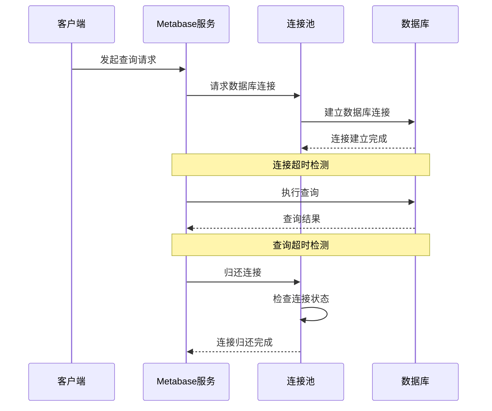
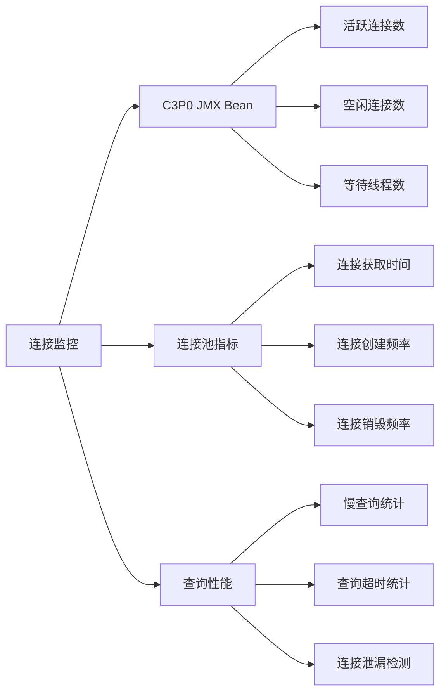

# 数据库连接配置

<cite>
**本文档中引用的文件**
- [connection_pool_setup.clj](file://src/metabase/app_db/connection_pool_setup.clj)
- [data_source.clj](file://src/metabase/app_db/data_source.clj)
- [env.clj](file://src/metabase/app_db/env.clj)
- [connection.clj](file://src/metabase/driver/sql_jdbc/connection.clj)
- [settings.clj](file://src/metabase/driver/settings.clj)
- [api.clj](file://src/metabase/warehouses/api.clj)
- [postgres.clj](file://src/metabase/driver/postgres.clj)
- [mysql.clj](file://src/metabase/driver/mysql.clj)
- [spec.clj](file://src/metabase/app_db/spec.clj)
</cite>

## 目录
1. [简介](#简介)
2. [项目结构概览](#项目结构概览)
3. [Database模型与连接参数](#database模型与连接参数)
4. [C3P0连接池配置](#c3p0连接池配置)
5. [数据库驱动配置](#数据库驱动配置)
6. [连接测试机制](#连接测试机制)
7. [环境变量配置](#环境变量配置)
8. [连接超时配置](#连接超时配置)
9. [实际配置示例](#实际配置示例)
10. [故障排除指南](#故障排除指南)
11. [总结](#总结)

## 简介

Metabase是一个强大的BI工具，其数据库连接配置系统设计精巧，支持多种数据库类型和连接管理策略。本文档深入解析Metabase的数据库连接配置机制，涵盖从基础的连接参数到高级的连接池优化策略。

## 项目结构概览

Metabase的数据库连接配置主要分布在以下关键模块中：



**图表来源**
- [env.clj](file://src/metabase/app_db/env.clj#L1-L20)
- [data_source.clj](file://src/metabase/app_db/data_source.clj#L1-L30)
- [connection_pool_setup.clj](file://src/metabase/app_db/connection_pool_setup.clj#L1-L50)

## Database模型与连接参数

### 核心连接参数结构

Metabase使用`details`字段存储数据库连接的所有必要信息：



**图表来源**
- [env.clj](file://src/metabase/app_db/env.clj#L80-L116)
- [data_source.clj](file://src/metabase/app_db/data_source.clj#L121-L138)

### 连接参数详解

| 参数名称 | 类型 | 必需 | 默认值 | 描述 |
|---------|------|------|--------|------|
| `host` | string | 是 | localhost | 数据库服务器主机名或IP地址 |
| `port` | int | 是 | 5432/3306 | 数据库端口号 |
| `dbname` | string | 是 | "" | 数据库名称 |
| `user` | string | 是 | - | 数据库用户名 |
| `password` | string | 否 | - | 数据库密码 |
| `ssl` | boolean | 否 | false | 是否启用SSL连接 |
| `sslMode` | string | 否 | "require" | SSL模式：allow、prefer、require、verify-ca、verify-full |
| `aws-iam` | boolean | 否 | false | 是否使用AWS IAM认证 |
| `azure-managed-identity-client-id` | string | 否 | - | Azure托管身份客户端ID |

**节来源**
- [env.clj](file://src/metabase/app_db/env.clj#L80-L116)
- [common.clj](file://src/metabase/driver/common.clj#L15-L63)

## C3P0连接池配置

### 应用数据库连接池配置

Metabase为应用数据库和数据仓库分别配置了不同的连接池参数：



**图表来源**
- [connection_pool_setup.clj](file://src/metabase/app_db/connection_pool_setup.clj#L131-L150)

### 关键配置参数

| 参数名称 | 默认值 | 可调范围 | 描述 |
|---------|--------|----------|------|
| `minPoolSize` | 1 | 0-10 | 最小连接数 |
| `maxPoolSize` | 15 | 1-100 | 最大连接数 |
| `initialPoolSize` | 0 | 0-15 | 初始连接数 |
| `acquireIncrement` | 1 | 1-10 | 获取增量 |
| `maxIdleTime` | 10800 | 300-86400 | 最大空闲时间(秒) |
| `maxIdleTimeExcessConnections` | 600 | 0-3600 | 超额连接最大空闲时间 |
| `maxConnectionAge` | 3600 | 0-86400 | 连接最大生存时间 |
| `idleConnectionTestPeriod` | 60 | 0-3600 | 空闲连接测试周期 |
| `testConnectionOnCheckout` | true | true/false | 检出时测试连接 |
| `unreturnedConnectionTimeout` | 查询超时 | 0-查询超时 | 未返回连接超时 |

**节来源**
- [connection_pool_setup.clj](file://src/metabase/app_db/connection_pool_setup.clj#L63-L150)
- [connection.clj](file://src/metabase/driver/sql_jdbc/connection.clj#L85-L141)

### 连接池生命周期管理



**图表来源**
- [connection_pool_setup.clj](file://src/metabase/app_db/connection_pool_setup.clj#L45-L85)

## 数据库驱动配置

### PostgreSQL驱动配置

PostgreSQL驱动提供了丰富的SSL配置选项：



**图表来源**
- [postgres.clj](file://src/metabase/driver/postgres.clj#L144-L182)

### MySQL驱动配置

MySQL驱动支持MariaDB和传统MySQL：

| 配置项 | PostgreSQL | MySQL/MariaDB | 描述 |
|--------|------------|---------------|------|
| 驱动类 | `org.postgresql.Driver` | `org.mariadb.jdbc.Driver` | JDBC驱动类 |
| 默认端口 | 5432 | 3306 | 标准端口 |
| SSL模式 | verify-ca | VERIFY_CA | SSL验证级别 |
| AWS IAM | 支持 | 支持 | AWS身份认证 |
| 信任证书 | 不适用 | trustServerCertificate | 信任服务器证书 |

**节来源**
- [spec.clj](file://src/metabase/app_db/spec.clj#L35-L73)
- [postgres.clj](file://src/metabase/driver/postgres.clj#L113-L147)

## 连接测试机制

### 连接测试流程



**图表来源**
- [api.clj](file://src/metabase/warehouses/api.clj#L824-L852)

### 连接验证策略

| 验证级别 | 描述 | 性能影响 | 推荐场景 |
|---------|------|----------|----------|
| 基础连接测试 | `SELECT 1`查询 | 低 | 日常连接验证 |
| SSL连接测试 | SSL握手验证 | 中 | 生产环境SSL配置 |
| 权限验证 | 用户权限检查 | 高 | 敏感数据访问 |
| 完整功能测试 | 复杂查询验证 | 很高 | 关键业务系统 |

**节来源**
- [connection.clj](file://src/metabase/driver/sql_jdbc/connection.clj#L350-L382)

## 环境变量配置

### 应用数据库环境变量

Metabase支持三种配置方式：



**图表来源**
- [env.clj](file://src/metabase/app_db/env.clj#L5-L25)

### 环境变量映射表

| 配置方式 | 环境变量 | 示例值 | 优先级 |
|---------|----------|--------|--------|
| 连接字符串 | `MB_DB_CONNECTION_URI` | `jdbc:postgresql://localhost:5432/metabase` | 最高 |
| 分解参数 | `MB_DB_TYPE` | `postgres` | 中等 |
| 分解参数 | `MB_DB_HOST` | `localhost` | 中等 |
| 分解参数 | `MB_DB_PORT` | `5432` | 中等 |
| 分解参数 | `MB_DB_DBNAME` | `metabase` | 中等 |
| 分解参数 | `MB_DB_USER` | `metabase_user` | 中等 |
| 分解参数 | `MB_DB_PASS` | `secure_password` | 中等 |

**节来源**
- [env.clj](file://src/metabase/app_db/env.clj#L111-L141)

### 数据仓库环境变量

| 变量名 | 类型 | 默认值 | 描述 |
|--------|------|--------|------|
| `MB_DB_CONNECTION_TIMEOUT_MS` | int | 10000 | 连接超时(毫秒) |
| `MB_DB_QUERY_TIMEOUT_MINUTES` | int | 20 | 查询超时(分钟) |
| `MB_APPLICATION_DB_MAX_CONNECTION_POOL_SIZE` | int | 15 | 应用数据库最大连接池大小 |
| `MB_DB_QUERY_CACHE_TTL` | int | 300 | 查询缓存TTL(秒) |

**节来源**
- [settings.clj](file://src/metabase/driver/settings.clj#L75-L99)

## 连接超时配置

### 超时机制协同工作



**图表来源**
- [connection.clj](file://src/metabase/driver/sql_jdbc/connection.clj#L128-L141)

### 超时参数配置

| 超时类型 | 参数名称 | 默认值 | 单位 | 描述 |
|---------|----------|--------|------|------|
| 连接超时 | `db-connection-timeout-ms` | 10000 | 毫秒 | 数据库连接建立超时 |
| 查询超时 | `db-query-timeout-minutes` | 20 | 分钟 | 查询执行超时 |
| 未返回连接超时 | `unreturnedConnectionTimeout` | 查询超时 | 秒 | 连接未归还超时 |
| 连接池获取超时 | `acquireRetryAttempts` | 0/1 | 次数 | 连接池获取重试次数 |

**节来源**
- [settings.clj](file://src/metabase/driver/settings.clj#L75-L99)
- [connection.clj](file://src/metabase/driver/sql_jdbc/connection.clj#L128-L141)

## 实际配置示例

### PostgreSQL生产环境配置

```yaml
# 环境变量配置
MB_DB_TYPE: postgres
MB_DB_HOST: db-production.internal
MB_DB_PORT: 5432
MB_DB_DBNAME: metabase_prod
MB_DB_USER: metabase_user
MB_DB_PASS: ${DB_PASSWORD}
MB_DB_SSL_CERT: /etc/ssl/certs/ca-certificates.crt
MB_DB_AWS_IAM: true

# 连接池配置
MB_APPLICATION_DB_MAX_CONNECTION_POOL_SIZE: 25
MB_DB_CONNECTION_TIMEOUT_MS: 15000
MB_DB_QUERY_TIMEOUT_MINUTES: 30
```

### MySQL开发环境配置

```yaml
# 环境变量配置
MB_DB_TYPE: mysql
MB_DB_HOST: localhost
MB_DB_PORT: 3306
MB_DB_DBNAME: metabase_dev
MB_DB_USER: dev_user
MB_DB_PASS: dev_password

# 连接池配置
MB_APPLICATION_DB_MAX_CONNECTION_POOL_SIZE: 10
MB_DB_CONNECTION_TIMEOUT_MS: 5000
MB_DB_QUERY_TIMEOUT_MINUTES: 5
```

### Docker Compose配置示例

```yaml
version: '3.8'
services:
  metabase:
    image: metabase/metabase:v0.47.0
    ports:
      - "3000:3000"
    environment:
      - MB_DB_TYPE=postgres
      - MB_DB_HOST=postgres
      - MB_DB_PORT=5432
      - MB_DB_DBNAME=metabase
      - MB_DB_USER=metabase
      - MB_DB_PASS=${METABASE_DB_PASSWORD}
      - MB_APPLICATION_DB_MAX_CONNECTION_POOL_SIZE=20
      - MB_DB_QUERY_TIMEOUT_MINUTES=15
    depends_on:
      - postgres
    restart: unless-stopped
```

### API配置示例

```bash
# 创建数据库连接
curl -X POST \
  -H "Content-Type: application/json" \
  -H "Authorization: Bearer $TOKEN" \
  -d '{
    "name": "Production PostgreSQL",
    "engine": "postgres",
    "details": {
      "host": "db-production.internal",
      "port": 5432,
      "dbname": "production_db",
      "user": "readonly_user",
      "password": "secure_password",
      "ssl": true,
      "sslMode": "verify-ca"
    },
    "is_full_sync": false,
    "is_on_demand": true
  }' \
  https://metabase.example.com/api/database
```

## 故障排除指南

### 常见连接问题及解决方案

| 问题症状 | 可能原因 | 解决方案 |
|---------|----------|----------|
| 连接超时 | 网络延迟或防火墙阻断 | 检查网络连通性，调整超时设置 |
| SSL握手失败 | SSL证书配置错误 | 验证SSL证书路径和配置 |
| 认证失败 | 用户名密码错误 | 检查数据库用户权限 |
| 连接池耗尽 | 查询长时间未完成 | 优化查询性能，调整超时设置 |
| 内存溢出 | 连接泄漏导致 | 启用连接泄漏检测，修复代码bug |

### 监控和诊断



**节来源**
- [prometheus.clj](file://src/metabase/analytics/prometheus.clj#L93-L171)

### 性能调优建议

1. **连接池大小优化**
   - 根据并发查询量调整`maxPoolSize`
   - 监控连接池利用率，避免过大或过小

2. **超时参数调优**
   - 根据查询复杂度调整查询超时
   - 平衡响应时间和资源消耗

3. **SSL配置优化**
   - 生产环境启用SSL并配置适当的SSL模式
   - 开发环境可适当放宽SSL要求

4. **监控指标关注**
   - 连接池命中率
   - 查询响应时间分布
   - 连接泄漏检测

**节来源**
- [connection.clj](file://src/metabase/driver/sql_jdbc/connection.clj#L85-L141)

## 总结

Metabase的数据库连接配置系统设计完善，涵盖了从基础连接参数到高级连接池优化的各个方面。通过合理配置连接参数、连接池设置和超时策略，可以确保Metabase在各种部署环境中稳定高效运行。

关键要点：
- 支持多种配置方式，灵活适应不同部署需求
- 提供完善的连接测试和验证机制
- 具备强大的连接池管理和监控能力
- 支持主流数据库类型和认证方式
- 提供丰富的环境变量和API配置选项

正确理解和配置这些参数，对于确保Metabase系统的稳定性和性能至关重要。