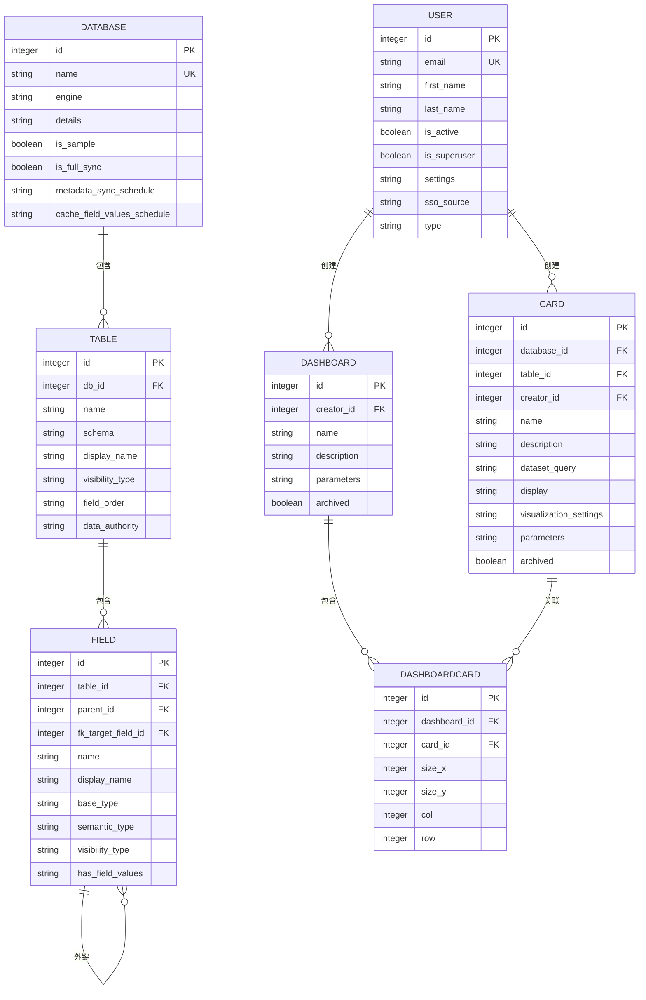

# 数据模型

<cite>
**本文档中引用的文件**   
- [user.clj](file://src/metabase/users/models/user.clj)
- [dashboard.clj](file://src/metabase/dashboards/models/dashboard.clj)
- [card.clj](file://src/metabase/queries/models/card.clj)
- [database.clj](file://src/metabase/warehouses/models/database.clj)
- [table.clj](file://src/metabase/warehouse_schema/models/table.clj)
- [field.clj](file://src/metabase/warehouse_schema/models/field.clj)
- [dashboard_card.clj](file://src/metabase/dashboards/models/dashboard_card.clj)
- [interface.clj](file://src/metabase/models/interface.clj)
</cite>

## 目录
1. [简介](#简介)
2. [核心实体结构](#核心实体结构)
3. [实体关系](#实体关系)
4. [数据验证与业务约束](#数据验证与业务约束)
5. [序列化机制](#序列化机制)
6. [数据库模式图](#数据库模式图)
7. [数据生命周期管理](#数据生命周期管理)
8. [数据迁移框架](#数据迁移框架)
9. [性能优化策略](#性能优化策略)
10. [结论](#结论)

## 简介
Metabase是一个开源的数据分析和可视化平台，其核心数据模型由多个关键实体组成，包括用户、数据库、表、字段、卡片、仪表板等。这些实体通过复杂的关系相互连接，形成了一个完整的数据分析生态系统。本文档旨在全面描述Metabase的核心数据模型，详细说明主要实体的结构、字段定义和数据类型，阐明实体之间的关系，解释数据验证规则、业务约束和序列化机制，提供数据库模式图展示表结构和外键关系，说明数据生命周期管理策略，涵盖数据迁移框架的工作原理和版本管理，并讨论性能优化策略。

**Section sources**
- [user.clj](file://src/metabase/users/models/user.clj#L1-L422)
- [dashboard.clj](file://src/metabase/dashboards/models/dashboard.clj#L1-L503)
- [card.clj](file://src/metabase/queries/models/card.clj#L1-L1364)
- [database.clj](file://src/metabase/warehouses/models/database.clj#L1-L615)
- [table.clj](file://src/metabase/warehouse_schema/models/table.clj#L1-L402)
- [field.clj](file://src/metabase/warehouse_schema/models/field.clj#L1-L440)

## 核心实体结构
Metabase的核心数据模型包含多个关键实体，每个实体都有其特定的结构和字段定义。这些实体包括用户、数据库、表、字段、卡片和仪表板。

### 用户实体
用户实体（User）是Metabase系统中的基本身份单位，用于管理用户信息和权限。其主要字段包括：
- `id`：用户唯一标识符
- `email`：用户邮箱地址
- `first_name`：用户名字
- `last_name`：用户姓氏
- `is_active`：用户是否激活
- `is_superuser`：用户是否为超级用户
- `settings`：用户设置（加密存储）
- `sso_source`：单点登录来源
- `type`：用户类型（内部、个人、API密钥）

用户实体通过`perms-objects-set`方法定义权限对象路径，通过`can-read?`和`can-write?`方法检查读写权限。

**Section sources**
- [user.clj](file://src/metabase/users/models/user.clj#L1-L422)

### 数据库实体
数据库实体（Database）代表连接到Metabase的外部数据源。其主要字段包括：
- `id`：数据库唯一标识符
- `name`：数据库名称
- `engine`：数据库引擎类型
- `details`：连接详细信息（加密存储）
- `is_sample`：是否为示例数据库
- `is_full_sync`：是否完全同步
- `metadata_sync_schedule`：元数据同步计划
- `cache_field_values_schedule`：字段值缓存计划

数据库实体通过`can-read?`和`can-write?`方法控制访问权限，并通过`infer-db-schedules`方法推断同步计划。

**Section sources**
- [database.clj](file://src/metabase/warehouses/models/database.clj#L1-L615)

### 表实体
表实体（Table）代表数据库中的数据表。其主要字段包括：
- `id`：表唯一标识符
- `db_id`：所属数据库ID
- `name`：表名称
- `schema`：表模式
- `display_name`：显示名称
- `visibility_type`：可见性类型
- `field_order`：字段排序方式
- `data_authority`：数据权威性

表实体通过`set-new-table-permissions!`方法设置新表的权限，并通过`update-field-positions!`方法更新字段位置。

**Section sources**
- [table.clj](file://src/metabase/warehouse_schema/models/table.clj#L1-L402)

### 字段实体
字段实体（Field）代表表中的列。其主要字段包括：
- `id`：字段唯一标识符
- `table_id`：所属表ID
- `name`：字段名称
- `display_name`：显示名称
- `base_type`：基础类型
- `semantic_type`：语义类型
- `visibility_type`：可见性类型
- `has_field_values`：是否有字段值

字段实体通过`transform-field-base-type`等转换函数处理类型转换，并通过`with-values`等批量水合方法高效加载字段值。

**Section sources**
- [field.clj](file://src/metabase/warehouse_schema/models/field.clj#L1-L440)

### 卡片实体
卡片实体（Card）代表一个查询或可视化。其主要字段包括：
- `id`：卡片唯一标识符
- `name`：卡片名称
- `description`：描述
- `dataset_query`：数据集查询
- `display`：显示类型
- `visualization_settings`：可视化设置
- `parameters`：参数
- `archived`：是否归档

卡片实体通过`pre-insert`和`pre-update`方法在插入和更新时进行预处理，并通过`upgrade-card-schema-to`方法升级卡片模式。

**Section sources**
- [card.clj](file://src/metabase/queries/models/card.clj#L1-L1364)

### 仪表板实体
仪表板实体（Dashboard）代表一组卡片的集合。其主要字段包括：
- `id`：仪表板唯一标识符
- `name`：仪表板名称
- `description`：描述
- `parameters`：参数
- `archived`：是否归档
- `collection_id`：所属集合ID

仪表板实体通过`add-dashcards!`方法添加卡片，并通过`update-dashcards!`方法更新卡片。

**Section sources**
- [dashboard.clj](file://src/metabase/dashboards/models/dashboard.clj#L1-L503)

### 仪表板卡片实体
仪表板卡片实体（DashboardCard）代表仪表板中的单个卡片实例。其主要字段包括：
- `id`：仪表板卡片唯一标识符
- `dashboard_id`：所属仪表板ID
- `card_id`：关联卡片ID
- `size_x`：水平大小
- `size_y`：垂直大小
- `col`：列位置
- `row`：行位置

**Section sources**
- [dashboard_card.clj](file://src/metabase/dashboards/models/dashboard_card.clj#L1-L200)

## 实体关系
Metabase的核心实体之间通过多种关系相互连接，形成了一个复杂的网络结构。

### 一对多关系
- **用户-卡片**：一个用户可以创建多个卡片
- **数据库-表**：一个数据库包含多个表
- **表-字段**：一个表包含多个字段
- **仪表板-仪表板卡片**：一个仪表板包含多个仪表板卡片
- **卡片-参数卡片**：一个卡片可以有多个参数卡片

### 多对多关系
- **用户-权限组**：一个用户可以属于多个权限组，一个权限组可以包含多个用户
- **卡片-仪表板**：一个卡片可以出现在多个仪表板中，一个仪表板可以包含多个卡片

### 外键关系
- `Card`表的`database_id`字段引用`Database`表的`id`字段
- `Card`表的`table_id`字段引用`Table`表的`id`字段
- `Card`表的`creator_id`字段引用`User`表的`id`字段
- `Dashboard`表的`creator_id`字段引用`User`表的`id`字段
- `DashboardCard`表的`dashboard_id`字段引用`Dashboard`表的`id`字段
- `DashboardCard`表的`card_id`字段引用`Card`表的`id`字段
- `Field`表的`table_id`字段引用`Table`表的`id`字段
- `Field`表的`fk_target_field_id`字段引用`Field`表的`id`字段（自引用）



**Diagram sources **
- [user.clj](file://src/metabase/users/models/user.clj#L1-L422)
- [database.clj](file://src/metabase/warehouses/models/database.clj#L1-L615)
- [table.clj](file://src/metabase/warehouse_schema/models/table.clj#L1-L402)
- [field.clj](file://src/metabase/warehouse_schema/models/field.clj#L1-L440)
- [card.clj](file://src/metabase/queries/models/card.clj#L1-L1364)
- [dashboard.clj](file://src/metabase/dashboards/models/dashboard.clj#L1-L503)
- [dashboard_card.clj](file://src/metabase/dashboards/models/dashboard_card.clj#L1-L200)

## 数据验证与业务约束
Metabase在数据模型层面实施了严格的数据验证规则和业务约束，确保数据的完整性和一致性。

### 数据验证规则
- **用户邮箱验证**：通过`u/email?`函数验证邮箱格式
- **密码验证**：通过`u/password/hash-bcrypt`函数对密码进行哈希处理
- **字段类型验证**：通过`isa?`函数验证字段类型是否符合继承关系
- **枚举值验证**：通过`assert-enum`函数验证值是否在允许的枚举范围内
- **命名空间验证**：通过`assert-namespaced`函数验证值是否为指定命名空间下的关键字

### 业务约束
- **用户类型约束**：用户类型必须是`:internal`、`:personal`或`:api-key`之一
- **数据库引擎约束**：样本数据库的引擎类型不能更改
- **字段可见性约束**：敏感字段和已退休字段不会被加载
- **数据权威性约束**：一旦配置了数据权威性，就不能再设置为未配置状态
- **权限约束**：审计数据库中的卡片和仪表板不可写

### 验证实现
数据验证主要通过以下方式实现：
- **转换函数**：如`transform-keyword`、`transform-json`等，在数据序列化和反序列化时进行验证
- **预插入/预更新钩子**：如`pre-insert`、`pre-update`等，在数据插入或更新前进行验证
- **自定义验证函数**：如`assert-enum`、`assert-namespaced`等，用于特定场景的验证

**Section sources**
- [interface.clj](file://src/metabase/models/interface.clj#L1-L829)
- [user.clj](file://src/metabase/users/models/user.clj#L1-L422)
- [database.clj](file://src/metabase/warehouses/models/database.clj#L1-L615)
- [table.clj](file://src/metabase/warehouse_schema/models/table.clj#L1-L402)
- [field.clj](file://src/metabase/warehouse_schema/models/field.clj#L1-L440)

## 序列化机制
Metabase使用了一套复杂的序列化机制来处理数据的存储和传输。

### 转换机制
Metabase通过`deftransforms`宏定义了各种转换函数，用于处理不同类型的数据：
- `transform-json`：处理JSON数据的序列化和反序列化
- `transform-encrypted-json`：处理加密JSON数据
- `transform-keyword`：处理关键字的序列化和反序列化
- `transform-result-metadata`：处理卡片结果元数据
- `transform-visualization-settings`：处理可视化设置

### 序列化实现
序列化主要通过以下方式实现：
- **Toucan 2框架**：使用Toucan 2的`deftransforms`和`define-before-insert`等宏
- **自定义转换函数**：如`json-in`、`json-out-with-keywordization`等
- **缓存机制**：使用`memoize/ttl`对解密后的JSON进行缓存

### 序列化示例
```clojure
(t2/deftransforms :model/User
  {:login_attributes mi/transform-json-no-keywordization
   :jwt_attributes   mi/transform-json-no-keywordization
   :settings         mi/transform-encrypted-json
   :sso_source       mi/transform-keyword
   :type             mi/transform-keyword})
```

**Section sources**
- [interface.clj](file://src/metabase/models/interface.clj#L1-L829)
- [user.clj](file://src/metabase/users/models/user.clj#L1-L422)
- [card.clj](file://src/metabase/queries/models/card.clj#L1-L1364)
- [dashboard.clj](file://src/metabase/dashboards/models/dashboard.clj#L1-L503)

## 数据库模式图
以下是Metabase核心数据模型的数据库模式图，展示了主要表的结构和外键关系。


**Diagram sources **
- [user.clj](file://src/metabase/users/models/user.clj#L1-L422)
- [database.clj](file://src/metabase/warehouses/models/database.clj#L1-L615)
- [table.clj](file://src/metabase/warehouse_schema/models/table.clj#L1-L402)
- [field.clj](file://src/metabase/warehouse_schema/models/field.clj#L1-L440)
- [card.clj](file://src/metabase/queries/models/card.clj#L1-L1364)
- [dashboard.clj](file://src/metabase/dashboards/models/dashboard.clj#L1-L503)
- [dashboard_card.clj](file://src/metabase/dashboards/models/dashboard_card.clj#L1-L200)

## 数据生命周期管理
Metabase实现了完整的数据生命周期管理策略，包括创建、更新、删除和归档。

### 创建策略
- **用户创建**：通过`insert-new-user!`函数创建新用户，自动设置默认值
- **数据库创建**：通过`define-before-insert`钩子设置默认值和推断同步计划
- **表创建**：通过`define-before-insert`钩子设置显示名称和字段排序
- **字段创建**：通过`define-before-insert`钩子设置显示名称
- **卡片创建**：通过`define-before-insert`钩子设置模式版本和元数据
- **仪表板创建**：通过`define-before-insert`钩子设置默认参数

### 更新策略
- **时间戳更新**：通过`add-updated-at-timestamp`函数自动更新`updated_at`字段
- **权限更新**：当用户超级用户状态改变时，自动添加或移除管理员组权限
- **字段值更新**：当卡片参数改变时，自动更新相关字段值
- **同步计划更新**：当数据库设置改变时，自动重新安排同步任务

### 删除策略
- **级联删除**：删除数据库时，自动删除相关卡片和字段
- **权限清理**：删除数据库时，自动清理相关权限
- **秘密清理**：删除数据库时，自动清理相关秘密
- **任务取消**：删除数据库时，自动取消相关同步任务

### 归档策略
- **卡片归档**：通过`archived`字段标记卡片是否归档
- **仪表板归档**：通过`archived`字段标记仪表板是否归档
- **用户归档**：通过`is_active`字段标记用户是否激活
- **表归档**：通过`active`字段标记表是否激活

**Section sources**
- [user.clj](file://src/metabase/users/models/user.clj#L1-L422)
- [database.clj](file://src/metabase/warehouses/models/database.clj#L1-L615)
- [table.clj](file://src/metabase/warehouse_schema/models/table.clj#L1-L402)
- [field.clj](file://src/metabase/warehouse_schema/models/field.clj#L1-L440)
- [card.clj](file://src/metabase/queries/models/card.clj#L1-L1364)
- [dashboard.clj](file://src/metabase/dashboards/models/dashboard.clj#L1-L503)

## 数据迁移框架
Metabase使用了一套完善的数据迁移框架来管理数据模式的演进。

### 迁移机制
- **Liquibase**：使用Liquibase进行数据库模式迁移
- **自定义迁移**：通过`custom_migrations`模块实现自定义迁移逻辑
- **版本控制**：通过`card_schema`字段跟踪卡片模式版本

### 迁移实现
- **模式升级**：通过`upgrade-card-schema-to`多方法实现卡片模式升级
- **数据转换**：通过`transform-visualization-settings`等转换函数处理数据格式变化
- **向后兼容**：通过`migrate-viz-settings*`等函数处理旧版本数据

### 迁移示例
```clojure
(defmethod ^:private migrate-viz-settings* [1 2] [viz-settings _]
  (let [{percent? :pie.show_legend_perecent ;; [sic]
         legend?  :pie.show_legend} viz-settings
        new-visibility              (cond
                                      legend?  "inside"
                                      percent? "legend")
        new-linktype                (when (= "page" (-> viz-settings :click_behavior :linkType))
                                      "dashboard")]
    (cond-> viz-settings
      new-visibility (assoc :pie.percent_visibility new-visibility)
      new-linktype   (assoc-in [:click_behavior :linkType] new-linktype))))
```

**Section sources**
- [interface.clj](file://src/metabase/models/interface.clj#L1-L829)
- [app_db/core.clj](file://src/metabase/app_db/core.clj#L1-L165)
- [card.clj](file://src/metabase/queries/models/card.clj#L1-L1364)

## 性能优化策略
Metabase采用多种性能优化策略来提高系统效率。

### 索引设计
- **主键索引**：所有表都有主键索引
- **外键索引**：所有外键字段都有索引
- **唯一索引**：邮箱、名称等唯一字段有唯一索引
- **复合索引**：常用查询条件组合有复合索引

### 缓存机制
- **元数据缓存**：使用`metadata-provider-cache`缓存元数据
- **查询结果缓存**：使用`query_cache`表缓存查询结果
- **字段值缓存**：使用`field_values`表缓存字段值
- **TTL缓存**：使用`memoize/ttl`实现带过期时间的缓存

### 查询优化
- **批量操作**：使用批量水合方法减少数据库查询次数
- **延迟加载**：按需加载相关数据，避免一次性加载过多数据
- **查询计划优化**：使用`query->database-and-table-ids`等函数优化查询计划
- **连接优化**：使用适当的连接池配置优化数据库连接

### 性能监控
- **执行时间统计**：记录查询平均执行时间
- **使用统计**：记录卡片和仪表板的使用情况
- **性能分析**：提供性能分析工具帮助优化查询

**Section sources**
- [cache/models/query_cache.clj](file://src/metabase/cache/models/query_cache.clj#L1-L20)
- [field_values.clj](file://src/metabase/warehouse-schema/models/field-values.clj#L1-L100)
- [query.clj](file://src/metabase/queries/models/query.clj#L1-L117)
- [card.clj](file://src/metabase/queries/models/card.clj#L1-L1364)

## 结论
Metabase的核心数据模型设计精良，通过清晰的实体结构、复杂的关系网络、严格的数据验证、完善的序列化机制、合理的生命周期管理、灵活的数据迁移框架和高效的性能优化策略，构建了一个强大而灵活的数据分析平台。这些设计不仅确保了系统的稳定性和可靠性，还为未来的扩展和维护提供了坚实的基础。通过对这些核心组件的深入理解和合理利用，可以充分发挥Metabase的潜力，满足各种复杂的数据分析需求。