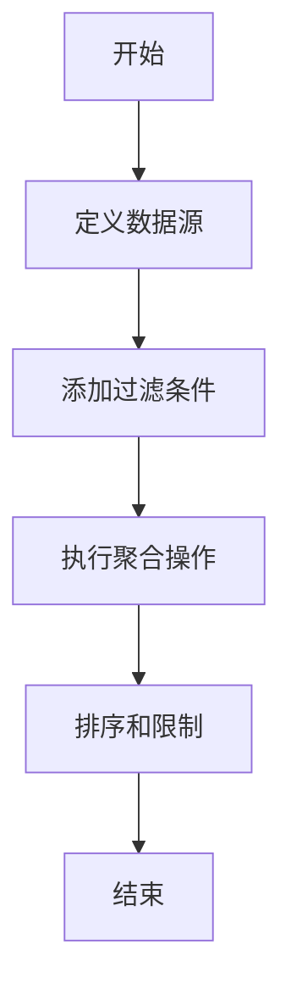
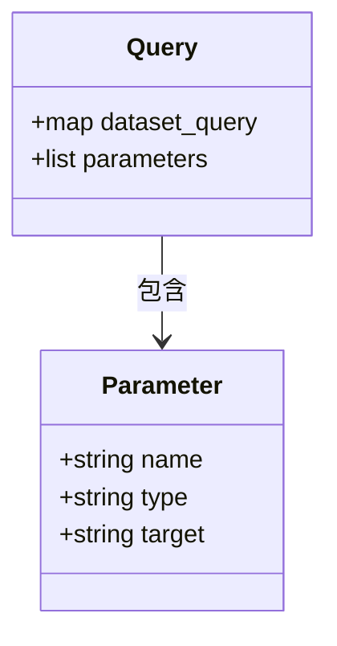
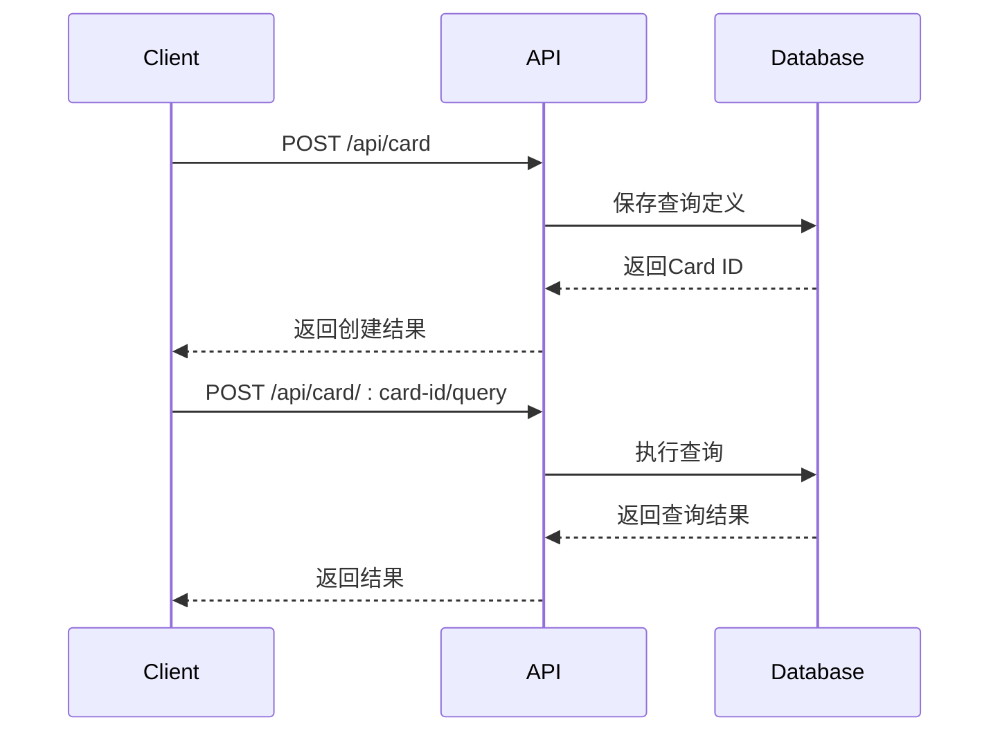

# 查询定义

<cite>
**本文档引用的文件**
- [card.cljc](file://src\metabase\lib\card.cljc)
- [card.clj](file://src\metabase\queries\card.clj)
- [metadata.clj](file://src\metabase\queries\models\card\metadata.clj)
- [schema.cljc](file://src\metabase\lib\schema.cljc)
- [schema.clj](file://src\metabase\queries\schema.clj)
- [card.clj](file://src\metabase\queries\api\card.clj)
</cite>

## 目录
1. [简介](#简介)
2. [Card模型与dataset_query结构](#card模型与dataset_query结构)
3. [MBQL查询语法](#mbql查询语法)
4. [原生SQL查询](#原生sql查询)
5. [查询参数](#查询参数)
6. [YAML序列化格式](#yaml序列化格式)
7. [查询模式验证](#查询模式验证)
8. [API操作](#api操作)
9. [结论](#结论)

## 简介
Metabase中的查询定义是其核心功能之一，它允许用户通过可视化界面或API创建和管理数据查询。本文档详细阐述了Card模型中的`dataset_query`字段结构，区分了MBQL和原生SQL查询格式，并深入探讨了MBQL查询的语法结构、查询参数的嵌入方式、YAML序列化格式以及查询模式验证机制。

## Card模型与dataset_query结构
在Metabase中，Card模型是查询定义的核心载体。`dataset_query`字段是Card模型中的关键属性，它包含了查询的完整定义。该字段可以包含MBQL（Metabase Query Language）或原生SQL查询。

`dataset_query`字段的结构遵循Malli schema定义，确保了查询的合法性和一致性。该字段的值是一个map，包含了查询的类型、数据库、阶段等信息。

**Section sources**
- [schema.cljc](file://src\metabase\lib\schema.cljc#L1-L523)
- [schema.clj](file://src\metabase\queries\schema.clj#L1-L74)

## MBQL查询语法
MBQL（Metabase Query Language）是一种高级查询语言，它允许用户通过声明式语法构建复杂的查询。MBQL查询由多个阶段（stages）组成，每个阶段可以包含不同的操作，如过滤、聚合、排序等。

### 数据源
MBQL查询的数据源通过`source-table`或`source-card`字段指定。`source-table`用于指定数据库表，而`source-card`用于指定另一个Card作为数据源。

### 过滤
过滤操作通过`filters`字段定义，支持多种条件，如等于、不等于、包含等。过滤条件可以嵌套，形成复杂的逻辑表达式。

### 聚合
聚合操作通过`aggregation`字段定义，支持常见的聚合函数，如计数、求和、平均值等。聚合结果可以作为后续阶段的输入。

**Diagram sources**
- [schema.cljc](file://src\metabase\lib\schema.cljc#L1-L523)

**Section sources**
- [schema.cljc](file://src\metabase\lib\schema.cljc#L1-L523)

## 原生SQL查询
除了MBQL，Metabase还支持原生SQL查询。原生SQL查询通过`native`字段定义，允许用户直接编写SQL语句。这种方式提供了更大的灵活性，但需要用户具备SQL知识。

原生SQL查询可以包含参数，这些参数在执行时会被替换为实际值。参数的使用使得查询更加动态和可重用。

**Section sources**
- [schema.cljc](file://src\metabase\lib\schema.cljc#L1-L523)

## 查询参数
查询参数是Metabase中实现动态查询的关键。参数可以在查询中以`{{param}}`的形式嵌入，执行时会被替换为用户提供的值。

### 参数类型
Metabase支持多种参数类型，包括：
- **字段过滤**：用于过滤特定字段的值。
- **文本**：用于插入文本值。
- **数字**：用于插入数值。

### 参数嵌入
参数通过`parameters`字段在Card模型中定义，并在`dataset_query`中引用。参数的值可以在执行查询时通过API传递。

**Diagram sources**
- [card.clj](file://src\metabase\queries\card.clj#L1-L73)
- [schema.clj](file://src\metabase\queries\schema.clj#L1-L74)

**Section sources**
- [card.clj](file://src\metabase\queries\card.clj#L1-L73)
- [schema.clj](file://src\metabase\queries\schema.clj#L1-L74)

## YAML序列化格式
Metabase支持将查询定义导出为YAML格式，便于版本控制和团队协作。YAML格式的查询定义包含了所有必要的信息，可以轻松地在不同环境中导入和导出。

YAML序列化格式不仅便于人工阅读，还支持自动化工具的处理，如CI/CD管道中的查询验证和部署。

**Section sources**
- [metadata.clj](file://src\metabase\queries\models\card\metadata.clj#L1-L247)

## 查询模式验证
为了确保查询定义的正确性，Metabase实现了查询模式验证机制。该机制基于Malli schema，对`dataset_query`字段进行验证，确保其符合预定义的结构和约束。

模式验证在查询创建和更新时自动执行，防止非法查询的保存。此外，API端点也会对传入的查询定义进行验证，确保数据的一致性和安全性。

**Section sources**
- [schema.cljc](file://src\metabase\lib\schema.cljc#L1-L523)
- [schema.clj](file://src\metabase\queries\schema.clj#L1-L74)

## API操作
Metabase提供了丰富的API，允许通过编程方式创建和修改查询定义。主要的API端点包括：

- **创建查询**：通过`POST /api/card`创建新的Card。
- **更新查询**：通过`PUT /api/card/:id`更新现有Card。
- **执行查询**：通过`POST /api/card/:card-id/query`执行查询并获取结果。

API操作支持传递参数，使得查询的动态执行成为可能。此外，API还支持批量操作，提高效率。

**Diagram sources**
- [card.clj](file://src\metabase\queries\api\card.clj#L1-L959)

**Section sources**
- [card.clj](file://src\metabase\queries\api\card.clj#L1-L959)

## 结论
Metabase的查询定义系统通过`dataset_query`字段实现了灵活且强大的数据查询功能。无论是通过MBQL的声明式语法还是原生SQL的直接编写，用户都可以轻松构建复杂的查询。查询参数和YAML序列化格式进一步增强了查询的动态性和可维护性。通过API操作，Metabase为自动化和集成提供了坚实的基础。