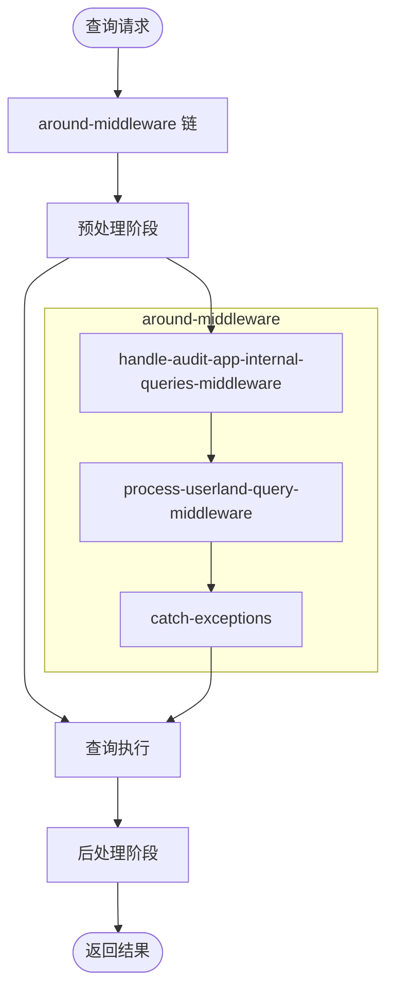
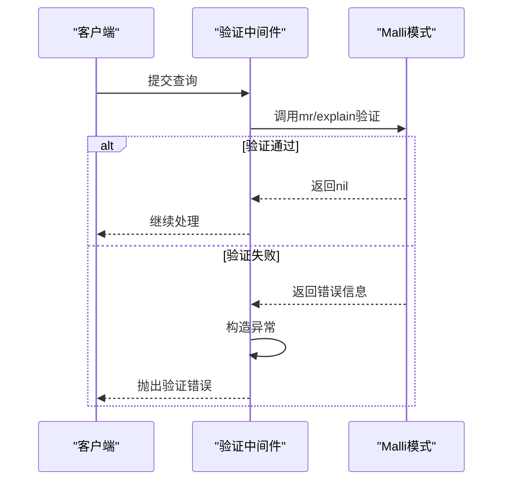
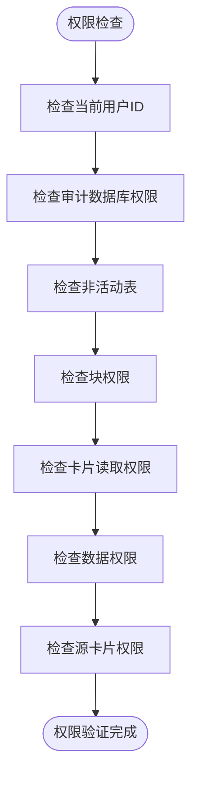
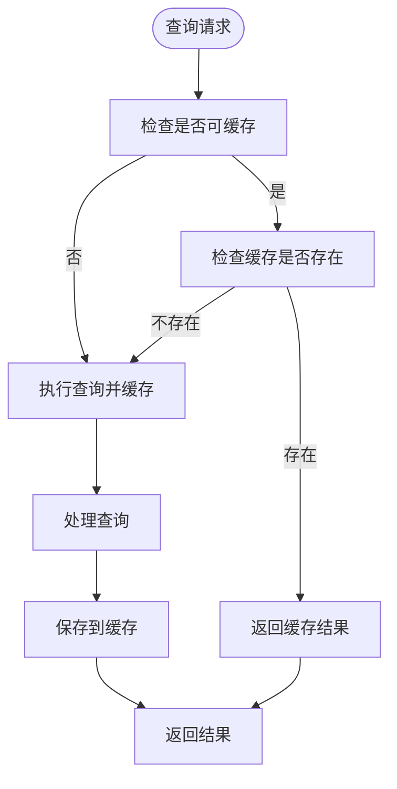
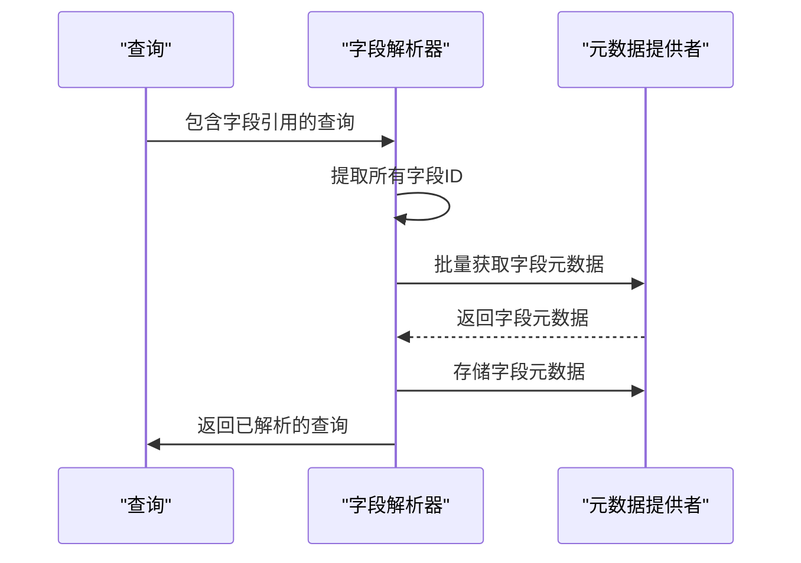
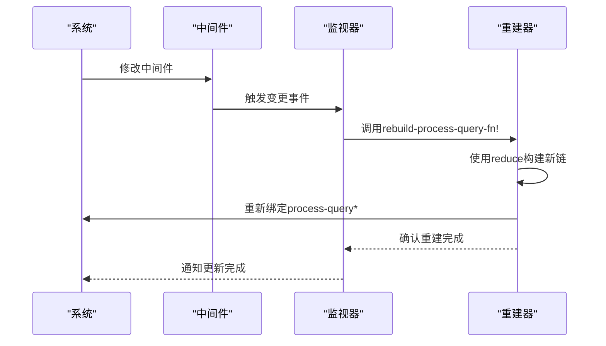
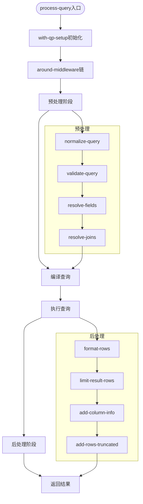

# 中间件机制

<cite>
**本文档中引用的文件**  
- [query_processor.clj](file://src/metabase/query_processor.clj)
- [preprocess.clj](file://src/metabase/query_processor/preprocess.clj)
- [postprocess.clj](file://src/metabase/query_processor/postprocess.clj)
- [middleware/validate.clj](file://src/metabase/query_processor/middleware/validate.clj)
- [middleware/permissions.clj](file://src/metabase/query_processor/middleware/permissions.clj)
- [middleware/cache.clj](file://src/metabase/query_processor/middleware/cache.clj)
- [middleware/resolve_fields.clj](file://src/metabase/query_processor/middleware/resolve_fields.clj)
- [setup.clj](file://src/metabase/query_processor/setup.clj)
</cite>

## 目录
1. [中间件机制概述](#中间件机制概述)
2. [around-middleware处理管道构建](#around-middleware处理管道构建)
3. [核心中间件实现分析](#核心中间件实现分析)
4. [中间件执行顺序与依赖关系](#中间件执行顺序与依赖关系)
5. [中间件注册与热重载机制](#中间件注册与热重载机制)
6. [查询处理流程中的中间件应用](#查询处理流程中的中间件应用)

## 中间件机制概述

Metabase查询处理器采用基于Clojure的函数式中间件架构，通过组合多个中间件函数构建查询处理管道。中间件机制允许在查询处理的不同阶段插入预处理和后处理逻辑，实现关注点分离和功能扩展。整个系统围绕`process-query`函数构建，通过`around-middleware`链式调用实现功能增强。

**Section sources**
- [query_processor.clj](file://src/metabase/query_processor.clj#L24-L52)

## around-middleware处理管道构建

`around-middleware`是Metabase查询处理器的核心机制，它构建了一个环绕`process-query`函数的处理管道。该机制采用函数式编程模式，通过高阶函数包装和转换查询处理函数。中间件的执行遵循"球体抛掷"模型：查询请求向上经过中间件链进行预处理，执行后结果向下返回时进行后处理。

处理管道的构建通过`rebuild-process-query-fn!`函数实现，该函数使用`reduce`将`around-middleware`列表中的每个中间件依次应用到基础查询处理函数上。每个中间件都接收下一个处理函数作为参数，并返回一个新的包装函数，从而形成嵌套的调用链。

**Diagram sources**
- [query_processor.clj](file://src/metabase/query_processor.clj#L24-L52)
- [query_processor.clj](file://src/metabase/query_processor.clj#L49-L82)

**Section sources**
- [query_processor.clj](file://src/metabase/query_processor.clj#L49-L82)

## 核心中间件实现分析

### 验证中间件(validate)

验证中间件负责在查询规范化后立即验证查询的合法性。它使用Malli库的模式验证功能检查查询结构是否符合定义的模式。如果验证失败，中间件会抛出包含详细错误信息的异常，阻止无效查询继续执行。

**Diagram sources**
- [middleware/validate.clj](file://src/metabase/query_processor/middleware/validate.clj#L0-L20)

**Section sources**
- [middleware/validate.clj](file://src/metabase/query_processor/middleware/validate.clj#L0-L20)

### 权限检查中间件(permissions)

权限检查中间件负责验证当前用户是否有权执行查询。它通过`check-query-permissions*`函数实现，该函数检查用户对查询涉及的数据库、表和卡片的访问权限。中间件还处理企业版的高级权限功能，如审计数据库访问控制和块权限检查。

**Diagram sources**
- [middleware/permissions.clj](file://src/metabase/query_processor/middleware/permissions.clj#L0-L202)

**Section sources**
- [middleware/permissions.clj](file://src/metabase/query_processor/middleware/permissions.clj#L0-L202)

### 缓存中间件(cache)

缓存中间件负责在适用时返回查询的缓存结果。查询必须满足多个条件才能被缓存：缓存功能已启用、传递了缓存策略、策略类型不是`nocache`、查询已通过权限检查，且结果行在序列化后小于`query-caching-max-kb`。

**Diagram sources**
- [middleware/cache.clj](file://src/metabase/query_processor/middleware/cache.clj#L0-L247)

**Section sources**
- [middleware/cache.clj](file://src/metabase/query_processor/middleware/cache.clj#L0-L247)

### 字段解析中间件(resolve-fields)

字段解析中间件负责解析查询中引用的所有字段。它通过`resolve-fields-with-ids!`函数批量获取字段元数据并存储在元数据提供者中。该中间件确保查询中引用的所有字段都已正确解析，为后续处理阶段提供完整的元数据信息。

**Diagram sources**
- [middleware/resolve_fields.clj](file://src/metabase/query_processor/middleware/resolve_fields.clj#L0-L38)

**Section sources**
- [middleware/resolve_fields.clj](file://src/metabase/query_processor/middleware/resolve_fields.clj#L0-L38)

## 中间件执行顺序与依赖关系

Metabase查询处理器的中间件执行顺序遵循严格的依赖关系，确保每个中间件在其依赖的前置条件都已满足的情况下执行。系统包含三种主要的中间件类型：around-middleware、预处理中间件和后处理中间件，它们在不同的处理阶段执行。

预处理中间件按从上到下的顺序执行，形成一个处理链。每个中间件都依赖于前一个中间件的输出，确保查询在进入下一个处理阶段前已正确转换。例如，查询规范化中间件必须在验证中间件之前执行，因为验证需要基于规范化的查询结构。

后处理中间件则按从下到上的顺序执行，形成一个结果转换链。这些中间件负责格式化结果、添加元数据、限制行数等操作，确保最终返回给客户端的结果符合预期格式。

**Diagram sources**
- [preprocess.clj](file://src/metabase/query_processor/preprocess.clj#L37-L69)
- [postprocess.clj](file://src/metabase/query_processor/postprocess.clj#L21-L57)

**Section sources**
- [preprocess.clj](file://src/metabase/query_processor/preprocess.clj#L37-L69)
- [postprocess.clj](file://src/metabase/query_processor/postprocess.clj#L21-L57)

## 中间件注册与热重载机制

Metabase实现了动态中间件注册和热重载机制，允许在运行时修改中间件配置并立即生效。该机制通过`add-watch`函数监听中间件变量的变化，当检测到变化时自动重建处理函数链。

`rebuild-process-query-fn!`函数是热重载机制的核心，它使用`alter-var-root`重新绑定`process-query*`变量，创建一个新的处理函数链。这个过程确保了所有后续查询都会使用更新后的中间件配置，而无需重启服务。

热重载机制的实现确保了系统的灵活性和可维护性，开发人员可以在不中断服务的情况下调整查询处理逻辑。每个中间件变量都设置了监视器，当其状态发生变化时，系统会记录日志并触发处理链的重建。

**Diagram sources**
- [query_processor.clj](file://src/metabase/query_processor.clj#L49-L82)

**Section sources**
- [query_processor.clj](file://src/metabase/query_processor.clj#L49-L82)

## 查询处理流程中的中间件应用

在完整的查询处理流程中，各种中间件协同工作，确保查询从接收到执行再到结果返回的每个阶段都得到正确处理。流程开始于`process-query`函数，该函数作为主要入口点，通过`with-qp-setup`宏确保查询处理器的必要设置已正确初始化。

查询首先经过`setup-middleware`链，该链负责解析数据库ID、绑定驱动程序、设置元数据提供者等初始化工作。然后查询进入`around-middleware`链，经历预处理、执行和后处理三个主要阶段。

在整个处理流程中，中间件机制提供了高度的模块化和可扩展性。每个中间件都专注于单一职责，通过组合这些中间件，系统能够处理复杂的查询场景，同时保持代码的清晰和可维护性。

**Section sources**
- [setup.clj](file://src/metabase/query_processor/setup.clj#L0-L257)
- [query_processor.clj](file://src/metabase/query_processor.clj#L24-L52)