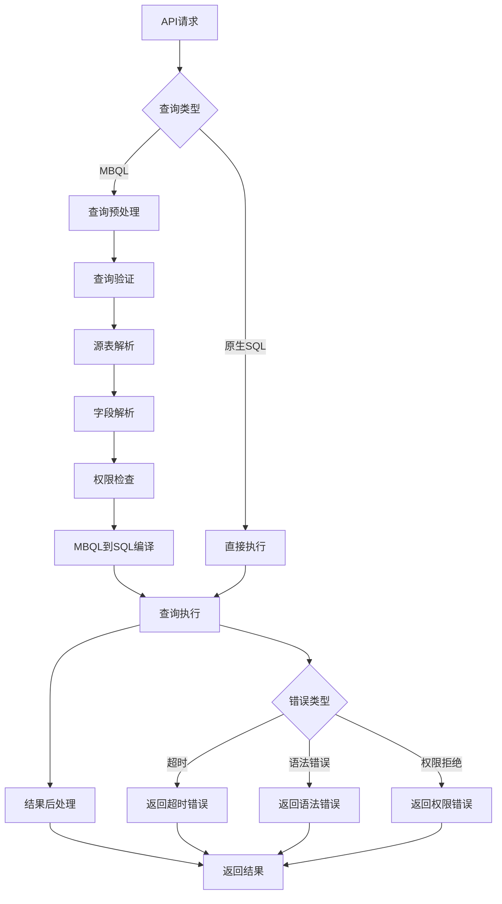

# 查询执行流程

<cite>
**本文档中引用的文件**  
- [query_processor.clj](file://src/metabase/query_processor.clj)
- [preprocess.clj](file://src/metabase/query_processor/preprocess.clj)
- [compile.clj](file://src/metabase/query_processor/compile.clj)
- [execute.clj](file://src/metabase/query_processor/execute.clj)
- [postprocess.clj](file://src/metabase/query_processor/postprocess.clj)
- [setup.clj](file://src/metabase/query_processor/setup.clj)
- [pipeline.clj](file://src/metabase/query_processor/pipeline.clj)
- [error_type.clj](file://src/metabase/query_processor/error_type.clj)
- [permissions.clj](file://src/metabase/query_processor/middleware/permissions.clj)
- [resolve_source_table.clj](file://src/metabase/query_processor/middleware/resolve_source_table.clj)
- [validate.clj](file://src/metabase/query_processor/middleware/validate.clj)
- [execute.clj](file://src/metabase/driver/sql_jdbc/execute.clj)
- [connection.clj](file://src/metabase/driver/sql_jdbc/connection.clj)
</cite>

## 目录
1. [引言](#引言)
2. [查询执行上下文构建](#查询执行上下文构建)
3. [中间件管道处理机制](#中间件管道处理机制)
4. [MBQL到SQL的编译过程](#mbql到sql的编译过程)
5. [原生查询执行机制](#原生查询执行机制)
6. [错误处理策略](#错误处理策略)
7. [完整数据流流程图](#完整数据流流程图)

## 引言
Metabase查询执行流程是一个复杂的多阶段处理系统，从API请求进入开始，经过一系列中间件处理、查询编译、权限检查和结果后处理，最终返回查询结果。该流程的核心是查询处理器（Query Processor），它通过精心设计的中间件管道来处理MBQL（Metabase Query Language）查询，并将其转换为数据库可执行的原生SQL语句。本文档将深入解析这一完整流程，重点关注中间件的执行顺序和作用、MBQL到SQL的编译过程、查询执行上下文的构建以及错误处理策略。

## 查询执行上下文构建
查询执行上下文的构建是查询处理的第一步，它为后续的查询执行提供了必要的环境和配置。在Metabase中，这一过程主要通过`setup.clj`文件中的`with-qp-setup`宏来实现。该宏负责解析和绑定查询所需的各项设置，包括数据库连接、驱动程序、元数据提供者和取消通道等。

上下文构建过程遵循特定的中间件顺序，从底部到顶部依次执行。首先，`do-with-resolved-database`中间件负责解析查询中的数据库ID，特别是处理虚拟数据库ID（如保存问题的虚拟数据库ID）并将其转换为实际的数据库ID。接着，`do-with-metadata-provider`中间件为查询附加元数据提供者，以便在查询处理过程中能够访问数据库的元数据信息。然后，`do-with-driver`中间件根据查询的数据库ID确定并绑定相应的驱动程序。`do-with-database-local-settings`中间件负责处理数据库本地设置，而`do-with-canceled-chan`中间件则创建一个取消通道，用于在查询执行过程中检测和处理取消请求。

这种分层的上下文构建机制确保了查询执行环境的完整性和一致性，为后续的查询处理奠定了基础。通过这种方式，Metabase能够在执行查询之前，预先准备好所有必要的资源和配置，从而提高查询执行的效率和可靠性。

**Section sources**
- [setup.clj](file://src/metabase/query_processor/setup.clj#L220-L257)

## 中间件管道处理机制
Metabase的查询处理器采用了一种基于中间件管道的处理机制，将查询处理过程分解为多个独立的、可组合的中间件函数。这些中间件按照特定的顺序执行，每个中间件负责处理查询的某个特定方面，如查询验证、源表解析、字段解析和权限检查等。

查询处理的中间件管道主要分为三个阶段：预处理、执行和后处理。预处理阶段的中间件在`preprocess.clj`文件中定义，按照从上到下的顺序执行。这一阶段包括查询规范化、权限键移除、约束添加、查询验证、源卡片解析、字段删除、聚合扩展、参数替换、源表解析、日期时间自动分桶、权限应用、持久化查询替换、隐式子句添加、连接解析、字段解析、分箱策略更新、去糖化、默认时间单位添加、隐式连接添加、坏字段ID修复、非活动字段引用移除、累积聚合重写、值字面量包装、过滤值自动解析、时间分桶验证、时间过滤优化、默认限制添加和功能检查等。

执行阶段的中间件在`execute.clj`文件中定义，包括目标数据库交换、模拟应用后处理、更新使用卡片、添加原生形式到结果元数据、缓存结果、查询权限检查等。后处理阶段的中间件在`postprocess.clj`文件中定义，按照从下到上的顺序执行，包括行格式化、记录和返回元数据、结果行限制、添加截断行、添加时区信息、合并沙箱元数据、结果重映射、透视导出数据添加、大整数转换为字符串、可视化设置更新、累积聚合列求和、添加列信息和添加数据集信息等。

这种模块化的中间件设计使得查询处理过程高度可扩展和可维护，每个中间件都可以独立开发和测试，同时通过简单的组合就能构建复杂的查询处理逻辑。

**Section sources**
- [preprocess.clj](file://src/metabase/query_processor/preprocess.clj#L37-L69)
- [execute.clj](file://src/metabase/query_processor/execute.clj#L30-L37)
- [postprocess.clj](file://src/metabase/query_processor/postprocess.clj#L10-L17)

## MBQL到SQL的编译过程
MBQL到SQL的编译过程是Metabase查询执行的核心环节，它将高级的MBQL查询语言转换为数据库可执行的原生SQL语句。这一过程主要在`compile.clj`文件中实现，通过`compile`和`compile-preprocessed`函数完成。

编译过程首先检查查询是否已经是原生查询。如果是，则直接返回查询的原生形式；否则，调用驱动程序的`mbql->native`方法将MBQL查询转换为原生查询。在转换之前，查询必须经过预处理阶段，确保所有MBQL特性都被正确解析和扩展。编译过程中会创建一个包含查询和参数的映射，其中查询字段存储SQL语句，参数字段存储准备语句的参数。

编译过程还负责处理参数内联，即将准备语句的参数直接插入到SQL查询中作为字面量。这在某些场景下非常有用，例如将问题转换为SQL时。编译结果会被附加到查询的`:qp/compiled`键下，以便在后续的执行阶段使用。如果查询是纯MBQL查询，则还会创建一个参数内联版本的编译结果，存储在`:qp/compiled-inline`键下。

整个编译过程被设计为可扩展的，不同的数据库驱动程序可以提供自己的`mbql->native`实现，以支持特定数据库的SQL方言和特性。这种设计使得Metabase能够支持多种数据库，同时保持查询编译逻辑的一致性和可维护性。

**Section sources**
- [compile.clj](file://src/metabase/query_processor/compile.clj#L74-L96)

## 原生查询执行机制
原生查询执行机制是Metabase与底层数据库交互的关键部分，它负责将编译后的SQL查询发送到数据库并获取结果。这一机制主要在`sql_jdbc/execute.clj`文件中实现，通过一系列多方法（multimethods）来支持不同数据库的执行需求。

执行过程从`execute-reducible-query`函数开始，该函数接收驱动程序、查询、上下文和响应回调作为参数。首先，它根据查询的上下文确定是否为下载操作，并相应地设置连接选项。然后，通过`do-with-connection-with-options`多方法获取数据库连接，该方法会根据驱动程序和数据库类型创建适当的连接池和连接配置。

获取连接后，执行器会根据查询是否有参数决定使用`PreparedStatement`还是`Statement`。对于有参数的查询，使用`prepared-statement`多方法创建准备语句，并通过`set-parameter`多方法设置参数值。对于无参数的查询，则使用`statement`多方法创建普通语句。执行器还会设置结果集的获取方向和大小，以优化查询性能。

查询执行通过`execute-prepared-statement!`或`execute-statement!`多方法完成，返回一个`ResultSet`对象。然后，通过`column-metadata`多方法获取结果集的元数据，包括列名、数据库类型和基本类型等信息。最后，使用`reducible-rows`函数创建一个可还原的结果行集合，该集合可以通过还原函数逐行处理结果，从而实现内存高效的流式处理。

整个执行机制被设计为异步和可取消的，通过取消通道（canceled-chan）可以在查询执行过程中检测到取消请求并及时终止查询，避免资源浪费。

**Section sources**
- [execute.clj](file://src/metabase/driver/sql_jdbc/execute.clj#L800-L970)
- [connection.clj](file://src/metabase/driver/sql_jdbc/connection.clj#L300-L382)

## 错误处理策略
Metabase的错误处理策略是其查询执行流程的重要组成部分，它确保了系统在遇到各种错误情况时能够提供有意义的反馈并保持稳定性。错误处理主要在`error_type.clj`文件中定义，通过一个层次化的错误类型系统来分类和处理不同类型的错误。

错误类型系统分为客户端错误和服务器端错误两大类。客户端错误（client）相当于HTTP 4xx状态码，表示查询本身存在问题，如缺少必需权限、无效查询、缺少必需参数、无效参数、不支持的特性或禁用的特性等。服务器端错误（server）相当于HTTP 5xx状态码，表示意外的服务器错误，如查询超时、查询处理器错误、驱动程序错误或数据仓库错误等。

查询处理器通过`catch-exceptions`中间件来捕获和处理异常。当查询执行过程中抛出异常时，该中间件会根据异常的类型和上下文生成适当的错误响应。对于用户查询，异常会被捕获并转换为包含错误类型和消息的特殊错误形状，而不是直接向用户暴露原始异常。这有助于保护系统安全，防止敏感信息泄露。

此外，Metabase还实现了细粒度的权限检查和验证机制，能够在查询执行的早期阶段检测到潜在的错误情况，如访问非活动表、缺少必需参数或权限不足等，并提前返回相应的错误响应。这种预防性的错误处理策略不仅提高了系统的健壮性，还改善了用户体验，使用户能够更快地识别和修复查询问题。

**Section sources**
- [error_type.clj](file://src/metabase/query_processor/error_type.clj#L0-L102)
- [permissions.clj](file://src/metabase/query_processor/middleware/permissions.clj#L71-L99)

## 完整数据流流程图

**Diagram sources**
- [query_processor.clj](file://src/metabase/query_processor.clj#L0-L116)
- [preprocess.clj](file://src/metabase/query_processor/preprocess.clj#L0-L158)
- [compile.clj](file://src/metabase/query_processor/compile.clj#L0-L96)
- [execute.clj](file://src/metabase/query_processor/execute.clj#L0-L99)
- [postprocess.clj](file://src/metabase/query_processor/postprocess.clj#L0-L65)
- [error_type.clj](file://src/metabase/query_processor/error_type.clj#L0-L102)

**Section sources**
- [query_processor.clj](file://src/metabase/query_processor.clj#L0-L116)