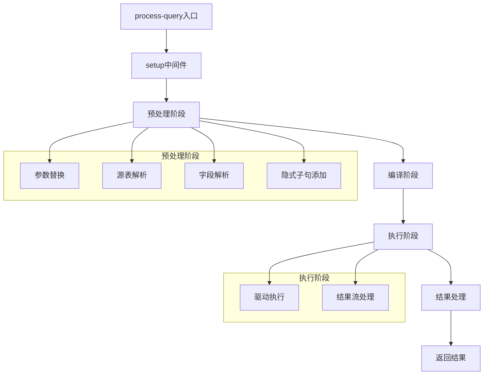
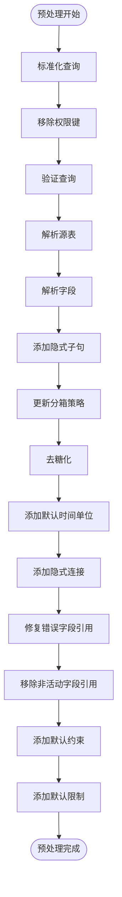
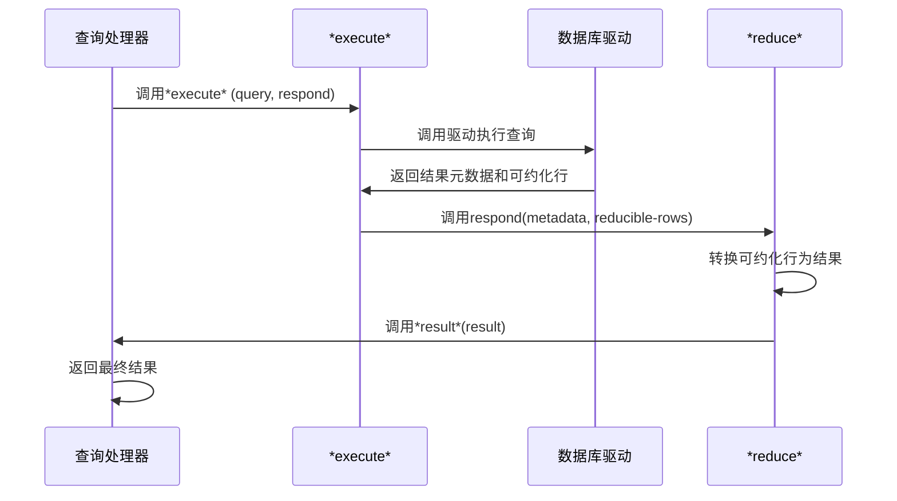
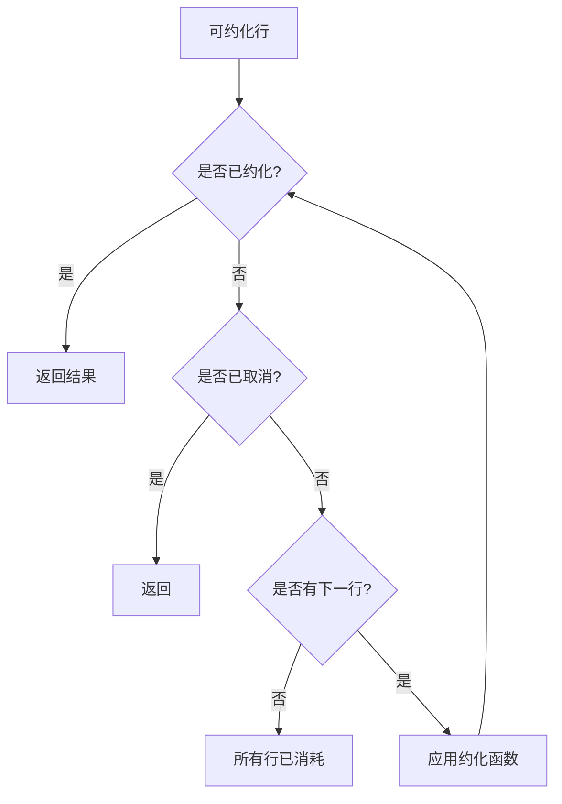
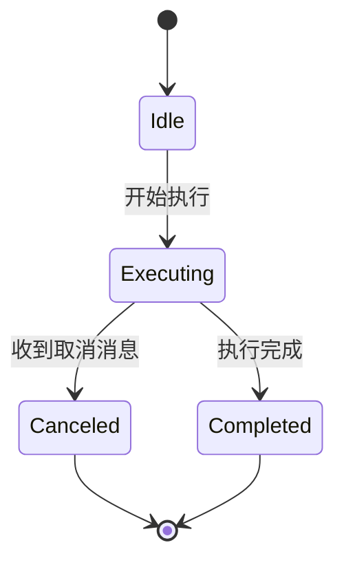
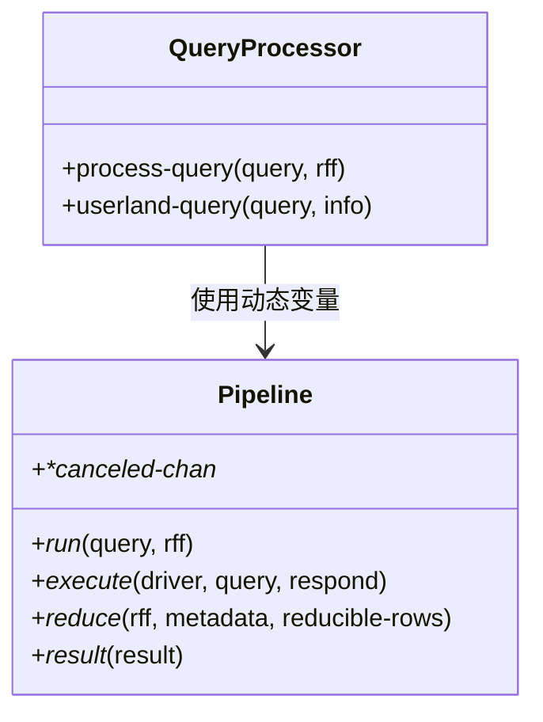

# 查询执行管道

<cite>
**本文档中引用的文件**  
- [query_processor.clj](file://src/metabase/query_processor.clj)
- [pipeline.clj](file://src/metabase/query_processor/pipeline.clj)
- [preprocess.clj](file://src/metabase/query_processor/preprocess.clj)
- [execute.clj](file://src/metabase/query_processor/execute.clj)
- [reducible.clj](file://src/metabase/query_processor/reducible.clj)
- [setup.clj](file://src/metabase/query_processor/setup.clj)
- [compile.clj](file://src/metabase/query_processor/compile.clj)
- [parameters.clj](file://src/metabase/query_processor/middleware/parameters.clj)
- [resolve_source_table.clj](file://src/metabase/query_processor/middleware/resolve_source_table.clj)
- [resolve_fields.clj](file://src/metabase/query_processor/middleware/resolve_fields.clj)
- [add_implicit_clauses.clj](file://src/metabase/query_processor/middleware/add_implicit_clauses.clj)
- [app_db\query_cancelation.clj](file://src/metabase/app_db/query_cancelation.clj)
- [schema.clj](file://src/metabase/query_processor/schema.clj)
</cite>

## 目录
1. [简介](#简介)
2. [查询执行管道概览](#查询执行管道概览)
3. [预处理阶段](#预处理阶段)
4. [执行阶段](#执行阶段)
5. [结果处理与流式传输](#结果处理与流式传输)
6. [查询取消机制](#查询取消机制)
7. [动态变量协调](#动态变量协调)
8. [数据结构转换示例](#数据结构转换示例)

## 简介
Metabase的查询执行管道是一个复杂的处理流程，负责将用户提交的MBQL查询转换为数据库可执行的原生查询，并返回结果。该管道从`process-query`入口开始，通过一系列中间件链对查询进行预处理、编译、执行和后处理。本文档详细描述了这一完整流程，重点分析了预处理阶段的查询预处理顺序、执行阶段的数据库驱动执行机制、结果流的reducible处理方式、查询取消的支持机制以及通过动态变量协调执行流程的方法。

## 查询执行管道概览



**Diagram sources**
- [query_processor.clj](file://src/metabase/query_processor.clj#L24-L52)
- [pipeline.clj](file://src/metabase/query_processor/pipeline.clj#L49-L82)

**Section sources**
- [query_processor.clj](file://src/metabase/query_processor.clj#L24-L82)
- [pipeline.clj](file://src/metabase/query_processor/pipeline.clj#L49-L82)

## 预处理阶段

预处理阶段是查询执行管道的关键环节，它通过一系列中间件对查询进行转换和优化。这些中间件按照特定顺序执行，确保查询在编译前处于正确的状态。



**Diagram sources**
- [preprocess.clj](file://src/metabase/query_processor/preprocess.clj#L121-L143)
- [middleware/parameters.clj](file://src/metabase/query_processor/middleware/parameters.clj#L100-L120)
- [middleware/resolve_source_table.clj](file://src/metabase/query_processor/middleware/resolve_source_table.clj#L10-L13)
- [middleware/resolve_fields.clj](file://src/metabase/query_processor/middleware/resolve_fields.clj#L30-L37)
- [middleware/add_implicit_clauses.clj](file://src/metabase/query_processor/middleware/add_implicit_clauses.clj#L80-L93)

**Section sources**
- [preprocess.clj](file://src/metabase/query_processor/preprocess.clj#L121-L143)
- [middleware/parameters.clj](file://src/metabase/query_processor/middleware/parameters.clj#L100-L120)
- [middleware/resolve_source_table.clj](file://src/metabase/query_processor/middleware/resolve_source_table.clj#L10-L13)
- [middleware/resolve_fields.clj](file://src/metabase/query_processor/middleware/resolve_fields.clj#L30-L37)
- [middleware/add_implicit_clauses.clj](file://src/metabase/query_processor/middleware/add_implicit_clauses.clj#L80-L93)

### 参数替换
参数替换中间件负责将查询中的参数占位符替换为实际值。它处理两种类型的参数：MBQL查询中的参数和原生查询中的模板标签。

**Section sources**
- [middleware/parameters.clj](file://src/metabase/query_processor/middleware/parameters.clj#L100-L120)

### 源表解析
源表解析中间件负责解析查询中引用的源表，将其从表ID转换为完整的表元数据对象，并存储在查询处理器的元数据提供者中。

**Section sources**
- [middleware/resolve_source_table.clj](file://src/metabase/query_processor/middleware/resolve_source_table.clj#L10-L13)

### 字段解析
字段解析中间件负责解析查询中引用的所有字段，包括直接引用的字段和通过表达式间接引用的字段。它确保所有引用的字段都存在于元数据提供者中。

**Section sources**
- [middleware/resolve_fields.clj](file://src/metabase/query_processor/middleware/resolve_fields.clj#L30-L37)

### 隐式子句添加
隐式子句添加中间件负责为查询添加必要的隐式子句，如字段列表和排序子句。当查询没有明确指定字段且没有聚合或分组时，它会自动添加所有可用字段。

**Section sources**
- [middleware/add_implicit_clauses.clj](file://src/metabase/query_processor/middleware/add_implicit_clauses.clj#L80-L93)

## 执行阶段

执行阶段负责将编译后的查询交给数据库驱动执行，并处理返回的结果流。这个阶段通过`*execute*`动态变量协调执行流程。



**Diagram sources**
- [pipeline.clj](file://src/metabase/query_processor/pipeline.clj#L49-L82)
- [execute.clj](file://src/metabase/query_processor/execute.clj#L70-L99)

**Section sources**
- [pipeline.clj](file://src/metabase/query_processor/pipeline.clj#L49-L82)
- [execute.clj](file://src/metabase/query_processor/execute.clj#L70-L99)

## 结果处理与流式传输

结果处理阶段使用reducible机制处理查询结果流，允许在不将所有结果加载到内存的情况下进行处理。



**Diagram sources**
- [reducible.clj](file://src/metabase/query_processor/reducible.clj#L50-L80)
- [pipeline.clj](file://src/metabase/query_processor/pipeline.clj#L49-L82)

**Section sources**
- [reducible.clj](file://src/metabase/query_processor/reducible.clj#L50-L80)
- [pipeline.clj](file://src/metabase/query_processor/pipeline.clj#L49-L82)

## 查询取消机制

查询取消机制通过`*canceled-chan*`通道支持查询取消功能。当HTTP连接关闭时，系统会向该通道发送消息，通知查询执行可以安全终止。



**Diagram sources**
- [pipeline.clj](file://src/metabase/query_processor/pipeline.clj#L10-L25)
- [app_db\query_cancelation.clj](file://src/metabase/app_db/query_cancelation.clj#L10-L30)

**Section sources**
- [pipeline.clj](file://src/metabase/query_processor/pipeline.clj#L10-L25)
- [app_db\query_cancelation.clj](file://src/metabase/app_db/query_cancelation.clj#L10-L30)

## 动态变量协调

查询执行管道使用多个动态变量来协调执行流程，包括`*run*`、`*execute*`、`*reduce*`和`*result*`。



**Diagram sources**
- [pipeline.clj](file://src/metabase/query_processor/pipeline.clj#L10-L82)
- [query_processor.clj](file://src/metabase/query_processor.clj#L24-L52)

**Section sources**
- [pipeline.clj](file://src/metabase/query_processor/pipeline.clj#L10-L82)
- [query_processor.clj](file://src/metabase/query_processor.clj#L24-L52)

## 数据结构转换示例

以下是查询在管道中各阶段的数据结构变换示例：

```mermaid
graph LR
A[原始查询] --> B[预处理后查询]
B --> C[编译后查询]
C --> D[执行结果]
subgraph "数据结构"
A1["{:database 1, :type :query, :query {:source-table 2}}"]
B1["{:database 1, :type :query, :query {:source-table {:id 2, ...}, :fields [...], :order-by [...]}}"]
C1["{:native {:query \"SELECT * FROM table WHERE id = ?\", :params [1]}}"]
D1["{:data {:cols [...], :rows [...]}, :row_count 100, :status :completed}"]
end
A --> A1
B --> B1
C --> C1
D --> D1
```

**Diagram sources**
- [preprocess.clj](file://src/metabase/query_processor/preprocess.clj#L121-L143)
- [compile.clj](file://src/metabase/query_processor/compile.clj#L80-L96)
- [reducible.clj](file://src/metabase/query_processor/reducible.clj#L10-L30)
- [schema.clj](file://src/metabase/query_processor/schema.clj#L50-L80)

**Section sources**
- [preprocess.clj](file://src/metabase/query_processor/preprocess.clj#L121-L143)
- [compile.clj](file://src/metabase/query_processor/compile.clj#L80-L96)
- [reducible.clj](file://src/metabase/query_processor/reducible.clj#L10-L30)
- [schema.clj](file://src/metabase/query_processor/schema.clj#L50-L80)