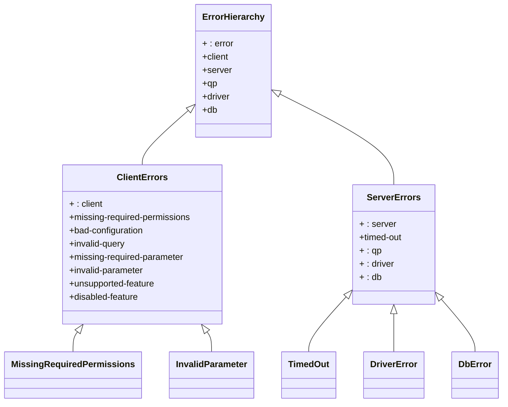
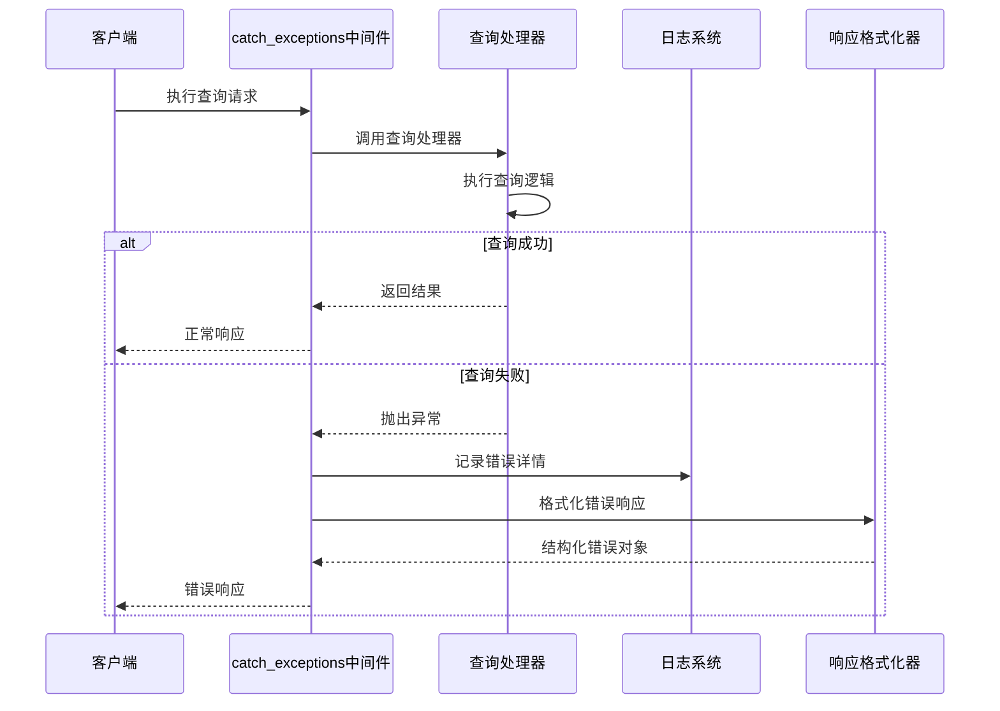
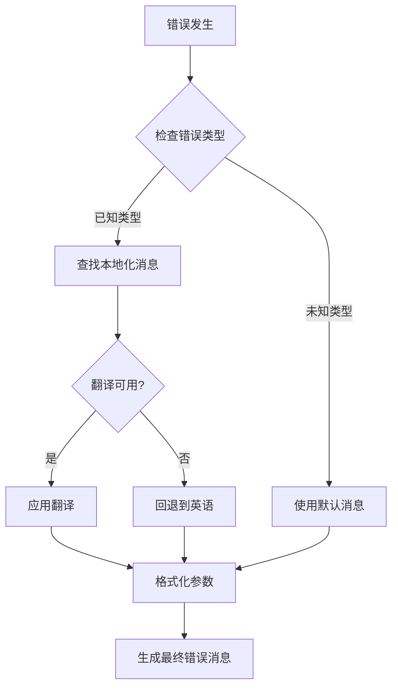
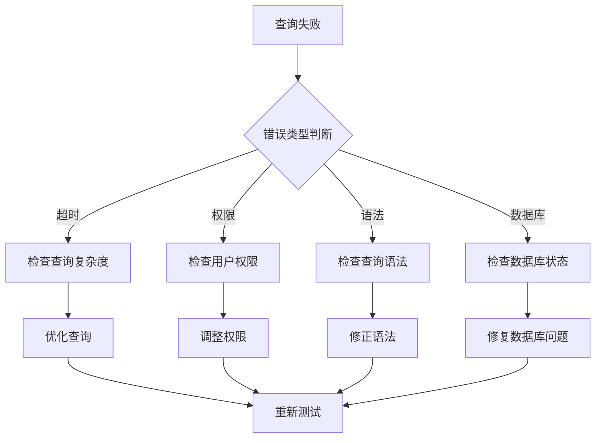
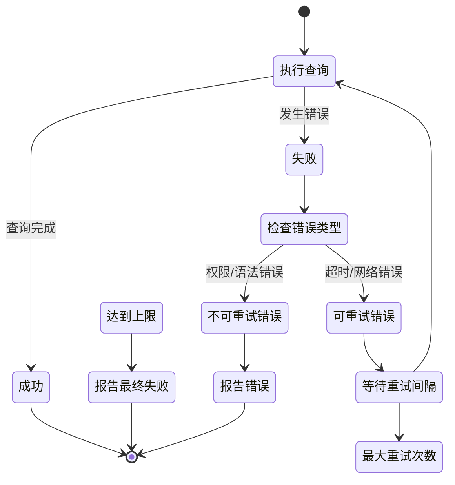

# 错误处理策略

<cite>
**本文档中引用的文件**
- [error_type.clj](file://src/metabase/query_processor/error_type.clj)
- [catch_exceptions.clj](file://src/metabase/query_processor/middleware/catch_exceptions.clj)
- [exceptions.clj](file://src/metabase/server/middleware/exceptions.clj)
- [execute.clj](file://src/metabase/query_processor/execute.clj)
- [impl.clj](file://src/metabase/util/i18n/impl.clj)
- [log.clj](file://src/metabase/util/log.clj)
- [ddl.clj](file://src/metabase/driver/mysql/ddl.clj)
- [actions.clj](file://src/metabase/driver/sql_jdbc/actions.clj)
- [query_processor.clj](file://src/metabase/query_processor.clj)
</cite>

## 目录
1. [概述](#概述)
2. [错误类型层次结构](#错误类型层次结构)
3. [catch_exceptions中间件架构](#catch_exceptions中间件架构)
4. [错误分类与处理策略](#错误分类与处理策略)
5. [本地化处理机制](#本地化处理机制)
6. [日志记录与监控](#日志记录与监控)
7. [常见查询错误诊断](#常见查询错误诊断)
8. [错误恢复与重试策略](#错误恢复与重试策略)
9. [最佳实践与建议](#最佳实践与建议)

## 概述

Metabase的查询执行系统采用分层的错误处理策略，通过多层次的中间件和专门的错误类型系统来确保查询失败时能够提供清晰、结构化的错误响应。该系统的核心特点包括：

- **分层错误处理**：从底层驱动程序到上层API的完整错误链路处理
- **结构化错误响应**：统一的错误格式，包含状态码、错误类型和详细信息
- **智能错误分类**：基于错误类型的自动分类和处理策略
- **本地化支持**：多语言错误消息和用户友好的错误提示
- **详细日志记录**：完整的错误堆栈和上下文信息记录

## 错误类型层次结构

Metabase定义了一套完整的错误类型层次结构，用于对不同类型的查询错误进行分类和处理。



**图表来源**
- [error_type.clj](file://src/metabase/query_processor/error_type.clj#L29-L100)

### 客户端错误（Client Errors）

客户端错误表示与查询本身或用户输入相关的错误，通常对应HTTP 4xx状态码：

| 错误类型 | 描述 | 显示嵌入式 | 状态码 |
|---------|------|-----------|--------|
| `missing-required-permissions` | 用户缺少运行查询所需的权限 | 否 | 403 |
| `bad-configuration` | 配置问题阻止查询执行 | 否 | 400 |
| `invalid-query` | 查询结构无效 | 否 | 400 |
| `missing-required-parameter` | 缺少必需的参数 | 是 | 400 |
| `invalid-parameter` | 参数值无效 | 是 | 400 |
| `unsupported-feature` | 使用数据库不支持的功能 | 是 | 400 |
| `disabled-feature` | 全局禁用的功能 | 是 | 400 |

### 服务器端错误（Server Errors）

服务器端错误表示意外的系统级错误，通常对应HTTP 5xx状态码：

| 错误类型 | 描述 | 显示嵌入式 | 状态码 |
|---------|------|-----------|--------|
| `timed-out` | 查询在超时前未返回结果 | 是 | 504 |
| `qp` | 查询处理器中的意外错误 | 否 | 500 |
| `driver` | 驱动程序相关错误 | 否 | 500 |
| `db` | 数据库返回的意外错误 | 否 | 500 |

**节来源**
- [error_type.clj](file://src/metabase/query_processor/error_type.clj#L29-L100)

## catch_exceptions中间件架构

catch_exceptions中间件是查询处理器中负责捕获和格式化异常的核心组件。



**图表来源**
- [catch_exceptions.clj](file://src/metabase/query_processor/middleware/catch_exceptions.clj#L125-L151)

### 异常捕获流程

catch_exceptions中间件的工作流程包括以下关键步骤：

1. **异常检测**：识别查询处理器抛出的任何异常
2. **异常链分析**：提取完整的异常链信息
3. **最佳错误选择**：从异常链中选择最有用的错误消息
4. **错误类型提取**：从异常数据中提取错误类型信息
5. **响应格式化**：将异常转换为标准化的错误响应格式
6. **日志记录**：记录详细的错误信息供调试使用

### 异常响应格式

catch_exceptions中间件将异常转换为以下结构的响应：

```clojure
{
  :status :failed
  :class Throwable类名
  :error 错误消息
  :stacktrace 过滤后的堆栈跟踪
  :error_type 可选的错误类型
  :error_is_curated 可选的已审核标志
  :ex-data 异常数据
  :via 异常链（如果有）
  :json_query 查询信息
  :preprocessed 预处理查询（MBQL查询）
  :native 原生查询（如果用户有权限）
}
```

**节来源**
- [catch_exceptions.clj](file://src/metabase/query_processor/middleware/catch_exceptions.clj#L65-L94)

## 错误分类与处理策略

### 超时错误（Timeout Errors）

超时错误是最常见的查询执行错误之一，通常由以下情况引起：

- 查询复杂度高，需要较长时间执行
- 数据库连接不稳定或网络延迟
- 数据量过大导致查询性能下降

**处理策略**：
- 设置合理的查询超时时间
- 实现查询取消机制
- 提供用户友好的超时错误消息

### 权限错误（Permission Errors）

权限错误发生在用户尝试执行没有足够权限的操作时：

- 缺少数据库访问权限
- 查询涉及受保护的数据表
- 用户角色限制

**处理策略**：
- 实现细粒度的权限检查
- 提供清晰的权限不足提示
- 支持权限申请流程

### 语法错误（Syntax Errors）

语法错误通常在查询编译阶段被发现：

- SQL语法不正确
- 字段名称不存在
- 表结构不匹配

**处理策略**：
- 提供详细的语法错误位置信息
- 给出可能的修复建议
- 支持语法高亮和验证

### 数据库错误（Database Errors）

数据库错误由底层数据库系统引发：

- 连接断开
- 索引失效
- 存储空间不足

**处理策略**：
- 实现数据库连接池管理
- 提供数据库健康检查
- 支持故障转移机制

**节来源**
- [ddl.clj](file://src/metabase/driver/mysql/ddl.clj#L35-L68)
- [actions.clj](file://src/metabase/driver/sql_jdbc/actions.clj#L56-L79)

## 本地化处理机制

Metabase的错误处理系统集成了完整的国际化支持，能够根据用户的语言偏好提供相应的错误消息。



**图表来源**
- [impl.clj](file://src/metabase/util/i18n/impl.clj#L175-L220)

### 本地化实现机制

1. **消息资源管理**：维护多语言的消息资源文件
2. **动态语言切换**：根据用户设置动态选择语言
3. **参数化消息**：支持带参数的可变错误消息
4. **回退机制**：当特定语言不可用时回退到英语

### 常见本地化错误消息

| 错误类型 | 英文消息 | 中文翻译示例 |
|---------|---------|-------------|
| `timed-out` | Query timed out | 查询超时 |
| `missing-required-permissions` | You don't have permission to run this query | 您没有权限运行此查询 |
| `invalid-parameter` | Parameter {0} has an invalid value | 参数 {0} 的值无效 |
| `unsupported-feature` | This feature is not supported by the database | 数据库不支持此功能 |

**节来源**
- [impl.clj](file://src/metabase/util/i18n/impl.clj#L175-L220)

## 日志记录与监控

### 结构化日志记录

Metabase使用结构化的日志记录系统来捕获和分析错误信息：

```clojure
{
  :timestamp "2024-01-15T10:30:00Z"
  :level "ERROR"
  :logger "metabase.query-processor.middleware.catch-exceptions"
  :message "Error processing query: Error running query"
  :exception {
    :class "java.sql.SQLException"
    :error "Connection refused"
    :stacktrace [...]
  }
  :query-info {...}
  :user-id 123
  :database-id 456
}
```

### 监控指标

系统监控以下关键指标：

- **查询成功率**：成功执行的查询百分比
- **错误分布**：按错误类型统计的错误分布
- **响应时间**：查询执行时间和超时率
- **资源使用**：CPU、内存和数据库连接使用情况

### 故障排除工具

1. **错误追踪**：完整的异常链追踪
2. **查询审计**：所有查询的执行记录
3. **性能分析**：查询执行时间分析
4. **资源监控**：系统资源使用情况

**节来源**
- [catch_exceptions.clj](file://src/metabase/query_processor/middleware/catch_exceptions.clj#L143-L150)
- [log.clj](file://src/metabase/util/log.clj#L326-L348)

## 常见查询错误诊断

### 诊断流程



### 常见错误模式

#### 1. 性能相关错误
- **症状**：查询执行时间过长，最终超时
- **原因**：复杂查询、大数据量、索引缺失
- **解决方案**：查询优化、索引改进、分页处理

#### 2. 权限相关错误
- **症状**：访问被拒绝或权限不足
- **原因**：用户角色限制、表级权限配置
- **解决方案**：权限调整、角色分配

#### 3. 连接相关错误
- **症状**：连接超时或连接拒绝
- **原因**：网络问题、数据库服务不可用
- **解决方案**：连接池配置、故障转移

### 诊断工具

1. **查询分析器**：分析查询执行计划
2. **性能监控**：实时监控查询性能
3. **权限检查器**：验证用户权限配置
4. **连接测试器**：测试数据库连接状态

## 错误恢复与重试策略

### 自动恢复机制



### 重试策略配置

| 错误类型 | 最大重试次数 | 重试间隔 | 指数退避 |
|---------|-------------|---------|----------|
| 网络超时 | 3 | 1秒 | 是 |
| 连接超时 | 2 | 2秒 | 是 |
| 数据库锁定 | 5 | 500毫秒 | 否 |
| 权限错误 | 0 | - | - |

### 故障转移机制

1. **主从切换**：数据库主节点故障时自动切换到备用节点
2. **负载均衡**：多个数据库实例间的查询分发
3. **缓存降级**：缓存失效时的降级处理策略

## 最佳实践与建议

### 开发阶段

1. **错误边界设计**
   - 在关键操作点添加错误检查
   - 使用防御性编程减少异常发生
   - 提供有意义的错误消息

2. **测试覆盖**
   - 单元测试覆盖各种错误场景
   - 集成测试验证错误处理流程
   - 性能测试确保超时处理有效

3. **文档维护**
   - 更新错误代码参考文档
   - 维护常见问题解答
   - 提供故障排除指南

### 运维阶段

1. **监控告警**
   - 设置关键错误指标监控
   - 配置异常频率告警
   - 建立错误趋势分析

2. **容量规划**
   - 分析查询性能瓶颈
   - 评估系统资源需求
   - 制定扩容计划

3. **维护更新**
   - 定期更新错误处理逻辑
   - 优化日志记录策略
   - 改进用户体验反馈

### 用户体验优化

1. **错误消息设计**
   - 使用用户友好的语言
   - 提供具体的解决建议
   - 避免技术术语

2. **交互设计**
   - 渐进式披露错误信息
   - 提供帮助链接
   - 支持错误报告功能

3. **学习曲线**
   - 提供在线帮助文档
   - 创建视频教程
   - 建立社区支持

通过实施这些最佳实践，可以显著提高Metabase查询系统的稳定性和用户体验，同时降低运维成本和用户困扰。