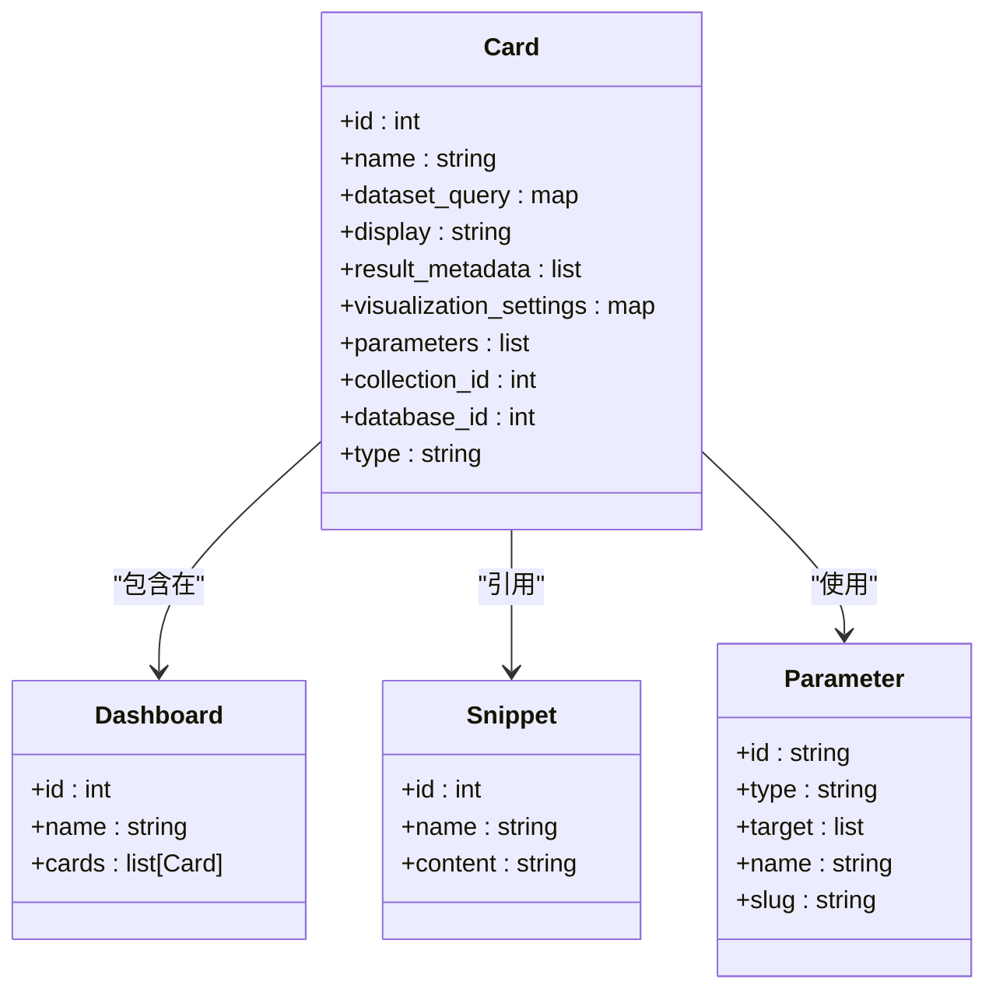
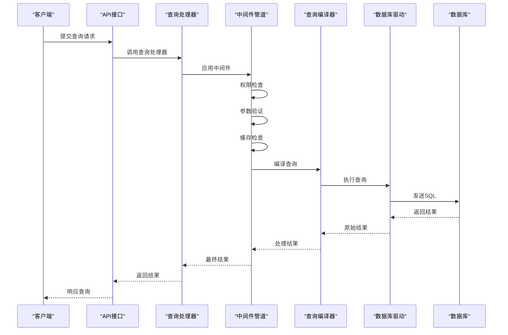
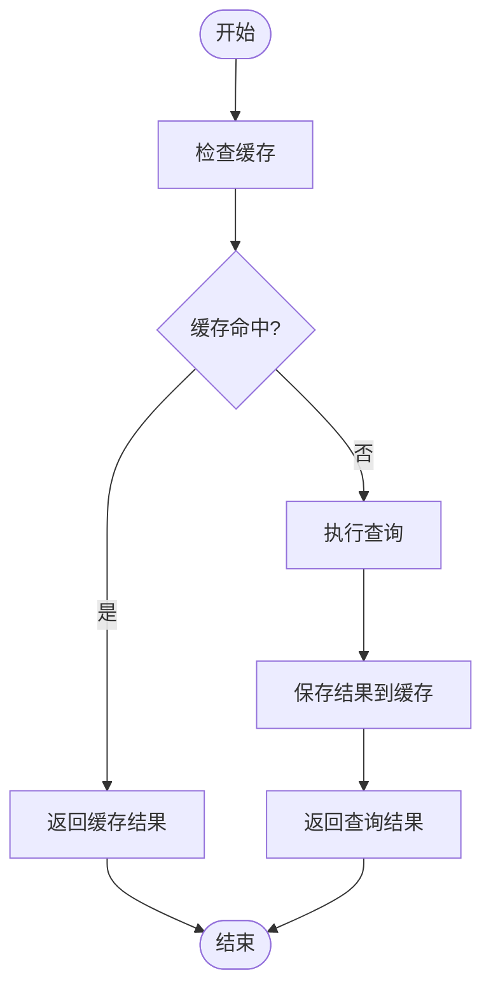
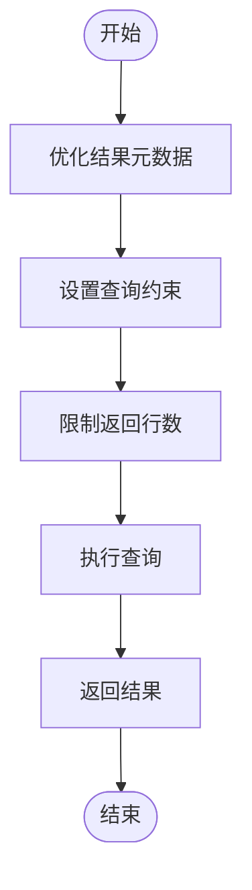
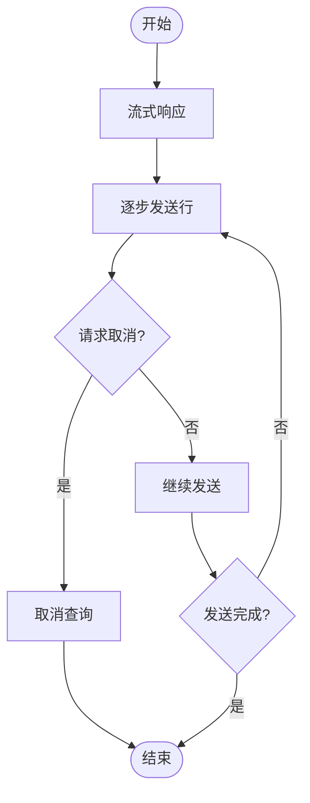

# 查询模型

<cite>
**本文档引用的文件**  
- [card.clj](file://src/metabase/queries/models/card.clj)
- [card.clj](file://src/metabase/query_processor/card.clj)
- [compile.clj](file://src/metabase/query_processor/compile.clj)
- [execute.clj](file://src/metabase/query_processor/execute.clj)
- [cache.clj](file://src/metabase/query_processor/middleware/cache.clj)
- [cache_backend/interface.clj](file://src/metabase/query_processor/middleware/cache_backend/interface.clj)
- [cache_backend/db.clj](file://src/metabase/query_processor/middleware/cache_backend/db.clj)
- [settings.clj](file://src/metabase/query_processor/settings.clj)
- [pipeline.clj](file://src/metabase/query_processor/pipeline.clj)
- [streaming.clj](file://src/metabase/query_processor/streaming.clj)
</cite>

## 目录
1. [简介](#简介)
2. [核心查询载体：Card实体](#核心查询载体card实体)
3. [查询执行流程](#查询执行流程)
4. [查询结果缓存机制](#查询结果缓存机制)
5. [查询序列化与YAML格式](#查询序列化与yaml格式)
6. [查询性能调优策略](#查询性能调优策略)
7. [大型结果集处理](#大型结果集处理)
8. [结论](#结论)

## 简介
Metabase的查询模型以Card实体为核心，作为查询的主要载体。Card不仅存储查询定义，还包含可视化设置、结果元数据等关键信息。查询模型与仪表板、片段和参数紧密关联，通过中间件管道处理查询请求，最终由数据库驱动执行。查询结果支持缓存机制，可通过配置MB_QP_CACHE_BACKEND来管理缓存后端。此外，查询支持YAML格式序列化，便于版本控制和团队协作。

**Section sources**
- [card.clj](file://src/metabase/queries/models/card.clj#L1-L50)

## 核心查询载体：Card实体
Card实体是Metabase中查询的核心载体，其结构包含多个关键字段。`dataset_query`字段存储查询定义，可以是MBQL或原生SQL。`display`字段定义可视化类型，如表格、图表等。`result_metadata`字段包含查询结果的元数据，如列名、数据类型等。

Card与仪表板、片段和参数有密切关联。仪表板通过DashboardCard引用Card，形成可视化布局。片段（Snippet）作为可重用的SQL片段，可在原生查询中引用。参数允许用户在运行时动态修改查询条件，支持字段过滤、文本、数字等多种类型。



**Diagram sources**
- [card.clj](file://src/metabase/queries/models/card.clj#L149-L175)
- [card.clj](file://src/metabase/query_processor/card.clj#L233-L259)

**Section sources**
- [card.clj](file://src/metabase/queries/models/card.clj#L149-L175)

## 查询执行流程
查询执行流程从API请求开始，经过查询处理器（Query Processor）的中间件管道处理，最终由数据库驱动执行。流程如下：

1. **API请求**：用户通过API提交查询请求，请求包含Card ID、参数等信息。
2. **中间件管道**：查询处理器通过中间件管道处理查询。中间件包括权限检查、参数验证、结果缓存等。
3. **查询编译**：将MBQL查询编译为原生SQL，准备执行。
4. **数据库执行**：由数据库驱动执行编译后的SQL，返回结果。
5. **结果处理**：对查询结果进行后处理，如格式化、分页等。



**Diagram sources**
- [query_processor.clj](file://src/metabase/query_processor.clj#L24-L52)
- [execute.clj](file://src/metabase/query_processor/execute.clj#L30-L63)

**Section sources**
- [query_processor.clj](file://src/metabase/query_processor.clj#L24-L52)
- [execute.clj](file://src/metabase/query_processor/execute.clj#L30-L63)

## 查询结果缓存机制
Metabase提供查询结果缓存机制，通过配置MB_QP_CACHE_BACKEND来管理缓存后端。缓存机制的工作流程如下：

1. **缓存检查**：在执行查询前，检查是否存在缓存结果。
2. **缓存命中**：如果缓存存在且未过期，直接返回缓存结果。
3. **查询执行**：如果缓存未命中，执行查询并将结果缓存。

缓存后端通过`CacheBackend`协议定义，支持多种实现，如数据库后端。`cached-results`方法用于获取缓存结果，`save-results!`方法用于保存结果。



**Diagram sources**
- [cache.clj](file://src/metabase/query_processor/middleware/cache.clj#L26-L63)
- [cache_backend/interface.clj](file://src/metabase/query_processor/middleware/cache_backend/interface.clj#L0-L26)

**Section sources**
- [cache.clj](file://src/metabase/query_processor/middleware/cache.clj#L26-L63)
- [cache_backend/interface.clj](file://src/metabase/query_processor/middleware/cache_backend/interface.clj#L0-L26)

## 查询序列化与YAML格式
查询支持YAML格式序列化，便于版本控制和团队协作。序列化过程将Card实体转换为YAML格式，包含查询定义、参数、可视化设置等信息。YAML格式示例如下：

```yaml
name: "Sales Report"
dataset_query:
  type: "query"
  query:
    source_table: 1
    aggregation: ["count"]
    breakout: [["field", 4, null]]
  database: 1
display: "scalar"
visualization_settings: {}
parameters: []
```

序列化后的YAML文件可用于版本控制系统，如Git，便于团队协作和变更追踪。

**Section sources**
- [card.clj](file://src/metabase/queries/models/card.clj#L149-L175)

## 查询性能调优策略
查询性能调优策略包括结果元数据优化和查询约束设置。结果元数据优化通过减少返回的元数据量来提高性能。查询约束设置通过限制返回的行数来防止大型查询影响系统性能。



**Diagram sources**
- [settings.clj](file://src/metabase/query_processor/settings.clj#L0-L67)

**Section sources**
- [settings.clj](file://src/metabase/query_processor/settings.clj#L0-L67)

## 大型结果集处理
大型结果集处理通过流式响应和分页机制实现。流式响应允许逐步发送结果，避免内存溢出。分页机制通过限制每次返回的行数，分批获取结果。



**Diagram sources**
- [streaming.clj](file://src/metabase/query_processor/streaming.clj#L226-L251)

**Section sources**
- [streaming.clj](file://src/metabase/query_processor/streaming.clj#L226-L251)

## 结论
Metabase的查询模型以Card实体为核心，通过中间件管道处理查询请求，支持结果缓存和YAML序列化。查询性能调优和大型结果集处理机制确保系统在高负载下的稳定性。通过合理配置缓存后端和查询约束，可以显著提升查询性能和用户体验。