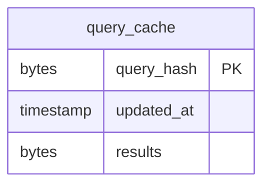
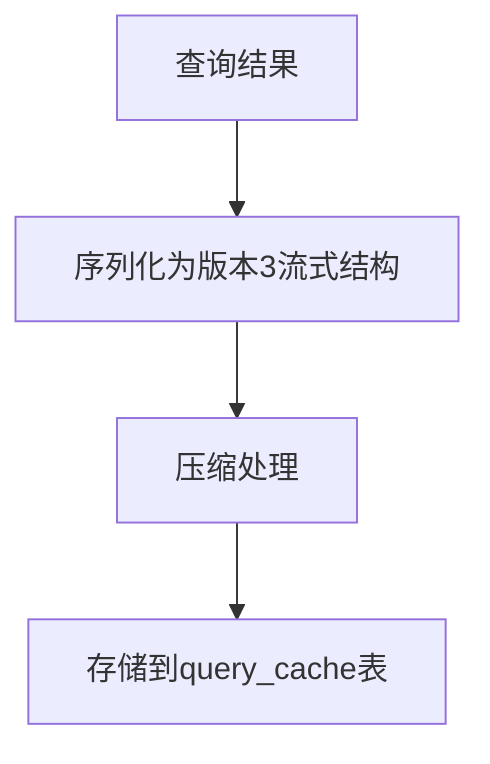
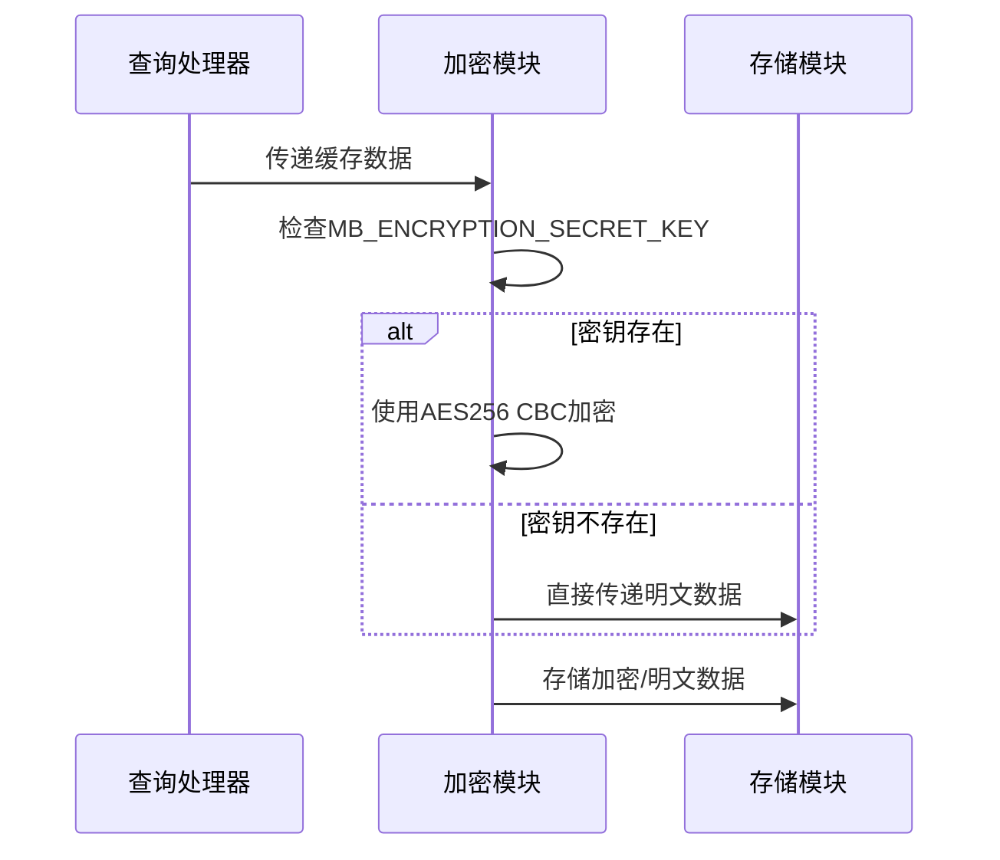
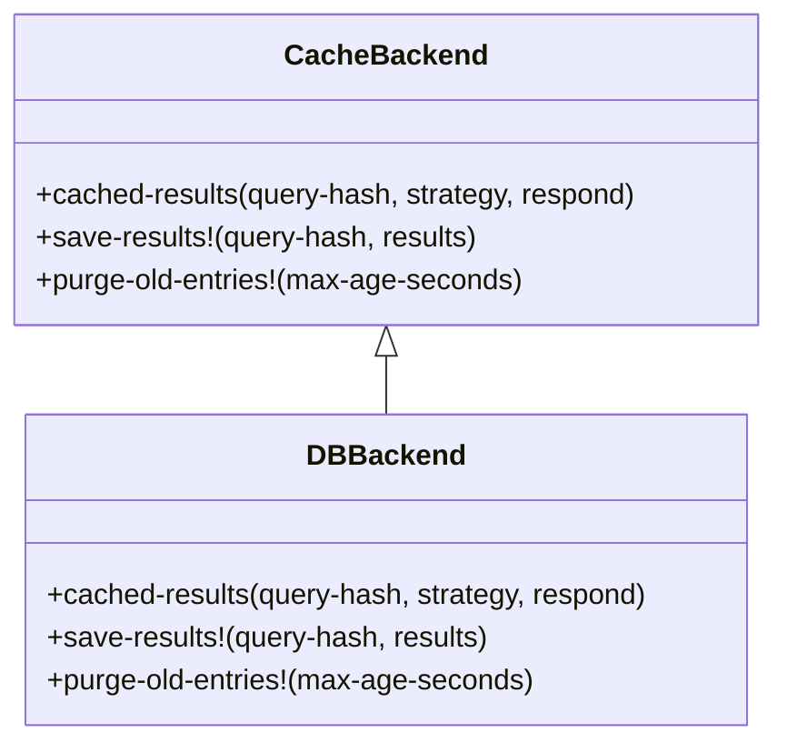
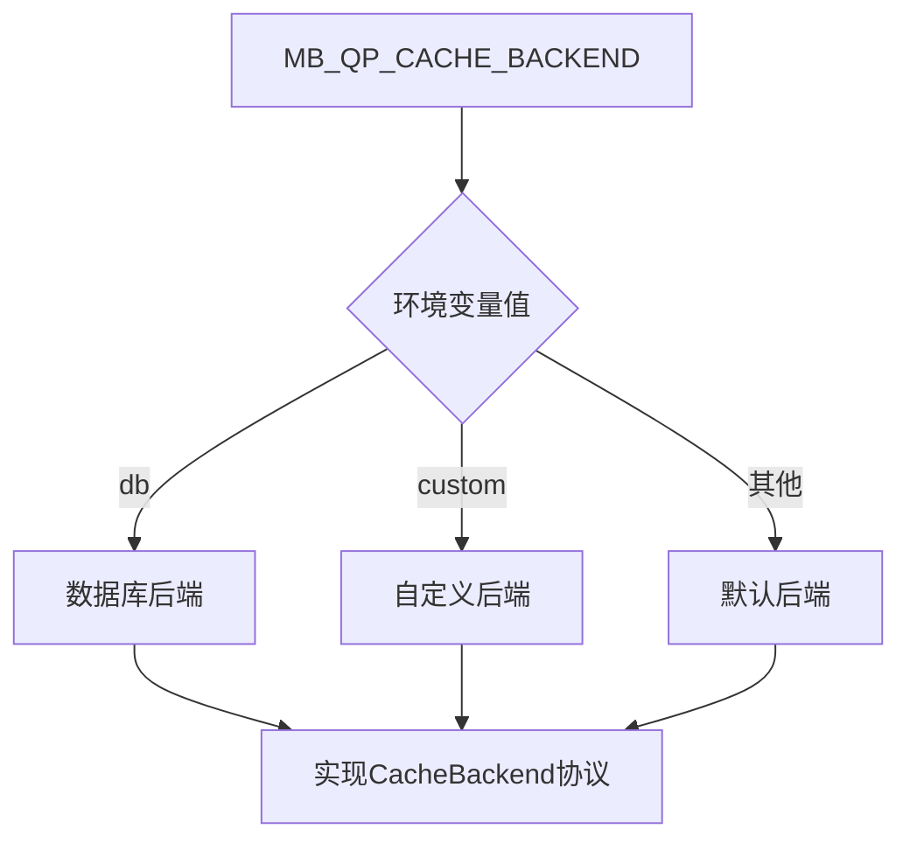

# 查询缓存存储机制

<cite>
**本文档中引用的文件**  
- [query_cache.clj](file://src/metabase/cache/models/query_cache.clj)
- [db.clj](file://src/metabase/query_processor/middleware/cache_backend/db.clj)
- [interface.clj](file://src/metabase/query_processor/middleware/cache_backend/interface.clj)
- [cache.clj](file://src/metabase/query_processor/middleware/cache.clj)
- [encryption.clj](file://src/metabase/util/encryption.clj)
- [settings.clj](file://src/metabase/cache/settings.clj)
- [cache_config.clj](file://src/metabase/cache/models/cache_config.clj)
</cite>

## 目录
1. [简介](#简介)
2. [表结构设计](#表结构设计)
3. [缓存数据序列化与压缩](#缓存数据序列化与压缩)
4. [加密机制](#加密机制)
5. [缓存后端协议](#缓存后端协议)
6. [环境变量与扩展](#环境变量与扩展)

## 简介
Metabase查询缓存机制通过Toucan2 ORM框架实现，将查询结果持久化存储在数据库中。该机制采用query_hash作为主键，结合updated_at时间戳实现高效的缓存管理和过期策略。缓存数据采用版本3的流式结构进行序列化，并通过压缩和加密处理确保数据安全性和存储效率。

**Section sources**
- [query_cache.clj](file://src/metabase/cache/models/query_cache.clj)
- [cache.clj](file://src/metabase/query_processor/middleware/cache.clj)

## 表结构设计
基于Toucan2 ORM的query_cache表结构设计采用了高效的主键和时间戳机制。query_hash字段作为主键，存储查询的SHA3哈希值，确保唯一性和快速查找。updated_at字段采用hook/updated-at-timestamped?机制，在每次更新时自动记录时间戳。

**Diagram sources**
- [query_cache.clj](file://src/metabase/cache/models/query_cache.clj)

**Section sources**
- [query_cache.clj](file://src/metabase/cache/models/query_cache.clj)

## 缓存数据序列化与压缩
缓存数据采用版本3的流式结构进行序列化，格式为[initial-metadata row-1 row-2 ... row-n final-metadata]。这种结构支持流式处理，提高了大数据集的处理效率。序列化后的数据经过压缩处理，减少了存储空间占用和I/O开销。

**Diagram sources**
- [cache.clj](file://src/metabase/query_processor/middleware/cache.clj)

**Section sources**
- [cache.clj](file://src/metabase/query_processor/middleware/cache.clj)

## 加密机制
加密机制通过encryption/maybe-encrypt-for-stream函数对缓存结果进行安全保护。当MB_ENCRYPTION_SECRET_KEY环境变量设置时，缓存数据会被加密；否则保持明文。加密采用AES256 CBC模式，确保数据在存储过程中的安全性。

**Diagram sources**
- [encryption.clj](file://src/metabase/util/encryption.clj)
- [db.clj](file://src/metabase/query_processor/middleware/cache_backend/db.clj)

**Section sources**
- [encryption.clj](file://src/metabase/util/encryption.clj)
- [db.clj](file://src/metabase/query_processor/middleware/cache_backend/db.clj)

## 缓存后端协议
数据库后端（:db）作为默认缓存实现，遵循CacheBackend协议。该协议包含三个核心方法：cached-results用于获取缓存结果，save-results!用于保存结果，purge-old-entries!用于清理过期条目。这些方法共同实现了完整的缓存生命周期管理。

**Diagram sources**
- [interface.clj](file://src/metabase/query_processor/middleware/cache_backend/interface.clj)
- [db.clj](file://src/metabase/query_processor/middleware/cache_backend/db.clj)

**Section sources**
- [interface.clj](file://src/metabase/query_processor/middleware/cache_backend/interface.clj)
- [db.clj](file://src/metabase/query_processor/middleware/cache_backend/db.clj)

## 环境变量与扩展
通过MB_QP_CACHE_BACKEND环境变量可以切换缓存后端实现。系统支持自定义缓存后端扩展，只需实现cache-backend多方法并返回符合CacheBackend协议的对象即可。这种设计提供了良好的可扩展性，允许用户根据具体需求选择或开发适合的缓存策略。

**Diagram sources**
- [cache.clj](file://src/metabase/query_processor/middleware/cache.clj)
- [interface.clj](file://src/metabase/query_processor/middleware/cache_backend/interface.clj)

**Section sources**
- [cache.clj](file://src/metabase/query_processor/middleware/cache.clj)
- [interface.clj](file://src/metabase/query_processor/middleware/cache_backend/interface.clj)