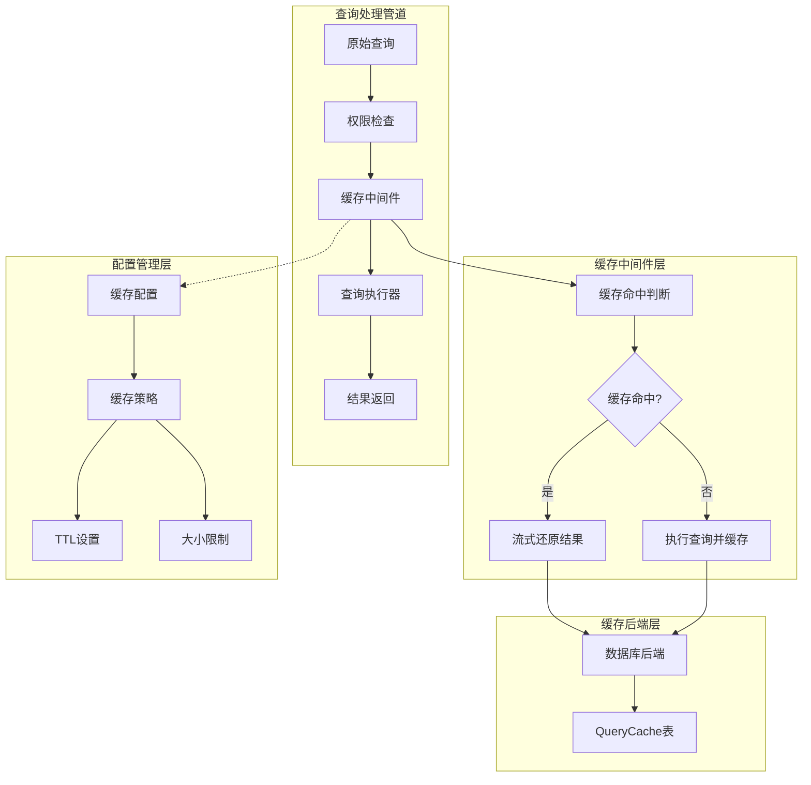
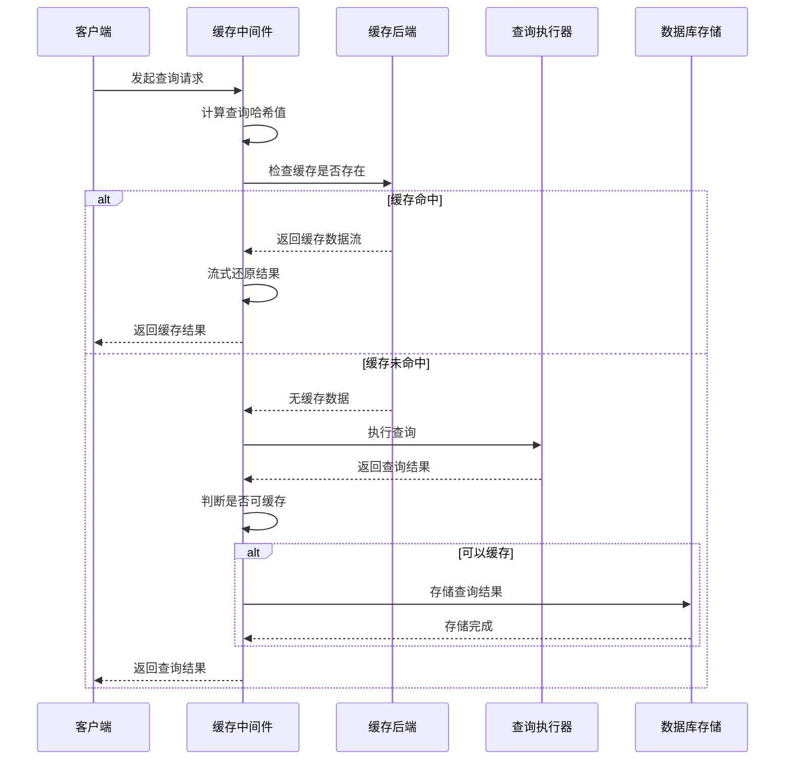
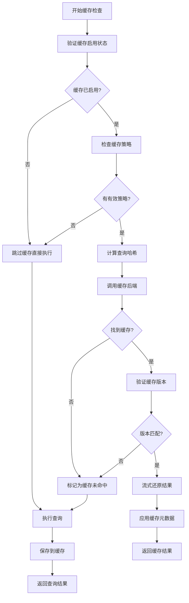
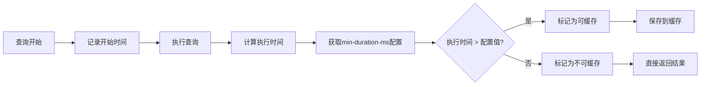
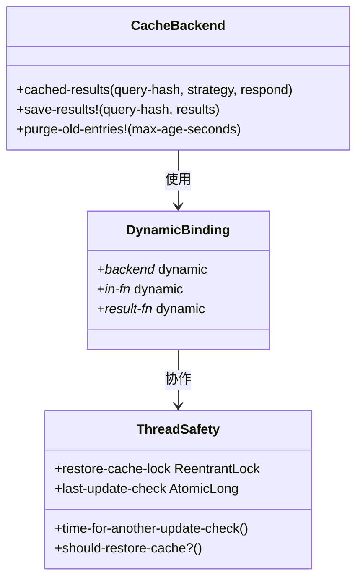
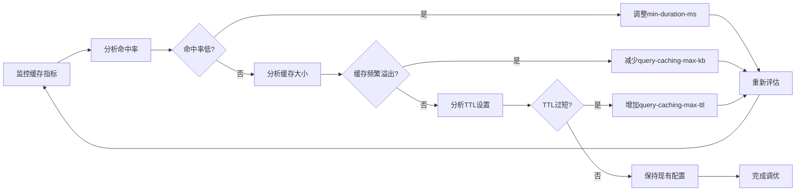
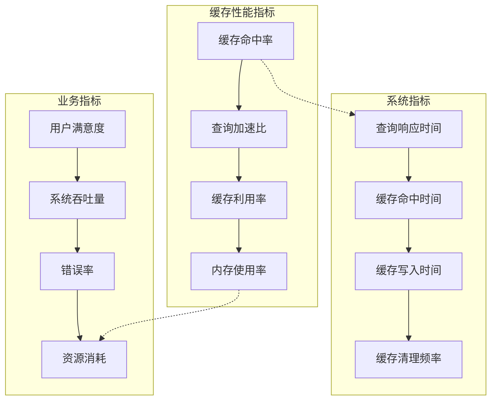
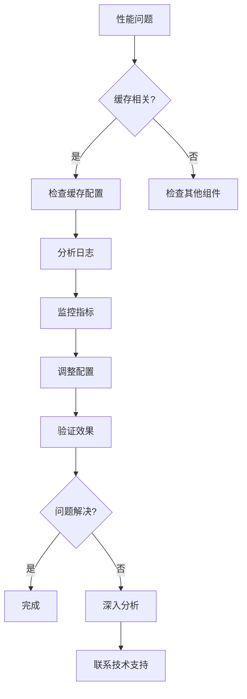

# 查询缓存性能优化

<cite>
**本文档中引用的文件**
- [cache.clj](file://src/metabase/query_processor/middleware/cache.clj)
- [cache_backend/db.clj](file://src/metabase/query_processor/middleware/cache_backend/db.clj)
- [cache_backend/interface.clj](file://src/metabase/query_processor/middleware/cache_backend/interface.clj)
- [cache_config.clj](file://src/metabase/cache/models/cache_config.clj)
- [cache_settings.clj](file://src/metabase/cache/settings.clj)
- [cache_api.clj](file://src/metabase/cache/api.clj)
- [cache_core.clj](file://src/metabase/cache/core.clj)
- [cache_init.clj](file://src/metabase/cache/init.clj)
- [stats.clj](file://src/metabase/analytics/stats.clj)
- [cache_impl.clj](file://src/metabase/query_processor/middleware/cache_impl.clj)
</cite>

## 目录
1. [简介](#简介)
2. [缓存架构概述](#缓存架构概述)
3. [缓存中间件执行流程](#缓存中间件执行流程)
4. [缓存命中判断与处理](#缓存命中判断与处理)
5. [min-duration-ms参数优化](#min-duration-ms参数优化)
6. [高并发缓存一致性保障](#高并发缓存一致性保障)
7. [缓存配置参数调优](#缓存配置参数调优)
8. [性能监控与日志分析](#性能监控与日志分析)
9. [生产环境最佳实践](#生产环境最佳实践)
10. [故障排除指南](#故障排除指南)

## 简介

Metabase查询缓存系统是一个高性能的查询结果缓存中间件，旨在显著提升重复查询的执行效率。该系统通过智能的缓存策略、动态的缓存管理机制以及完善的性能监控体系，为用户提供快速的数据查询体验。

缓存系统的核心设计理念是：
- **智能缓存决策**：基于查询执行时间和结果大小自动决定是否缓存
- **高性能存储**：采用数据库作为默认缓存后端，支持多种存储策略
- **线程安全访问**：通过动态绑定和锁机制确保高并发环境下的数据一致性
- **可配置性**：提供丰富的配置参数满足不同场景需求

## 缓存架构概述

Metabase查询缓存系统采用分层架构设计，包含缓存中间件、缓存后端接口和存储层三个核心组件。



**图表来源**
- [cache.clj](file://src/metabase/query_processor/middleware/cache.clj#L1-L50)
- [cache_backend/db.clj](file://src/metabase/query_processor/middleware/cache_backend/db.clj#L1-L30)

**章节来源**
- [cache.clj](file://src/metabase/query_processor/middleware/cache.clj#L1-L30)
- [cache_backend/interface.clj](file://src/metabase/query_processor/middleware/cache_backend/interface.clj#L1-L26)

## 缓存中间件执行流程

缓存中间件在查询处理管道中的位置至关重要，它负责在整个查询生命周期中进行缓存相关的操作。



**图表来源**
- [cache.clj](file://src/metabase/query_processor/middleware/cache.clj#L180-L246)

### 中间件核心功能

缓存中间件的主要职责包括：

1. **查询哈希计算**：为每个查询生成唯一的SHA3哈希值用于缓存键
2. **缓存策略评估**：根据配置的缓存策略决定是否启用缓存
3. **执行时间监控**：记录查询执行时间用于缓存决策
4. **结果序列化**：将查询结果序列化为字节数组存储
5. **缓存清理**：定期清理过期的缓存条目

**章节来源**
- [cache.clj](file://src/metabase/query_processor/middleware/cache.clj#L180-L246)

## 缓存命中判断与处理

缓存命中判断是缓存系统的核心逻辑，涉及多个维度的条件检查和优化策略。



**图表来源**
- [cache.clj](file://src/metabase/query_processor/middleware/cache.clj#L151-L195)

### 缓存命中判断逻辑

缓存命中判断遵循严格的多层验证机制：

1. **基础条件检查**：验证缓存功能是否启用、是否有有效的缓存策略
2. **查询哈希验证**：确保查询经过标准化处理，避免因格式差异导致的缓存失效
3. **缓存版本兼容性**：检查缓存数据的序列化版本是否与当前系统兼容
4. **时间有效性检查**：验证缓存条目的时效性，防止使用过期数据

**章节来源**
- [cache.clj](file://src/metabase/query_processor/middleware/cache.clj#L151-L195)

## min-duration-ms参数优化

`min-duration-ms`参数是控制查询缓存资格的关键配置，它防止执行时间过短的查询占用宝贵的缓存空间。

### 参数作用机制



**图表来源**
- [cache.clj](file://src/metabase/query_processor/middleware/cache.clj#L95-L115)

### min-duration-ms优化策略

1. **基准测试确定阈值**：
   - 在生产环境中运行基准测试，测量不同类型查询的平均执行时间
   - 设置合理的最小阈值，通常建议在100ms到1000ms之间
   - 考虑网络延迟和数据库负载对执行时间的影响

2. **动态调整策略**：
   - 根据系统负载动态调整min-duration-ms值
   - 在低峰时段降低阈值以提高缓存命中率
   - 在高峰时段提高阈值以减少缓存开销

3. **查询类型差异化配置**：
   - 对于复杂报表查询设置较高的阈值（2000ms-5000ms）
   - 对于简单筛选查询设置较低的阈值（100ms-500ms）
   - 对于聚合查询根据数据量动态调整

**章节来源**
- [cache.clj](file://src/metabase/query_processor/middleware/cache.clj#L95-L115)

## 高并发缓存一致性保障

在高并发环境下，缓存系统需要确保数据的一致性和线程安全性。

### 动态绑定机制

Metabase使用Clojure的动态绑定特性实现线程安全的缓存访问：



**图表来源**
- [cache_backend/interface.clj](file://src/metabase/query_processor/middleware/cache_backend/interface.clj#L25-L56)
- [cache_backend/db.clj](file://src/metabase/query_processor/middleware/cache_backend/db.clj#L96-L111)

### 线程安全访问机制

1. **动态绑定隔离**：
   - 每个线程维护独立的缓存上下文
   - 使用Clojure的`binding`宏确保线程隔离
   - 避免跨线程的数据竞争问题

2. **锁机制保护**：
   - 关键操作使用可重入锁保护
   - 防止多个线程同时更新缓存配置
   - 确保缓存一致性

3. **原子操作保证**：
   - 使用原子操作更新缓存统计信息
   - 确保并发环境下的数据准确性
   - 避免竞态条件

**章节来源**
- [cache_backend/db.clj](file://src/metabase/query_processor/middleware/cache_backend/db.clj#L70-L98)
- [settings/models/setting/cache.clj](file://src/metabase/settings/models/setting/cache.clj#L145-L165)

## 缓存配置参数调优

合理的缓存配置参数设置是获得最佳性能的关键。

### 核心配置参数

| 参数名称 | 默认值 | 描述 | 调优建议 |
|---------|--------|------|----------|
| `query-caching-max-kb` | 2000KB | 单个查询最大缓存大小 | 根据查询结果大小分布调整，典型值500KB-2000KB |
| `query-caching-max-ttl` | 35天 | 最大缓存生存时间 | 根据数据新鲜度要求设置，建议7-30天 |
| `enable-query-caching` | true | 是否启用查询缓存 | 生产环境建议始终启用 |

### 配置调优策略



**图表来源**
- [cache_settings.clj](file://src/metabase/cache/settings.clj#L25-L45)

### 性能调优建议

1. **内存使用平衡**：
   - 设置合理的`query-caching-max-kb`值，避免内存溢出
   - 监控JVM堆内存使用情况，确保有足够的可用内存
   - 考虑查询结果的压缩比，实际存储大小可能小于配置值

2. **缓存时效性优化**：
   - 根据业务数据更新频率设置合适的TTL
   - 对于实时性要求高的数据设置较短的TTL
   - 对于历史数据分析设置较长的TTL

3. **查询特征适配**：
   - 分析查询执行时间分布，设置合适的min-duration-ms
   - 考虑查询复杂度和数据量对缓存效果的影响
   - 针对不同类型的查询制定差异化的缓存策略

**章节来源**
- [cache_settings.clj](file://src/metabase/cache/settings.clj#L25-L45)

## 性能监控与日志分析

完善的监控体系是缓存系统高效运行的重要保障。

### 关键性能指标



**图表来源**
- [stats.clj](file://src/metabase/analytics/stats.clj#L426-L464)

### 日志监控策略

1. **缓存命中率监控**：
   - 记录缓存命中和未命中的次数
   - 计算缓存命中率并设置告警阈值
   - 分析不同查询类型的缓存效果

2. **性能瓶颈识别**：
   - 监控缓存读取和写入的响应时间
   - 识别缓存操作的性能瓶颈
   - 分析缓存清理操作对系统的影响

3. **异常情况追踪**：
   - 记录缓存操作失败的情况
   - 追踪内存溢出和磁盘空间不足等问题
   - 监控并发访问冲突和死锁情况

### 监控配置示例

```clojure
;; 缓存命中率监控配置
(def cache-monitoring-config
  {:metrics-enabled true
   :log-level :info
   :alert-threshold {:hit-rate 0.8
                     :response-time 5000
                     :memory-usage 0.9}})
```

**章节来源**
- [stats.clj](file://src/metabase/analytics/stats.clj#L426-L464)

## 生产环境最佳实践

基于生产环境的经验总结，以下是推荐的最佳实践配置。

### 基础配置模板

```yaml
# 生产环境缓存配置
query-caching:
  enable-query-caching: true
  query-caching-max-kb: 2000
  query-caching-max-ttl: 2592000  # 30天（24小时 × 60分钟 × 60秒 × 30天）
  
# 查询执行优化
query-execution:
  min-duration-ms: 1000  # 仅缓存执行时间超过1秒的查询
  
# 监控配置
monitoring:
  cache-hit-rate-alert: 0.8
  memory-usage-alert: 0.85
  response-time-alert: 5000
```

### 高可用部署策略

1. **数据库优化**：
   - 使用高性能的数据库引擎（如PostgreSQL）
   - 配置适当的连接池大小
   - 启用数据库级别的查询缓存

2. **硬件资源配置**：
   - 确保充足的内存容量
   - 使用SSD存储提高I/O性能
   - 配置适当的CPU核心数

3. **网络优化**：
   - 减少网络延迟影响
   - 配置适当的连接超时时间
   - 使用连接复用技术

### 容量规划建议

| 场景类型 | 推荐配置 | 预期效果 |
|---------|----------|----------|
| 小型团队（<10人） | max-kb: 1000, TTL: 7天 | 平衡性能和资源使用 |
| 中型团队（10-50人） | max-kb: 2000, TTL: 14天 | 提升缓存命中率 |
| 大型企业（>50人） | max-kb: 5000, TTL: 30天 | 最大化缓存收益 |

**章节来源**
- [cache_settings.clj](file://src/metabase/cache/settings.clj#L25-L45)

## 故障排除指南

常见问题的诊断和解决方案。

### 常见问题及解决方案

1. **缓存命中率低**
   - 检查min-duration-ms设置是否过高
   - 分析查询模式，确认是否有重复查询
   - 检查缓存配置是否正确应用

2. **内存使用过高**
   - 降低query-caching-max-kb配置
   - 检查是否有大查询被意外缓存
   - 监控JVM内存使用情况

3. **缓存清理频繁**
   - 检查query-caching-max-ttl设置
   - 分析缓存条目的生命周期
   - 考虑调整清理策略

### 诊断工具和方法



### 性能优化检查清单

- [ ] 确认缓存功能已启用
- [ ] 检查缓存配置参数合理性
- [ ] 监控缓存命中率和响应时间
- [ ] 分析查询执行时间分布
- [ ] 检查内存和磁盘使用情况
- [ ] 验证并发访问安全性
- [ ] 确认监控告警配置正确

**章节来源**
- [cache.clj](file://src/metabase/query_processor/middleware/cache.clj#L176-L206)

## 结论

Metabase查询缓存系统通过精心设计的架构和丰富的配置选项，为用户提供了强大的查询性能优化能力。通过合理配置min-duration-ms参数、优化缓存大小和TTL设置、实施有效的监控策略，可以显著提升系统的整体性能。

关键成功因素包括：
- 基于实际查询特征的配置调优
- 完善的监控和告警机制
- 高并发环境下的线程安全保障
- 生产环境的最佳实践遵循

持续的监控和优化是确保缓存系统长期高效运行的关键。建议定期评估缓存效果，根据业务发展和系统负载变化调整配置参数，以获得最佳的性能收益。