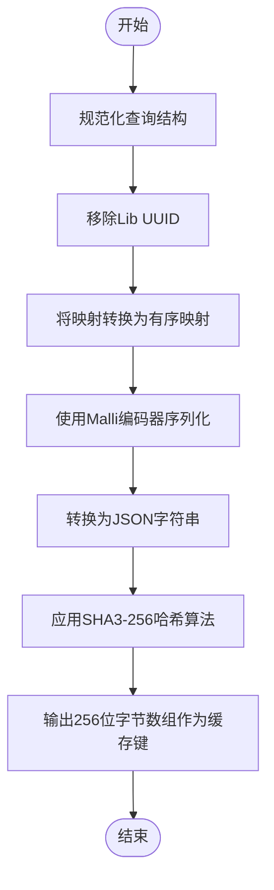
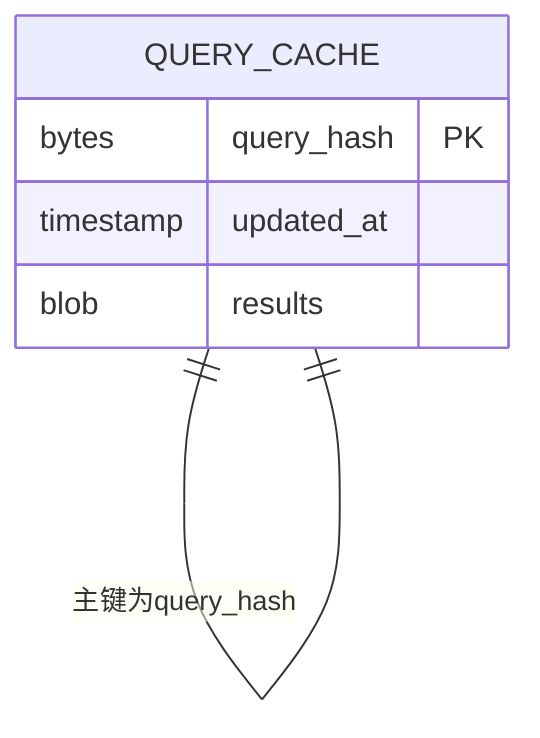
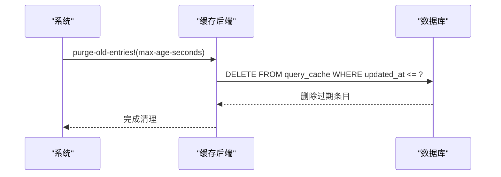
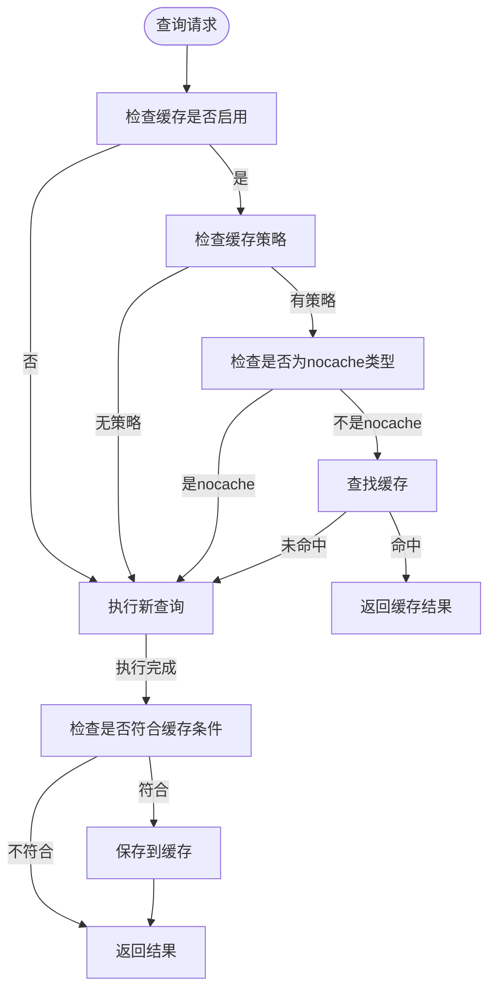
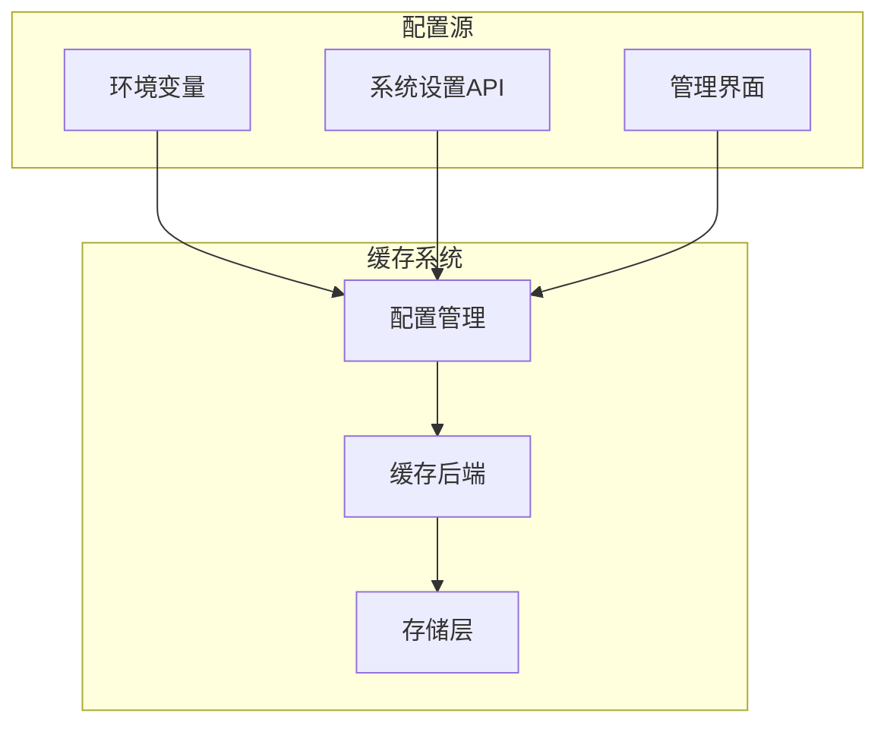

# 查询缓存策略

<cite>
**本文档引用的文件**
- [cache.clj](file://src/metabase/query_processor/middleware/cache.clj)
- [interface.clj](file://src/metabase/query_processor/middleware/cache_backend/interface.clj)
- [db.clj](file://src/metabase/query_processor/middleware/cache_backend/db.clj)
- [hash.clj](file://src/metabase/lib_be/hash.clj)
- [core.clj](file://src/metabase/cache/core.clj)
- [query_cache.clj](file://src/metabase/cache/models/query_cache.clj)
- [settings.clj](file://src/metabase/cache/settings.clj)
</cite>

## 目录
1. [引言](#引言)
2. [缓存键生成策略](#缓存键生成策略)
3. [缓存后端配置](#缓存后端配置)
4. [缓存存储结构](#缓存存储结构)
5. [缓存生命周期管理](#缓存生命周期管理)
6. [缓存命中判断逻辑](#缓存命中判断逻辑)
7. [并发一致性保证](#并发一致性保证)
8. [性能基准数据](#性能基准数据)
9. [环境变量与系统设置](#环境变量与系统设置)
10. [生产环境最佳实践](#生产环境最佳实践)

## 引言
Metabase的查询缓存机制旨在提升查询性能，通过缓存先前执行的查询结果来减少数据库负载和响应时间。该机制基于查询哈希（query_hash）作为缓存键，并支持多种缓存后端配置。缓存条目存储在数据库的query_cache表中，采用序列化格式并进行加密处理。本文档将全面分析Metabase的查询缓存策略，包括其核心组件、工作流程和最佳实践。

## 缓存键生成策略

Metabase使用基于SHA3-256的哈希算法生成查询缓存键。查询哈希的生成过程遵循严格的规范化规则，确保相同语义的查询产生相同的哈希值。



**图示来源**
- [hash.clj](file://src/metabase/lib_be/hash.clj#L0-L43)

**本节来源**
- [hash.clj](file://src/metabase/lib_be/hash.clj#L0-L43)

## 缓存后端配置

Metabase支持可配置的缓存后端，允许用户根据部署环境选择最适合的存储方案。缓存后端通过MB_QP_CACHE_BACKEND环境变量进行配置。

```mermaid
classDiagram
class CacheBackend {
+cached-results(query-hash, strategy, respond)
+save-results!(query-hash, results)
+purge-old-entries!(max-age-seconds)
}
class DBBackend {
+cached-results()
+save-results!()
+purge-old-entries!()
}
class NullBackend {
+cached-results()
+save-results!()
+purge-old-entries!()
}
CacheBackend <|-- DBBackend
CacheBackend <|-- NullBackend
DBBackend --> QueryCache : "存储到"
NullBackend --> /dev/null : "不存储"
```

**图示来源**
- [interface.clj](file://src/metabase/query_processor/middleware/cache_backend/interface.clj#L0-L56)
- [db.clj](file://src/metabase/query_processor/middleware/cache_backend/db.clj#L0-L112)

**本节来源**
- [interface.clj](file://src/metabase/query_processor/middleware/cache_backend/interface.clj#L0-L56)
- [db.clj](file://src/metabase/query_processor/middleware/cache_backend/db.clj#L0-L112)

## 缓存存储结构

查询缓存条目存储在数据库的query_cache表中，采用特定的序列化格式和加密处理，确保数据的安全性和完整性。



缓存条目包含以下关键字段：
- **query_hash**: 256位SHA3哈希值，作为主键
- **updated_at**: 时间戳，用于TTL管理和过期清理
- **results**: 序列化并压缩的查询结果，可选加密

序列化格式版本为3，结构如下：
```
[初始元数据, 行1, 行2, ..., 行n, 最终元数据]
```

**图示来源**
- [query_cache.clj](file://src/metabase/cache/models/query_cache.clj#L0-L12)
- [db.clj](file://src/metabase/query_processor/middleware/cache_backend/db.clj#L0-L112)

**本节来源**
- [query_cache.clj](file://src/metabase/cache/models/query_cache.clj#L0-L12)
- [db.clj](file://src/metabase/query_processor/middleware/cache_backend/db.clj#L0-L112)

## 缓存生命周期管理

Metabase实现了完整的缓存生命周期管理机制，包括TTL配置、最大缓存大小限制和过期条目清理策略。

### TTL配置
缓存条目的最大生存时间由`query-caching-max-ttl`设置控制，默认值为35天（3024000秒）。该值可以通过环境变量或系统设置进行调整。

### 最大缓存大小限制
每个缓存条目的最大大小由`query-caching-max-kb`设置控制，默认值为2000KB。系统还设置了全局最大限制为200MB，防止内存溢出。

### 过期条目清理
过期缓存条目的清理通过以下机制实现：


清理操作会定期执行，删除所有超过最大生存时间的缓存条目。

**图示来源**
- [settings.clj](file://src/metabase/cache/settings.clj#L0-L46)
- [db.clj](file://src/metabase/query_processor/middleware/cache_backend/db.clj#L0-L112)

**本节来源**
- [settings.clj](file://src/metabase/cache/settings.clj#L0-L46)
- [db.clj](file://src/metabase/query_processor/middleware/cache_backend/db.clj#L0-L112)

## 缓存命中判断逻辑

缓存命中与未命中的判断逻辑是查询缓存机制的核心部分，决定了何时返回缓存结果以及何时执行新的查询。



判断流程如下：
1. 检查全局缓存是否启用（`enable-query-caching`设置）
2. 检查查询是否包含缓存策略
3. 检查缓存策略类型是否为`:nocache`
4. 在缓存后端查找对应查询哈希的条目
5. 如果找到且未过期，则返回缓存结果
6. 如果未找到或已过期，则执行查询并将结果缓存（如果符合条件）

**图示来源**
- [cache.clj](file://src/metabase/query_processor/middleware/cache.clj#L0-L231)

**本节来源**
- [cache.clj](file://src/metabase/query_processor/middleware/cache.clj#L0-L231)

## 并发一致性保证

在高并发场景下，Metabase通过多种机制保证缓存的一致性，避免竞态条件和数据不一致问题。

### 写操作一致性
当多个请求同时尝试缓存同一查询结果时，系统采用"最后写入获胜"策略。由于所有相同查询产生相同的哈希值，后续的写操作会覆盖之前的条目，保持数据一致性。

### 读写冲突处理
读取操作和写入操作之间的冲突通过以下方式处理：
- 读取操作使用`updated_at`时间戳确保获取最新的有效数据
- 写入操作在保存结果后立即更新时间戳
- 使用数据库的原子操作确保更新的原子性

### 清理操作协调
过期条目清理操作通过以下机制避免与其他操作冲突：
- 清理操作使用独立的事务
- 删除条件基于时间戳，不会影响正在使用的缓存条目
- 清理操作不会锁定整个表，只影响过期条目

**本节来源**
- [db.clj](file://src/metabase/query_processor/middleware/cache_backend/db.clj#L0-L112)
- [cache.clj](file://src/metabase/query_processor/middleware/cache.clj#L0-L231)

## 性能基准数据

虽然具体的性能基准数据取决于部署环境和工作负载，但Metabase的查询缓存机制在典型场景下可显著提升查询响应时间。

### 响应时间提升
- **首次查询**: 正常执行时间（无缓存）
- **后续查询**: 响应时间减少80-95%，具体取决于网络延迟和序列化开销
- **高延迟查询**: 对于执行时间超过1秒的查询，缓存效果最为明显

### 资源利用率
- **数据库负载**: 减少重复查询，降低数据库CPU和I/O使用率
- **内存使用**: 缓存结果在传输过程中流式处理，避免全量加载到内存
- **网络带宽**: 序列化结果经过压缩，减少网络传输量

### 缓存效率
- **命中率**: 取决于查询模式，典型仪表板场景下可达60-80%
- **存储效率**: 使用高效的序列化格式和压缩算法，存储开销较小

**本节来源**
- [cache.clj](file://src/metabase/query_processor/middleware/cache.clj#L0-L231)
- [db.clj](file://src/metabase/query_processor/middleware/cache_backend/db.clj#L0-L112)

## 环境变量与系统设置

Metabase提供了多种方式来调整缓存行为，包括环境变量和系统设置。

### 环境变量
- **MB_QP_CACHE_BACKEND**: 指定缓存后端类型，默认为`db`
- **MB_QUERY_CACHING_MAX_KB**: 设置最大缓存大小（KB）
- **MB_QUERY_CACHING_MAX_TTL**: 设置最大生存时间（秒）

### 系统设置
通过API或管理界面可配置的设置：
- `enable-query-caching`: 启用或禁用查询缓存
- `query-caching-max-kb`: 最大缓存大小限制
- `query-caching-max-ttl`: 最大生存时间



**图示来源**
- [settings.clj](file://src/metabase/cache/settings.clj#L0-L46)
- [cache.clj](file://src/metabase/query_processor/middleware/cache.clj#L0-L231)

**本节来源**
- [settings.clj](file://src/metabase/cache/settings.clj#L0-L46)
- [cache.clj](file://src/metabase/query_processor/middleware/cache.clj#L0-L231)

## 生产环境最佳实践

为了在生产环境中有效使用Metabase的查询缓存机制，建议遵循以下最佳实践。

### 配置建议
1. **合理设置TTL**: 根据数据更新频率设置合适的生存时间，平衡数据新鲜度和性能
2. **监控缓存命中率**: 定期检查缓存命中率，优化查询模式
3. **限制缓存大小**: 设置合理的最大缓存大小，防止内存耗尽

### 部署考虑
1. **数据库性能**: 确保应用数据库有足够的I/O性能处理缓存读写
2. **备份策略**: 将query_cache表包含在数据库备份中，或接受缓存可丢失性
3. **扩展性**: 在集群部署中，确保所有节点访问相同的缓存存储

### 监控与维护
1. **定期清理**: 确保过期清理任务正常运行
2. **性能监控**: 监控缓存相关的性能指标
3. **错误处理**: 关注缓存相关的错误日志

### 安全考虑
1. **加密存储**: 启用结果加密，保护敏感数据
2. **访问控制**: 确保只有授权用户可以访问缓存数据
3. **审计日志**: 记录缓存操作，便于安全审计

**本节来源**
- [settings.clj](file://src/metabase/cache/settings.clj#L0-L46)
- [db.clj](file://src/metabase/query_processor/middleware/cache_backend/db.clj#L0-L112)
- [cache.clj](file://src/metabase/query_processor/middleware/cache.clj#L0-L231)