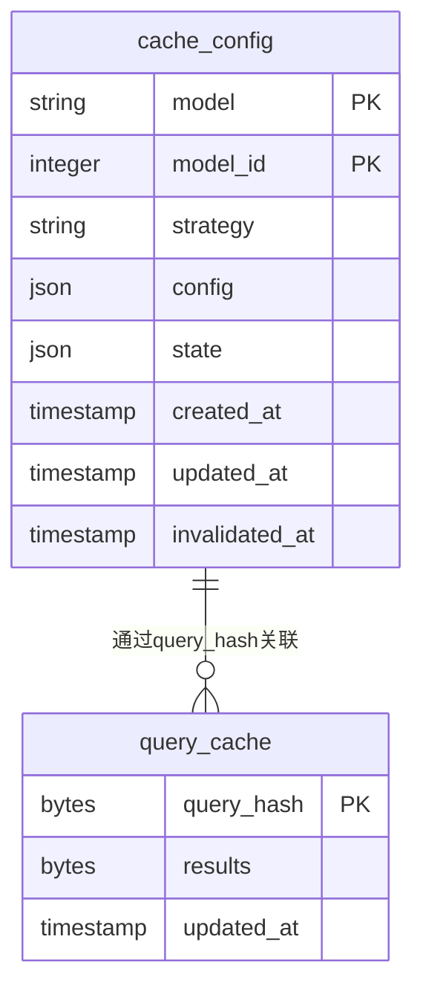
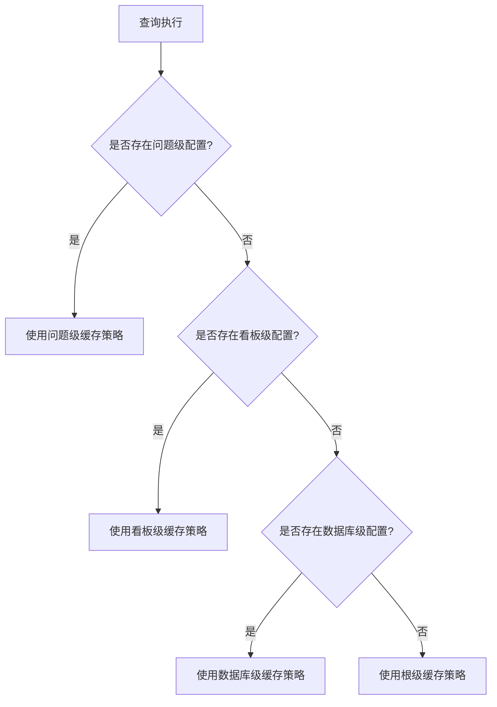
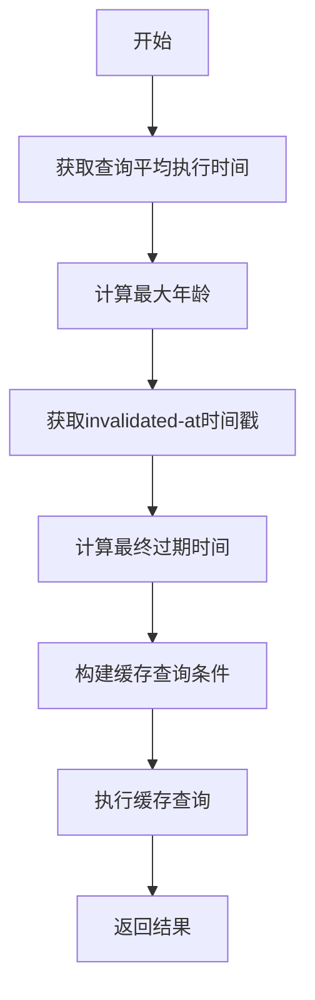
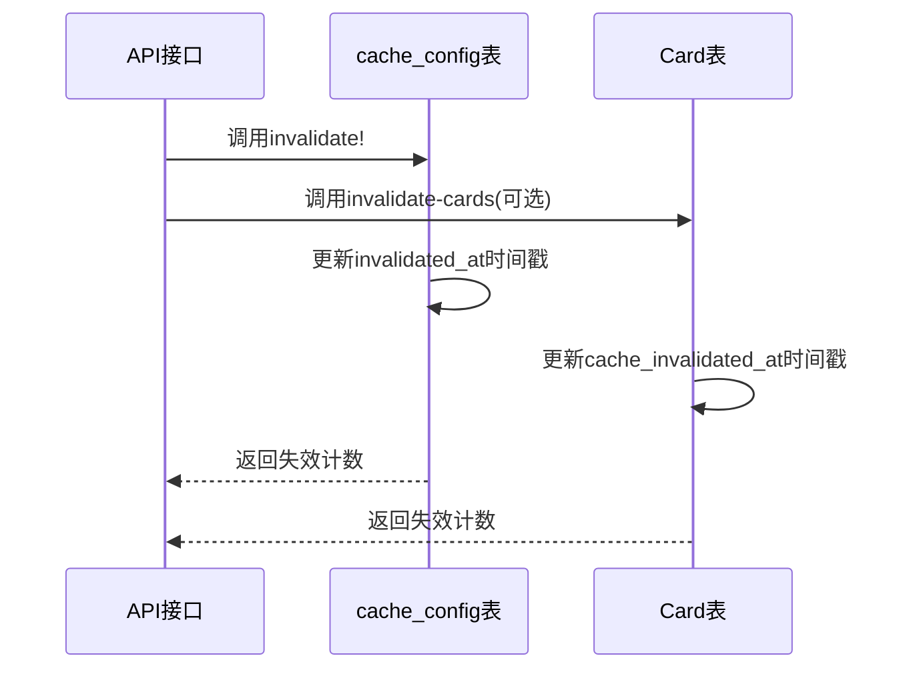
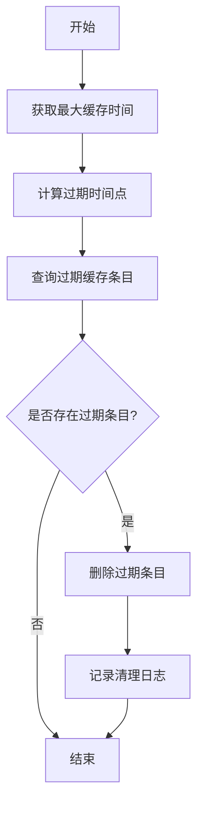
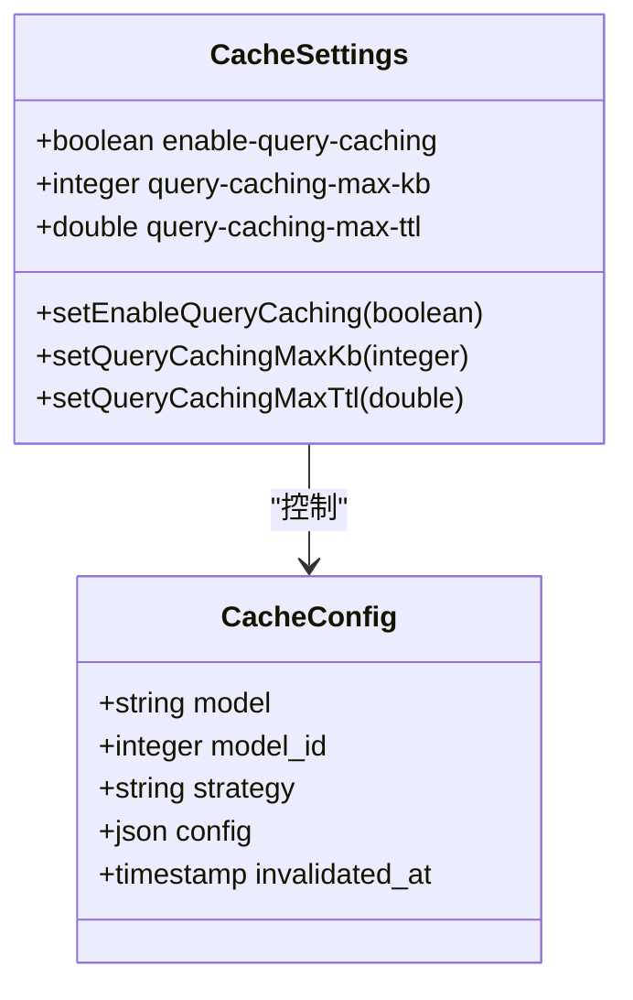
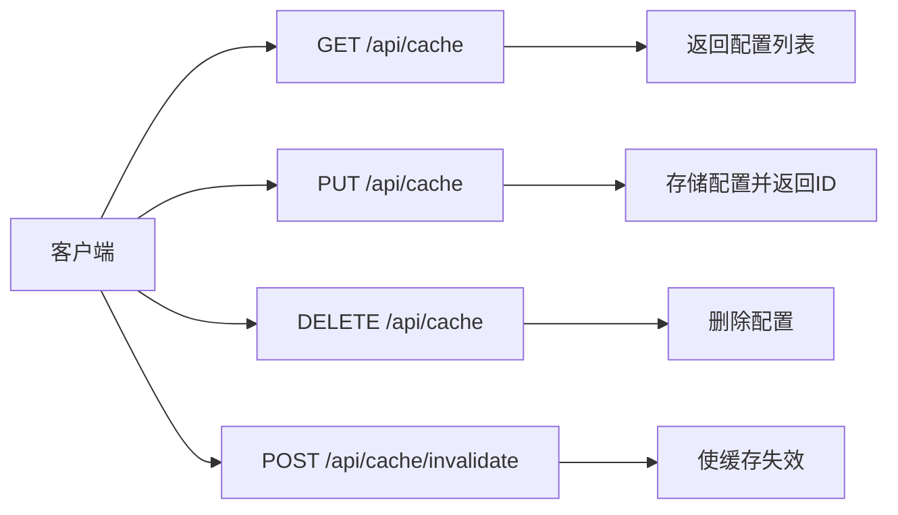
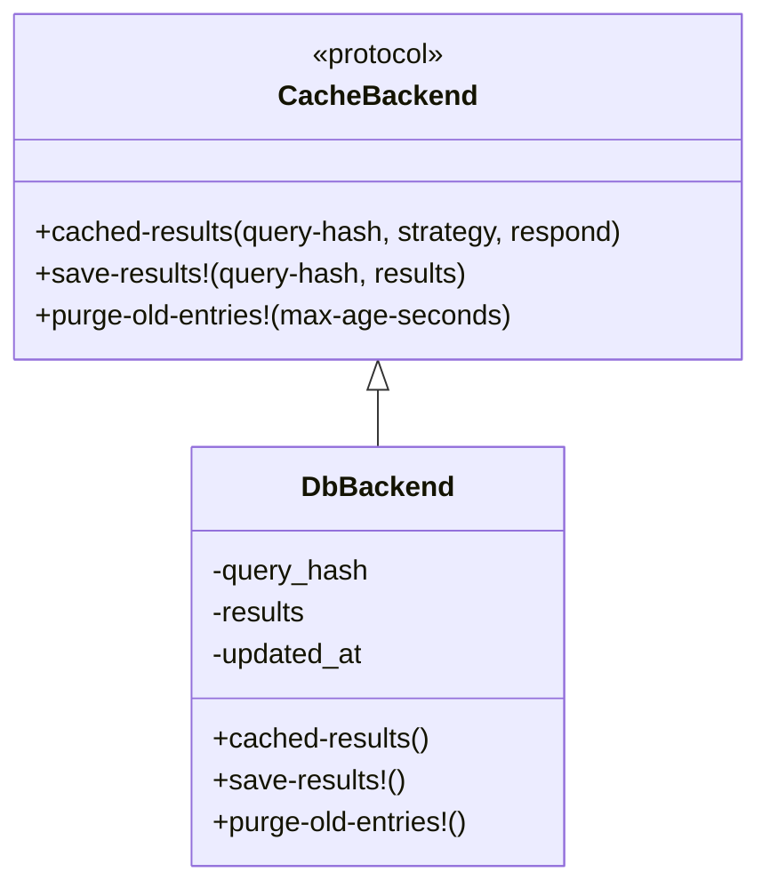
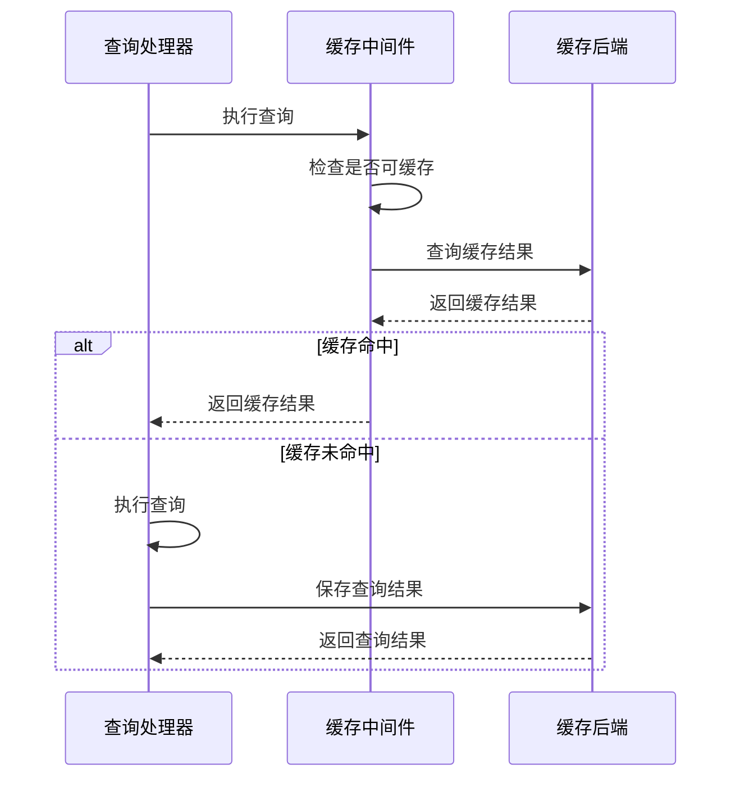

# 查询缓存管理策略

<cite>
**本文档引用的文件**  
- [cache_config.clj](file://src/metabase/cache/models/cache_config.clj)
- [query_cache.clj](file://src/metabase/cache/models/query_cache.clj)
- [core.clj](file://src/metabase/cache/core.clj)
- [settings.clj](file://src/metabase/cache/settings.clj)
- [api.clj](file://src/metabase/cache/api.clj)
- [db.clj](file://src/metabase/query_processor/middleware/cache_backend/db.clj)
- [cache.clj](file://src/metabase/query_processor/middleware/cache.clj)
- [card.clj](file://src/metabase/query_processor/card.clj)
</cite>

## 目录
1. [引言](#引言)
2. [缓存配置模型](#缓存配置模型)
3. [分级缓存策略配置](#分级缓存策略配置)
4. [TTL缓存策略实现](#ttl缓存策略实现)
5. [缓存失效机制](#缓存失效机制)
6. [缓存条目清理流程](#缓存条目清理流程)
7. [缓存功能控制](#缓存功能控制)
8. [API接口说明](#api接口说明)
9. [缓存后端实现](#缓存后端实现)
10. [查询处理器集成](#查询处理器集成)

## 引言
Metabase的查询缓存系统通过精细化的生命周期管理机制，实现了对查询结果的高效缓存和管理。本系统基于`cache_config`表实现了分级缓存策略配置，支持从根级到数据库、看板和问题级别的多层级缓存策略继承。缓存策略采用TTL（time-to-live）机制，结合查询平均执行时间实现动态过期计算。通过`invalidated-at`时间戳实现精确的缓存失效控制，并通过全局最大缓存时间和最大缓存大小的双重限制确保系统性能稳定。

## 缓存配置模型
缓存配置模型定义了缓存策略的存储结构和操作接口，通过`cache_config`表管理不同层级的缓存配置。



**图表来源**  
- [cache_config.clj](file://src/metabase/cache/models/cache_config.clj#L1-L152)
- [query_cache.clj](file://src/metabase/cache/models/query_cache.clj#L1-L12)

**本节来源**  
- [cache_config.clj](file://src/metabase/cache/models/cache_config.clj#L1-L152)
- [query_cache.clj](file://src/metabase/cache/models/query_cache.clj#L1-L12)

## 分级缓存策略配置
Metabase实现了基于`cache_config`表的分级缓存策略配置系统，支持根级、数据库、看板和问题四个级别的缓存策略继承关系。

缓存策略的继承遵循以下优先级顺序：
1. 问题级别：针对特定问题的缓存配置
2. 看板级别：针对特定看板的缓存配置
3. 数据库级别：针对特定数据库的缓存配置
4. 根级别：全局默认的缓存配置

当查询执行时，系统会按照上述优先级顺序查找适用的缓存策略。如果在较高级别找到配置，则使用该配置；否则继续向下查找，直到找到匹配的配置或使用默认配置。



**图表来源**  
- [cache_config.clj](file://src/metabase/cache/models/cache_config.clj#L71-L101)
- [card.clj](file://src/metabase/query_processor/card.clj#L25-L45)

**本节来源**  
- [cache_config.clj](file://src/metabase/cache/models/cache_config.clj#L71-L152)
- [card.clj](file://src/metabase/query_processor/card.clj#L25-L45)

## TTL缓存策略实现
TTL（time-to-live）缓存策略基于查询平均执行时间实现动态过期计算，确保缓存的有效性和性能优化。

TTL策略的核心实现原理如下：
1. 获取查询的平均执行时间（`avg-execution-ms`）
2. 根据配置的乘数（`multiplier`）计算最大年龄
3. 结合`invalidated-at`时间戳确定最终的过期时间

具体计算公式为：
```
max-age-ms = multiplier × avg-execution-ms
invalidated-at = max(ms-ago(max-age-ms), strategy.invalidated-at)
```

系统通过`fetch-cache-stmt-ttl`函数实现TTL策略的查询语句生成，确保只有在有效期内的缓存结果才会被返回。



**图表来源**  
- [db.clj](file://src/metabase/query_processor/middleware/cache_backend/db.clj#L40-L71)
- [cache.clj](file://src/metabase/query_processor/middleware/cache.clj#L199-L231)

**本节来源**  
- [db.clj](file://src/metabase/query_processor/middleware/cache_backend/db.clj#L40-L71)
- [cache.clj](file://src/metabase/query_processor/middleware/cache.clj#L199-L231)

## 缓存失效机制
缓存失效机制通过`invalidated-at`时间戳实现精确控制，确保缓存数据的及时更新和一致性。

系统提供了两种缓存失效模式：
1. **配置级失效**：通过更新`cache_config`表中的`invalidated-at`字段实现
2. **覆盖级失效**：通过更新`Card`表中的`cache_invalidated_at`字段实现

当调用`invalidate!`函数时，系统会根据`with-overrides?`参数决定失效范围：
- `with-overrides? = false`：仅失效缓存配置
- `with-overrides? = true`：同时失效缓存配置和所有相关卡片

失效操作会更新相应记录的时间戳，后续查询将根据新的时间戳判断缓存的有效性。



**图表来源**  
- [cache_config.clj](file://src/metabase/cache/models/cache_config.clj#L126-L151)
- [api.clj](file://src/metabase/cache/api.clj#L154-L188)

**本节来源**  
- [cache_config.clj](file://src/metabase/cache/models/cache_config.clj#L126-L151)
- [api.clj](file://src/metabase/cache/api.clj#L154-L188)

## 缓存条目清理流程
缓存条目清理流程通过全局最大缓存时间和最大缓存大小的双重限制，确保系统性能稳定。

系统实施以下清理策略：
1. **时间限制**：全局最大缓存时间默认为35天
2. **大小限制**：最大缓存大小默认为2000KB

清理流程在每次缓存写入后自动触发，通过`purge-old-entries!`方法删除过期的缓存条目。具体实现如下：
- 查询更新时间早于`max-age-seconds`的缓存条目
- 从`query_cache`表中删除这些过期条目
- 记录清理操作日志



**图表来源**  
- [db.clj](file://src/metabase/query_processor/middleware/cache_backend/db.clj#L96-L111)
- [settings.clj](file://src/metabase/cache/settings.clj#L30-L46)

**本节来源**  
- [db.clj](file://src/metabase/query_processor/middleware/cache_backend/db.clj#L96-L111)
- [settings.clj](file://src/metabase/cache/settings.clj#L30-L46)

## 缓存功能控制
缓存功能通过`enable-query-caching`设置项实现全局控制，允许动态启用或禁用缓存功能。

系统提供了以下配置选项：
- `enable-query-caching`：全局缓存开关，默认启用
- `query-caching-max-kb`：单个问题的最大缓存大小
- `query-caching-max-ttl`：缓存结果的绝对最大保留时间

这些配置可以通过API动态调整，系统会立即应用新的配置值。配置更新时会记录审计日志，便于追踪变更历史。



**图表来源**  
- [settings.clj](file://src/metabase/cache/settings.clj#L1-L46)
- [core.clj](file://src/metabase/cache/core.clj#L1-L21)

**本节来源**  
- [settings.clj](file://src/metabase/cache/settings.clj#L1-L46)
- [core.clj](file://src/metabase/cache/core.clj#L1-L21)

## API接口说明
缓存系统提供了完整的REST API接口，支持缓存配置的查询、创建、更新和删除操作。

主要API端点包括：
- `GET /api/cache`：获取缓存配置列表
- `PUT /api/cache`：存储缓存配置
- `DELETE /api/cache`：删除缓存配置
- `POST /api/cache/invalidate`：使缓存条目失效

API接口通过权限检查确保安全性，只有具有相应权限的用户才能执行操作。所有操作都会记录审计事件，便于追踪变更历史。



**图表来源**  
- [api.clj](file://src/metabase/cache/api.clj#L1-L189)
- [cache_config.clj](file://src/metabase/cache/models/cache_config.clj#L71-L101)

**本节来源**  
- [api.clj](file://src/metabase/cache/api.clj#L1-L189)
- [cache_config.clj](file://src/metabase/cache/models/cache_config.clj#L71-L101)

## 缓存后端实现
缓存后端通过`CacheBackend`协议定义了统一的接口，支持多种后端存储实现。

核心接口方法包括：
- `cached-results`：获取缓存结果
- `save-results!`：保存查询结果
- `purge-old-entries!`：清理过期条目

默认的`db`后端实现使用应用数据库存储缓存结果，通过`query_hash`作为主键。系统支持通过环境变量`MB_QP_CACHE_BACKEND`切换不同的后端实现。



**图表来源**  
- [db.clj](file://src/metabase/query_processor/middleware/cache_backend/db.clj#L1-L112)
- [interface.clj](file://src/metabase/query_processor/middleware/cache_backend/interface.clj#L1-L56)

**本节来源**  
- [db.clj](file://src/metabase/query_processor/middleware/cache_backend/db.clj#L1-L112)
- [interface.clj](file://src/metabase/query_processor/middleware/cache_backend/interface.clj#L1-L56)

## 查询处理器集成
查询处理器通过中间件机制集成了缓存功能，实现了查询结果的自动缓存和检索。

缓存中间件的工作流程如下：
1. 检查查询是否可缓存
2. 尝试获取缓存结果
3. 如果缓存命中，返回缓存结果
4. 如果缓存未命中，执行查询并保存结果

系统通过`maybe-return-cached-results`中间件实现这一流程，确保只有符合条件的查询才会被缓存。



**图表来源**  
- [cache.clj](file://src/metabase/query_processor/middleware/cache.clj#L1-L246)
- [card.clj](file://src/metabase/query_processor/card.clj#L25-L45)

**本节来源**  
- [cache.clj](file://src/metabase/query_processor/middleware/cache.clj#L1-L246)
- [card.clj](file://src/metabase/query_processor/card.clj#L25-L45)