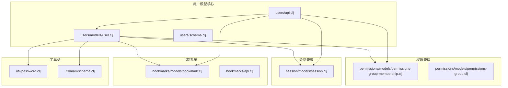
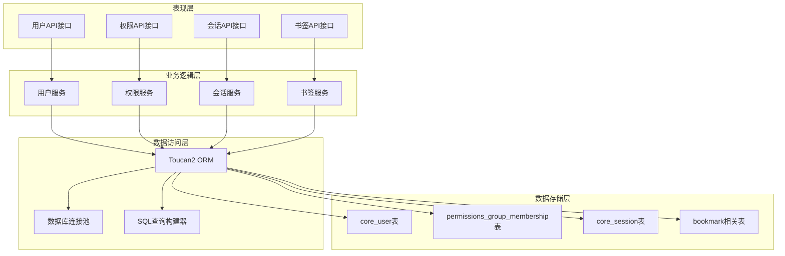
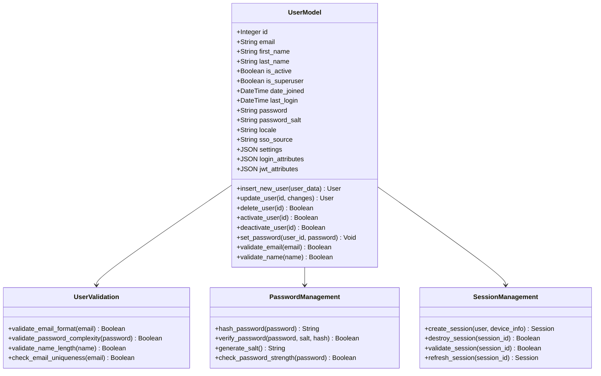
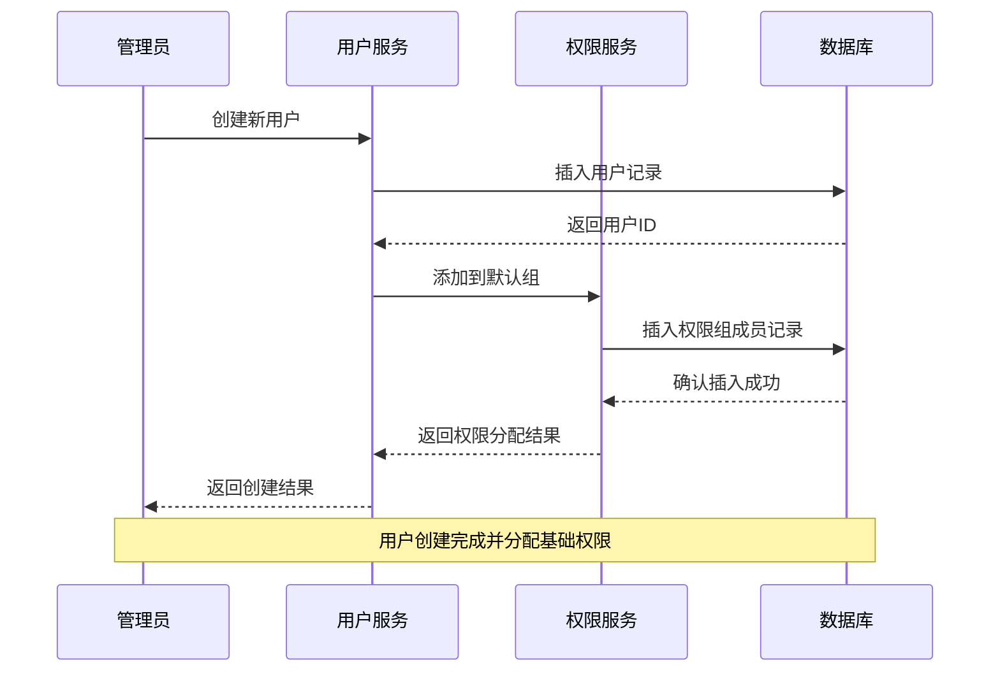
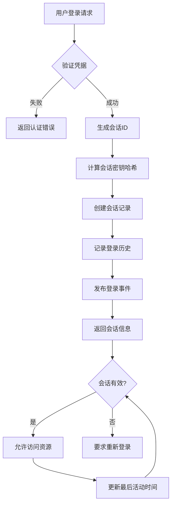
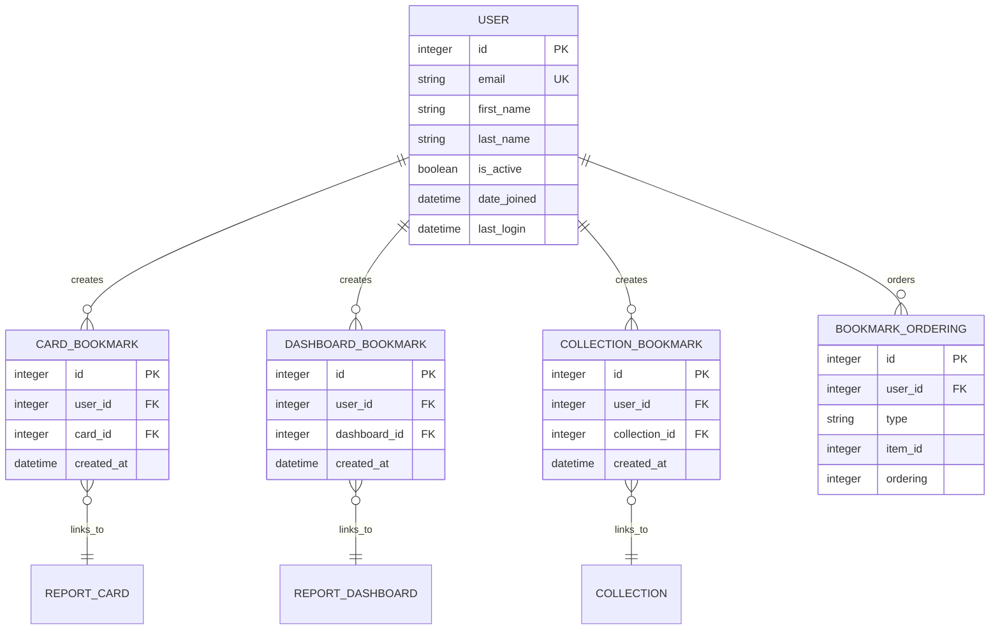
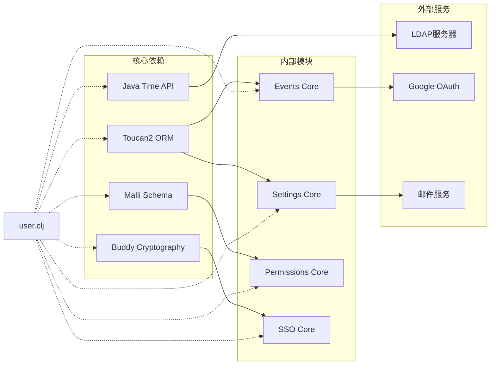

# 用户模型

<cite>
**本文档中引用的文件**
- [user.clj](file://src/metabase/users/models/user.clj)
- [permissions_group_membership.clj](file://src/metabase/permissions/models/permissions-group-membership.clj)
- [session.clj](file://src/metabase/session/models/session.clj)
- [bookmark.clj](file://src/metabase/bookmarks/models/bookmark.clj)
- [schema.clj](file://src/metabase/users/schema.clj)
- [api.clj](file://src/metabase/users/api.clj)
- [password.clj](file://src/metabase/util/password.clj)
- [custom_migrations.clj](file://src/metabase/app_db/custom_migrations.clj)
</cite>

## 目录
1. [简介](#简介)
2. [项目结构](#项目结构)
3. [核心组件](#核心组件)
4. [架构概览](#架构概览)
5. [详细组件分析](#详细组件分析)
6. [依赖关系分析](#依赖关系分析)
7. [性能考虑](#性能考虑)
8. [故障排除指南](#故障排除指南)
9. [结论](#结论)

## 简介

Metabase用户模型是一个复杂而完整的身份管理系统，负责处理用户注册、认证、授权和生命周期管理。该系统采用Clojure语言构建，使用Toucan2 ORM框架进行数据库操作，实现了多层次的安全控制和灵活的权限管理机制。

用户模型不仅包含基本的身份信息，还集成了权限组管理、会话控制、书签功能等多个子系统，形成了一个统一的用户管理体系。

## 项目结构

Metabase用户模型的实现分布在多个命名空间中，每个模块负责特定的功能领域：

**图表来源**
- [user.clj](file://src/metabase/users/models/user.clj#L1-L50)
- [permissions_group_membership.clj](file://src/metabase/permissions/models/permissions-group-membership.clj#L1-L30)
- [session.clj](file://src/metabase/session/models/session.clj#L1-L30)
- [bookmark.clj](file://src/metabase/bookmarks/models/bookmark.clj#L1-L30)

**章节来源**
- [user.clj](file://src/metabase/users/models/user.clj#L1-L422)
- [schema.clj](file://src/metabase/users/schema.clj#L1-L25)

## 核心组件

### 用户实体字段定义

用户实体包含以下核心字段，每个字段都有明确的数据类型和约束条件：

| 字段名 | 数据类型 | 描述 | 约束条件 |
|--------|----------|------|----------|
| id | Integer | 用户唯一标识符 | 主键，自增 |
| email | String | 用户邮箱地址 | 唯一，非空，必须是有效邮箱格式 |
| first_name | String | 用户名字 | 可选，最大长度限制 |
| last_name | String | 用户姓氏 | 可选，最大长度限制 |
| password | String | 密码哈希值 | 加密存储，bcrypt算法 |
| password_salt | String | 密码盐值 | 随机生成，用于密码加密 |
| is_active | Boolean | 用户激活状态 | 默认为true，禁用时为false |
| is_superuser | Boolean | 超级用户标志 | 全局管理员权限 |
| date_joined | DateTime | 注册时间 | 自动设置当前时间 |
| last_login | DateTime | 最后登录时间 | 记录用户最后登录时间 |
| deactivated_at | DateTime | 禁用时间 | 用户被禁用的时间戳 |
| locale | String | 本地化设置 | 支持的语言环境 |
| sso_source | String | 单点登录来源 | LDAP、Google等认证源 |
| settings | JSON | 用户设置 | 存储用户个性化配置 |
| login_attributes | JSON | 登录属性 | 认证相关元数据 |
| jwt_attributes | JSON | JWT属性 | JWT令牌相关属性 |

### 用户类型分类

系统支持三种用户类型，每种类型具有不同的行为特征：

- **personal**: 普通用户账户，通过标准注册流程创建
- **api-key**: API密钥用户，用于程序化访问
- **internal**: 内部系统用户，由系统自动创建

**章节来源**
- [user.clj](file://src/metabase/users/models/user.clj#L40-L80)
- [schema.clj](file://src/metabase/users/schema.clj#L10-L25)

## 架构概览

Metabase用户模型采用分层架构设计，确保了良好的关注点分离和可维护性：

**图表来源**
- [user.clj](file://src/metabase/users/models/user.clj#L25-L45)
- [api.clj](file://src/metabase/users/api.clj#L1-L50)

## 详细组件分析

### 用户模型核心实现

用户模型的核心实现在`user.clj`文件中，包含了完整的CRUD操作和生命周期管理：

**图表来源**
- [user.clj](file://src/metabase/users/models/user.clj#L40-L120)
- [password.clj](file://src/metabase/util/password.clj#L89-L121)

### 权限组关联机制

用户与权限组之间的关联通过多对多关系实现，支持复杂的权限继承和管理：

**图表来源**
- [permissions_group_membership.clj](file://src/metabase/permissions/models/permissions-group-membership.clj#L120-L180)
- [user.clj](file://src/metabase/users/models/user.clj#L110-L140)

### 会话管理机制

会话管理确保用户认证状态的安全性和有效性：

**图表来源**
- [session.clj](file://src/metabase/session/models/session.clj#L60-L106)

### 书签系统集成

用户书签功能提供了个性化的快速访问机制：

**图表来源**
- [bookmark.clj](file://src/metabase/bookmarks/models/bookmark.clj#L10-L30)

**章节来源**
- [user.clj](file://src/metabase/users/models/user.clj#L190-L250)
- [permissions_group_membership.clj](file://src/metabase/permissions/models/permissions-group-membership.clj#L1-L225)
- [session.clj](file://src/metabase/session/models/session.clj#L1-L107)
- [bookmark.clj](file://src/metabase/bookmarks/models/bookmark.clj#L1-L172)

## 依赖关系分析

用户模型与其他系统组件之间存在复杂的依赖关系：

**图表来源**
- [user.clj](file://src/metabase/users/models/user.clj#L2-L25)

**章节来源**
- [user.clj](file://src/metabase/users/models/user.clj#L1-L30)
- [api.clj](file://src/metabase/users/api.clj#L1-L30)

## 性能考虑

### 查询优化策略

1. **索引设计**: 在email字段上建立唯一索引，提高查找效率
2. **批量操作**: 使用批量插入和更新减少数据库交互次数
3. **缓存机制**: 对频繁访问的用户信息实施缓存策略
4. **分页查询**: 大列表查询采用分页方式避免内存溢出

### 安全最佳实践

1. **密码加密**: 使用bcrypt算法加盐存储密码
2. **输入验证**: 严格的输入验证防止SQL注入和XSS攻击
3. **会话安全**: 实施会话固定保护和CSRF防护
4. **权限控制**: 基于角色的访问控制(RBAC)机制

## 故障排除指南

### 常见问题及解决方案

1. **用户无法登录**
   - 检查用户是否被禁用
   - 验证密码哈希是否正确
   - 确认会话是否过期

2. **权限分配失败**
   - 验证权限组是否存在
   - 检查用户与权限组的匹配关系
   - 确认事务完整性

3. **密码重置问题**
   - 检查重置令牌是否有效
   - 验证重置触发时间
   - 确认邮件发送配置

**章节来源**
- [user.clj](file://src/metabase/users/models/user.clj#L350-L422)
- [password.clj](file://src/metabase/util/password.clj#L60-L91)

## 结论

Metabase用户模型是一个设计精良、功能完备的身份管理系统。它不仅满足了基本的用户管理需求，还通过灵活的权限控制、安全的密码管理和完善的生命周期管理，为企业级应用提供了可靠的基础支撑。

系统的模块化设计使得各个功能组件可以独立演进，同时保持良好的协作关系。通过持续的优化和改进，该用户模型能够适应不断变化的业务需求和技术挑战。