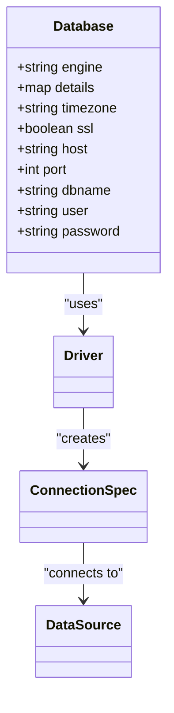
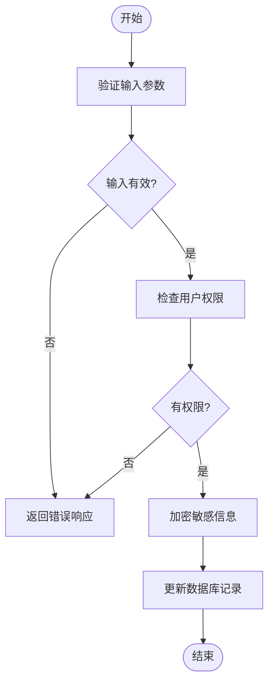
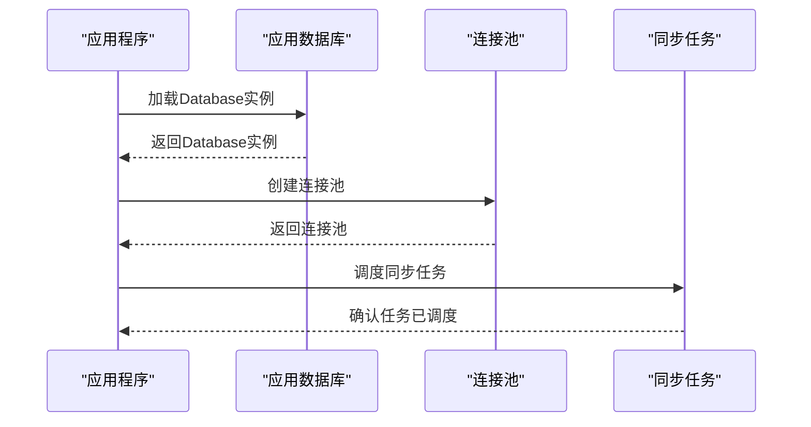
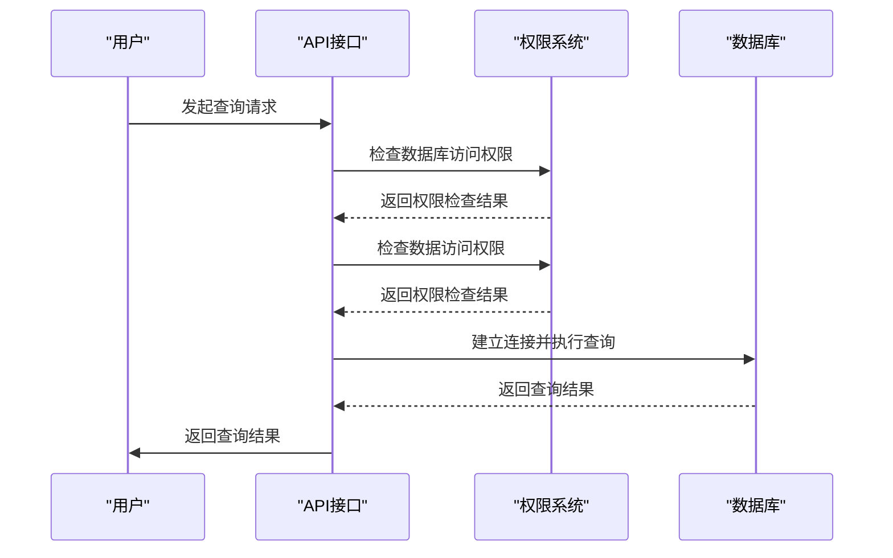

# Database模型

<cite>
**本文档中引用的文件**  
- [database.clj](file://src/metabase/warehouses/models/database.clj)
- [spec.clj](file://src/metabase/app_db/spec.clj)
- [core.clj](file://src/metabase/app_db/core.clj)
- [sync_metadata.clj](file://src/metabase/sync/sync_metadata.clj)
- [connection.clj](file://src/metabase/driver/sql_jdbc/connection.clj)
- [sync_timezone.clj](file://src/metabase/sync/sync_metadata/sync_timezone.clj)
</cite>

## 目录
1. [引言](#引言)
2. [Database模型设计与实现](#database模型设计与实现)
3. [数据库连接属性详解](#数据库连接属性详解)
4. [字段验证与安全校验](#字段验证与安全校验)
5. [应用启动时的初始化流程](#应用启动时的初始化流程)
6. [与app_db模块的交互方式](#与app_db模块的交互方式)
7. [元数据定期更新机制](#元数据定期更新机制)
8. [查询路由与权限控制中的作用](#查询路由与权限控制中的作用)
9. [实际代码示例](#实际代码示例)
10. [结论](#结论)

## 引言
Metabase是一个开源的数据分析平台，允许用户通过简单的界面连接到各种数据库并执行查询。在Metabase中，`Database`模型是核心组件之一，负责管理数据库连接、元数据同步和权限控制。本文档深入阐述了`Database`模型的设计与实现，重点解析`database.clj`文件中定义的数据库连接属性，包括引擎类型（engine）、连接字符串（details）、时区配置（timezone）和SSL设置。结合`spec.clj`中的验证规则，说明字段完整性约束与安全校验机制。文档涵盖`Database`实例在应用启动时的初始化流程、与`app_db`模块的交互方式，以及如何通过`sync`模块定期更新元数据。提供实际代码示例展示创建和配置`Database`实例的过程，并解释其在查询路由和权限控制中的作用。

## Database模型设计与实现

`Database`模型在Metabase中扮演着至关重要的角色，它不仅定义了数据库的基本属性，还负责处理数据库连接、元数据同步和权限控制等关键功能。该模型位于`src/metabase/warehouses/models/database.clj`文件中，使用Clojure语言编写，利用Toucan2 ORM框架进行数据持久化操作。

`Database`模型通过`defmethod`和`methodical/defmethod`定义了一系列生命周期方法，如`after-insert`、`after-select`、`before-update`和`before-delete`，这些方法确保了在数据库记录插入、选择、更新和删除时执行相应的业务逻辑。例如，在插入新数据库记录后，会自动设置默认权限并调度同步任务；在更新数据库记录前，会对连接详情进行归一化处理，并根据驱动支持情况检查是否允许启用特定功能。

此外，`Database`模型还实现了序列化和反序列化功能，确保数据库连接详情的安全性。通过`secret/clean-secret-properties-from-database`函数，敏感信息在返回给前端之前会被清理，防止泄露。同时，模型还支持通过`serdes`模块导出和导入数据库配置，便于迁移和备份。

**Section sources**
- [database.clj](file://src/metabase/warehouses/models/database.clj#L1-L615)

## 数据库连接属性详解

`Database`模型中的连接属性是其核心组成部分，主要包括引擎类型（engine）、连接字符串（details）、时区配置（timezone）和SSL设置。这些属性共同决定了Metabase如何与外部数据库建立连接并进行交互。

### 引擎类型（engine）
引擎类型指定了要连接的数据库类型，如PostgreSQL、MySQL、H2等。在`database.clj`文件中，`engine`字段被定义为关键字类型，通过`mi/transform-keyword`转换器确保其值始终为关键字。这使得后续的驱动选择和功能判断更加高效和一致。

### 连接字符串（details）
连接字符串包含了连接到目标数据库所需的所有信息，如主机地址、端口号、数据库名称、用户名和密码等。`details`字段被定义为加密JSON类型，通过`mi/transform-encrypted-json`转换器对其进行加密存储，以保护敏感信息。此外，`details`字段还支持动态属性，允许不同数据库驱动添加特定的连接参数。

### 时区配置（timezone）
时区配置用于确定数据库的默认时区，这对于正确解析和显示时间戳数据至关重要。`timezone`字段存储了数据库的时区ID，如"UTC"或"America/New_York"。在`sync_timezone.clj`文件中，`sync-timezone!`函数通过查询数据库的当前时间来确定其默认时区，并将结果更新到`Database`模型中。

### SSL设置
SSL设置控制是否使用安全套接层协议加密数据库连接。在`driver/postgres.clj`和`driver/mysql.clj`文件中，分别定义了PostgreSQL和MySQL驱动的SSL相关属性，如`ssl`和`ssl-mode`。这些属性允许用户根据需要启用或禁用SSL连接，并指定不同的SSL模式，如"require"或"verify-ca"。



**Diagram sources**
- [database.clj](file://src/metabase/warehouses/models/database.clj#L1-L615)
- [connection.clj](file://src/metabase/driver/sql_jdbc/connection.clj#L1-L383)

**Section sources**
- [database.clj](file://src/metabase/warehouses/models/database.clj#L1-L615)
- [connection.clj](file://src/metabase/driver/sql_jdbc/connection.clj#L1-L383)

## 字段验证与安全校验

为了确保`Database`模型的数据完整性和安全性，Metabase在多个层面实施了严格的验证和校验机制。这些机制主要体现在`spec.clj`文件中定义的验证规则，以及`database.clj`文件中实现的生命周期方法。

### 字段完整性约束
在`spec.clj`文件中，`spec`多方法为不同类型的数据库创建JDBC连接规范。每个具体实现都包含了对连接参数的验证逻辑，确保所有必需的字段都已提供且格式正确。例如，对于PostgreSQL数据库，`host`、`port`和`db`字段都是必需的，且`port`必须是一个有效的整数。

### 安全校验机制
除了基本的字段验证外，Metabase还实施了多层次的安全校验机制。首先，`details`字段中的敏感信息（如密码）在存储前会被加密，并在返回给前端前被清理。其次，`before-update`生命周期方法会在更新数据库记录前检查驱动是否支持特定功能，如动作（actions）和数据编辑（data-editing），如果不支持则抛出异常阻止更新。最后，`can-write?`方法会检查当前用户是否有权修改数据库详情，进一步增强了系统的安全性。



**Diagram sources**
- [spec.clj](file://src/metabase/app_db/spec.clj#L1-L82)
- [database.clj](file://src/metabase/warehouses/models/database.clj#L1-L615)

**Section sources**
- [spec.clj](file://src/metabase/app_db/spec.clj#L1-L82)
- [database.clj](file://src/metabase/warehouses/models/database.clj#L1-L615)

## 应用启动时的初始化流程

当Metabase应用程序启动时，`Database`模型的初始化流程是整个系统正常运行的基础。这一流程涉及多个步骤，从加载数据库配置到建立连接池，再到启动同步任务，确保所有连接的数据库都能被正确识别和使用。

### 加载数据库配置
在`core.clj`文件中，`init!*`函数负责初始化应用程序。其中，`t2/select :model/Database`调用从应用数据库中加载所有已配置的`Database`实例。这些实例包含了连接到外部数据库所需的所有信息，如引擎类型、连接字符串和时区配置。

### 建立连接池
一旦加载了`Database`实例，Metabase会为每个实例创建一个连接池。在`connection.clj`文件中，`db->pooled-connection-spec`函数负责生成带有C3P0 `ComboPooledDataSource`的JDBC连接规范。这个连接池被缓存起来，避免为同一个数据库创建多个连接池，从而提高性能和资源利用率。

### 启动同步任务
在`database.clj`文件中，`t2/define-after-insert`宏定义了一个`after-insert`生命周期方法，该方法在插入新的`Database`记录后自动调用`check-and-schedule-tasks-for-db!`函数。此函数负责调度数据库同步和分析任务，确保新添加的数据库能够及时同步元数据。



**Diagram sources**
- [core.clj](file://src/metabase/app_db/core.clj#L1-L165)
- [connection.clj](file://src/metabase/driver/sql_jdbc/connection.clj#L1-L383)
- [database.clj](file://src/metabase/warehouses/models/database.clj#L1-L615)

**Section sources**
- [core.clj](file://src/metabase/app_db/core.clj#L1-L165)
- [connection.clj](file://src/metabase/driver/sql_jdbc/connection.clj#L1-L383)
- [database.clj](file://src/metabase/warehouses/models/database.clj#L1-L615)

## 与app_db模块的交互方式

`Database`模型与`app_db`模块之间存在紧密的交互关系，这种交互主要体现在数据库连接、元数据存储和配置管理等方面。`app_db`模块提供了访问应用数据库的API，而`Database`模型则利用这些API来完成各种操作。

### 数据库连接
`app_db`模块通过`data-source`函数提供了一个可连接的应用数据库实例。`Database`模型在需要访问应用数据库时，会调用此函数获取数据源。例如，在`check-health!`函数中，`t2/select :model/Database`调用依赖于`data-source`提供的连接来查询所有已配置的数据库实例。

### 元数据存储
`Database`模型的元数据（如表结构、字段信息等）存储在应用数据库中。当需要同步外部数据库的元数据时，`Database`模型会通过`app_db`模块提供的`query`函数执行SQL查询，将结果保存到应用数据库中。这一过程确保了Metabase内部状态与外部数据库的一致性。

### 配置管理
`app_db`模块还负责管理应用级别的配置，如数据库迁移、加密设置等。`Database`模型在初始化或更新时，可能会调用`app_db`模块的相关函数来获取或更新这些配置。例如，在`maybe-test-and-migrate-details!`函数中，`driver.u/can-connect-with-details?`调用可能需要访问应用数据库中的驱动配置信息。

```mermaid
graph TB
subgraph "Metabase应用"
DB[(应用数据库)]
App[Database模型]
end
subgraph "外部系统"
ExternalDB[(外部数据库)]
end
App --> DB: 读取/写入元数据
App --> ExternalDB: 查询/同步数据
DB --> App: 提供配置信息
```

**Diagram sources**
- [core.clj](file://src/metabase/app_db/core.clj#L1-L165)
- [database.clj](file://src/metabase/warehouses/models/database.clj#L1-L615)

**Section sources**
- [core.clj](file://src/metabase/app_db/core.clj#L1-L165)
- [database.clj](file://src/metabase/warehouses/models/database.clj#L1-L615)

## 元数据定期更新机制

为了保持Metabase内部元数据与外部数据库的一致性，系统通过`sync`模块实现了定期更新机制。这一机制确保了即使外部数据库发生变更，Metabase也能及时反映这些变化，为用户提供准确的数据视图。

### 同步任务调度
在`sync_metadata.clj`文件中，`sync-db-metadata!`函数定义了同步数据库元数据的主要逻辑。该函数首先获取数据库的元数据，然后依次执行一系列同步步骤，包括同步表、字段、外键和索引等。每个步骤都有对应的摘要函数，用于记录同步结果。

### 定时触发
同步任务的触发由`task/start-scheduler!`函数控制。在`core.clj`文件中，`init!*`函数调用此函数启动任务调度器。调度器根据预设的时间间隔（通常为每小时一次）自动触发`sync-db-metadata!`函数，确保元数据的持续更新。

### 异常处理
在同步过程中，如果遇到任何异常，系统会记录错误日志并继续处理其他数据库。这样可以避免单个数据库的问题影响整个同步流程。此外，`sync-util/run-sync-operation`函数提供了同步操作的通用框架，支持中断和恢复功能，增强了系统的健壮性。


**Diagram sources**
- [sync_metadata.clj](file://src/metabase/sync/sync_metadata.clj#L1-L79)
- [core.clj](file://src/metabase/app_db/core.clj#L1-L165)

**Section sources**
- [sync_metadata.clj](file://src/metabase/sync/sync_metadata.clj#L1-L79)
- [core.clj](file://src/metabase/app_db/core.clj#L1-L165)

## 查询路由与权限控制中的作用

`Database`模型在查询路由和权限控制中发挥着重要作用，确保用户只能访问其被授权的数据库和数据。这一机制通过多层次的权限检查和路由策略实现，保障了系统的安全性和灵活性。

### 查询路由
在`database_routing/core.clj`文件中，`with-database-routing-on`宏定义了数据库路由的开启逻辑。当路由功能启用时，系统会根据用户的权限和请求的目标数据库，决定是否允许访问。对于路由数据库，直接访问将被拒绝，除非特别配置。

### 权限控制
权限控制主要通过`permissions/models/data_permissions.clj`文件中的`set-database-permission!`函数实现。该函数允许管理员为特定用户组设置数据库级别的权限，如查看数据、创建查询和下载结果等。权限级别包括`unrestricted`、`blocked`和`query-builder-and-native`等，满足不同场景的需求。

### 实际应用
在实际应用中，当用户发起查询请求时，系统首先检查其对目标数据库的访问权限。如果权限不足，则直接拒绝请求；否则，系统会根据数据库的连接属性建立连接，并执行查询。查询结果返回前，还会再次检查用户对结果数据的访问权限，确保不会泄露敏感信息。



**Diagram sources**
- [database_routing/core.clj](file://src/metabase/database_routing/core.clj#L1-L44)
- [data_permissions.clj](file://src/metabase/permissions/models/data_permissions.clj#L1-L800)

**Section sources**
- [database_routing/core.clj](file://src/metabase/database_routing/core.clj#L1-L44)
- [data_permissions.clj](file://src/metabase/permissions/models/data_permissions.clj#L1-L800)

## 实际代码示例

以下是一个创建和配置`Database`实例的实际代码示例，展示了如何使用Metabase API完成这一过程。

```clojure
;; 创建一个新的Database实例
(def new-db {:name "My PostgreSQL Database"
             :engine :postgres
             :details {:host "localhost"
                       :port 5432
                       :dbname "mydb"
                       :user "myuser"
                       :password "mypassword"}
             :timezone "UTC"
             :ssl true})

;; 插入到应用数据库中
(t2/insert! :model/Database new-db)

;; 获取刚插入的Database实例
(def db-instance (t2/select-one :model/Database :name "My PostgreSQL Database"))

;; 检查连接是否成功
(driver/can-connect? (:engine db-instance) (:details db-instance))

;; 调度同步任务
(check-and-schedule-tasks-for-db! db-instance)
```

此示例首先定义了一个新的`Database`实例，包含必要的连接信息。然后使用`t2/insert!`函数将其插入到应用数据库中。接着，通过`t2/select-one`函数获取刚插入的实例，并使用`driver/can-connect?`函数检查连接是否成功。最后，调用`check-and-schedule-tasks-for-db!`函数调度同步任务，确保新添加的数据库能够及时同步元数据。

**Section sources**
- [database.clj](file://src/metabase/warehouses/models/database.clj#L1-L615)
- [connection.clj](file://src/metabase/driver/sql_jdbc/connection.clj#L1-L383)

## 结论

通过对`Database`模型的深入分析，我们可以看到Metabase在设计上充分考虑了灵活性、安全性和可维护性。`Database`模型不仅定义了数据库连接的基本属性，还通过丰富的生命周期方法和验证机制确保了数据的完整性和安全性。与`app_db`模块的紧密交互使得元数据管理更加高效，而定期更新机制则保证了系统与外部数据库的一致性。在查询路由和权限控制方面，`Database`模型通过多层次的检查和策略实现了细粒度的访问控制，为用户提供了一个安全可靠的数据分析平台。未来的工作可以进一步优化同步性能，增强对更多数据库类型的支持，并提升用户体验。