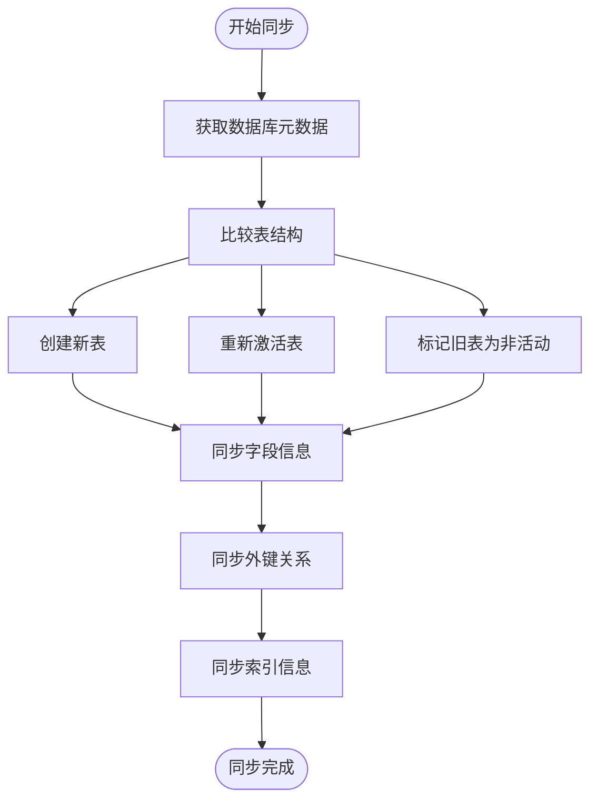
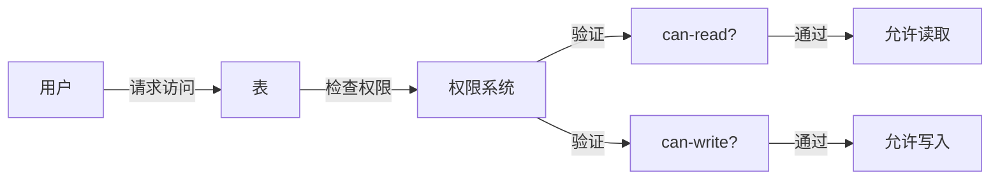
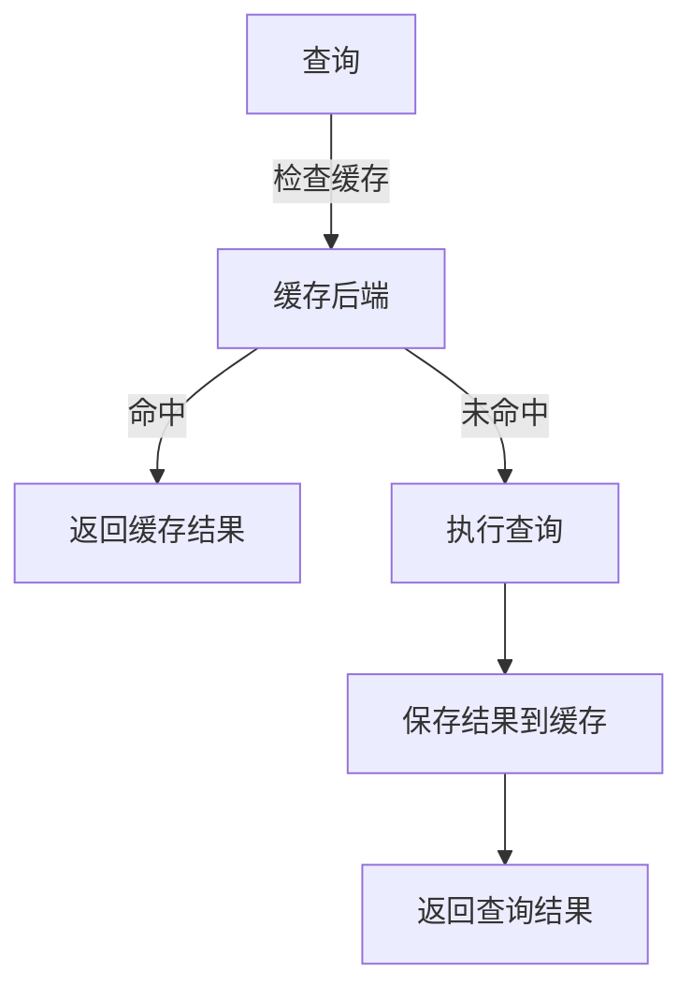
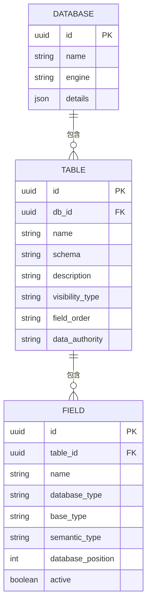

# Table模型

<cite>
**本文档中引用的文件**  
- [table.clj](file://src/metabase/warehouse_schema/models/table.clj)
- [interface.clj](file://src/metabase/models/interface.clj)
- [sync_metadata.clj](file://src/metabase/sync/sync_metadata.clj)
- [sync_tables.clj](file://src/metabase/sync/sync_metadata/tables.clj)
- [sync_fields.clj](file://src/metabase/sync/sync_metadata/fields/sync_instances.clj)
- [query_cache.clj](file://src/metabase/cache/models/query_cache.clj)
- [cache.clj](file://src/metabase/query_processor/middleware/cache.clj)
</cite>

## 目录
1. [简介](#简介)
2. [Table模型结构](#table模型结构)
3. [生命周期管理](#生命周期管理)
4. [元数据同步流程](#元数据同步流程)
5. [可见性控制与权限](#可见性控制与权限)
6. [缓存策略](#缓存策略)
7. [查询处理器中的引用](#查询处理器中的引用)
8. [实体关系图](#实体关系图)

## 简介
`Table`模型是Metabase系统中的核心数据结构，用于表示和管理数据库中的表。该模型不仅存储表的基本属性，还负责与底层数据库的同步、权限控制、缓存策略等关键功能。本文档详细描述了`Table`模型的结构、行为及其在系统中的作用。

## Table模型结构

`Table`模型定义了表的多个核心属性，包括名称、模式、描述等，这些属性存储在应用数据库中，并与底层数据库表保持映射关系。

- **name**: 表的名称，作为唯一标识符。
- **schema**: 表所属的模式（schema），用于组织数据库对象。
- **description**: 表的描述信息，提供关于表用途的详细说明。
- **display_name**: 人类可读的显示名称，通常由系统根据`name`自动生成。
- **visibility_type**: 控制表的可见性，有效值包括`:hidden`、`:technical`、`:cruft`等。
- **field_order**: 字段排序方式，支持`:database`、`:alphabetical`、`:custom`、`:smart`四种模式。
- **data_authority**: 数据权威性类型，指示表的数据来源状态，如`:unconfigured`、`:authoritative`、`:computed`、`:ingested`。

这些属性通过`warehouse_schema.models.table`命名空间中的定义进行管理，并通过Toucan ORM框架实现持久化。

**Section sources**
- [table.clj](file://src/metabase/warehouse_schema/models/table.clj#L1-L100)

## 生命周期管理

`Table`模型的生命周期管理遵循通用模型接口`interface.clj`，支持创建、更新和删除操作。这些操作通过Toucan的生命周期钩子（lifecycle hooks）实现自动化处理。

### 创建
当创建新的`Table`实例时，系统会自动执行以下操作：
- 生成`entity_id`作为唯一标识。
- 设置默认的`display_name`，基于表名进行人性化转换。
- 初始化`field_order`为数据库默认顺序。
- 为新表设置默认权限，确保所有用户组具有基本的数据访问权限。

### 更新
更新`Table`实例时，系统会检查字段的变化并相应地更新数据库记录。关键更新逻辑包括：
- 防止将`data_authority`重置为`unconfigured`状态，一旦配置后不可逆。
- 处理表的激活与停用状态变更，更新`deactivated_at`和`archived_at`时间戳。

### 删除
删除`Table`实例时，系统首先删除其关联的`Field`对象，然后才删除表本身。这种顺序确保了数据完整性，避免了外键约束问题。

**Section sources**
- [table.clj](file://src/metabase/warehouse_schema/models/table.clj#L101-L300)
- [interface.clj](file://src/metabase/models/interface.clj#L1-L200)

## 元数据同步流程

`Table`模型通过`sync_metadata`流程从外部数据库同步结构信息。这一过程确保了Metabase应用数据库中的表定义与实际数据库保持一致。

### 同步步骤
1. **获取数据库元数据**：调用驱动程序的`describe-database`方法获取当前数据库的元数据。
2. **同步表结构**：比较现有表与数据库中的表，创建新表或重新激活已存在的表。
3. **同步字段信息**：为每个表同步字段定义，包括字段类型、位置、主键等属性。
4. **同步外键关系**：建立表之间的外键关联，确保数据完整性。
5. **同步索引信息**：如果数据库支持，同步索引信息以优化查询性能。

### 同步实现
同步逻辑主要在`sync/sync_metadata.clj`和`sync/sync_metadata/tables.clj`中实现。`sync-db-metadata!`函数负责协调整个同步过程，而`sync-table-metadata!`则专注于单个表的元数据同步。

**Diagram sources**
- [sync_metadata.clj](file://src/metabase/sync/sync_metadata.clj#L52-L77)
- [tables.clj](file://src/metabase/sync/sync_metadata/tables.clj#L300-L400)

## 可见性控制与权限

`Table`模型的可见性控制通过`visibility_type`属性实现，允许管理员隐藏技术性或冗余的表。此外，权限系统确保只有授权用户才能访问特定表。

### 可见性类型
- `:hidden`: 完全隐藏表，仅管理员可见。
- `:technical`: 技术性表，对普通用户隐藏。
- `:cruft`: 冗余表，如框架生成的迁移表，自动隐藏。

### 权限检查
权限检查通过`can-read?`和`can-write?`多方法实现。对于`Table`模型，读取权限要求用户具有数据查看权限，写入权限则需要超级用户身份或特定的数据模型管理权限。

**Diagram sources**
- [table.clj](file://src/metabase/warehouse_schema/models/table.clj#L301-L400)
- [interface.clj](file://src/metabase/models/interface.clj#L600-L800)

## 缓存策略

`Table`模型相关的查询结果可以通过缓存机制提高性能。缓存策略由查询处理器中间件管理，确保频繁访问的数据能够快速响应。

### 缓存条件
查询结果可缓存需满足以下条件：
- 启用了查询缓存功能。
- 查询包含有效的`cache-strategy`值。
- 策略类型不是`:nocache`。
- 查询结果大小不超过`query-caching-max-kb`限制。

### 缓存实现
缓存实现基于`query_processor.middleware.cache`模块，使用数据库表`query_cache`存储序列化的查询结果。缓存条目包含查询哈希、结果数据和更新时间戳，支持定期清理过期条目。

**Diagram sources**
- [cache.clj](file://src/metabase/query_processor/middleware/cache.clj#L176-L245)
- [query_cache.clj](file://src/metabase/cache/models/query_cache.clj#L1-L11)

## 查询处理器中的引用

`Table`模型在查询处理器中被广泛引用，作为构建和执行查询的基础。查询处理器利用`Table`的元数据信息生成高效的SQL查询，并通过缓存机制优化性能。

### 查询构建
查询处理器根据`Table`的字段定义和关系信息构建查询计划。字段的`base_type`、`semantic_type`等属性用于确定数据类型和语义，从而生成正确的SQL表达式。

### 性能优化
通过分析`Table`的索引信息和统计信息，查询处理器可以优化查询执行计划，选择最优的索引和连接策略。此外，缓存机制减少了重复查询的开销，提高了整体系统性能。

**Section sources**
- [cache.clj](file://src/metabase/query_processor/middleware/cache.clj#L1-L200)
- [interface.clj](file://src/metabase/query_processor/interface.clj#L1-L16)

## 实体关系图

以下是`Table`模型与`Database`和`Field`的实体关系图，展示了它们之间的一对多关系。

**Diagram sources**
- [table.clj](file://src/metabase/warehouse_schema/models/table.clj#L1-L100)
- [field.clj](file://src/metabase/warehouse_schema/models/field.clj#L1-L37)