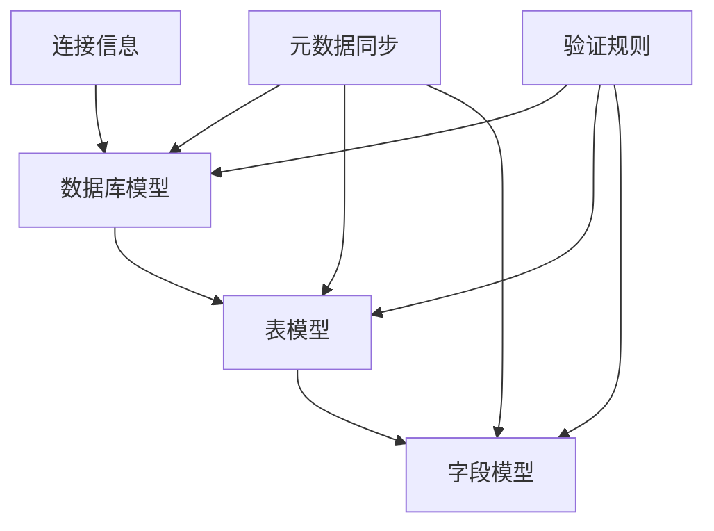
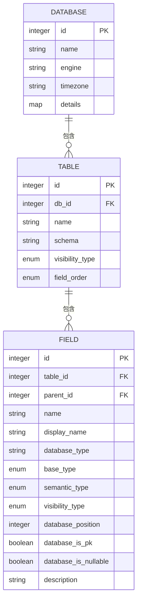
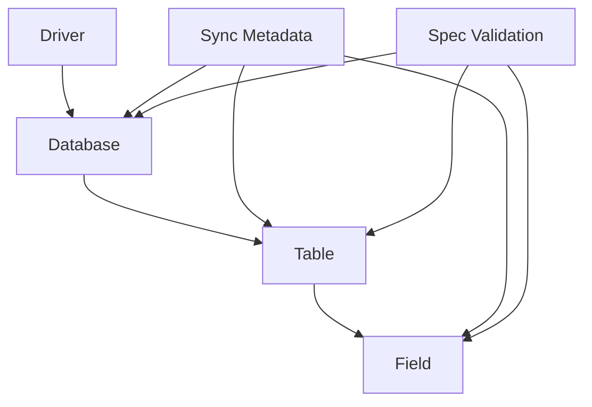

# 数据库与表模型

<cite>
**本文档引用的文件**
- [database.clj](file://src/metabase/warehouse_schema/models/database.clj)
- [table.clj](file://src/metabase/warehouse_schema/models/table.clj)
- [field.clj](file://src/metabase/warehouse_schema/models/field.clj)
- [sync_metadata.clj](file://src/metabase/sync/sync_metadata.clj)
- [spec.clj](file://src/metabase/app_db/spec.clj)
</cite>

## 目录
1. [引言](#引言)
2. [项目结构](#项目结构)
3. [核心组件](#核心组件)
4. [架构概述](#架构概述)
5. [详细组件分析](#详细组件分析)
6. [依赖分析](#依赖分析)
7. [性能考虑](#性能考虑)
8. [故障排除指南](#故障排除指南)
9. [结论](#结论)
10. [附录](#附录)（如有必要）

## 引言
本文档深入阐述Metabase中代表外部数据源的`Database`模型及其内部结构`Table`和`Field`。文档解释了连接信息存储、引擎类型、时区配置等属性，并描述了`table.clj`和`field.clj`如何映射底层数据库的元数据，包括字段类型推断、语义类型标注（如Category、Price）和可见性控制。结合`spec.clj`中的验证规则，说明了数据完整性保障机制。文档还涵盖了元数据同步流程（sync_metadata）如何更新这些模型。

## 项目结构
Metabase的数据库与表模型主要分布在`src/metabase/warehouse_schema/models/`目录下，其中包含`database.clj`、`table.clj`和`field.clj`三个核心文件。元数据同步功能位于`src/metabase/sync/`目录下，而连接信息和验证规则则分布在`src/metabase/app_db/`和`src/metabase/sync/`目录中。

**图示来源**
- [database.clj](file://src/metabase/warehouse_schema/models/database.clj)
- [table.clj](file://src/metabase/warehouse_schema/models/table.clj)
- [field.clj](file://src/metabase/warehouse_schema/models/field.clj)
- [sync_metadata.clj](file://src/metabase/sync/sync_metadata.clj)

**章节来源**
- [database.clj](file://src/metabase/warehouse_schema/models/database.clj)
- [table.clj](file://src/metabase/warehouse_schema/models/table.clj)
- [field.clj](file://src/metabase/warehouse_schema/models/field.clj)

## 核心组件
Metabase中的`Database`、`Table`和`Field`模型构成了数据源的核心结构。`Database`模型代表外部数据源，包含连接信息、引擎类型和时区配置等属性。`Table`模型映射数据库中的表，而`Field`模型则对应表中的字段。

**章节来源**
- [database.clj](file://src/metabase/warehouse_schema/models/database.clj)
- [table.clj](file://src/metabase/warehouse_schema/models/table.clj)
- [field.clj](file://src/metabase/warehouse_schema/models/field.clj)

## 架构概述
Metabase的数据库与表模型采用层次化结构，`Database`包含多个`Table`，每个`Table`又包含多个`Field`。元数据同步流程负责更新这些模型，确保它们与底层数据库的元数据保持一致。

**图示来源**
- [database.clj](file://src/metabase/warehouse_schema/models/database.clj)
- [table.clj](file://src/metabase/warehouse_schema/models/table.clj)
- [field.clj](file://src/metabase/warehouse_schema/models/field.clj)

## 详细组件分析
### Database模型分析
`Database`模型是Metabase中代表外部数据源的核心实体，它存储了连接到外部数据库所需的所有信息。

#### 连接信息存储
`Database`模型通过`details`字段存储连接信息，这些信息包括主机名、端口、数据库名称、用户名和密码等。连接信息以加密方式存储，确保数据安全。

#### 引擎类型
`engine`字段标识数据库的类型，如PostgreSQL、MySQL、H2等。引擎类型决定了Metabase如何与数据库交互，包括SQL语法、数据类型映射等。

#### 时区配置
`timezone`字段存储数据库的时区信息。Metabase使用此信息正确处理日期和时间数据，确保在不同时区之间进行准确的转换。

**章节来源**
- [database.clj](file://src/metabase/warehouse_schema/models/database.clj)
- [spec.clj](file://src/metabase/app_db/spec.clj)

### Table模型分析
`Table`模型映射数据库中的表，包含表的元数据信息。

#### 表元数据映射
`Table`模型通过`name`、`schema`等字段映射数据库表的名称和模式。`visibility_type`字段控制表的可见性，允许用户隐藏技术性或临时表。

#### 字段排序
`field_order`字段定义了表中字段的显示顺序，支持`database`（按数据库定义顺序）、`alphabetical`（按字母顺序）、`custom`（自定义顺序）和`smart`（智能排序）等多种排序方式。

**章节来源**
- [table.clj](file://src/metabase/warehouse_schema/models/table.clj)

### Field模型分析
`Field`模型对应数据库表中的字段，包含丰富的元数据信息。

#### 字段类型推断
`Field`模型通过`base_type`和`database_type`字段存储字段的数据类型。`base_type`是Metabase内部的标准化类型，而`database_type`是数据库特定的原始类型。

#### 语义类型标注
`semantic_type`字段允许用户为字段添加语义类型标注，如`Category`、`Price`、`Name`等。这些标注帮助Metabase更好地理解数据的含义，从而提供更智能的分析功能。

#### 可见性控制
`visibility_type`字段控制字段的可见性，支持`normal`（正常显示）、`details-only`（仅在详情中显示）、`sensitive`（敏感字段）和`retired`（已弃用）等多种状态。

**章节来源**
- [field.clj](file://src/metabase/warehouse_schema/models/field.clj)

## 依赖分析
Metabase的数据库与表模型之间存在明确的依赖关系。`Database`模型依赖于驱动程序来建立连接，`Table`模型依赖于`Database`模型，而`Field`模型则依赖于`Table`模型。

**图示来源**
- [database.clj](file://src/metabase/warehouse_schema/models/database.clj)
- [table.clj](file://src/metabase/warehouse_schema/models/table.clj)
- [field.clj](file://src/metabase/warehouse_schema/models/field.clj)
- [sync_metadata.clj](file://src/metabase/sync/sync_metadata.clj)
- [spec.clj](file://src/metabase/app_db/spec.clj)

**章节来源**
- [database.clj](file://src/metabase/warehouse_schema/models/database.clj)
- [table.clj](file://src/metabase/warehouse_schema/models/table.clj)
- [field.clj](file://src/metabase/warehouse_schema/models/field.clj)
- [sync_metadata.clj](file://src/metabase/sync/sync_metadata.clj)

## 性能考虑
在处理大型数据库时，元数据同步可能成为性能瓶颈。建议定期执行同步操作，并考虑在非高峰时段进行大规模同步。此外，合理使用字段的可见性控制可以减少前端渲染的数据量，提高用户体验。

## 故障排除指南
当遇到元数据同步问题时，首先检查数据库连接是否正常。然后查看Metabase日志，寻找与同步相关的错误信息。如果问题持续存在，可以尝试手动触发同步操作，或检查数据库用户权限是否足够。

**章节来源**
- [sync_metadata.clj](file://src/metabase/sync/sync_metadata.clj)
- [database.clj](file://src/metabase/warehouse_schema/models/database.clj)

## 结论
Metabase的`Database`、`Table`和`Field`模型提供了一个强大而灵活的框架，用于管理和分析外部数据源。通过深入理解这些模型的结构和功能，用户可以更好地利用Metabase进行数据探索和分析。