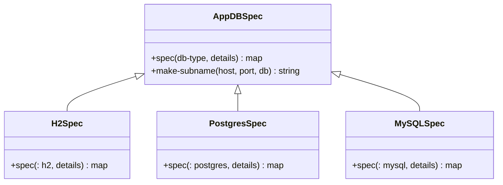
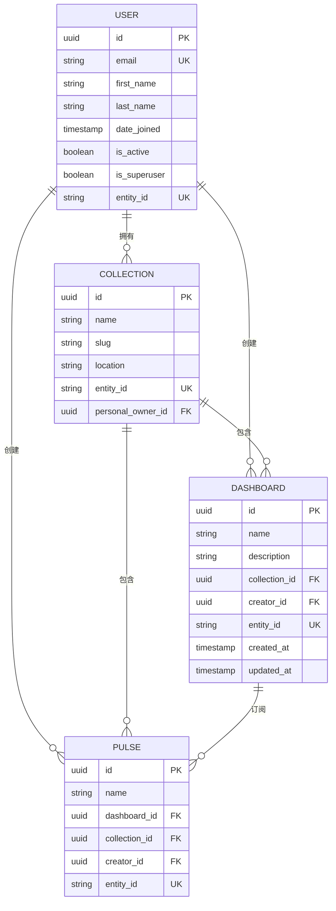

# 数据模型与ORM映射

<cite>
**本文档引用的文件**
- [user.clj](file://src\metabase\users\models\user.clj)
- [dashboard.clj](file://src\metabase\dashboards\models\dashboard.clj)
- [collection.clj](file://src\metabase\collections\models\collection.clj)
- [pulse.clj](file://src\metabase\pulse\models\pulse.clj)
- [spec.clj](file://src\metabase\app_db\spec.clj)
- [query.clj](file://src\metabase\app_db\query.clj)
- [core.clj](file://src\metabase\app_db\core.clj)
- [interface.clj](file://src\metabase\models\interface.clj)
- [serialization.clj](file://src\metabase\models\serialization.clj)
- [setup.clj](file://src\metabase\app_db\setup.clj)
</cite>

## 目录
1. [引言](#引言)
2. [核心数据实体](#核心数据实体)
3. [ORM层与应用数据库](#orm层与应用数据库)
4. [数据验证与查询构建](#数据验证与查询构建)
5. [数据生命周期与同步](#数据生命周期与同步)
6. [实体关系图(ERD)](#实体关系图erd)
7. [结论](#结论)

## 引言
本文档旨在全面阐述Metabase的核心数据模型，详细描述其关键数据实体、关系以及对象关系映射（ORM）层的实现。文档将深入分析`models/`目录下定义的核心模型，如`User`、`Dashboard`、`Collection`和`Pulse`，并解释`app_db`模块如何作为ORM层，将这些模型映射到后端的应用数据库（支持H2、MySQL、PostgreSQL）。此外，文档将涵盖数据验证、查询构建、序列化/反序列化机制以及与外部数据库元数据的同步逻辑。

## 核心数据实体
Metabase的数据模型围绕一系列核心实体构建，这些实体通过清晰的层次结构和关系来组织数据、用户和分析内容。

### 用户 (User)
`User`模型是系统权限和身份验证的基础。它存储了用户的基本信息，如电子邮件、姓名、密码哈希和账户状态。该模型通过`perms/use-parent-collection-perms`等权限策略，决定了用户对其他资源的访问权限。`User`实体是许多其他实体（如`Dashboard`、`Pulse`）的创建者和所有者。

**Section sources**
- [user.clj](file://src\metabase\users\models\user.clj#L1-L528)

### 仪表板 (Dashboard)
`Dashboard`模型代表一个包含多个可视化卡片（Cards）的容器。它通过`dashcards`关系与`DashboardCard`实体关联，后者定义了卡片在仪表板上的位置和配置。仪表板可以属于一个`Collection`，并继承其权限。`Dashboard`模型还支持参数化，允许用户通过动态参数与仪表板进行交互。

**Section sources**
- [dashboard.clj](file://src\metabase\dashboards\models\dashboard.clj#L1-L503)

### 集合 (Collection)
`Collection`模型用于组织和管理Metabase中的各种内容，如仪表板、查询和脉冲。它实现了类似文件系统的嵌套层次结构，通过`location`字段存储其在层次结构中的路径。`Collection`是权限管理的核心，决定了其内部所有内容的访问策略。个人集合（Personal Collection）是一种特殊类型的集合，与特定用户关联。

**Section sources**
- [collection.clj](file://src\metabase\collections\models\collection.clj#L1-L799)

### 脉冲 (Pulse)
`Pulse`模型代表一种通知机制，用于将查询结果定期或在满足特定条件时发送给用户。它可以是简单的定期报告，也可以是基于查询结果的警报（Alert）。`Pulse`通过`channels`关系与`PulseChannel`实体关联，后者定义了通知的发送方式（如邮件、Slack）。`Pulse`通常与一个`Dashboard`或一组`Card`关联。

**Section sources**
- [pulse.clj](file://src\metabase\pulse\models\pulse.clj#L1-L617)

## ORM层与应用数据库
`app_db`模块是Metabase与应用数据库交互的核心ORM层，它抽象了底层数据库的差异，为上层业务逻辑提供统一的数据访问接口。

### 数据库连接与配置
`app_db.spec`命名空间负责根据数据库类型（H2、PostgreSQL、MySQL）和连接详情创建JDBC连接规范。它通过`defmulti`定义了`spec`多态函数，为每种数据库类型生成相应的连接字符串和驱动类名。这使得应用可以无缝地在不同数据库之间切换。

**Diagram sources**
- [spec.clj](file://src\metabase\app_db\spec.clj#L1-L82)

### 查询构建与执行
`app_db.query`命名空间提供了基于Honey SQL 2的查询构建和执行功能。它封装了`Toucan2`库，提供了`query`、`select-or-insert!`和`update-or-insert!`等高级函数，简化了数据库的CRUD操作。`isa`和`join`等辅助函数使得构建复杂的查询条件和连接操作更加直观。

**Section sources**
- [query.clj](file://src\metabase\app_db\query.clj#L1-L232)
- [core.clj](file://src\metabase\app_db\core.clj#L1-L165)

### 数据库初始化与迁移
`app_db.setup`模块负责数据库的初始化、连接验证和模式迁移。它利用`Liquibase`库来管理数据库的变更历史，确保数据库模式与应用代码保持同步。`setup-db!`函数是数据库准备的入口点，它会检查连接、运行必要的迁移，并处理加密配置。

**Section sources**
- [setup.clj](file://src\metabase\app_db\setup.clj#L1-L291)

## 数据验证与查询构建
Metabase通过一套完善的机制来确保数据的完整性和查询的正确性。

### 数据验证规范
`models.interface`和`models.serialization`命名空间定义了通用的数据验证和转换规范。例如，`transform-json`、`transform-keyword`和`transform-encrypted-json`等转换器确保了JSON数据、关键字和加密字段的正确序列化与反序列化。`assert-enum`和`assert-namespaced`等断言函数在数据插入前进行严格的验证。

**Section sources**
- [interface.clj](file://src\metabase\models\interface.clj#L1-L799)
- [serialization.clj](file://src\metabase\models\serialization.clj#L1-L799)

### 查询构建模式
`query.clj`中定义的`isa`和`join`函数是构建复杂查询的关键。`isa`函数利用Metabase的类型层次结构，生成包含所有子类型的`IN`子句，简化了语义类型（如`type/URL`）的查询。`join`函数则提供了一种声明式的方式来定义表连接。

## 数据生命周期与同步
### 序列化与反序列化
`models.serialization`模块为数据模型的导出和导入（序列化与反序列化）提供了框架。`make-spec`多态函数定义了每个模型的序列化规范，包括需要复制的字段（`copy`）、需要跳过的字段（`skip`）以及需要转换的字段（`transform`）。`fk`和`nested`转换器处理了模型间的引用关系。

**Section sources**
- [serialization.clj](file://src\metabase\models\serialization.clj#L1-L799)

### 与外部数据库元数据的同步
虽然本文档主要关注应用数据库，但Metabase会定期从用户连接的外部数据库同步元数据（如表、字段信息）。这个过程由`sync`模块管理，它会扫描外部数据库的Schema，并将结果存储在应用数据库的`metabase_field`、`metabase_table`等表中，供用户在构建查询时使用。

## 实体关系图(ERD)

**Diagram sources**
- [user.clj](file://src\metabase\users\models\user.clj#L1-L528)
- [collection.clj](file://src\metabase\collections\models\collection.clj#L1-L799)
- [dashboard.clj](file://src\metabase\dashboards\models\dashboard.clj#L1-L503)
- [pulse.clj](file://src\metabase\pulse\models\pulse.clj#L1-L617)

## 结论
Metabase的数据模型设计精良，通过`User`、`Collection`、`Dashboard`和`Pulse`等核心实体，构建了一个功能强大且易于管理的分析平台。`app_db`模块作为ORM层，有效地抽象了底层数据库的复杂性，提供了安全、高效的数据库访问。通过`models.interface`和`models.serialization`提供的通用规范，确保了数据的一致性和可移植性。整体架构清晰，为系统的可扩展性和维护性奠定了坚实的基础。