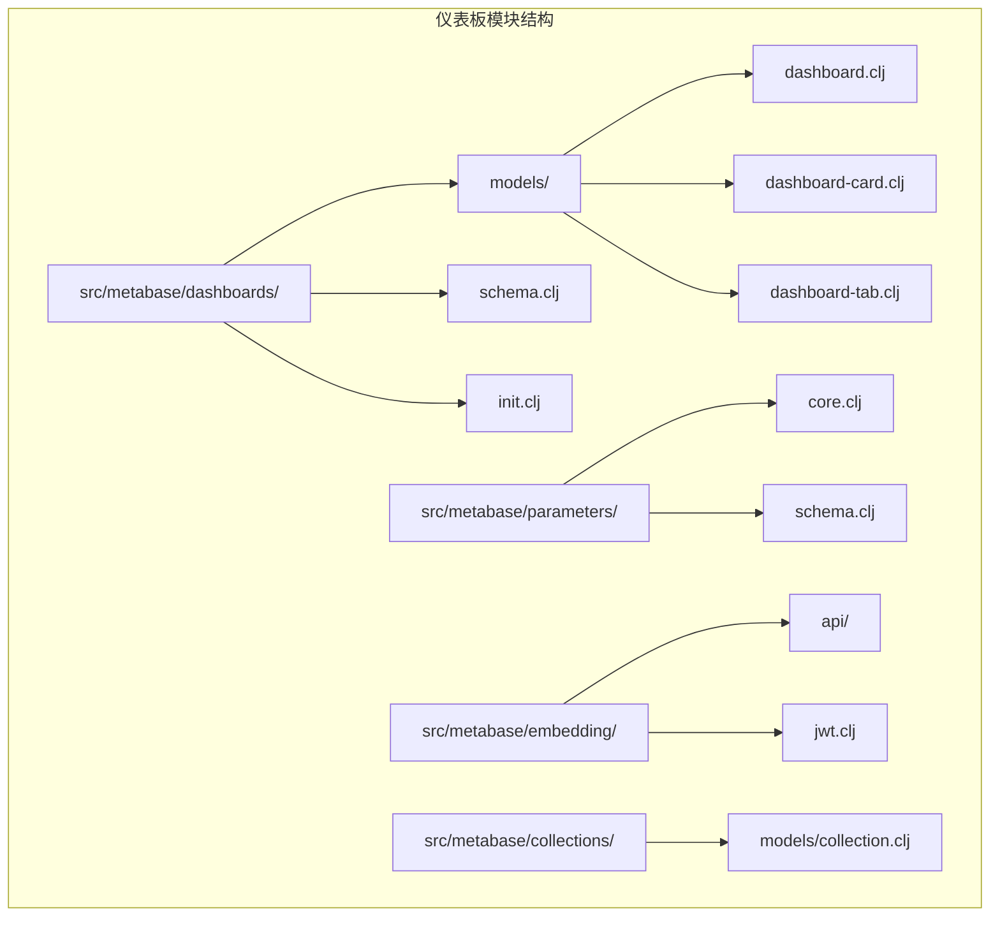
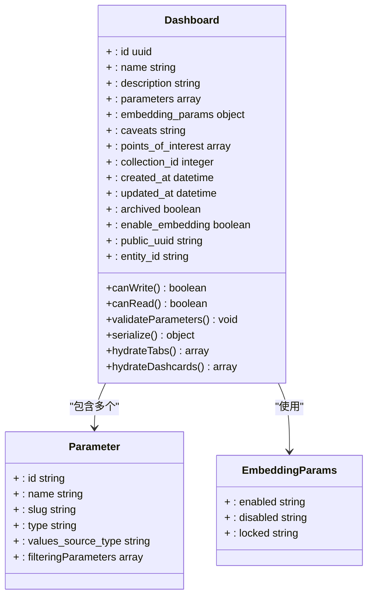
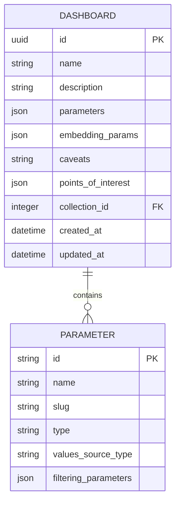
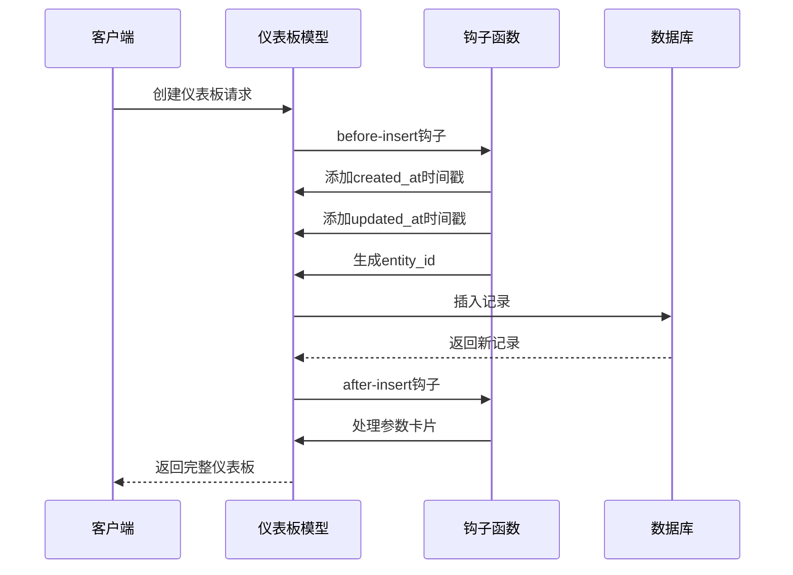
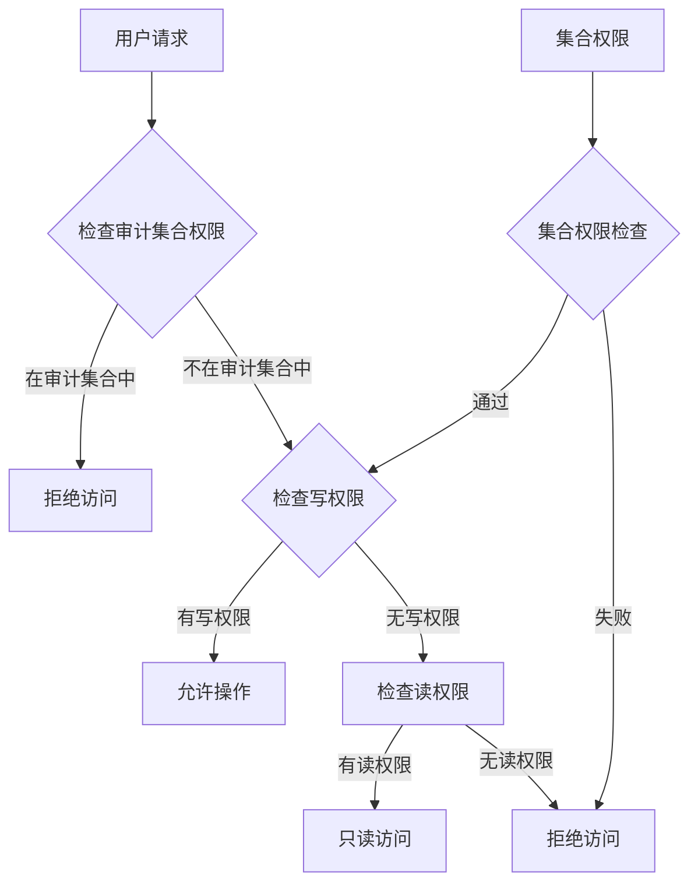
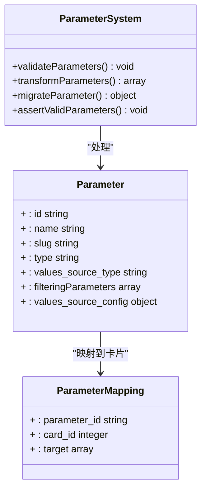
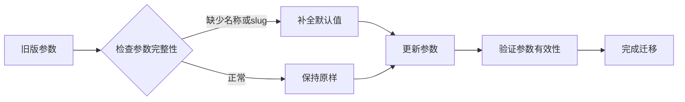
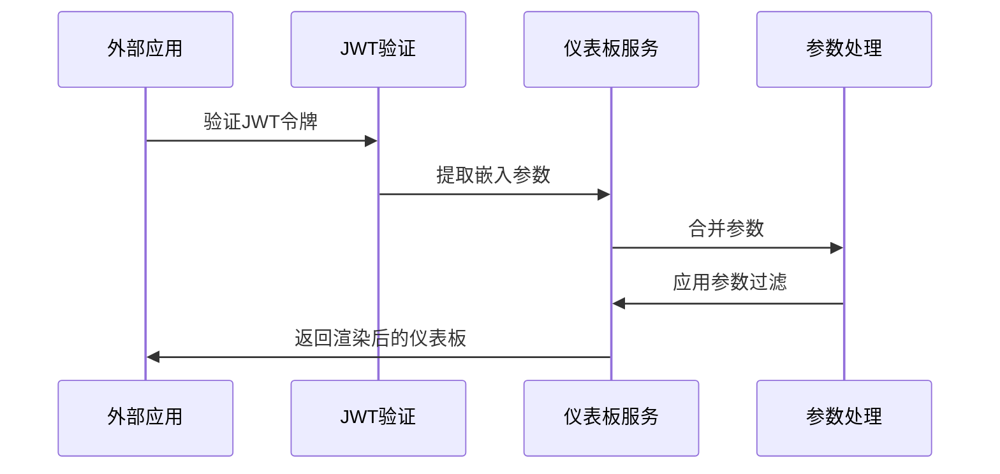
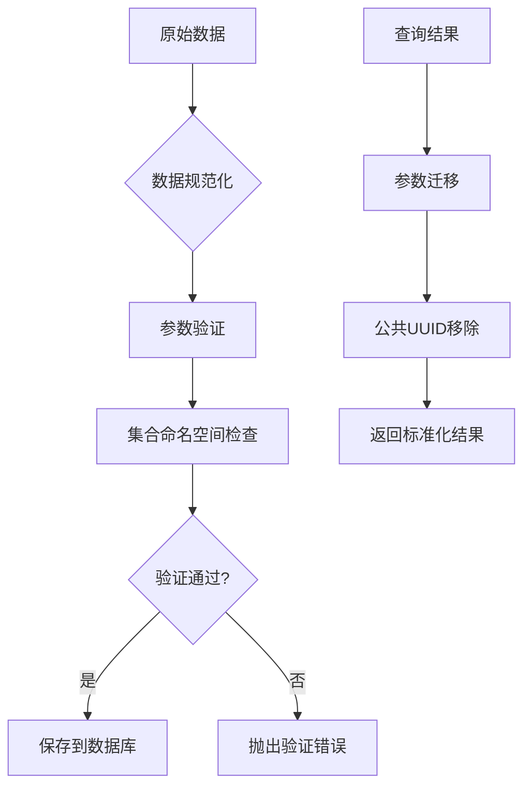
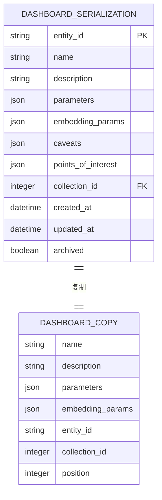

# 仪表板实体模型

<cite>
**本文档中引用的文件**
- [dashboard.clj](file://src/metabase/dashboards/models/dashboard.clj)
- [schema.clj](file://src/metabase/dashboards/schema.clj)
- [interface.clj](file://src/metabase/models/interface.clj)
- [collection.clj](file://src/metabase/collections/models/collection.clj)
- [serialization.clj](file://src/metabase/models/serialization.clj)
- [common.clj](file://src/metabase/embedding_rest/api/common.clj)
</cite>

## 目录
1. [简介](#简介)
2. [项目结构概览](#项目结构概览)
3. [核心数据模型定义](#核心数据模型定义)
4. [字段结构详解](#字段结构详解)
5. [生命周期属性](#生命周期属性)
6. [权限控制系统](#权限控制系统)
7. [参数化仪表板功能](#参数化仪表板功能)
8. [嵌入式分析支持](#嵌入式分析支持)
9. [模型验证与转换](#模型验证与转换)
10. [序列化与反序列化](#序列化与反序列化)
11. [性能优化考虑](#性能优化考虑)
12. [故障排除指南](#故障排除指南)
13. [总结](#总结)

## 简介

仪表板实体模型是Metabase数据分析平台的核心组件之一，负责管理仪表板的完整生命周期。该模型通过`defmodel`宏定义，提供了强大的参数化功能、嵌入式分析支持以及完善的权限控制机制。本文档深入解析了仪表板模型的字段结构、生命周期管理、权限控制以及与其他系统组件的集成关系。

## 项目结构概览

仪表板相关的代码主要分布在以下目录结构中：

**图表来源**
- [dashboard.clj](file://src/metabase/dashboards/models/dashboard.clj#L1-L50)
- [schema.clj](file://src/metabase/dashboards/schema.clj#L1-L27)

**章节来源**
- [dashboard.clj](file://src/metabase/dashboards/models/dashboard.clj#L1-L50)
- [schema.clj](file://src/metabase/dashboards/schema.clj#L1-L27)

## 核心数据模型定义

仪表板模型通过`defmodel`宏定义，继承了多个基础特性：

**图表来源**
- [dashboard.clj](file://src/metabase/dashboards/models/dashboard.clj#L25-L45)
- [schema.clj](file://src/metabase/dashboards/schema.clj#L15-L27)

**章节来源**
- [dashboard.clj](file://src/metabase/dashboards/models/dashboard.clj#L25-L45)
- [schema.clj](file://src/metabase/dashboards/schema.clj#L15-L27)

## 字段结构详解

### 基础字段

仪表板模型包含以下核心字段：

| 字段名 | 类型 | 描述 | 默认值 | 验证规则 |
|--------|------|------|--------|----------|
| `id` | UUID | 仪表板唯一标识符 | 自动生成 | 必填，唯一 |
| `name` | String | 仪表板名称 | 必填 | 非空字符串 |
| `description` | String | 仪表板描述 | 可选 | 支持HTML格式 |
| `archived` | Boolean | 是否已归档 | false | 布尔值 |
| `collection_id` | Integer | 所属集合ID | 可选 | 外键约束 |

### 参数化字段

#### parameters（参数定义）
参数字段是一个数组，包含仪表板中使用的动态参数配置：

**图表来源**
- [dashboard.clj](file://src/metabase/dashboards/models/dashboard.clj#L60-L70)
- [schema.clj](file://src/metabase/dashboards/schema.clj#L15-L27)

#### embedding_params（嵌入参数）
嵌入参数控制仪表板在外部应用中的显示行为：

| 参数类型 | 值 | 行为描述 |
|----------|-----|----------|
| enabled | "enabled" | 用户可以通过JWT或URL参数覆盖 |
| disabled | "disabled" | 不允许用户指定参数值 |
| locked | "locked" | 必须在JWT中指定参数值 |

### 元数据字段

#### caveats（警告信息）
用于显示给用户的警告或重要提示信息，支持Markdown格式。

#### points_of_interest（关注点）
标记仪表板中需要特别关注的数据点或指标。

**章节来源**
- [dashboard.clj](file://src/metabase/dashboards/models/dashboard.clj#L60-L95)
- [schema.clj](file://src/metabase/dashboards/schema.clj#L15-L27)

## 生命周期属性

仪表板模型实现了完整的生命周期管理，包括时间戳自动更新和实体ID生成：

**图表来源**
- [dashboard.clj](file://src/metabase/dashboards/models/dashboard.clj#L75-L85)
- [interface.clj](file://src/metabase/models/interface.clj#L509-L547)

### 时间戳管理

模型自动管理以下时间戳字段：

| 字段名 | 触发时机 | 自动值 | 用途 |
|--------|----------|--------|------|
| `created_at` | 插入时 | 当前时间戳 | 记录创建时间 |
| `updated_at` | 更新时 | 当前时间戳 | 记录最后修改时间 |
| `last_viewed_at` | 查询时 | 最后访问时间 | 统计访问频率 |

### 实体ID生成

每个仪表板实例都会自动生成唯一的实体ID，用于跨实例的持久化引用。

**章节来源**
- [dashboard.clj](file://src/metabase/dashboards/models/dashboard.clj#L75-L85)
- [interface.clj](file://src/metabase/models/interface.clj#L509-L547)
- [serialization.clj](file://src/metabase/models/serialization.clj#L116-L146)

## 权限控制系统

仪表板模型集成了完整的权限控制机制，与集合系统紧密关联：

**图表来源**
- [dashboard.clj](file://src/metabase/dashboards/models/dashboard.clj#L40-L60)
- [collection.clj](file://src/metabase/collections/models/collection.clj#L150-L180)

### 权限层次结构

仪表板的权限控制遵循以下层次：

1. **审计集合保护**：审计集合中的仪表板只能读取，不能修改
2. **集合权限继承**：从所属集合继承权限
3. **直接权限检查**：针对特定用户的权限验证

### collection_id 关联

仪表板与集合的关联通过`collection_id`字段实现，支持：

- 层级权限继承
- 批量权限管理
- 内容组织和分类

**章节来源**
- [dashboard.clj](file://src/metabase/dashboards/models/dashboard.clj#L40-L60)
- [collection.clj](file://src/metabase/collections/models/collection.clj#L150-L180)

## 参数化仪表板功能

仪表板支持动态参数化，允许用户在运行时过滤和定制内容：

**图表来源**
- [dashboard.clj](file://src/metabase/dashboards/models/dashboard.clj#L95-L120)
- [dashboard.clj](file://src/metabase/dashboards/models/dashboard.clj#L125-L145)

### 参数迁移机制

系统提供参数迁移功能，确保向后兼容性：

**图表来源**
- [dashboard.clj](file://src/metabase/dashboards/models/dashboard.clj#L125-L145)

### 参数验证规则

参数系统实施严格的验证规则：

| 验证项 | 规则 | 错误处理 |
|--------|------|----------|
| 名称非空 | `name`不能为空字符串 | 设置为"unnamed" |
| Slug非空 | `slug`不能为空字符串 | 设置为"unnamed" |
| 过滤器兼容性 | 链接过滤器仅支持特定类型 | 移除链接过滤器 |
| 输入框兼容性 | 输入框不支持链接过滤器 | 移除链接过滤器 |

**章节来源**
- [dashboard.clj](file://src/metabase/dashboards/models/dashboard.clj#L95-L120)
- [dashboard.clj](file://src/metabase/dashboards/models/dashboard.clj#L125-L145)

## 嵌入式分析支持

仪表板模型提供了完整的嵌入式分析功能，支持在外部应用中安全展示：

**图表来源**
- [common.clj](file://src/metabase/embedding_rest/api/common.clj#L343-L362)
- [common.clj](file://src/metabase/embedding_rest/api/common.clj#L361-L386)

### 嵌入参数处理流程

嵌入参数的处理遵循以下流程：

1. **参数提取**：从JWT令牌中提取嵌入参数
2. **参数合并**：合并用户提供的参数和令牌参数
3. **参数验证**：验证参数的有效性和安全性
4. **参数应用**：将参数应用到仪表板查询

### 参数状态管理

嵌入参数支持三种状态：

| 状态 | 描述 | 用户交互 |
|------|------|----------|
| enabled | 用户可以覆盖 | 支持JWT或URL参数 |
| disabled | 不允许用户指定 | 仅使用JWT参数 |
| locked | 必须在JWT中指定 | 强制使用JWT参数 |

**章节来源**
- [common.clj](file://src/metabase/embedding_rest/api/common.clj#L343-L362)
- [common.clj](file://src/metabase/embedding_rest/api/common.clj#L361-L386)

## 模型验证与转换

仪表板模型实现了多层次的验证和转换机制：

**图表来源**
- [dashboard.clj](file://src/metabase/dashboards/models/dashboard.clj#L75-L85)
- [dashboard.clj](file://src/metabase/dashboards/models/dashboard.clj#L150-L165)

### 转换器定义

模型定义了专门的转换器：

| 字段 | 转换器 | 用途 |
|------|--------|------|
| `parameters` | `parameters/transform-parameters` | 参数序列化和反序列化 |
| `embedding_params` | `mi/transform-json` | JSON字段处理 |

### 验证钩子

系统在关键生命周期事件上执行验证：

- **before-insert**：验证新仪表板的完整性
- **before-update**：验证更新操作的安全性
- **after-select**：后处理查询结果

**章节来源**
- [dashboard.clj](file://src/metabase/dashboards/models/dashboard.clj#L75-L85)
- [dashboard.clj](file://src/metabase/dashboards/models/dashboard.clj#L150-L165)

## 序列化与反序列化

仪表板模型支持完整的序列化功能，便于数据导出和导入：

**图表来源**
- [dashboard.clj](file://src/metabase/dashboards/models/dashboard.clj#L450-L480)

### 序列化策略

模型定义了详细的序列化规范：

| 类别 | 字段列表 | 处理方式 |
|------|----------|----------|
| 复制字段 | `archived`, `collection_position`, `description` | 直接复制 |
| 跳过字段 | `view_count`, `cache_ttl` | 排除 |
| 转换字段 | `created_at`, `collection_id` | 特殊处理 |
| 嵌套字段 | `tabs`, `dashcards` | 递归序列化 |

### 依赖关系管理

序列化过程会追踪所有依赖关系：

- **仪表板卡片**：追踪卡片依赖
- **参数映射**：追踪参数依赖
- **可视化设置**：追踪可视化依赖
- **动作卡片**：追踪动作依赖

**章节来源**
- [dashboard.clj](file://src/metabase/dashboards/models/dashboard.clj#L450-L480)

## 性能优化考虑

仪表板模型采用了多种性能优化策略：

### 批量水合化

系统支持批量水合化操作，减少数据库查询次数：

### 权限检查优化

- **权限缓存**：缓存用户权限信息
- **延迟加载**：按需加载权限详情
- **批量检查**：一次性检查多个对象权限

### 查询优化

- **索引利用**：合理使用数据库索引
- **连接优化**：优化表连接顺序
- **条件过滤**：精确的WHERE条件

## 故障排除指南

### 常见问题及解决方案

| 问题 | 症状 | 解决方案 |
|------|------|----------|
| 参数验证失败 | 创建仪表板时报错 | 检查参数配置，确保必填字段完整 |
| 权限访问被拒绝 | 无法查看仪表板 | 检查集合权限设置 |
| 嵌入参数无效 | 嵌入显示异常 | 验证JWT令牌和参数格式 |
| 性能问题 | 查询响应缓慢 | 检查索引和查询优化 |

### 调试工具

系统提供了多种调试功能：

- **日志记录**：详细的操作日志
- **性能监控**：查询执行时间统计
- **权限诊断**：权限检查详细信息

**章节来源**
- [dashboard.clj](file://src/metabase/dashboards/models/dashboard.clj#L450-L480)

## 总结

仪表板实体模型是Metabase平台的核心组件，具备以下关键特性：

1. **完整的生命周期管理**：自动处理时间戳和实体ID
2. **强大的参数化功能**：支持动态参数和过滤
3. **灵活的嵌入支持**：安全的外部应用集成
4. **完善的权限控制**：基于集合的细粒度权限管理
5. **高效的性能优化**：批量操作和缓存机制
6. **可靠的序列化支持**：完整的数据导出导入能力

该模型通过精心设计的架构和丰富的功能特性，为Metabase提供了稳定可靠的数据仪表板管理能力，支撑了整个平台的数据分析和展示需求。