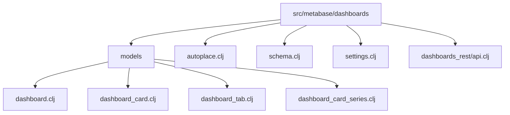
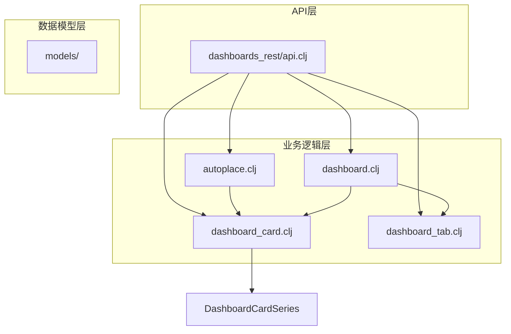
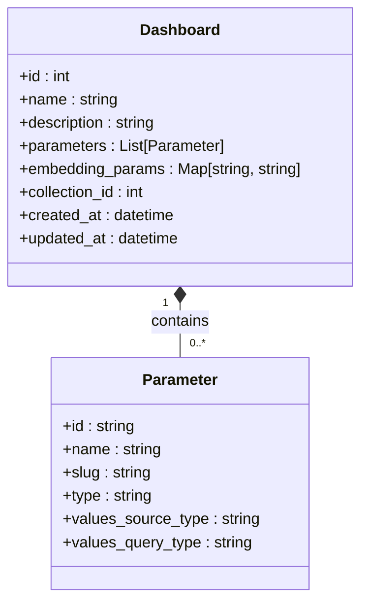
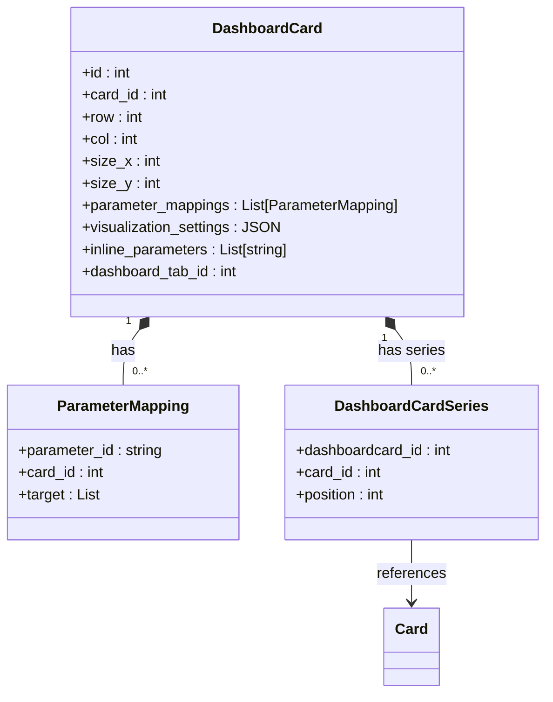
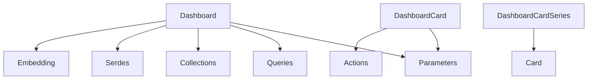

# 仪表板模型

<cite>
**本文档中引用的文件**  
- [dashboard.clj](file://src/metabase/dashboards/models/dashboard.clj)
- [dashboard_card.clj](file://src/metabase/dashboards/models/dashboard_card.clj)
- [dashboard_tab.clj](file://src/metabase/dashboards/models/dashboard_tab.clj)
- [dashboard_card_series.clj](file://src/metabase/dashboards/models/dashboard_card_series.clj)
- [schema.clj](file://src/metabase/dashboards/schema.clj)
- [autoplace.clj](file://src/metabase/dashboards/autoplace.clj)
- [dashboards_rest/api.clj](file://src/metabase/dashboards_rest/api.clj)
</cite>

## 目录
1. [引言](#引言)
2. [项目结构](#项目结构)
3. [核心组件](#核心组件)
4. [架构概述](#架构概述)
5. [详细组件分析](#详细组件分析)
6. [依赖分析](#依赖分析)
7. [性能考虑](#性能考虑)
8. [故障排除指南](#故障排除指南)
9. [结论](#结论)

## 引言
本文档深入解析Metabase系统中`Dashboard`（仪表板）及其关联组件的数据模型。重点阐述`dashboard.clj`中的`parameters`、`embedding_params`等字段，以及`dashboard_card.clj`中`parameter_mappings`、`visualization_settings`、`series`等关键属性。同时，文档将详细说明`dashboard_tab.clj`对标签页的支持机制。内容涵盖仪表板的创建、卡片布局管理、参数映射、系列配置及与查询模型的关联关系，为开发者和系统维护者提供全面的技术参考。

## 项目结构
仪表板相关的数据模型和功能主要位于`src/metabase/dashboards`目录下，其结构清晰，职责分明。核心数据模型定义在`models`子目录中，而相关的业务逻辑、API接口和辅助功能则分布在同级的其他文件中。

**Diagram sources**
- [dashboard.clj](file://src/metabase/dashboards/models/dashboard.clj)
- [dashboard_card.clj](file://src/metabase/dashboards/models/dashboard_card.clj)
- [dashboard_tab.clj](file://src/metabase/dashboards/models/dashboard_tab.clj)
- [dashboard_card_series.clj](file://src/metabase/dashboards/models/dashboard_card_series.clj)

**Section sources**
- [dashboard.clj](file://src/metabase/dashboards/models/dashboard.clj)
- [dashboard_card.clj](file://src/metabase/dashboards/models/dashboard_card.clj)
- [dashboard_tab.clj](file://src/metabase/dashboards/models/dashboard_tab.clj)

## 核心组件
仪表板系统的核心由`Dashboard`、`DashboardCard`、`DashboardTab`和`DashboardCardSeries`四个主要模型构成。`Dashboard`是最高层级的容器，代表一个完整的仪表板。它包含一个或多个`DashboardCard`，每个卡片代表一个可视化图表或文本块。`DashboardTab`模型支持将卡片组织到不同的标签页中，实现内容的分组管理。`DashboardCardSeries`则用于处理一个卡片中包含多个数据系列（如多线图）的复杂情况，它建立了`DashboardCard`与额外的`Card`（问题）之间的关联。

**Section sources**
- [dashboard.clj](file://src/metabase/dashboards/models/dashboard.clj)
- [dashboard_card.clj](file://src/metabase/dashboards/models/dashboard_card.clj)
- [dashboard_tab.clj](file://src/metabase/dashboards/models/dashboard_tab.clj)
- [dashboard_card_series.clj](file://src/metabase/dashboards/models/dashboard_card_series.clj)

## 架构概述
整个仪表板系统的架构遵循分层设计原则。数据模型层（`models`）定义了核心实体及其关系。业务逻辑层（如`autoplace.clj`）处理卡片的自动布局等复杂操作。API层（`dashboards_rest/api.clj`）为前端提供RESTful接口，处理创建、读取、更新和删除（CRUD）操作。序列化层（`serdes`）负责模型的导入导出。这种分层架构确保了系统的可维护性和可扩展性。

**Diagram sources**
- [dashboard.clj](file://src/metabase/dashboards/models/dashboard.clj)
- [dashboard_card.clj](file://src/metabase/dashboards/models/dashboard_card.clj)
- [dashboard_tab.clj](file://src/metabase/dashboards/models/dashboard_tab.clj)
- [autoplace.clj](file://src/metabase/dashboards/autoplace.clj)
- [dashboards_rest/api.clj](file://src/metabase/dashboards_rest/api.clj)

## 详细组件分析

### 仪表板 (Dashboard) 分析
`Dashboard`模型是整个仪表板系统的根实体。它通过`parameters`字段定义了仪表板级别的参数，这些参数可以被其包含的所有卡片所使用。`embedding_params`字段用于控制该仪表板在嵌入式场景下的行为，例如哪些参数是启用的、禁用的或锁定的。当创建或更新仪表板时，系统会通过`before-insert`和`before-update`钩子对参数进行验证和规范化。

**Diagram sources**
- [dashboard.clj](file://src/metabase/dashboards/models/dashboard.clj#L1-L503)
- [schema.clj](file://src/metabase/dashboards/schema.clj#L1-L27)

**Section sources**
- [dashboard.clj](file://src/metabase/dashboards/models/dashboard.clj#L1-L503)

### 仪表板卡片 (DashboardCard) 分析
`DashboardCard`模型代表了仪表板上的一个独立单元，可以是一个图表、一个文本块或一个链接。`parameter_mappings`字段是实现参数化查询的核心，它将仪表板级别的参数映射到卡片所关联的查询（`Card`）中的具体字段。`visualization_settings`字段是一个JSON对象，存储了图表的显示配置，如颜色、标签、坐标轴设置等。`series`字段则用于支持多系列图表，它通过`DashboardCardSeries`模型关联到其他`Card`，将它们的数据合并到同一个图表中。

**Diagram sources**
- [dashboard_card.clj](file://src/metabase/dashboards/models/dashboard_card.clj#L1-L411)
- [dashboard_card_series.clj](file://src/metabase/dashboards/models/dashboard_card_series.clj#L1-L25)

**Section sources**
- [dashboard_card.clj](file://src/metabase/dashboards/models/dashboard_card.clj#L1-L411)

### 仪表板标签页 (DashboardTab) 分析
`DashboardTab`模型为仪表板提供了标签页功能，允许用户将相关的卡片组织到不同的标签下，从而管理更复杂的内容。一个`Dashboard`可以有多个`DashboardTab`，每个`DashboardCard`通过`dashboard_tab_id`字段关联到一个特定的标签页。系统通过`batched-hydrate`方法高效地加载一个仪表板下所有标签及其关联的卡片列表。

**Section sources**
- [dashboard_tab.clj](file://src/metabase/dashboards/models/dashboard_tab.clj#L1-L133)

## 依赖分析
仪表板系统与其他多个模块存在紧密的依赖关系。它依赖于`parameters`模块来处理参数的定义、验证和映射逻辑。`queries`模块提供了创建和管理`Card`（问题）的能力，这些`Card`是`DashboardCard`的基础。`collections`模块用于管理仪表板的所属集合和权限。`serdes`模块负责整个仪表板及其所有组件的序列化和反序列化，支持导入导出功能。`embedding`模块则通过`embedding_params`与仪表板交互，控制其在外部系统中的嵌入行为。

**Diagram sources**
- [dashboard.clj](file://src/metabase/dashboards/models/dashboard.clj#L1-L503)
- [dashboard_card.clj](file://src/metabase/dashboards/models/dashboard_card.clj#L1-L411)
- [dashboard_tab.clj](file://src/metabase/dashboards/models/dashboard_tab.clj#L1-L133)

**Section sources**
- [dashboard.clj](file://src/metabase/dashboards/models/dashboard.clj#L1-L503)
- [dashboard_card.clj](file://src/metabase/dashboards/models/dashboard_card.clj#L1-L411)
- [dashboard_tab.clj](file://src/metabase/dashboards/models/dashboard_tab.clj#L1-L133)

## 性能考虑
在处理包含大量卡片或复杂参数的仪表板时，性能是一个关键考量。系统通过批量加载（batched-hydrate）机制来减少数据库查询次数，例如在加载仪表板时，会一次性获取所有关联的卡片和标签页。`autoplace.clj`中的自动布局算法通过在1000行的网格内搜索空闲位置来放置新卡片，虽然在极端情况下可能效率不高，但在正常场景下表现良好。此外，对`embedding_params`的处理也经过优化，避免了不必要的参数暴露，提升了嵌入场景下的响应速度。

## 故障排除指南
当遇到仪表板相关的问题时，可以从以下几个方面进行排查：
1.  **参数不生效**：检查`parameter_mappings`的`target`字段是否正确指向了查询中的字段ID，并确认`parameters`的`id`与`parameter_mappings`中的`parameter_id`匹配。
2.  **卡片无法加载**：检查`card_id`是否指向一个有效的、未被归档的`Card`，并确认当前用户对该`Card`有读取权限。
3.  **标签页显示异常**：确认`dashboard_tab_id`的值是正确的，并且该ID对应的`DashboardTab`存在于同一个`Dashboard`中。
4.  **嵌入失败**：检查`embedding_params`的配置，确保需要启用的参数被设置为`enabled`，并且JWT令牌中没有包含被锁定的参数。

**Section sources**
- [dashboard.clj](file://src/metabase/dashboards/models/dashboard.clj#L1-L503)
- [dashboard_card.clj](file://src/metabase/dashboards/models/dashboard_card.clj#L1-L411)
- [embedding_rest/api/common.clj](file://src/metabase/embedding_rest/api/common.clj#L1-L579)

## 结论
Metabase的仪表板数据模型设计精巧，通过`Dashboard`、`DashboardCard`、`DashboardTab`和`DashboardCardSeries`四个核心模型，构建了一个灵活、可扩展的可视化分析平台。`parameters`和`parameter_mappings`实现了强大的参数化功能，`visualization_settings`提供了丰富的图表定制能力，而`embedding_params`则确保了仪表板在不同环境下的安全嵌入。理解这些组件及其相互关系，对于开发、维护和优化基于Metabase的应用至关重要。