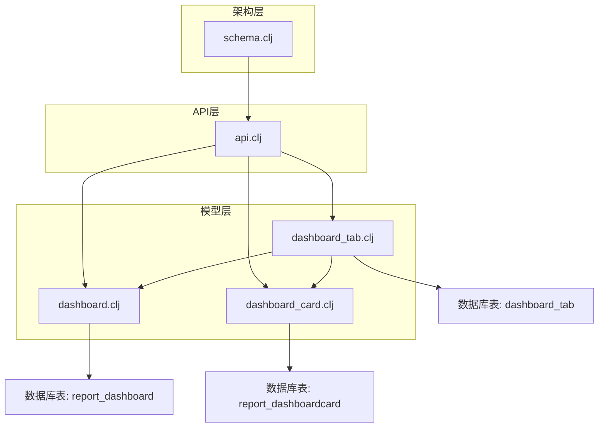
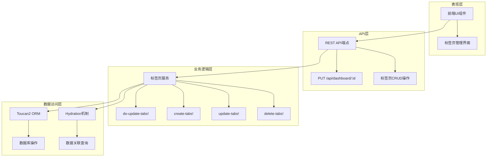
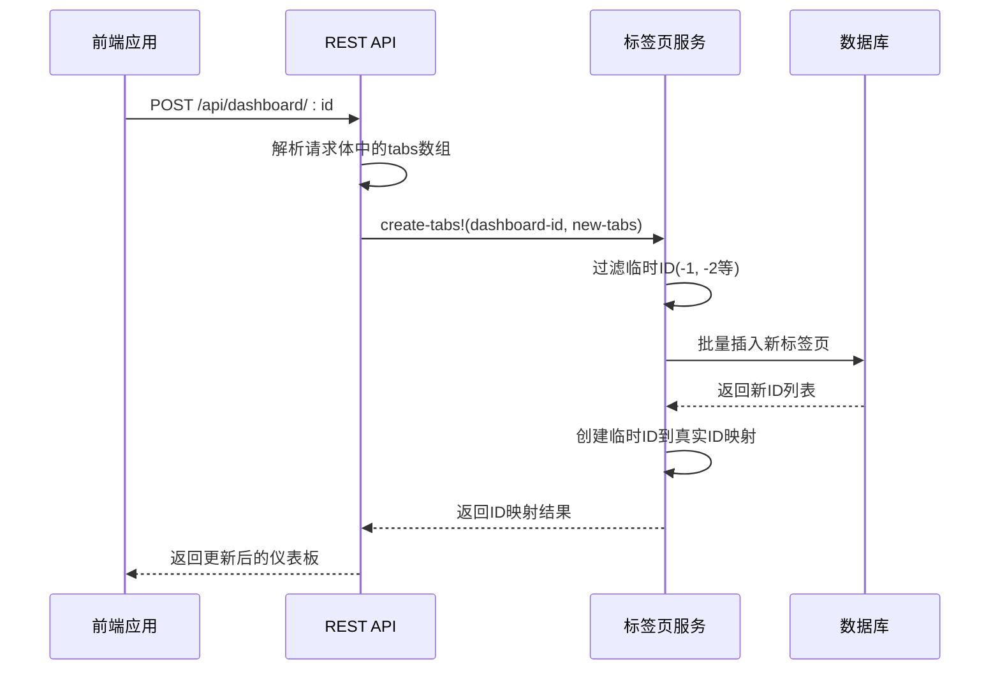
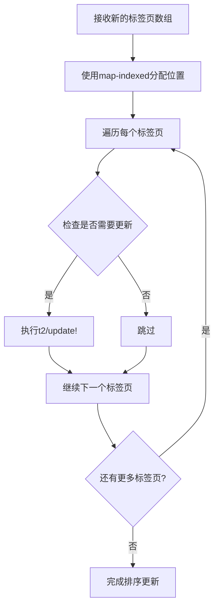
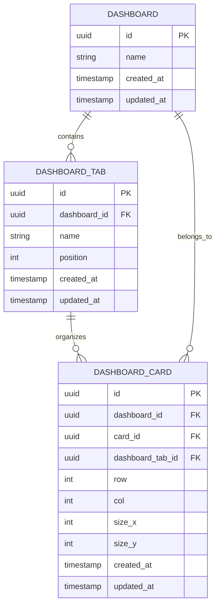
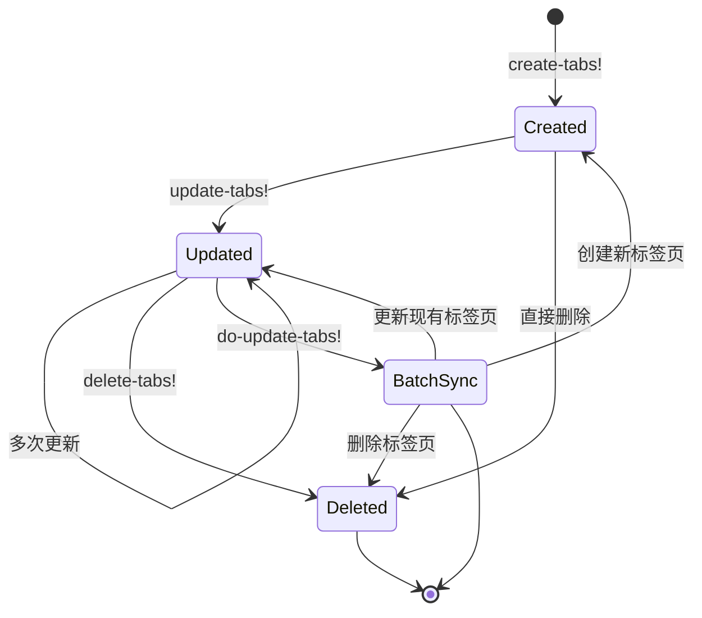
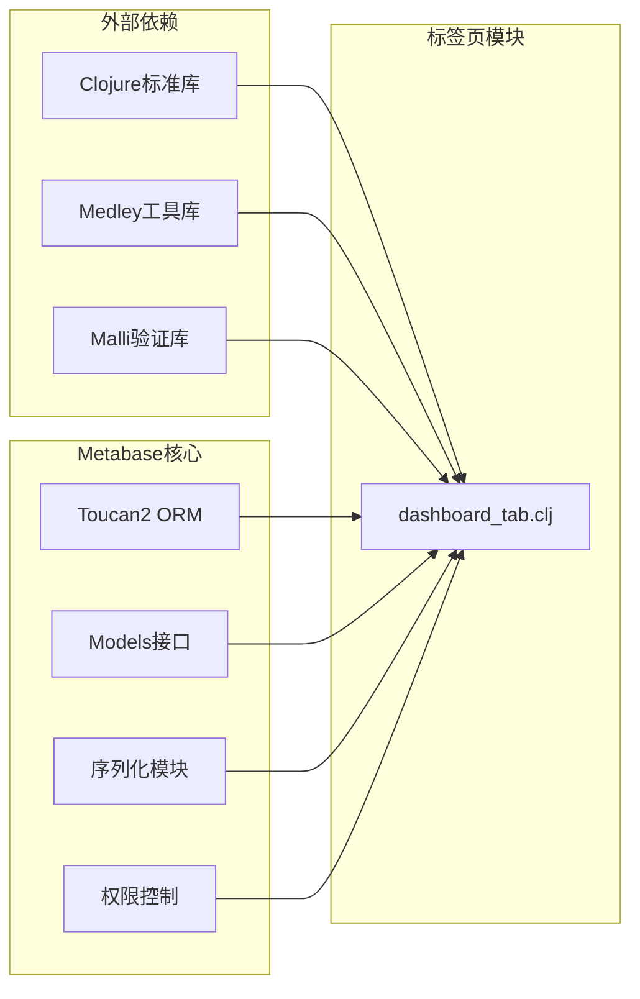

# 标签页支持模型

<cite>
**本文档中引用的文件**
- [dashboard_tab.clj](file://src/metabase/dashboards/models/dashboard_tab.clj)
- [dashboard.clj](file://src/metabase/dashboards/models/dashboard.clj)
- [dashboard_card.clj](file://src/metabase/dashboards/models/dashboard_card.clj)
- [api.clj](file://src/metabase/dashboards_rest/api.clj)
- [schema.clj](file://src/metabase/dashboards/schema.clj)
</cite>

## 目录
1. [简介](#简介)
2. [项目结构](#项目结构)
3. [核心组件](#核心组件)
4. [架构概览](#架构概览)
5. [详细组件分析](#详细组件分析)
6. [依赖关系分析](#依赖关系分析)
7. [性能考虑](#性能考虑)
8. [故障排除指南](#故障排除指南)
9. [结论](#结论)

## 简介

仪表板标签页（Dashboard Tab）功能是Metabase仪表板系统中的重要组成部分，它允许用户将复杂的仪表板分割成多个逻辑分组，每个分组称为一个标签页。这种设计使得用户能够更好地组织和管理大量的仪表板卡片（Dashboard Cards），提供更清晰的视图切换体验。

标签页系统通过`dashboard_id`外键关联到仪表板，使用`position`字段进行排序，并通过`name`字段提供可读性标识。该系统不仅支持基本的CRUD操作，还提供了复杂的批量更新机制，确保标签页状态的一致性和完整性。

## 项目结构

仪表板标签页功能的实现分布在以下关键文件中：

**图表来源**
- [dashboard_tab.clj](file://src/metabase/dashboards/models/dashboard_tab.clj#L1-L133)
- [dashboard.clj](file://src/metabase/dashboards/models/dashboard.clj#L1-L503)
- [api.clj](file://src/metabase/dashboards_rest/api.clj#L1-L1335)

**章节来源**
- [dashboard_tab.clj](file://src/metabase/dashboards/models/dashboard_tab.clj#L1-L133)
- [dashboard.clj](file://src/metabase/dashboards/models/dashboard.clj#L1-L503)

## 核心组件

### 数据库表结构

仪表板标签页的核心数据结构包含以下关键字段：

| 字段名 | 类型 | 约束条件 | 描述 |
|--------|------|----------|------|
| `id` | 主键 | 自增 | 标签页唯一标识符 |
| `dashboard_id` | 外键 | 非空 | 关联的仪表板ID |
| `name` | 字符串 | 非空 | 标签页显示名称 |
| `position` | 整数 | 非空 | 排序位置，用于确定标签页顺序 |
| `created_at` | 时间戳 | 自动生成 | 创建时间 |
| `updated_at` | 时间戳 | 自动生成 | 更新时间 |

### 核心业务逻辑

标签页系统的核心业务逻辑包括：

1. **外键关联机制**：通过`dashboard_id`字段建立与仪表板的多对一关系
2. **排序机制**：使用`position`字段实现标签页的有序排列
3. **权限控制**：继承仪表板的权限设置，确保访问控制一致性
4. **批量操作**：支持标签页的创建、更新、删除的批量处理

**章节来源**
- [dashboard_tab.clj](file://src/metabase/dashboards/models/dashboard_tab.clj#L1-L133)

## 架构概览

仪表板标签页系统采用分层架构设计，确保了良好的关注点分离和可维护性：

**图表来源**
- [api.clj](file://src/metabase/dashboards_rest/api.clj#L958-L1034)
- [dashboard_tab.clj](file://src/metabase/dashboards/models/dashboard_tab.clj#L113-L131)

## 详细组件分析

### 标签页创建机制

标签页的创建过程涉及临时ID映射和批量插入优化：

**图表来源**
- [dashboard_tab.clj](file://src/metabase/dashboards/models/dashboard_tab.clj#L65-L75)
- [api.clj](file://src/metabase/dashboards_rest/api.clj#L958-L972)

### 标签页排序机制

标签页的排序通过`position`字段实现，支持动态重新排序：

**图表来源**
- [api.clj](file://src/metabase/dashboards_rest/api.clj#L964-L966)
- [dashboard_tab.clj](file://src/metabase/dashboards/models/dashboard_tab.clj#L82-L95)

### 标签页与卡片的关系

标签页通过`dashboard_tab_id`字段与仪表板卡片建立关联：

**图表来源**
- [dashboard_tab.clj](file://src/metabase/dashboards/models/dashboard_tab.clj#L31-L59)
- [dashboard_card.clj](file://src/metabase/dashboards/models/dashboard_card.clj#L1-L411)

**章节来源**
- [dashboard_tab.clj](file://src/metabase/dashboards/models/dashboard_tab.clj#L31-L131)
- [dashboard_card.clj](file://src/metabase/dashboards/models/dashboard_card.clj#L31-L59)

### 标签页生命周期管理

标签页的完整生命周期包括创建、更新、删除和批量同步：

**图表来源**
- [dashboard_tab.clj](file://src/metabase/dashboards/models/dashboard_tab.clj#L113-L131)

**章节来源**
- [dashboard_tab.clj](file://src/metabase/dashboards/models/dashboard_tab.clj#L65-L131)

## 依赖关系分析

仪表板标签页系统的依赖关系体现了清晰的分层架构：

**图表来源**
- [dashboard_tab.clj](file://src/metabase/dashboards/models/dashboard_tab.clj#L1-L15)

### 关键依赖说明

1. **Toucan2 ORM**：提供数据库操作抽象层
2. **Malli验证库**：确保数据类型安全和验证
3. **Medley工具库**：提供函数式编程辅助工具
4. **权限系统**：集成仪表板级别的权限控制

**章节来源**
- [dashboard_tab.clj](file://src/metabase/dashboards/models/dashboard_tab.clj#L1-L15)

## 性能考虑

### 批量操作优化

标签页系统实现了多项性能优化措施：

1. **批量插入**：使用`insert-returning-pks!`实现批量ID映射
2. **批量更新**：通过`update-tabs!`函数减少数据库往返
3. **延迟加载**：使用Hydration机制按需加载关联数据
4. **索引优化**：在`dashboard_id`和`position`字段上建立复合索引

### 内存管理

系统采用惰性求值和流式处理来优化内存使用：

- 使用`eduction`和`reducible-query`避免一次性加载大量数据
- 实现增量处理机制，支持大数据集的高效处理
- 通过`group-by`和`update-vals`实现内存友好的数据重组

## 故障排除指南

### 常见问题及解决方案

#### 1. 标签页位置冲突

**问题描述**：多个标签页具有相同的position值

**解决方案**：
- 系统自动使用`map-indexed`重新分配位置
- 确保position字段的唯一性约束

#### 2. 权限访问问题

**问题描述**：用户无法访问某些标签页或卡片

**解决方案**：
- 检查仪表板级别的权限设置
- 验证卡片的可见性权限
- 确认用户对相关数据源的访问权限

#### 3. 数据一致性问题

**问题描述**：标签页删除后卡片仍然关联

**解决方案**：
- 使用事务确保原子性操作
- 实现级联删除机制
- 定期运行数据清理脚本

**章节来源**
- [dashboard_tab.clj](file://src/metabase/dashboards/models/dashboard_tab.clj#L82-L131)
- [api.clj](file://src/metabase/dashboards_rest/api.clj#L960-L970)

## 结论

仪表板标签页功能展现了Metabase在复杂业务场景下的优秀架构设计。通过合理的数据建模、清晰的分层架构和高效的性能优化，该系统成功地解决了大型仪表板的组织和管理问题。

### 主要优势

1. **灵活的组织方式**：支持多层级的标签页结构
2. **高性能操作**：批量处理和优化的数据库访问
3. **强一致性保证**：事务管理和权限控制
4. **可扩展性**：模块化设计便于功能扩展

### 技术亮点

- **外键关联**：通过`dashboard_id`建立稳定的关联关系
- **排序机制**：基于`position`字段的灵活排序
- **权限继承**：自动继承仪表板的权限设置
- **批量操作**：高效的批量CRUD操作支持

该系统为Metabase用户提供了强大的仪表板组织能力，是现代BI平台中标签页功能设计的优秀范例。