# 查询与仪表板模型

<cite>
**本文档中引用的文件**
- [dashboard.clj](file://src/metabase/dashboards/models/dashboard.clj)
- [dashboard_card.clj](file://src/metabase/dashboards/models/dashboard_card.clj)
- [dashboard_card_series.clj](file://src/metabase/dashboards/models/dashboard_card_series.clj)
- [card.clj](file://src/metabase/queries/models/card.clj)
- [serialization.clj](file://src/metabase/models/serialization.clj)
- [card.clj](file://src/metabase/query_processor/card.clj)
- [dashboard.clj](file://src/metabase/query_processor/dashboard.clj)
- [schema.clj](file://src/metabase/dashboards/schema.clj)
</cite>

## 目录
1. [简介](#简介)
2. [项目结构概览](#项目结构概览)
3. [Card（查询）模型详解](#card查询模型详解)
4. [Dashboard（仪表板）模型详解](#dashboard仪表板模型详解)
5. [DashboardCard（仪表板卡片）模型详解](#dashboardcard仪表板卡片模型详解)
6. [数据模型关系架构](#数据模型关系架构)
7. [序列化机制](#序列化机制)
8. [查询执行流程](#查询执行流程)
9. [缓存系统](#缓存系统)
10. [参数映射与系列配置](#参数映射与系列配置)
11. [总结](#总结)

## 简介

Metabase的查询与仪表板模型是整个数据分析平台的核心数据结构。本文档深入解析了`Card`（保存的问题/查询）和`Dashboard`（仪表板）的数据模型设计，详细说明了它们的关键字段、相互关系以及在系统中的作用。

核心概念：
- **Card**：代表一个保存的查询，包含`dataset_query`（查询定义）、`display`（显示类型）和`visualization_settings`（可视化设置）
- **Dashboard**：仪表板容器，管理多个`DashboardCard`，支持布局、参数映射等功能
- **DashboardCard**：仪表板中的单个卡片，关联具体的Card和可视化配置

## 项目结构概览

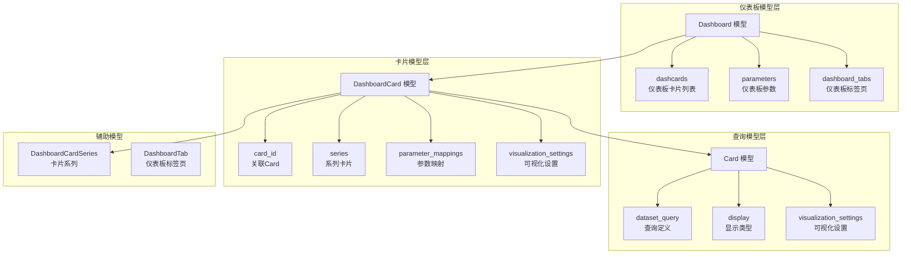

**图表来源**
- [dashboard.clj](file://src/metabase/dashboards/models/dashboard.clj#L1-L50)
- [dashboard_card.clj](file://src/metabase/dashboards/models/dashboard_card.clj#L1-L50)
- [card.clj](file://src/metabase/queries/models/card.clj#L1-L50)

## Card（查询）模型详解

### 核心数据结构

Card模型是Metabase中保存查询的核心实体，包含了执行查询所需的所有信息。

#### 关键字段说明

| 字段名 | 类型 | 描述 | 作用 |
|--------|------|------|------|
| `dataset_query` | Map | 查询定义，支持MBQL和原生SQL | 定义查询的具体结构和条件 |
| `display` | Keyword | 可视化显示类型 | 控制前端展示的图表类型 |
| `visualization_settings` | Map | 可视化配置选项 | 存储图表的详细配置参数 |
| `parameters` | List | 参数定义列表 | 定义查询所需的可变参数 |
| `parameter_mappings` | List | 参数映射关系 | 将仪表板参数映射到查询参数 |

#### dataset_query（查询定义）

`dataset_query`是Card的核心字段，支持两种查询类型：

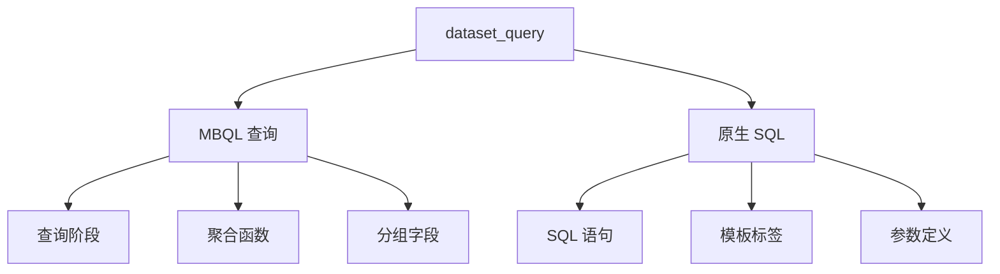

**图表来源**
- [card.clj](file://src/metabase/queries/models/card.clj#L200-L250)

#### 可视化设置

`visualization_settings`字段存储了图表的详细配置：

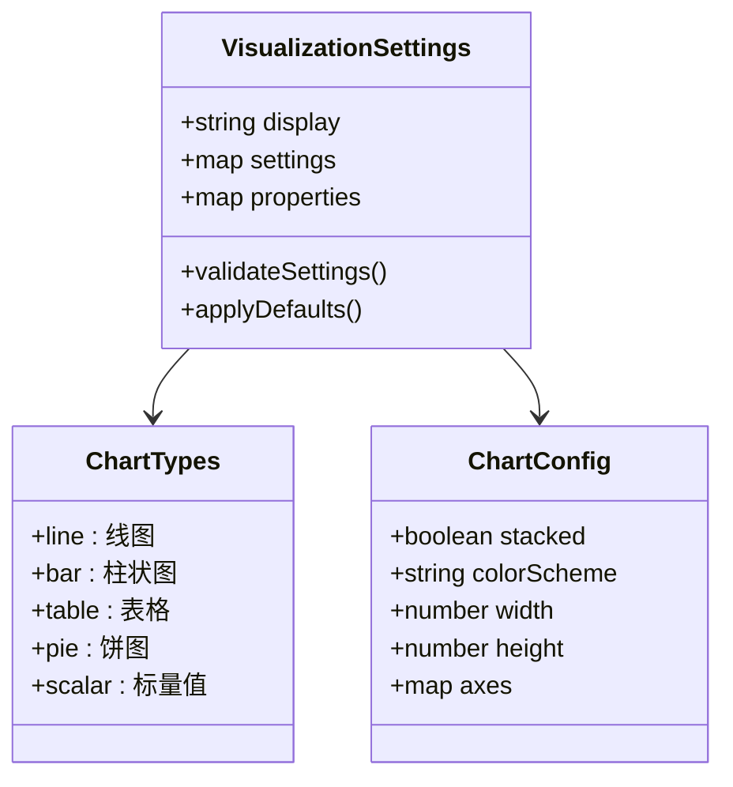

**图表来源**
- [card.clj](file://src/metabase/queries/models/card.clj#L300-L350)

**章节来源**
- [card.clj](file://src/metabase/queries/models/card.clj#L1-L200)

## Dashboard（仪表板）模型详解

### 基本结构

Dashboard模型作为仪表板容器，管理多个DashboardCard，提供统一的布局和参数控制。

#### 核心属性

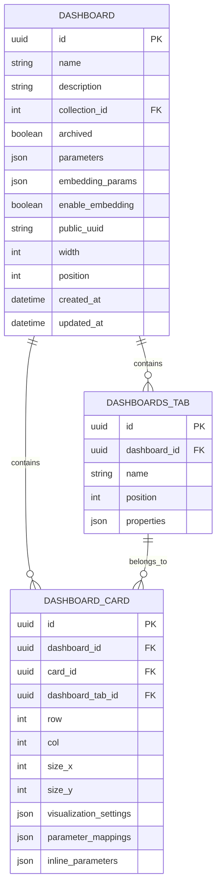

**图表来源**
- [dashboard.clj](file://src/metabase/dashboards/models/dashboard.clj#L100-L150)

#### 参数系统

Dashboard支持全局参数，这些参数可以映射到其包含的DashboardCard：

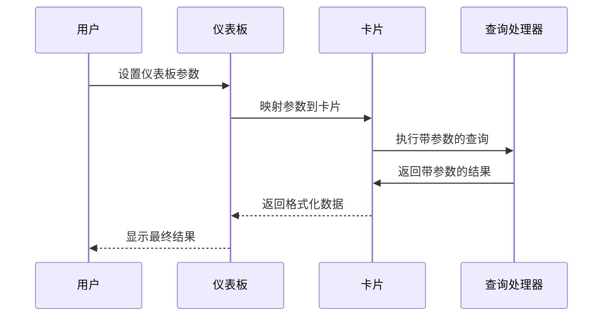

**图表来源**
- [dashboard.clj](file://src/metabase/dashboards/models/dashboard.clj#L350-L400)

**章节来源**
- [dashboard.clj](file://src/metabase/dashboards/models/dashboard.clj#L1-L300)

## DashboardCard（仪表板卡片）模型详解

### 卡片结构

DashboardCard是仪表板中的单个组件，连接具体的Card和可视化配置。

#### 核心字段

| 字段名 | 类型 | 描述 | 默认值 |
|--------|------|------|--------|
| `dashboard_id` | UUID | 所属仪表板ID | 必填 |
| `card_id` | UUID | 关联的Card ID | 必填 |
| `dashboard_tab_id` | UUID | 所属标签页ID | 可选 |
| `row` | Integer | 在网格中的行位置 | 0 |
| `col` | Integer | 在网格中的列位置 | 0 |
| `size_x` | Integer | 宽度（网格单元数） | 6 |
| `size_y` | Integer | 高度（网格单元数） | 6 |
| `parameter_mappings` | List | 参数映射配置 | [] |
| `visualization_settings` | Map | 可视化设置 | {} |

#### 系列功能

DashboardCard支持添加多个系列卡片，实现复合图表：

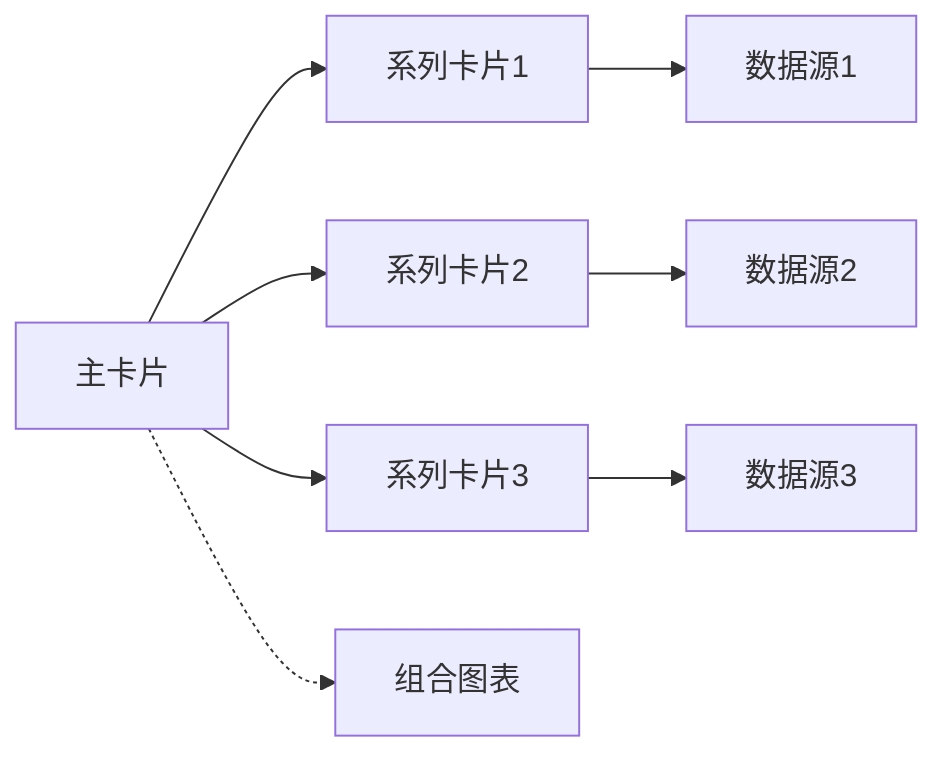

**图表来源**
- [dashboard_card.clj](file://src/metabase/dashboards/models/dashboard_card.clj#L100-L150)

**章节来源**
- [dashboard_card.clj](file://src/metabase/dashboards/models/dashboard_card.clj#L1-L200)

## 数据模型关系架构

### 多对多关系

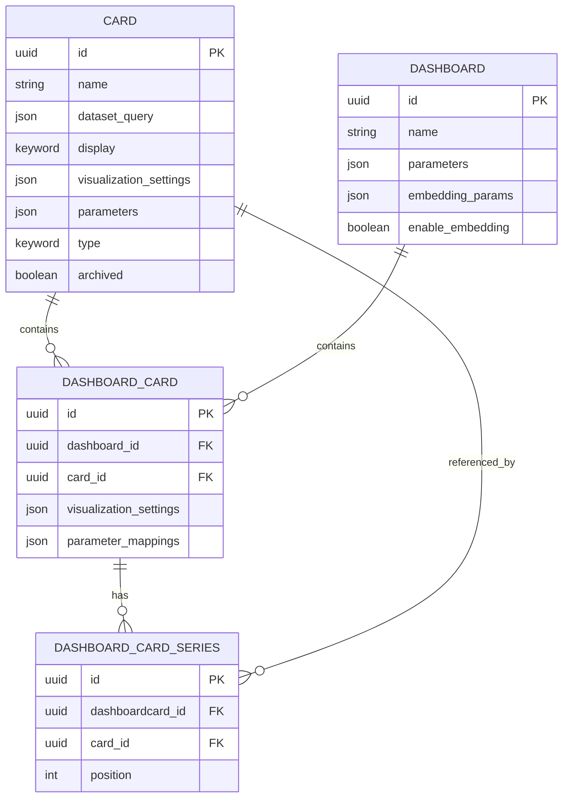

**图表来源**
- [dashboard.clj](file://src/metabase/dashboards/models/dashboard.clj#L400-L450)
- [dashboard_card.clj](file://src/metabase/dashboards/models/dashboard_card.clj#L200-L250)

### 生命周期管理

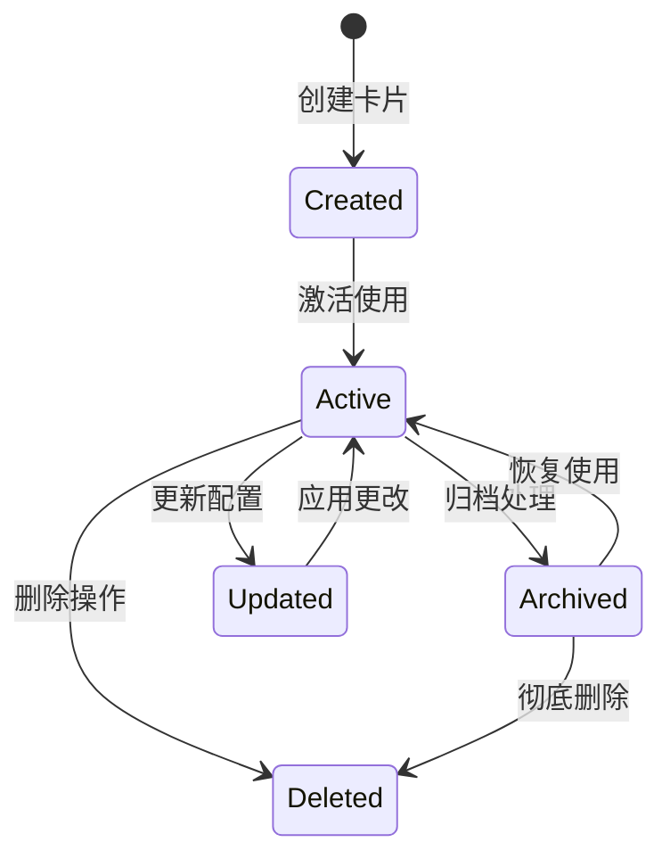

**章节来源**
- [dashboard.clj](file://src/metabase/dashboards/models/dashboard.clj#L200-L300)
- [dashboard_card.clj](file://src/metabase/dashboards/models/dashboard_card.clj#L150-L200)

## 序列化机制

### 序列化规范

Serialization模块负责在不同Metabase实例之间导出和导入实体数据。

#### 核心特性

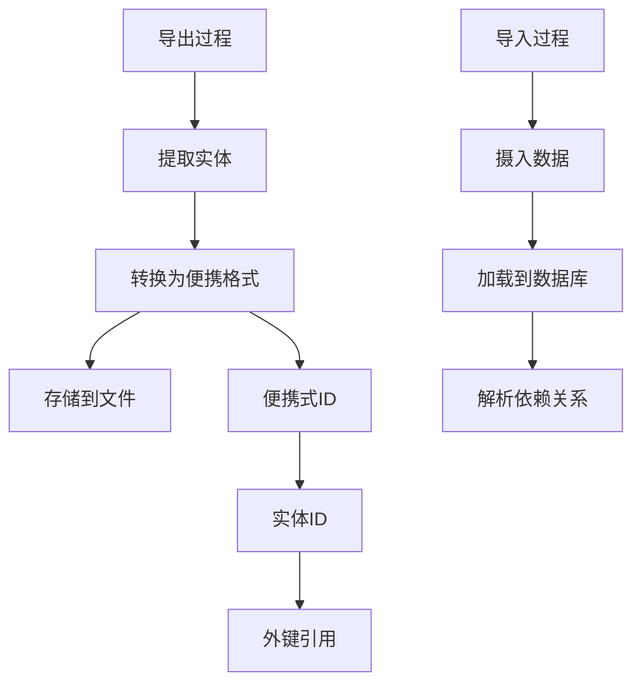

**图表来源**
- [serialization.clj](file://src/metabase/models/serialization.clj#L100-L200)

#### 版本兼容性

序列化系统支持向后兼容，通过以下机制保证：

1. **哈希回填**：为旧实体生成基于内容的唯一标识符
2. **模式升级**：逐步升级实体结构而不破坏现有数据
3. **依赖解析**：自动处理实体间的依赖关系

**章节来源**
- [serialization.clj](file://src/metabase/models/serialization.clj#L1-L400)

## 查询执行流程

### 完整执行链路

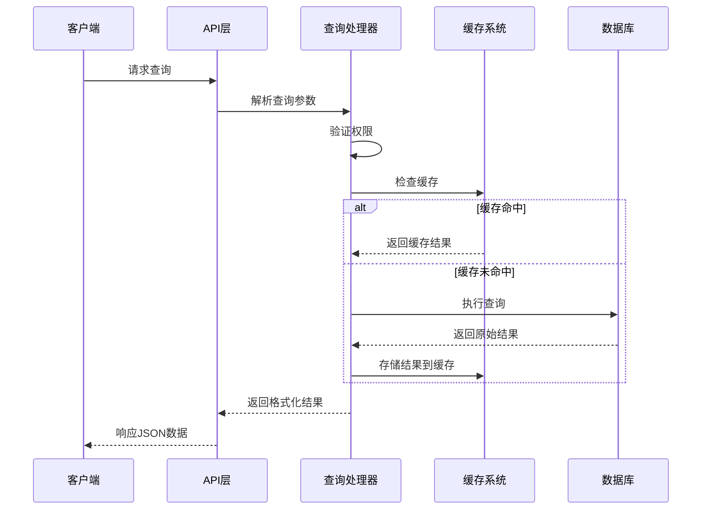

**图表来源**
- [card.clj](file://src/metabase/query_processor/card.clj#L200-L300)

### 查询优化

查询执行过程中的优化策略：

1. **参数验证**：确保查询参数的有效性
2. **权限检查**：验证用户访问权限
3. **缓存利用**：智能缓存查询结果
4. **结果流式传输**：大结果集的分块处理

**章节来源**
- [card.clj](file://src/metabase/query_processor/card.clj#L1-L200)

## 缓存系统

### 缓存键生成

缓存系统使用查询的SHA3-256哈希值作为缓存键：

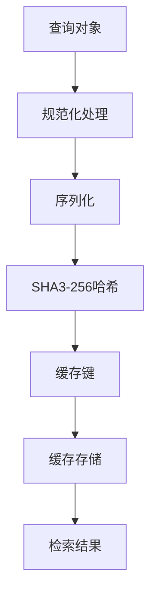

**图表来源**
- [lib-be/hash.clj](file://src/metabase/lib_be/hash.clj#L20-L42)

### 缓存策略

| 策略类型 | 描述 | 适用场景 |
|----------|------|----------|
| `:ttl` | 基于时间的过期策略 | 动态内容，需要定期更新 |
| `:nocache` | 不缓存策略 | 敏感数据，实时性要求高 |
| `:persistent` | 永久缓存策略 | 静态数据，不经常变化 |

**章节来源**
- [cache.clj](file://src/metabase/query_processor/middleware/cache.clj#L1-L100)

## 参数映射与系列配置

### 参数映射机制

参数映射允许将仪表板级别的参数传递给具体的卡片：

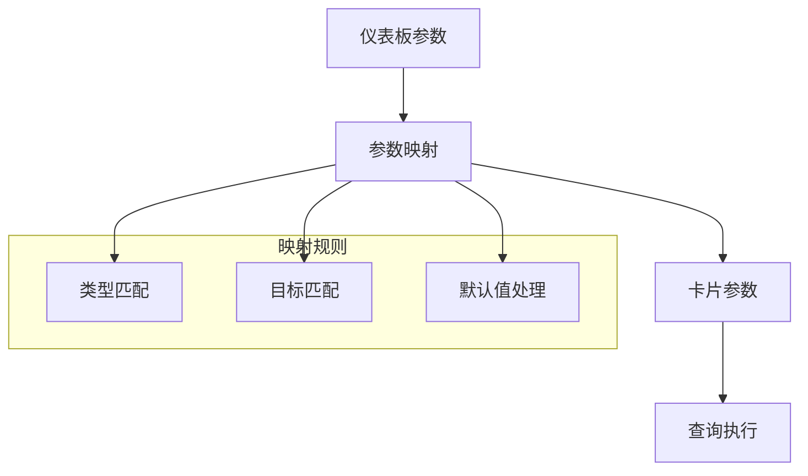

**图表来源**
- [dashboard.clj](file://src/metabase/query_processor/dashboard.clj#L28-L70)

### 系列配置

DashboardCard支持添加多个系列卡片，实现复杂的数据可视化：

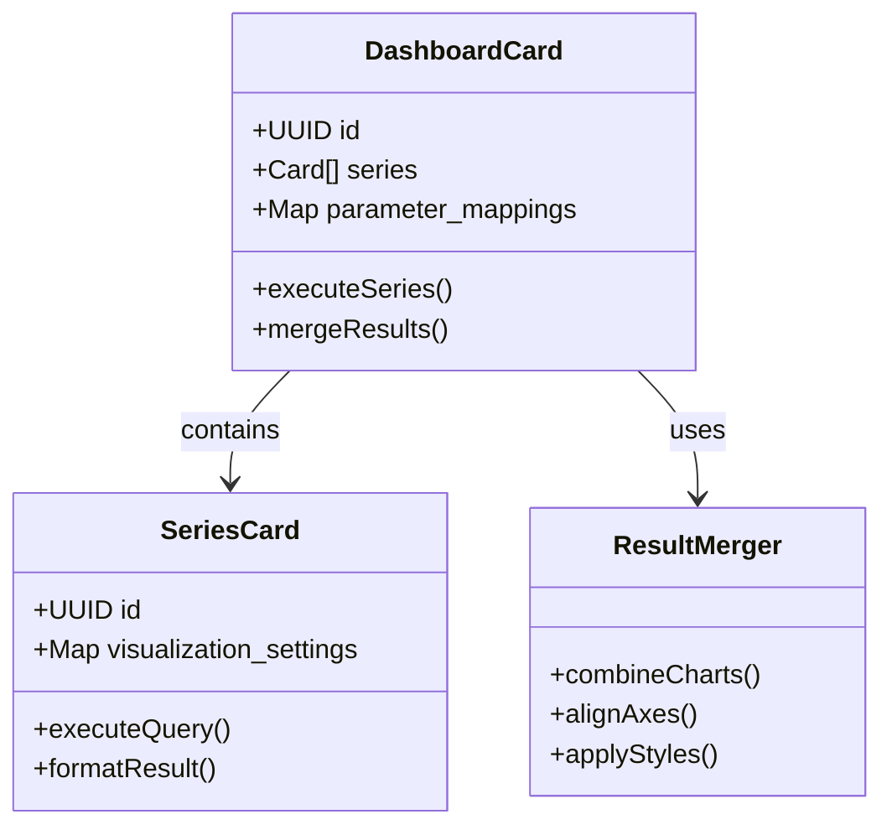

**图表来源**
- [dashboard_card.clj](file://src/metabase/dashboards/models/dashboard_card.clj#L100-L150)

**章节来源**
- [dashboard_card.clj](file://src/metabase/dashboards/models/dashboard_card.clj#L150-L300)

## 总结

Metabase的查询与仪表板模型展现了现代数据分析平台的设计精髓：

1. **模块化设计**：清晰分离Card、Dashboard、DashboardCard的职责
2. **灵活扩展**：支持多种查询类型和可视化方式
3. **性能优化**：完善的缓存机制和查询优化
4. **版本兼容**：强大的序列化系统保证数据迁移
5. **参数驱动**：灵活的参数映射系统支持动态交互

这套模型不仅支撑了Metabase的核心功能，也为构建更复杂的数据分析应用提供了坚实的基础。通过深入理解这些数据模型，开发者可以更好地扩展和定制Metabase的功能，满足特定的业务需求。