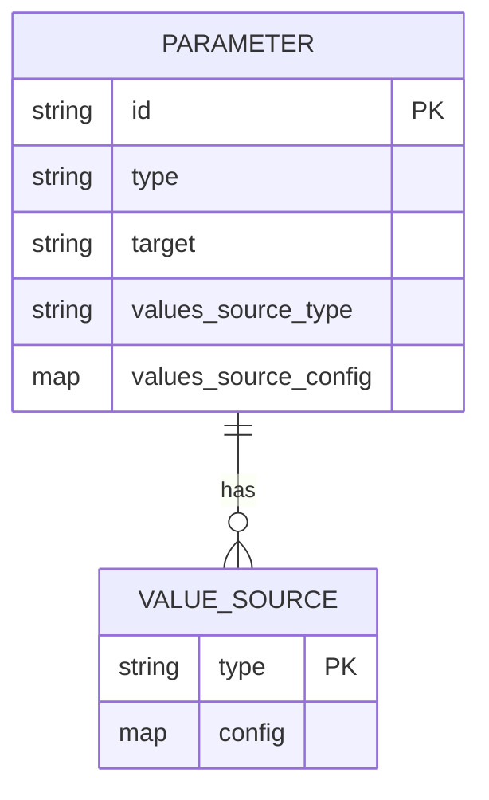
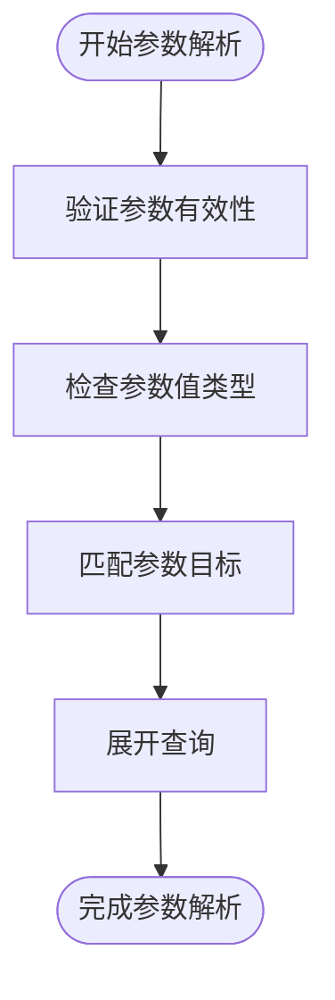
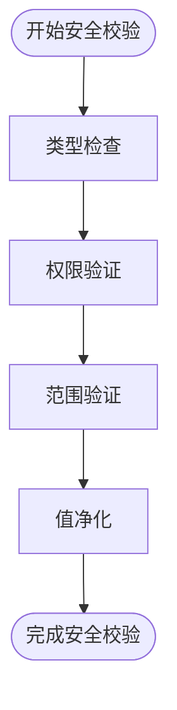
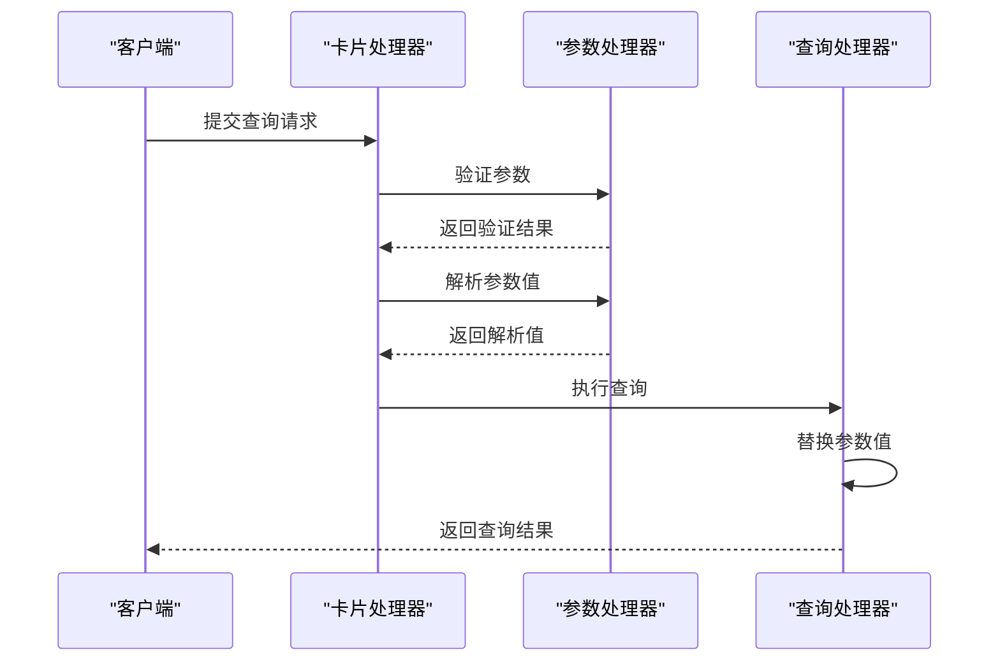
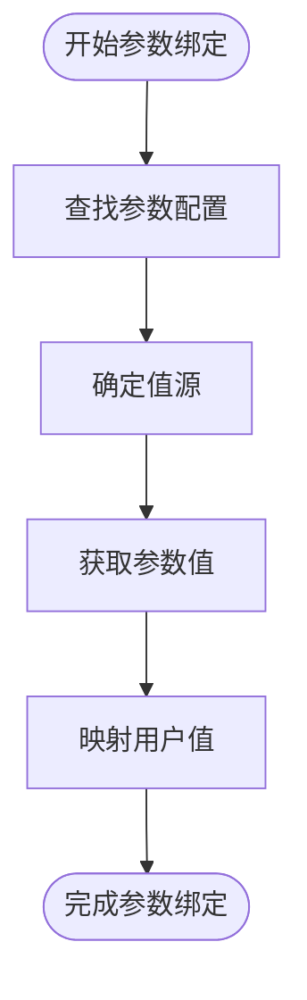

# 参数系统

<cite>
**本文档引用的文件**   
- [card.clj](file://src/metabase/queries/card.clj)
- [core.clj](file://src/metabase/parameters/core.clj)
- [params.clj](file://src/metabase/parameters/params.clj)
- [chain_filter.clj](file://src/metabase/parameters/chain_filter.clj)
- [custom_values.clj](file://src/metabase/parameters/custom_values.clj)
- [field_values.clj](file://src/metabase/parameters/field_values.clj)
- [query_processor/card.clj](file://src/metabase/query_processor/card.clj)
- [query_processor/middleware/parameters.clj](file://src/metabase/query_processor/middleware/parameters.clj)
- [query_processor/middleware/parameters/mbql.clj](file://src/metabase/query_processor/middleware/parameters/mbql.clj)
</cite>

## 目录
1. [参数系统概述](#参数系统概述)
2. [参数结构与定义](#参数结构与定义)
3. [参数类型与值源](#参数类型与值源)
4. [参数解析与替换](#参数解析与替换)
5. [参数验证与安全校验](#参数验证与安全校验)
6. [MBQL查询中的参数应用](#mbql查询中的参数应用)
7. [参数绑定过程](#参数绑定过程)
8. [总结](#总结)

## 参数系统概述

Metabase的参数系统为仪表板和卡片查询提供了动态值替换功能，允许用户通过交互式控件（如下拉列表、文本框等）来过滤和定制查询结果。该系统通过`card.clj`中的`parameters`字段定义参数，并与`parameters/core.clj`和`params.clj`等文件协同工作，实现参数的解析、替换和验证。

参数系统支持多种参数类型，包括静态值、动态下拉、字段过滤等，能够满足复杂的查询需求。系统通过MBQL（Metabase Query Language）查询来获取参数值，并在查询执行时进行安全的值替换。

**Section sources**
- [card.clj](file://src/metabase/queries/card.clj#L0-L72)
- [core.clj](file://src/metabase/parameters/core.clj#L0-L15)
- [params.clj](file://src/metabase/parameters/params.clj#L0-L373)

## 参数结构与定义

在Metabase中，参数主要定义在卡片（Card）的`parameters`字段中。该字段是一个包含参数配置的列表，每个参数对象包含以下关键属性：

- `:id`：参数的唯一标识符
- `:type`：参数类型（如`:string/=`、`:number/between`等）
- `:target`：参数的目标字段引用
- `:values_source_type`：值源类型（如`:static-list`、`:card`等）
- `:values_source_config`：值源配置

参数的结构定义在`parameters/schema.cljc`中，并通过`parameters/core.clj`中的`import-vars`导入到核心命名空间。`params.clj`文件提供了参数处理的核心功能，包括参数验证、字段ID映射和值获取等。



**Diagram sources**
- [params.clj](file://src/metabase/parameters/params.clj#L0-L373)
- [custom_values.clj](file://src/metabase/parameters/custom_values.clj#L0-L218)

**Section sources**
- [params.clj](file://src/metabase/parameters/params.clj#L0-L373)
- [core.clj](file://src/metabase/parameters/core.clj#L0-L15)

## 参数类型与值源

Metabase的参数系统支持多种参数类型和值源，为用户提供灵活的查询定制能力。

### 静态值参数

静态值参数通过`values_source_type`设置为`:static-list`来定义，其值在参数配置中直接指定。这种参数类型适用于预定义的选项列表，如状态、类别等。

```clojure
{:id "status"
 :type :string/=
 :values_source_type :static-list
 :values_source_config {:values ["Active" "Inactive" "Pending"]}}
```

### 动态下拉参数

动态下拉参数从其他查询结果中获取值，通过`values_source_type`设置为`:card`来定义。这种参数类型允许创建级联选择器，其中一个参数的值会影响另一个参数的可选项。

```clojure
{:id "category"
 :type :string/=
 :values_source_type :card
 :values_source_config {:card_id 123
                        :value_field [:field 456 nil]}}
```

### 字段过滤参数

字段过滤参数基于数据库字段的值生成选项，支持链式过滤（chain filter）功能。当一个参数的值发生变化时，相关参数的可选项会自动更新以反映当前筛选条件。

```clojure
{:id "product"
 :type :string/=
 :target [:dimension [:field 789 nil]]}
```

**Section sources**
- [custom_values.clj](file://src/metabase/parameters/custom_values.clj#L0-L218)
- [chain_filter.clj](file://src/metabase/parameters/chain_filter.clj#L0-L799)

## 参数解析与替换

参数解析与替换是Metabase查询执行过程中的关键步骤，主要在查询处理器中完成。

### 参数解析流程

参数解析从`query_processor/card.clj`中的`process-query-for-card`函数开始，该函数负责处理卡片查询的参数。解析过程包括：

1. 验证参数是否与卡片的模板标签匹配
2. 检查参数值类型是否符合要求
3. 将参数值与查询中的占位符进行匹配



**Diagram sources**
- [query_processor/card.clj](file://src/metabase/query_processor/card.clj#L0-L366)

### 参数替换机制

参数替换在`query_processor/middleware/parameters.clj`中实现，通过中间件模式在查询执行前进行值替换。系统支持两种主要的替换方式：

- **MBQL参数替换**：在MBQL查询中，参数通过`[:template-tag]`形式引用，并在执行时替换为实际值
- **原生SQL参数替换**：在原生SQL查询中，参数通过`{{param_name}}`语法引用

替换过程确保了参数值的安全性，防止SQL注入等安全问题。

**Section sources**
- [query_processor/card.clj](file://src/metabase/query_processor/card.clj#L0-L366)
- [query_processor/middleware/parameters.clj](file://src/metabase/query_processor/middleware/parameters.clj#L0-L32)

## 参数验证与安全校验

Metabase的参数系统包含严格的验证和安全校验机制，确保查询的安全性和正确性。

### 参数验证

参数验证主要在`params.clj`中实现，通过`assert-valid-parameters`和`assert-valid-parameter-mappings`函数进行。验证内容包括：

- 参数必须包含`:id`和`:type`键
- 参数映射必须包含`:parameter_id`和`:type`键
- 参数值必须符合指定的类型要求

```clojure
(defn assert-valid-parameters
  "接收一个参数化对象并检查其参数是否有效。"
  [{:keys [parameters]}]
  (let [schema [:maybe ::parameters.schema/parameters]]
    (when-let [error (mr/explain schema parameters)]
      (throw (ex-info (str ":parameters must be a sequence of maps with :id and :type keys; "
                           (pr-str (me/humanize error)))
                      {:parameters parameters
                       :errors     (:errors error)})))))
```

### 安全校验

安全校验机制防止恶意参数输入，主要措施包括：

- 类型检查：确保参数值类型与预期一致
- 权限验证：检查用户是否有权访问参数引用的字段
- 值范围限制：对数值参数进行范围验证



**Diagram sources**
- [params.clj](file://src/metabase/parameters/params.clj#L0-L373)
- [query_processor/middleware/parameters/mbql.clj](file://src/metabase/query_processor/middleware/parameters/mbql.clj#L0-L27)

**Section sources**
- [params.clj](file://src/metabase/parameters/params.clj#L0-L373)
- [query_processor/middleware/parameters/mbql.clj](file://src/metabase/query_processor/middleware/parameters/mbql.clj#L0-L27)

## MBQL查询中的参数应用

在MBQL查询中，参数通过模板标签（template tag）机制应用，为查询提供动态值。

### 模板标签解析

模板标签解析在`driver/common/parameters/values.clj`中实现，支持多种参数类型：

- **字段过滤参数**：通过`[:dimension [:template-tag ...]]`形式引用
- **变量参数**：通过`[:variable [:template-tag ...]]`形式引用
- **时间单位参数**：通过`[:temporal-unit [:template-tag ...]]`形式引用

```clojure
(defn- tag-targets
  "给定一个模板标签，返回可用于定位该标签的一组`target`结构。"
  [tag :- ::mbql.s/TemplateTag]
  (let [target-type (case (:type tag)
                      (:dimension :temporal-unit) :dimension
                      :variable)]
    #{[target-type [:template-tag (:name tag)]]
      [target-type [:template-tag {:id (:id tag)}]]}))
```

### 查询执行流程

MBQL查询的执行流程包括参数处理的多个阶段：



**Diagram sources**
- [query_processor/card.clj](file://src/metabase/query_processor/card.clj#L0-L366)
- [driver/common/parameters/values.clj](file://src/metabase/driver/common/parameters/values.clj#L0-L332)

**Section sources**
- [query_processor/card.clj](file://src/metabase/query_processor/card.clj#L0-L366)
- [driver/common/parameters/values.clj](file://src/metabase/driver/common/parameters/values.clj#L0-L332)

## 参数绑定过程

参数绑定是将用户输入的参数值与查询中的占位符关联的过程，确保查询能够使用正确的值执行。

### 绑定流程

参数绑定流程从`card.clj`中的`card-param-values`函数开始：

```clojure
(mu/defn card-param-values
  "获取包含`query`的参数值。如果`query`为nil或未提供，则返回所有值。"
  ([card param-key]
   (card-param-values card param-key nil))
  ([card         :- ms/Map
    param-key    :- ::lib.schema.parameter/id
    query-string :- [:maybe ms/NonBlankString]]
   (let [param (get-param-or-throw card param-key)]
     (custom-values/parameter->values param query-string (mu/fn :- ms/FieldValuesResult []
                                                           (mapping->field-values card param query-string)))))))
```

### 绑定步骤

1. **参数查找**：根据参数ID在卡片的参数列表中查找对应的参数配置
2. **值源确定**：根据`values_source_type`确定值的来源
3. **值获取**：从指定源获取参数值
4. **值映射**：将用户输入的值映射到数据库中的实际值



**Diagram sources**
- [card.clj](file://src/metabase/queries/card.clj#L0-L72)
- [custom_values.clj](file://src/metabase/parameters/custom_values.clj#L0-L218)

**Section sources**
- [card.clj](file://src/metabase/queries/card.clj#L0-L72)
- [custom_values.clj](file://src/metabase/parameters/custom_values.clj#L0-L218)

## 总结

Metabase的参数系统是一个功能强大且安全的查询定制框架，通过`card.clj`中的`parameters`字段定义参数，并与`parameters/core.clj`和`params.clj`等文件协同工作。系统支持多种参数类型和值源，包括静态值、动态下拉和字段过滤，能够满足复杂的查询需求。

参数系统的关键特性包括：
- **灵活的值源**：支持静态列表、其他查询结果和数据库字段值
- **安全的参数替换**：通过严格的验证和校验机制防止安全漏洞
- **高效的查询执行**：在MBQL查询中无缝集成参数替换
- **用户友好的交互**：支持级联选择器和动态下拉等高级功能

该系统为用户提供了强大的数据探索能力，同时确保了查询的安全性和性能。

**Section sources**
- [card.clj](file://src/metabase/queries/card.clj#L0-L72)
- [params.clj](file://src/metabase/parameters/params.clj#L0-L373)
- [query_processor/card.clj](file://src/metabase/query_processor/card.clj#L0-L366)