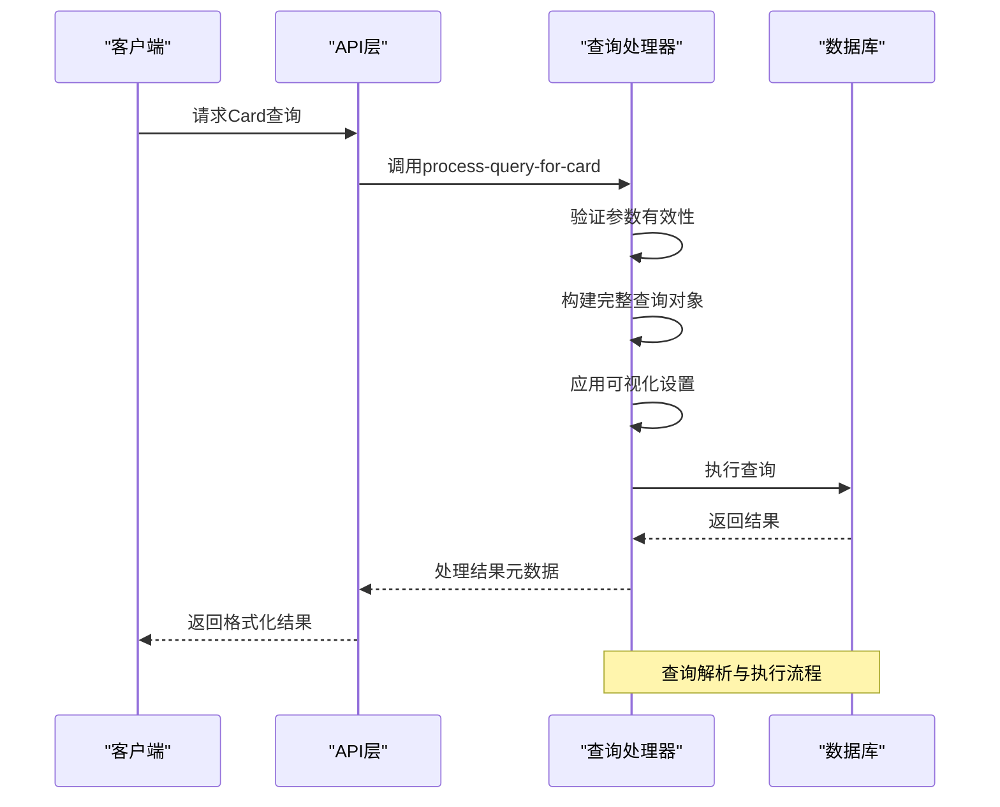
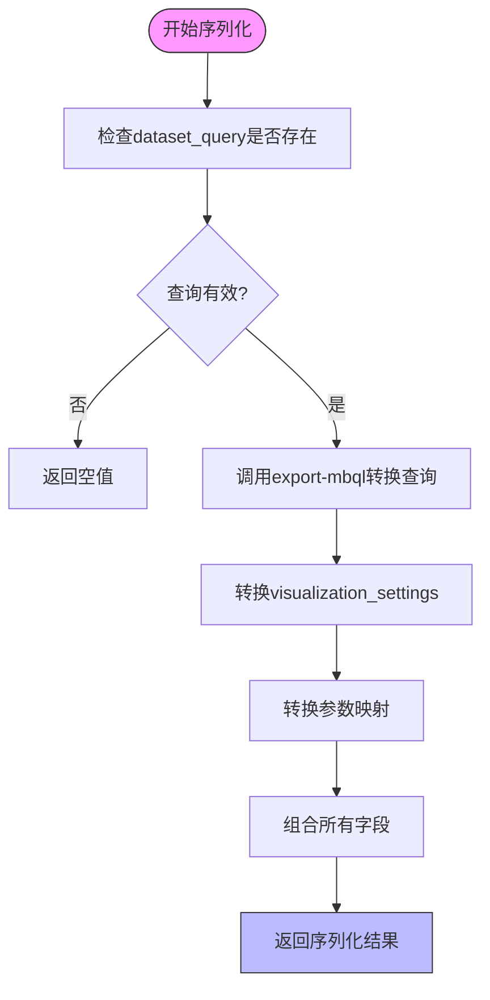
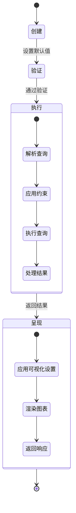

# 查询核心字段

<cite>
**本文档中引用的文件**   
- [card.clj](file://src\metabase\queries\models\card.clj)
- [card.clj](file://src\metabase\query_processor\card.clj)
- [query.clj](file://src\metabase\app_db\query.clj)
- [schema.clj](file://src\metabase\queries\schema.clj)
- [serialization.clj](file://src\metabase\models\serialization.clj)
- [metadata.clj](file://src\metabase\queries\models\card\metadata.clj)
</cite>

## 目录
1. [简介](#简介)
2. [Card模型核心字段分析](#card模型核心字段分析)
3. [查询解析与执行流程](#查询解析与执行流程)
4. [字段序列化与反序列化](#字段序列化与反序列化)
5. [字段验证与默认值](#字段验证与默认值)
6. [查询生命周期中的字段作用](#查询生命周期中的字段作用)
7. [结论](#结论)

## 简介
本文档深入解析Metabase系统中`Card`模型的核心字段，重点关注`dataset_query`、`display`和`visualization_settings`三个关键字段。这些字段在查询构建、执行和结果呈现过程中扮演着至关重要的角色。文档将详细说明这些字段的结构、验证规则、序列化行为以及它们在查询生命周期中的作用机制。

## Card模型核心字段分析

### dataset_query字段
`dataset_query`字段是`Card`模型的核心，存储了查询的完整定义。该字段支持两种查询类型：MBQL（Metabase Query Language）和原生查询。MBQL是一种结构化的查询语言，允许通过JSON格式定义复杂的查询逻辑，而原生查询则直接存储数据库特定的SQL语句。

该字段的结构在`queries.schema.clj`文件中定义，采用多态模式：当查询为空时，允许使用空映射`{}`；当查询存在时，则必须符合MBQL 5的模式定义。查询在存储和检索时会经过标准化处理，确保其格式的一致性。

**字段来源**
- [card.clj](file://src\metabase\queries\models\card.clj#L100-L150)
- [schema.clj](file://src\metabase\queries\schema.clj#L30-L50)

### display字段
`display`字段控制查询结果的可视化展示类型。该字段的值为关键字类型，决定了前端如何渲染查询结果。常见的显示类型包括`:table`（表格）、`:scalar`（标量值）、`:bar`（条形图）等。

在查询处理过程中，`display`字段与`visualization_settings`协同工作，共同决定最终的可视化效果。当查询结果被用于仪表板或通知时，该字段的值会影响结果的呈现方式。

**字段来源**
- [card.clj](file://src\metabase\queries\models\card.clj#L100-L150)
- [card.clj](file://src\metabase\query_processor\card.clj#L200-L250)

### visualization_settings字段
`visualization_settings`字段是一个JSON结构，存储了详细的可视化配置信息。该字段包含了图表的各种样式设置、字段格式化规则、交互行为等。其结构是灵活的，允许存储各种可视化相关的配置。

该字段在序列化和反序列化过程中会进行特殊处理，确保其中引用的数据库、表和字段ID在不同环境间迁移时能够正确转换。配置中的字段引用会被转换为可移植的`[数据库 名称 表名 字段名]`格式。

**字段来源**
- [card.clj](file://src\metabase\queries\models\card.clj#L100-L150)
- [serialization.clj](file://src\metabase\models\serialization.clj#L1550-L1700)

## 查询解析与执行流程

### 查询解析逻辑
查询解析主要在`query_processor/card.clj`文件中实现。当请求一个Card的查询时，系统会调用`query-for-card`函数，该函数负责将Card的`dataset_query`转换为可执行的查询对象。

解析过程包括：
1. 检查查询参数的有效性
2. 根据上下文添加约束条件
3. 处理缓存策略
4. 生成最终的执行查询

**Diagram sources **
- [card.clj](file://src\metabase\query_processor\card.clj#L250-L300)

**Section sources**
- [card.clj](file://src\metabase\query_processor\card.clj#L200-L350)

## 字段序列化与反序列化

### 序列化机制
字段的序列化和反序列化在`models/serialization.clj`文件中定义。系统使用多方法（multimethods）来处理不同字段的序列化逻辑。

对于`dataset_query`字段，系统使用`export-mbql`和`import-mbql`函数进行序列化和反序列化。这些函数会将查询中的数据库、表和字段ID转换为可移植的引用格式，确保在不同环境间迁移时的正确性。

**Diagram sources **
- [serialization.clj](file://src\metabase\models\serialization.clj#L1190-L1300)
- [serialization.clj](file://src\metabase\models\serialization.clj#L1550-L1700)

**Section sources**
- [serialization.clj](file://src\metabase\models\serialization.clj#L1190-L1749)

## 字段验证与默认值

### 验证规则
系统在保存Card时会执行严格的验证。验证规则包括：
- 检查字段过滤器引用的字段是否属于查询的目标数据库
- 验证模型类型的Card不能包含变量或字段过滤器
- 确保参数映射中的ID在参数列表中存在

这些验证在`pre-insert`和`pre-update`函数中实现，确保数据的完整性和一致性。

### 默认值处理
系统为某些字段设置了合理的默认值：
- `parameters`: 默认为空数组`[]`
- `parameter_mappings`: 默认为空数组`[]`
- `card_schema`: 默认为当前模式版本号

这些默认值在`pre-insert`函数中设置，确保新创建的Card具有完整的字段结构。

**Section sources**
- [card.clj](file://src\metabase\queries\models\card.clj#L500-L600)

## 查询生命周期中的字段作用

### 生命周期阶段
在查询的生命周期中，各个字段在不同阶段发挥着重要作用：

1. **创建阶段**: 字段的默认值被设置，查询结构被标准化
2. **验证阶段**: 字段值经过验证，确保符合业务规则
3. **执行阶段**: `dataset_query`被解析，`display`和`visualization_settings`影响结果处理
4. **呈现阶段**: 可视化设置决定最终的用户界面展示

### 元数据处理
`result_metadata`字段在查询执行后被更新，存储结果集的结构信息。系统提供了异步更新机制，当元数据计算耗时较长时，可以先保存Card，稍后更新元数据。

**Diagram sources **
- [metadata.clj](file://src\metabase\queries\models\card\metadata.clj#L100-L150)
- [card.clj](file://src\metabase\queries\models\card.clj#L700-L750)

**Section sources**
- [metadata.clj](file://src\metabase\queries\models\card\metadata.clj#L50-L200)
- [card.clj](file://src\metabase\queries\models\card.clj#L650-L800)

## 结论
`Card`模型中的`dataset_query`、`display`和`visualization_settings`字段构成了Metabase查询系统的核心。这些字段不仅定义了查询的逻辑和结果的呈现方式，还在查询的整个生命周期中发挥着关键作用。通过深入理解这些字段的结构、验证规则和处理流程，可以更好地利用Metabase的强大功能，构建高效、可靠的分析应用。