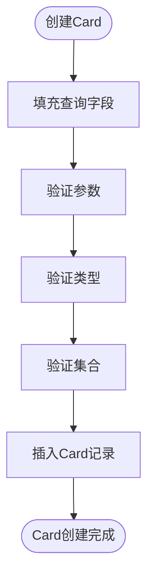
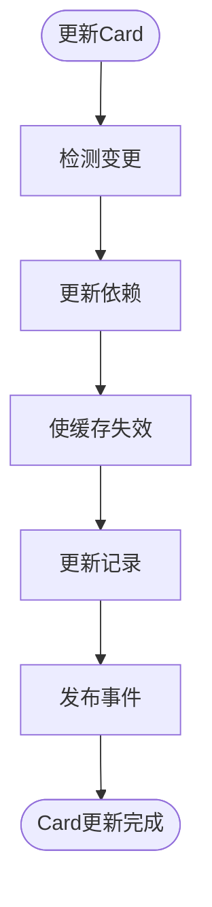
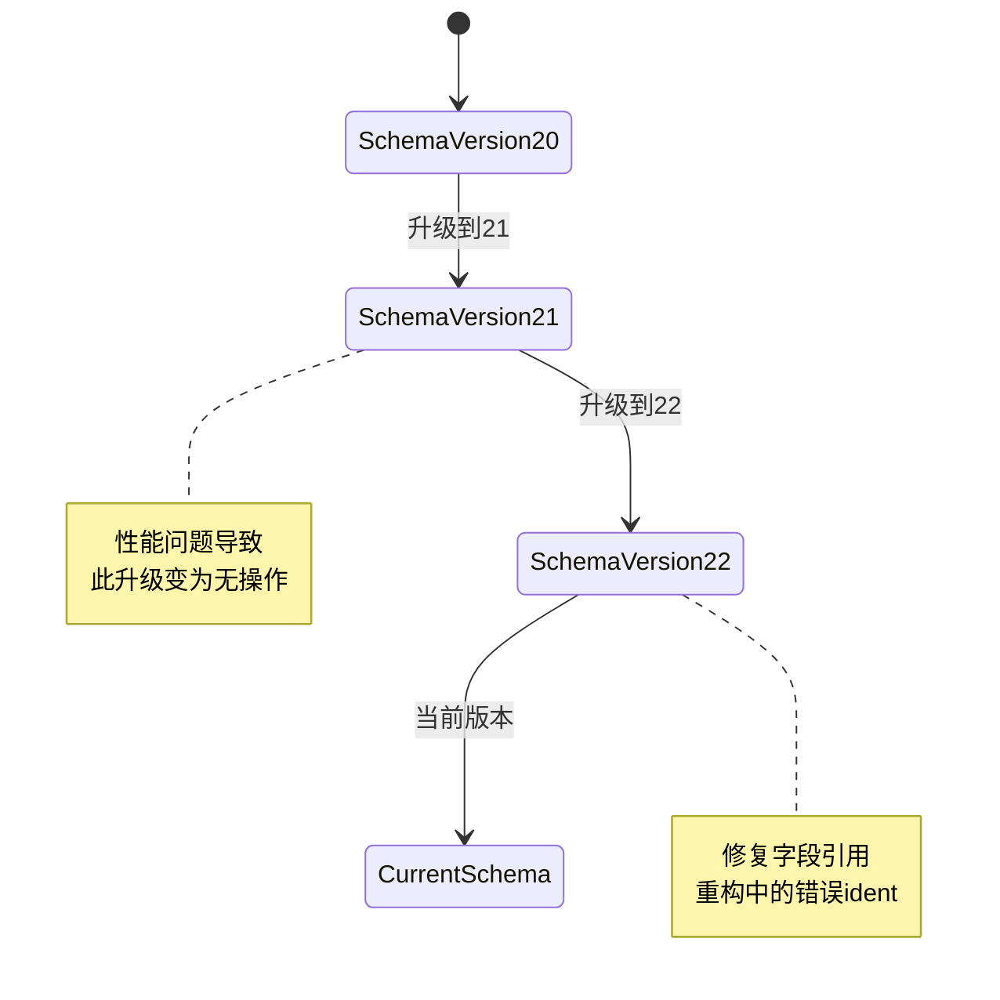
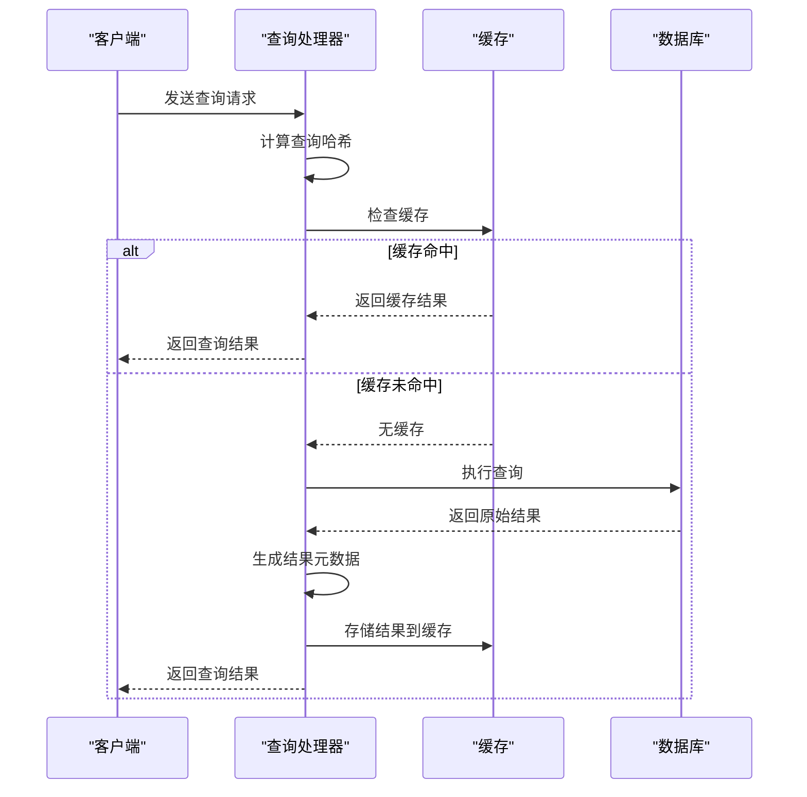
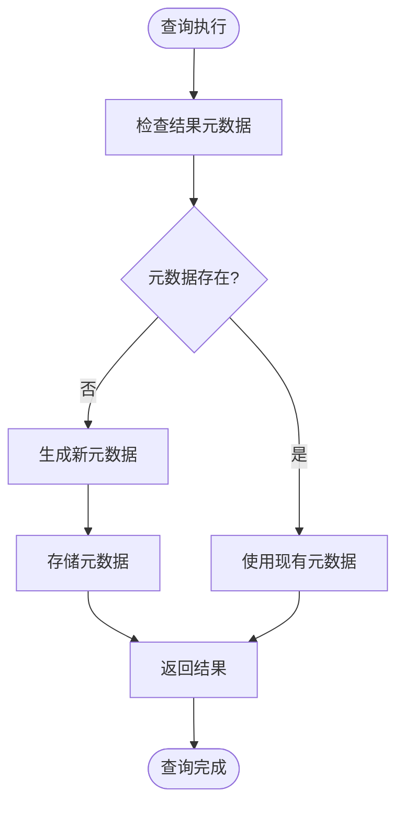

# 查询模型

<cite>
**本文档引用的文件**
- [card.clj](file://src\metabase\queries\models\card.clj)
- [card.clj](file://src\metabase\queries\card.clj)
- [query.clj](file://src\metabase\queries\models\query.clj)
- [schema.clj](file://src\metabase\queries\schema.clj)
- [serialization.clj](file://src\metabase\models\serialization.clj)
- [cache.clj](file://src\metabase\query_processor\middleware\cache.clj)
- [hash.clj](file://src\metabase\lib_be\hash.clj)
</cite>

## 目录
1. [简介](#简介)
2. [Card数据模型](#card数据模型)
3. [查询解析逻辑](#查询解析逻辑)
4. [序列化与版本兼容性](#序列化与版本兼容性)
5. [查询生命周期](#查询生命周期)
6. [结论](#结论)

## 简介
本文档全面解析Metabase中`Card`（即保存的查询）的数据模型。我们将详细探讨`card.clj`中的核心字段结构与作用，分析`query.clj`中定义的查询解析逻辑，以及`serialization.clj`在模型序列化和版本兼容性处理中的角色。文档将涵盖查询的创建、执行、结果元数据生成及缓存键计算的完整生命周期。

## Card数据模型

`Card`是Metabase中保存查询的核心数据模型，历史上称为"Question"，两者在后端代码库中可互换使用。`Card`模型定义了查询的各个方面，包括查询定义、显示设置、参数配置等。

### dataset_query字段
`dataset_query`是`Card`模型中最核心的字段，它定义了查询的具体内容。该字段可以包含两种类型的查询：
- **MBQL (Metabase Query Language)**：一种结构化的查询语言，用于构建复杂的分析查询
- **Native (原生SQL)**：直接的SQL查询，允许用户编写自定义SQL

`dataset_query`字段的结构在`queries.schema.clj`中有明确定义，它允许保存空查询（`{}`），但不允许为`NULL`值，因为数据库列是非空的。查询可以是有效的MBQL 5查询或空查询。

**Section sources**
- [card.clj](file://src\metabase\queries\models\card.clj#L0-L1364)
- [schema.clj](file://src\metabase\queries\schema.clj#L0-L73)

### display字段
`display`字段定义了查询结果的可视化类型。它决定了查询结果将以何种图表形式呈现，如柱状图、折线图、表格等。该字段的值是一个关键字，表示不同的可视化类型。

### visualization_settings字段
`visualization_settings`字段包含了与特定可视化类型相关的详细配置。这些设置可以包括：
- 图表的颜色方案
- 坐标轴的标签和格式
- 数据系列的显示方式
- 交互式功能的配置

这些设置使得用户可以高度自定义查询结果的外观和行为。

### parameters字段
`parameters`字段定义了查询中使用的参数。参数允许用户在不修改查询本身的情况下动态改变查询条件。参数可以是：
- **字符串参数**：用于文本匹配
- **数字参数**：用于数值比较
- **日期参数**：用于时间范围筛选
- **字段过滤参数**：允许用户选择特定的数据库字段进行过滤

参数系统使得查询更加灵活和可重用。

**Section sources**
- [card.clj](file://src\metabase\queries\models\card.clj#L0-L1364)

## 查询解析逻辑

查询解析逻辑主要在`query.clj`文件中定义，负责处理查询的创建、更新和验证。

### 查询创建
当创建一个新的`Card`时，系统会执行以下步骤：
1. **字段填充**：从查询定义中提取`database_id`、`table_id`、`query_type`和`source_card_id`等字段
2. **参数验证**：检查所有参数的有效性，确保它们引用的字段属于查询所指向的数据库
3. **类型验证**：验证模型（model）类型的`Card`是否具有有效的查询结构
4. **集合验证**：确保`Card`位于正确的集合命名空间中

**Diagram sources**
- [card.clj](file://src\metabase\queries\models\card.clj#L0-L1364)

### 查询更新
更新`Card`时，系统会执行一系列验证和处理逻辑：
1. **变更检测**：检测哪些字段发生了变化
2. **依赖更新**：如果查询的断面（breakout）发生变化，更新相关的仪表板参数映射
3. **缓存失效**：使相关查询的缓存失效
4. **事件发布**：发布`card-update`事件通知系统其他部分

**Diagram sources**
- [card.clj](file://src\metabase\queries\models\card.clj#L0-L1364)

## 序列化与版本兼容性

`serialization.clj`文件定义了`Card`模型的序列化机制，确保查询可以在不同Metabase实例之间导出和导入。

### 实体ID系统
每个可序列化的实体都需要一个唯一、永久且可移植的标识符。Metabase采用了三种方法：
1. **基于名称的唯一性**：如数据库具有唯一名称
2. **嵌入式实体**：作为父实体的一部分，不需要独立存在
3. **实体ID列**：对于其他实体，添加`entity_id`列并用随机生成的NanoID填充

### 版本升级
`Card`模型支持版本升级机制，通过`upgrade-card-schema-to`多方法实现：
- **版本20到21**：最初用于为`result_metadata`中的所有列填充`ident`，但由于性能问题已变为无操作
- **版本21到22**：修复了字段引用重构过程中产生的错误`ident`，简单地丢弃了旧的`ident`

**Diagram sources**
- [serialization.clj](file://src\metabase\models\serialization.clj#L0-L1838)

## 查询生命周期

查询的完整生命周期包括创建、执行、结果元数据生成和缓存管理。

### 查询执行与缓存
查询执行过程中，系统会计算查询的哈希值作为缓存键。`lib-be.hash.clj`文件中的`query-hash`函数负责生成256位SHA3哈希：

**Diagram sources**
- [hash.clj](file://src\metabase\lib_be\hash.clj#L0-L42)
- [cache.clj](file://src\metabase\query_processor\middleware\cache.clj#L151-L177)

### 结果元数据生成
结果元数据的生成是查询处理的重要环节：
1. **自动填充**：在创建或更新`Card`时，系统会自动填充`result_metadata`
2. **异步处理**：如果元数据不能及时获取，系统会先保存`Card`，然后异步更新元数据
3. **验证机制**：通过`verified-result-metadata?`标志控制是否重新生成元数据

**Diagram sources**
- [card.clj](file://src\metabase\queries\models\card.clj#L0-L1364)

## 结论
Metabase的查询模型设计精巧，通过`Card`数据模型统一管理查询的各个方面。`dataset_query`、`display`、`visualization_settings`和`parameters`等核心字段共同构成了灵活而强大的查询系统。查询解析逻辑确保了数据的完整性和一致性，而序列化机制则支持了跨实例的数据迁移。完整的查询生命周期管理，包括缓存和元数据生成，确保了系统的高性能和可靠性。这一架构设计使得Metabase能够满足从简单到复杂的各种数据分析需求。