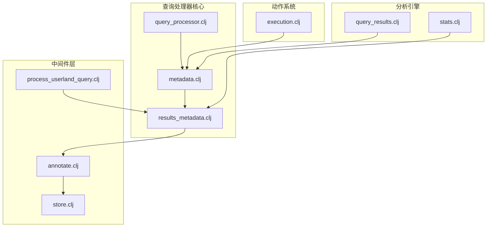
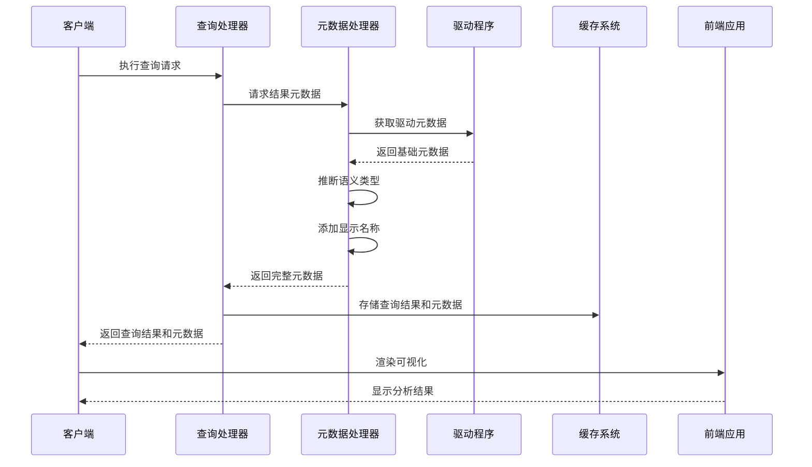
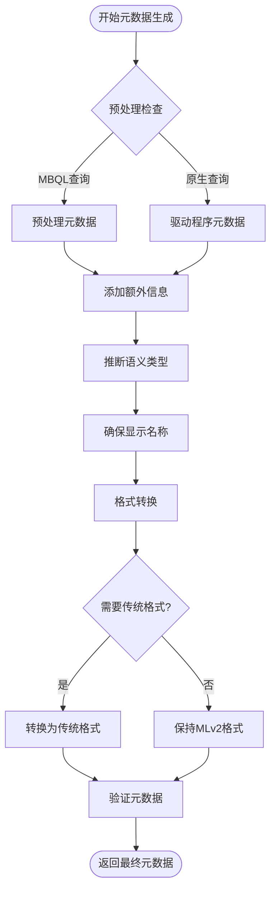
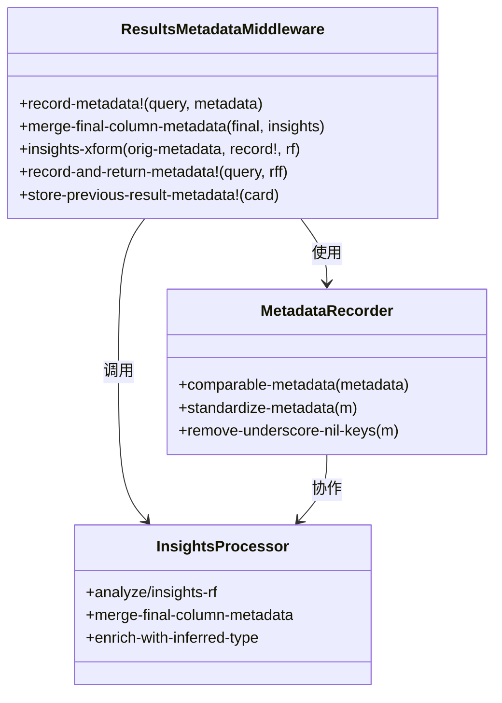
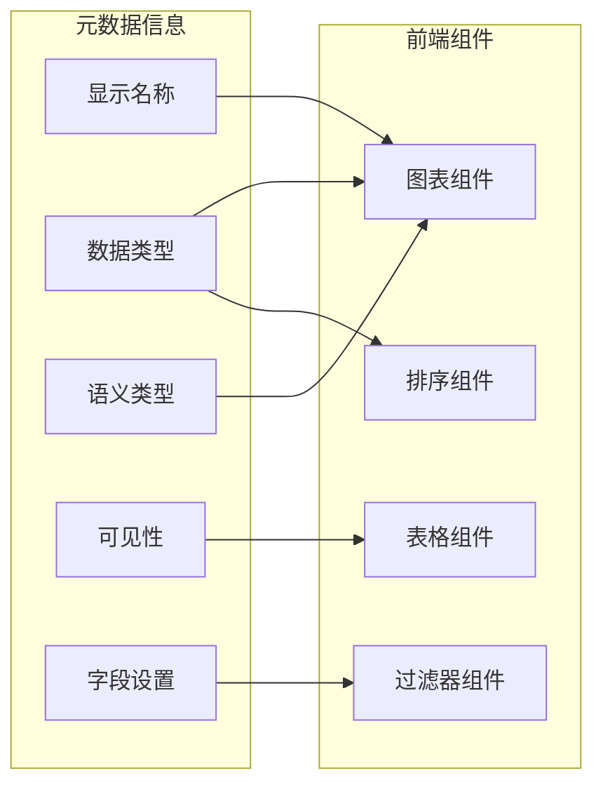
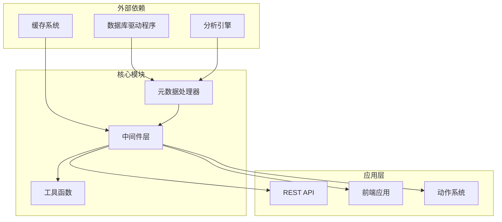

# 结果元数据

<cite>
**本文档中引用的文件**
- [execution.clj](file://src/metabase/actions/execution.clj)
- [metadata.clj](file://src/metabase/query_processor/metadata.clj)
- [results_metadata.clj](file://src/metabase/query_processor/middleware/results_metadata.clj)
- [store.clj](file://src/metabase/query_processor/store.clj)
- [query_processor.clj](file://src/metabase/query_processor.clj)
- [process_userland_query.clj](file://src/metabase/query_processor/middleware/process_userland_query.clj)
- [annotate.clj](file://src/metabase/query_processor/middleware/annotate.clj)
- [query_results.clj](file://src/metabase/analyze/query_results.clj)
- [stats.clj](file://src/metabase/analytics/stats.clj)
</cite>

## 目录
1. [简介](#简介)
2. [项目结构概览](#项目结构概览)
3. [核心组件分析](#核心组件分析)
4. [架构概览](#架构概览)
5. [详细组件分析](#详细组件分析)
6. [依赖关系分析](#依赖关系分析)
7. [性能考虑](#性能考虑)
8. [故障排除指南](#故障排除指南)
9. [结论](#结论)

## 简介

Metabase的结果元数据系统是一个复杂而精密的架构，负责在查询执行过程中生成、处理和管理查询结果的结构化信息。该系统的核心目标是为前端可视化提供准确的数据类型信息，支持高效的缓存机制，并为性能监控提供必要的指标数据。

结果元数据不仅包含基本的字段名称和数据类型，还包含了语义信息、显示名称、可见性设置等丰富的上下文信息，这些信息对于构建用户友好的数据分析界面至关重要。

## 项目结构概览

结果元数据系统主要分布在以下几个关键模块中：

**图表来源**
- [query_processor.clj](file://src/metabase/query_processor.clj#L1-L117)
- [metadata.clj](file://src/metabase/query_processor/metadata.clj#L1-L161)
- [results_metadata.clj](file://src/metabase/query_processor/middleware/results_metadata.clj#L1-L161)

## 核心组件分析

### 查询执行记录结构

查询执行记录（Query Execution Record）是结果元数据系统的基础，它包含了查询执行过程中的所有关键信息：

| 字段名 | 类型 | 描述 | 用途 |
|--------|------|------|------|
| `query-hash` | String | 查询的唯一标识符 | 缓存键计算和去重 |
| `running-time` | Integer | 查询执行时间（毫秒） | 性能监控和优化 |
| `result-rows` | Integer | 返回的行数 | 数据量统计 |
| `cache-hit` | Boolean | 是否命中缓存 | 缓存效果评估 |
| `error` | String | 错误信息 | 故障诊断 |
| `database-id` | Integer | 数据库标识符 | 数据源追踪 |

### 字段类型和语义信息

结果元数据系统维护着详细的字段属性信息：

| 属性类别 | 关键属性 | 数据类型 | 说明 |
|----------|----------|----------|------|
| 基础属性 | `name` | String | 字段原始名称 |
| 基础属性 | `display-name` | String | 用户友好的显示名称 |
| 基础属性 | `base-type` | Keyword | 原始数据类型 |
| 基础属性 | `effective-type` | Keyword | 实际使用的数据类型 |
| 语义属性 | `semantic-type` | Keyword | 字段的业务含义 |
| 可见性 | `visibility-type` | Keyword | 字段的可见性级别 |
| 关联信息 | `fk-target-field-id` | Integer | 外键关联的目标字段 |
| 设置信息 | `settings` | Map | 字段特定的配置选项 |

**章节来源**
- [metadata.clj](file://src/metabase/query_processor/metadata.clj#L82-L107)
- [results_metadata.clj](file://src/metabase/query_processor/middleware/results_metadata.clj#L25-L55)

## 架构概览

结果元数据系统采用分层架构设计，确保了高效的数据处理和灵活的功能扩展：

**图表来源**
- [query_processor.clj](file://src/metabase/query_processor.clj#L70-L117)
- [metadata.clj](file://src/metabase/query_processor/metadata.clj#L120-L161)

## 详细组件分析

### 元数据生成器（Metadata Generator）

元数据生成器是结果元数据系统的核心组件，负责从不同来源收集和整合元数据信息：

**图表来源**
- [metadata.clj](file://src/metabase/query_processor/metadata.clj#L120-L161)
- [results_metadata.clj](file://src/metabase/query_processor/middleware/results_metadata.clj#L114-L144)

### 结果元数据中间件（Results Metadata Middleware）

结果元数据中间件负责在查询执行完成后处理和存储元数据信息：

**图表来源**
- [results_metadata.clj](file://src/metabase/query_processor/middleware/results_metadata.clj#L25-L55)
- [results_metadata.clj](file://src/metabase/query_processor/middleware/results_metadata.clj#L114-L144)

### 序列化和缓存机制

结果元数据系统实现了高效的序列化和缓存机制：

| 缓存策略 | 实现方式 | 适用场景 | 性能特点 |
|----------|----------|----------|----------|
| 内存缓存 | 动态变量存储 | 短期查询结果 | 高速访问 |
| 持久化缓存 | 数据库存储 | 长期查询结果 | 持久化存储 |
| 分布式缓存 | Redis集成 | 多实例部署 | 高可用性 |
| 前端缓存 | 浏览器存储 | 用户会话期间 | 减少网络请求 |

**章节来源**
- [store.clj](file://src/metabase/query_processor/store.clj#L40-L80)
- [process_userland_query.clj](file://src/metabase/query_processor/middleware/process_userland_query.clj#L65-L90)

### 前端可视化支持

结果元数据为前端可视化提供了丰富的信息支持：

**图表来源**
- [annotate.clj](file://src/metabase/query_processor/middleware/annotate.clj#L27-L63)
- [query_results.clj](file://src/metabase/analyze/query_results.clj#L27-L59)

**章节来源**
- [results_metadata.clj](file://src/metabase/query_processor/middleware/results_metadata.clj#L72-L92)
- [annotate.clj](file://src/metabase/query_processor/middleware/annotate.clj#L61-L89)

## 依赖关系分析

结果元数据系统的依赖关系体现了其模块化设计的优势：

**图表来源**
- [metadata.clj](file://src/metabase/query_processor/metadata.clj#L1-L25)
- [results_metadata.clj](file://src/metabase/query_processor/middleware/results_metadata.clj#L1-L25)

**章节来源**
- [query_processor.clj](file://src/metabase/query_processor.clj#L10-L25)
- [store.clj](file://src/metabase/query_processor/store.clj#L1-L30)

## 性能考虑

结果元数据系统在设计时充分考虑了性能优化：

### 查询执行优化

- **延迟加载**：元数据只在需要时才进行完整计算
- **缓存策略**：多层缓存减少重复计算开销
- **并发处理**：异步处理提升系统响应速度
- **资源限制**：通过`LIMIT 1`最小化查询开销

### 内存使用优化

- **流式处理**：使用Reducible函数避免全量数据加载
- **增量更新**：只更新变化的元数据部分
- **垃圾回收友好**：合理使用不可变数据结构

### 网络传输优化

- **压缩传输**：元数据信息经过压缩后传输
- **按需加载**：前端只加载当前需要的元数据
- **版本控制**：支持元数据版本管理和回退

## 故障排除指南

### 常见问题及解决方案

| 问题类型 | 症状描述 | 可能原因 | 解决方案 |
|----------|----------|----------|----------|
| 元数据缺失 | 字段类型未知 | 驱动程序不支持元数据查询 | 启用类型推断 |
| 缓存失效 | 查询性能下降 | 缓存键计算错误 | 检查查询哈希生成 |
| 前端渲染异常 | 图表显示错误 | 元数据格式不兼容 | 更新前端适配器 |
| 性能瓶颈 | 查询响应缓慢 | 元数据计算过于频繁 | 优化缓存策略 |

### 调试工具和方法

1. **日志分析**：启用详细日志记录查询执行过程
2. **性能监控**：使用内置的性能指标跟踪
3. **缓存检查**：验证缓存键和过期策略
4. **元数据验证**：检查元数据格式和完整性

**章节来源**
- [stats.clj](file://src/metabase/analytics/stats.clj#L426-L464)
- [process_userland_query.clj](file://src/metabase/query_processor/middleware/process_userland_query.clj#L89-L118)

## 结论

Metabase的结果元数据系统是一个高度优化的架构，它成功地平衡了功能性、性能和可维护性的需求。通过分层设计、模块化架构和智能缓存策略，该系统能够高效地处理各种查询场景，为前端可视化提供准确可靠的数据支撑。

系统的主要优势包括：

- **灵活性**：支持多种查询类型和数据源
- **可扩展性**：模块化设计便于功能扩展
- **高性能**：多层缓存和优化算法确保快速响应
- **可靠性**：完善的错误处理和恢复机制

随着数据分析需求的不断增长，这个结果元数据系统将继续演进，为用户提供更加丰富和直观的数据分析体验。