# 用户模型

<cite>
**本文档中引用的文件**
- [user.clj](file://src/metabase/users/models/user.clj)
- [query.clj](file://src/metabase/app_db/query.clj)
- [interface.clj](file://src/metabase/models/interface.clj)
- [auth_identity.clj](file://src/metabase/auth_identity/models/auth_identity.clj)
- [schema.clj](file://src/metabase/users/schema.clj)
- [password.clj](file://src/metabase/util/password.clj)
</cite>

## 目录
1. [简介](#简介)
2. [项目结构](#项目结构)
3. [核心组件](#核心组件)
4. [架构概览](#架构概览)
5. [详细组件分析](#详细组件分析)
6. [依赖关系分析](#依赖关系分析)
7. [性能考虑](#性能考虑)
8. [故障排除指南](#故障排除指南)
9. [结论](#结论)

## 简介

Metabase的用户模型是一个复杂而强大的系统，负责管理应用程序中的所有用户账户。该模型不仅处理基本的用户信息存储，还包含了完整的身份验证、授权、会话管理以及与各种业务实体（如仪表板、卡片、警报等）的关联关系。

用户模型的核心设计遵循了现代Web应用的最佳实践，包括：
- 基于Toucan 2 ORM的数据持久化
- 完整的密码安全机制
- 细粒度的权限控制系统
- 生命周期管理（激活/禁用）
- 多种认证方式支持

## 项目结构

用户模型相关的文件主要分布在以下目录结构中：

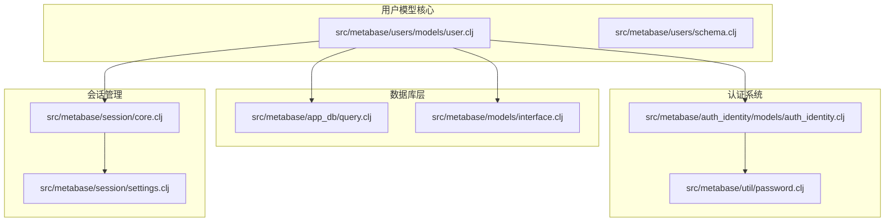

**图表来源**
- [user.clj](file://src/metabase/users/models/user.clj#L1-L50)
- [query.clj](file://src/metabase/app_db/query.clj#L1-L30)
- [interface.clj](file://src/metabase/models/interface.clj#L1-L50)

## 核心组件

### User实体定义

用户模型的核心是`:model/User`实体，它定义了用户的基本属性和行为：

#### 核心字段说明

| 字段名 | 类型 | 描述 | 默认值 | 业务规则 |
|--------|------|------|--------|----------|
| `id` | Integer | 用户唯一标识符 | 自动生成 | 主键，自增 |
| `email` | String | 用户邮箱地址 | 必填 | 唯一，格式验证 |
| `first_name` | String | 名字 | 可选 | 最多255字符 |
| `last_name` | String | 姓氏 | 可选 | 最多255字符 |
| `password` | String | 密码哈希值 | 自动生成 | BCrypt加密 |
| `password_salt` | String | 密码盐值 | 自动生成 | 随机UUID |
| `is_active` | Boolean | 账户激活状态 | true | 控制用户访问权限 |
| `is_superuser` | Boolean | 超级用户标志 | false | 全局管理员权限 |
| `is_qbnewb` | Boolean | 新手引导状态 | false | 控制新手提示显示 |
| `date_joined` | DateTime | 注册时间 | 当前时间 | 自动设置 |
| `last_login` | DateTime | 最后登录时间 | null | 更新策略 |
| `tenant_id` | Integer | 租户ID | 可选 | 多租户支持 |

#### 用户类型系统

系统支持多种用户类型：

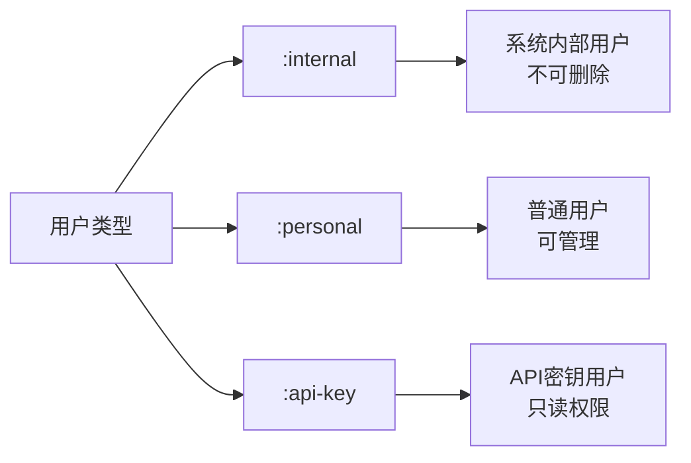

**节来源**
- [user.clj](file://src/metabase/users/models/user.clj#L40-L60)
- [schema.clj](file://src/metabase/users/schema.clj#L10-L25)

## 架构概览

用户模型采用分层架构设计，确保了良好的关注点分离和可维护性：

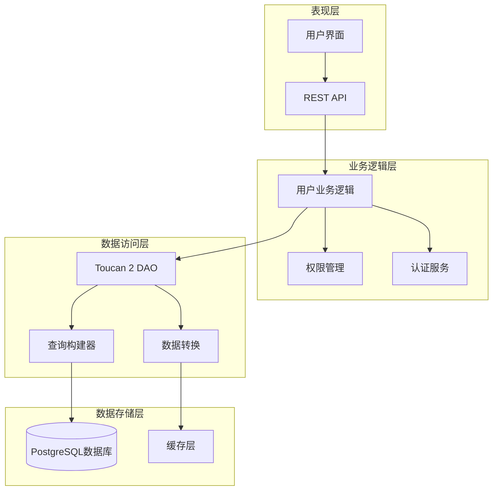

**图表来源**
- [user.clj](file://src/metabase/users/models/user.clj#L1-L50)
- [query.clj](file://src/metabase/app_db/query.clj#L1-L50)

## 详细组件分析

### 用户生命周期管理

用户模型实现了完整的生命周期管理，包括创建、激活、更新和归档：

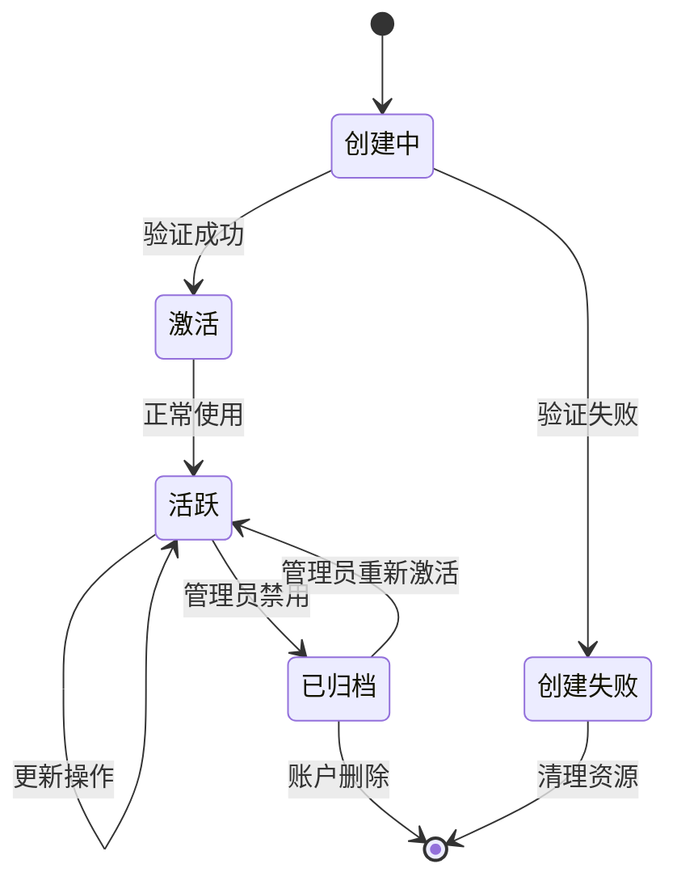

#### 用户创建流程

用户创建过程包含多个验证步骤和自动配置：

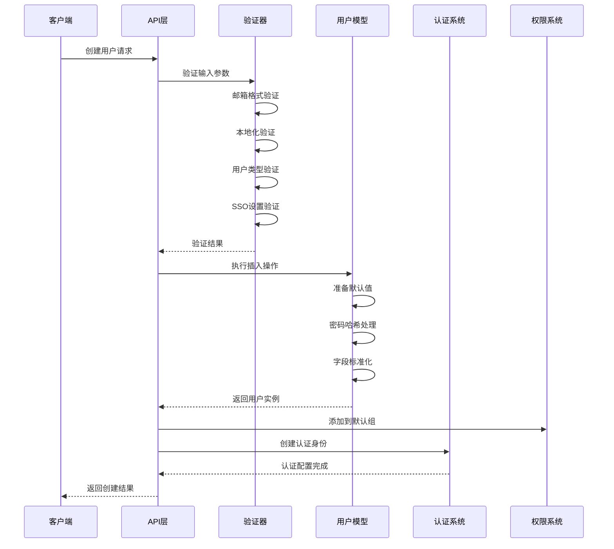

**图表来源**
- [user.clj](file://src/metabase/users/models/user.clj#L190-L220)
- [user.clj](file://src/metabase/users/models/user.clj#L240-L280)

#### 用户状态变更

用户状态的变更受到严格的控制和审计：

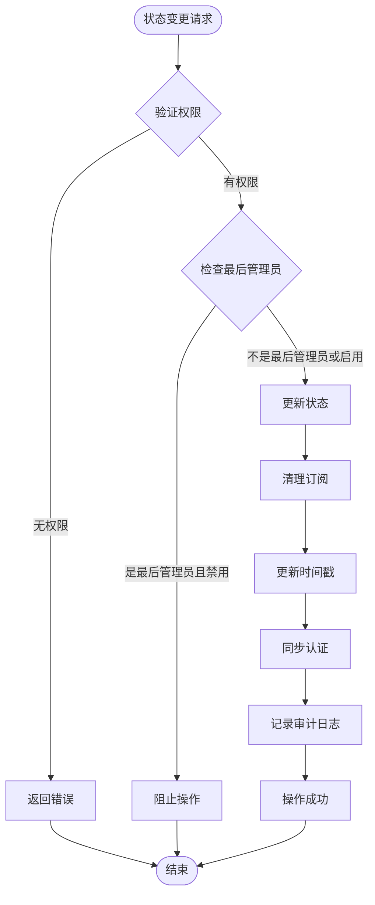

**图表来源**
- [user.clj](file://src/metabase/users/models/user.clj#L151-L185)
- [user.clj](file://src/metabase/users/models/user.clj#L187-L210)

**节来源**
- [user.clj](file://src/metabase/users/models/user.clj#L151-L210)

### 权限继承体系

用户模型与权限系统的深度集成确保了细粒度的访问控制：

#### 权限组管理

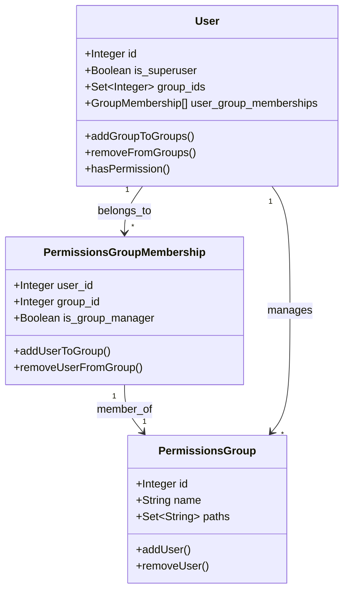

**图表来源**
- [user.clj](file://src/metabase/users/models/user.clj#L450-L480)

#### 权限验证流程

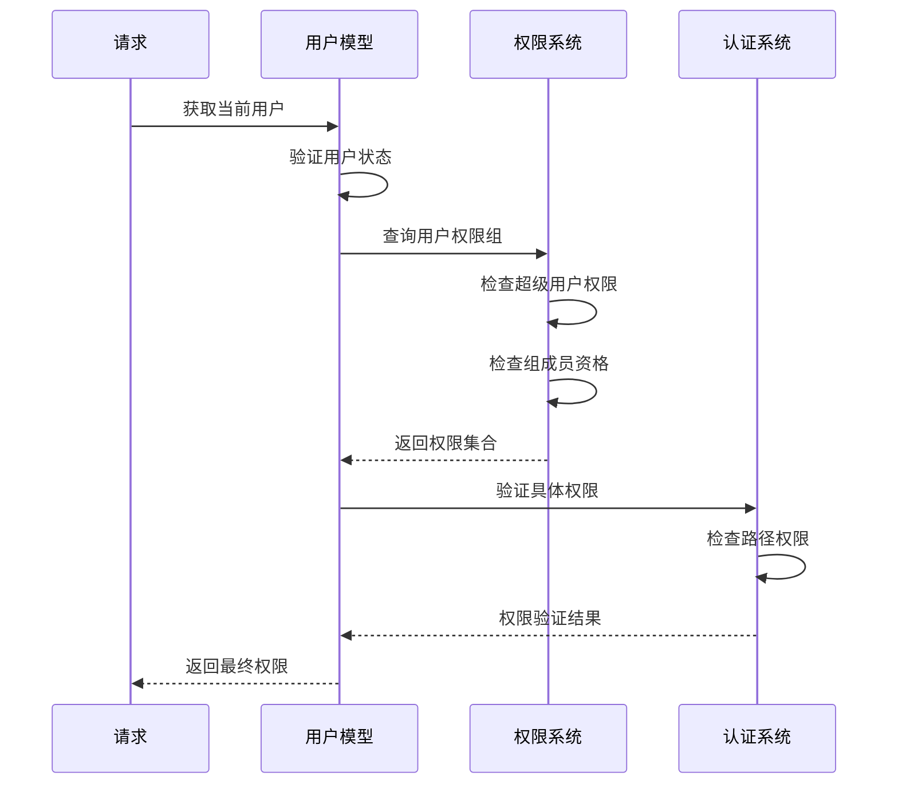

**图表来源**
- [interface.clj](file://src/metabase/models/interface.clj#L632-L680)

**节来源**
- [user.clj](file://src/metabase/users/models/user.clj#L450-L500)

### 密码安全机制

用户模型实现了企业级的密码安全策略：

#### 密码哈希流程

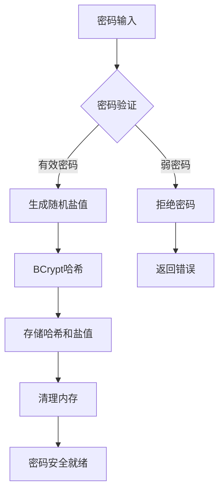

#### 密码复杂度要求

| 复杂度级别 | 最小长度 | 小写字母 | 大写字母 | 数字 | 特殊字符 |
|------------|----------|----------|----------|------|----------|
| 弱 | 6 | ✓ | ✓ | ✗ | ✗ |
| 标准 | 6 | ✓ | ✓ | ✓ | ✗ |
| 强 | 8 | ✓ | ✓ | ✓ | ✓ |

**图表来源**
- [password.clj](file://src/metabase/util/password.clj#L25-L45)
- [password.clj](file://src/metabase/util/password.clj#L70-L90)

#### 密码重置机制

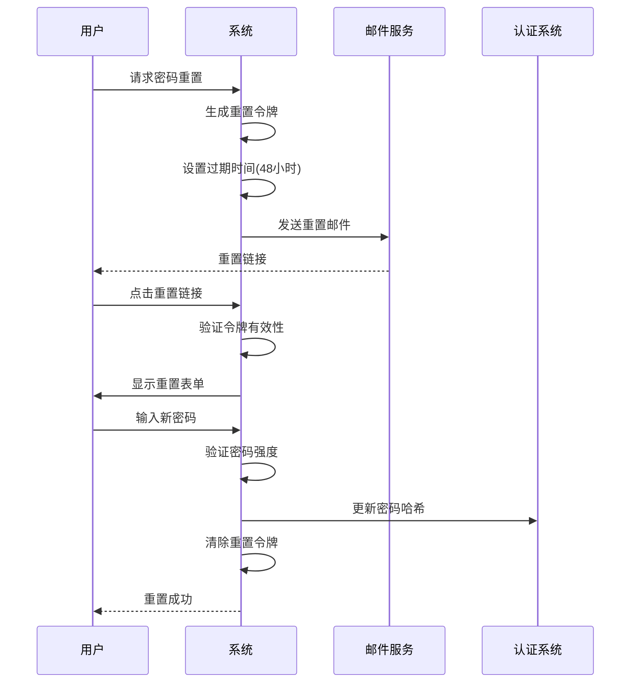

**图表来源**
- [auth_identity.clj](file://src/metabase/auth_identity/models/auth_identity.clj#L80-L135)

**节来源**
- [password.clj](file://src/metabase/util/password.clj#L1-L123)
- [auth_identity.clj](file://src/metabase/auth_identity/models/auth_identity.clj#L80-L135)

### 与其他模型的所有权关系

用户模型与Metabase中的其他核心实体存在复杂的关联关系：

#### Collection所有权

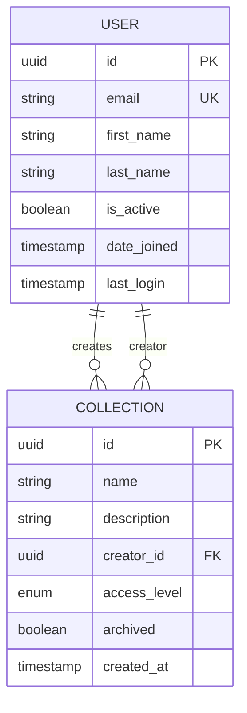

#### Dashboard所有权

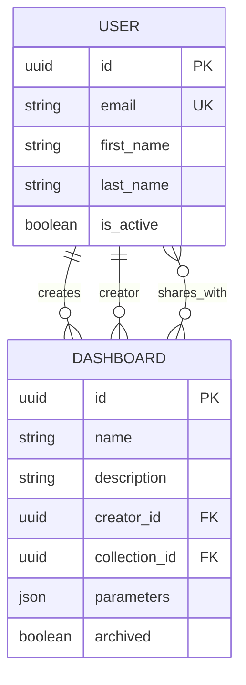

#### Pulse所有权

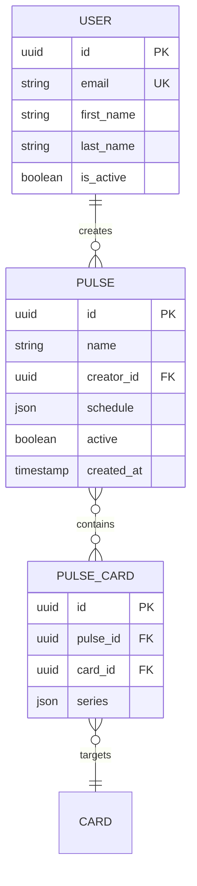

**图表来源**
- [user.clj](file://src/metabase/users/models/user.clj#L30-L40)

**节来源**
- [user.clj](file://src/metabase/users/models/user.clj#L30-L40)

### 应用数据库查询支持

用户模型通过Toucan 2 ORM提供了完整的CRUD操作支持：

#### 查询构建模式

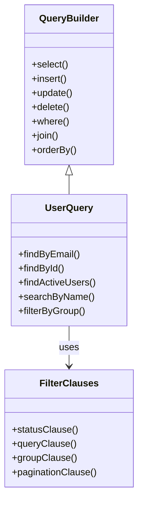

#### 实际查询示例

以下是几种常见的用户查询模式：

1. **基础查询**：获取活跃用户列表
2. **过滤查询**：按状态和搜索条件筛选
3. **关联查询**：获取用户及其权限组
4. **聚合查询**：统计用户活动指标

**节来源**
- [query.clj](file://src/metabase/app_db/query.clj#L100-L231)
- [user.clj](file://src/metabase/users/models/user.clj#L500-L527)

## 依赖关系分析

用户模型的依赖关系体现了模块化设计的优势：

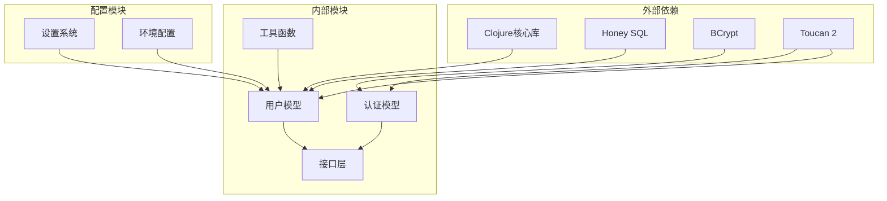

**图表来源**
- [user.clj](file://src/metabase/users/models/user.clj#L1-L30)
- [interface.clj](file://src/metabase/models/interface.clj#L1-L30)

**节来源**
- [user.clj](file://src/metabase/users/models/user.clj#L1-L30)

## 性能考虑

用户模型在设计时充分考虑了性能优化：

### 缓存策略
- 用户权限信息的智能缓存
- 登录历史的分页查询
- 批量权限检查优化

### 查询优化
- 索引字段的合理使用
- 分页查询的限制
- N+1问题的避免

### 内存管理
- 敏感数据的及时清理
- 大对象的懒加载
- 连接池的优化配置

## 故障排除指南

### 常见问题及解决方案

#### 用户创建失败
**症状**：用户无法创建，返回验证错误
**可能原因**：
- 邮箱格式不正确
- 密码不符合复杂度要求
- 用户类型无效
- SSO设置未完成

**解决方法**：
1. 检查邮箱格式是否符合标准
2. 验证密码复杂度要求
3. 确认用户类型配置
4. 完成初始设置流程

#### 权限访问被拒绝
**症状**：用户无法访问特定功能或数据
**可能原因**：
- 用户账户被禁用
- 权限组配置错误
- 超级用户权限不足

**解决方法**：
1. 检查用户激活状态
2. 验证权限组分配
3. 确认超级用户权限

#### 密码重置问题
**症状**：密码重置链接无效或过期
**可能原因**：
- 重置令牌过期
- 邮件发送失败
- 用户账户异常

**解决方法**：
1. 检查令牌有效期（48小时）
2. 验证邮件配置
3. 确认用户账户状态

**节来源**
- [user.clj](file://src/metabase/users/models/user.clj#L80-L120)
- [auth_identity.clj](file://src/metabase/auth_identity/models/auth_identity.clj#L80-L135)

## 结论

Metabase的用户模型是一个设计精良、功能完备的身份管理系统。它不仅满足了基本的用户管理需求，还提供了强大的安全特性、灵活的权限控制和完善的生命周期管理。

### 主要优势

1. **安全性**：采用BCrypt加密、密码复杂度验证、防重放攻击等多重安全措施
2. **灵活性**：支持多种用户类型和认证方式
3. **可扩展性**：模块化设计便于功能扩展
4. **可维护性**：清晰的代码结构和完善的测试覆盖

### 最佳实践建议

1. **定期审计**：监控用户活动和权限变更
2. **密码策略**：根据安全要求调整密码复杂度
3. **权限最小化**：遵循最小权限原则分配权限
4. **备份恢复**：建立完善的用户数据备份机制

这个用户模型为Metabase提供了坚实的基础，支撑着整个应用程序的安全运行和业务发展。