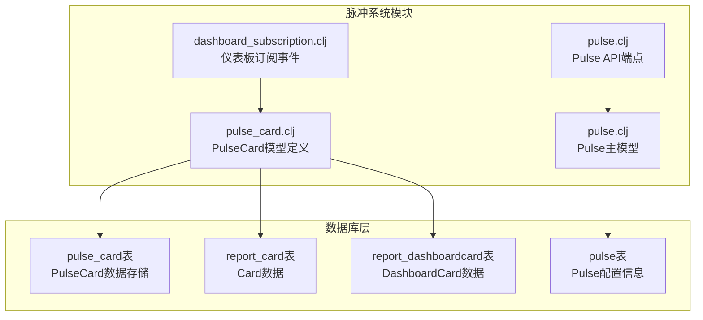
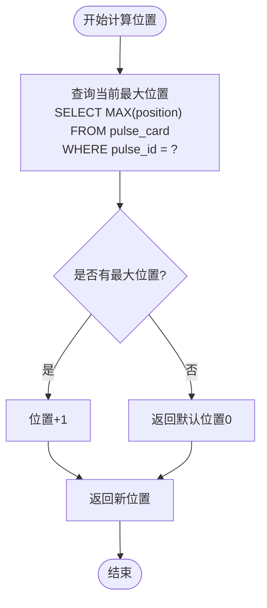
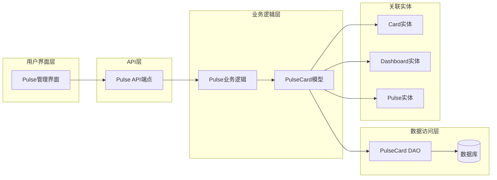
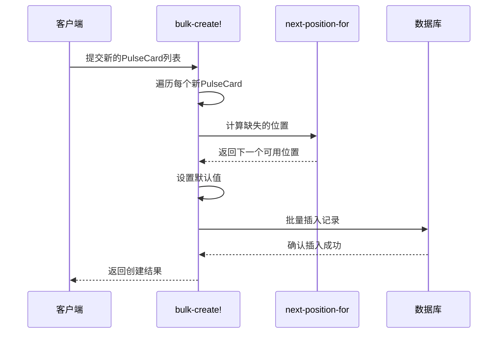
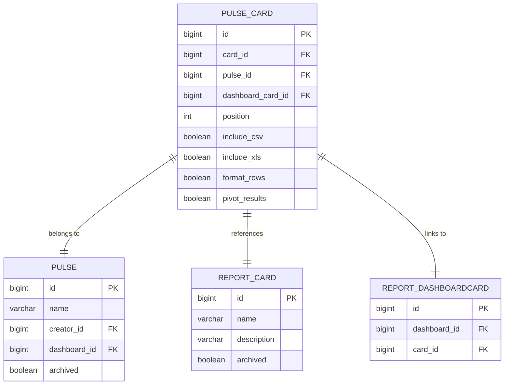
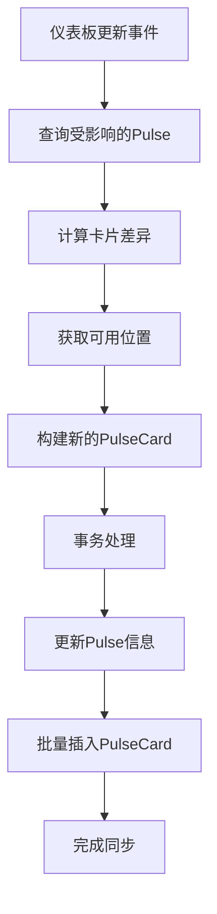
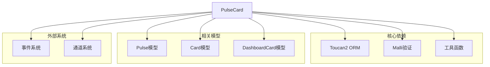

# 脉冲卡片关联

<cite>
**本文档中引用的文件**
- [pulse_card.clj](file://src/metabase/pulse/models/pulse_card.clj)
- [pulse.clj](file://src/metabase/pulse/models/pulse.clj)
- [dashboard_subscription.clj](file://src/metabase/pulse/events/dashboard_subscription.clj)
- [pulse.clj](file://src/metabase/pulse/api/pulse.clj)
</cite>

## 目录
1. [简介](#简介)
2. [项目结构](#项目结构)
3. [核心组件](#核心组件)
4. [架构概览](#架构概览)
5. [详细组件分析](#详细组件分析)
6. [依赖关系分析](#依赖关系分析)
7. [性能考虑](#性能考虑)
8. [故障排除指南](#故障排除指南)
9. [结论](#结论)

## 简介

PulseCard模型是Metabase中用于建立Pulse（脉冲）与源Card（或DashboardCard）之间关联关系的核心数据模型。该模型通过维护卡片在Pulse中的位置信息和格式化选项，确保Pulse能够正确地组织和展示其包含的卡片内容。

PulseCard模型的设计体现了以下关键特性：
- **位置管理**：通过`position`字段确保卡片在Pulse中的有序排列
- **格式控制**：通过`include_csv`、`include_xls`等字段控制卡片的输出格式
- **批量操作**：支持高效的批量创建和更新操作
- **关联完整性**：维护与Card和DashboardCard的完整关联关系

## 项目结构

PulseCard模型位于Metabase的脉冲系统中，主要文件组织如下：



**图表来源**
- [pulse_card.clj](file://src/metabase/pulse/models/pulse_card.clj#L1-L49)
- [pulse.clj](file://src/metabase/pulse/models/pulse.clj#L1-L617)

**章节来源**
- [pulse_card.clj](file://src/metabase/pulse/models/pulse_card.clj#L1-L49)
- [pulse.clj](file://src/metabase/pulse/models/pulse.clj#L16-L51)

## 核心组件

### PulseCard模型字段详解

PulseCard模型包含以下核心字段，每个字段都有特定的用途和约束：

| 字段名 | 类型 | 约束 | 描述 |
|--------|------|------|------|
| `card_id` | PositiveInt | 必填 | 关联的Card实体ID |
| `pulse_id` | PositiveInt | 必填 | 关联的Pulse实体ID |
| `dashboard_card_id` | PositiveInt | 必填 | 关联的DashboardCard实体ID |
| `position` | IntGreaterThanOrEqualToZero | 可选 | 卡片在Pulse中的显示位置 |
| `include_csv` | Boolean | 可选 | 是否包含CSV格式附件 |
| `include_xls` | Boolean | 可选 | 是否包含Excel格式附件 |
| `format_rows` | Boolean | 可选 | 是否格式化行数据 |
| `pivot_results` | Boolean | 可选 | 是否以透视表形式展示结果 |

### next-position-for函数

`next-position-for`函数是确保Pulse中卡片有序排列的核心机制：



**图表来源**
- [pulse_card.clj](file://src/metabase/pulse/models/pulse_card.clj#L18-L25)

**章节来源**
- [pulse_card.clj](file://src/metabase/pulse/models/pulse_card.clj#L18-L36)

## 架构概览

PulseCard模型在整个脉冲系统中的架构位置：



**图表来源**
- [pulse.clj](file://src/metabase/pulse/models/pulse.clj#L232-L262)
- [pulse_card.clj](file://src/metabase/pulse/models/pulse_card.clj#L1-L17)

## 详细组件分析

### bulk-create!函数实现

`bulk-create!`函数是PulseCard模型的核心批量创建功能，负责处理多个PulseCard实例的创建：



**图表来源**
- [pulse_card.clj](file://src/metabase/pulse/models/pulse_card.clj#L36-L47)

#### 默认值处理逻辑

`bulk-create!`函数实现了智能的默认值处理机制：

1. **位置自动递增**：当未指定`position`时，调用`next-position-for`获取下一个可用位置
2. **布尔值标准化**：所有布尔类型的字段都会被转换为标准的true/false值
3. **数据验证**：使用Malli schema进行输入验证和类型转换

**章节来源**
- [pulse_card.clj](file://src/metabase/pulse/models/pulse_card.clj#L36-L47)

### 关联查询机制

PulseCard模型提供了强大的关联查询能力，支持复杂的多表连接查询：



**图表来源**
- [pulse.clj](file://src/metabase/pulse/models/pulse.clj#L232-L262)

#### 查询示例

以下是几种典型的PulseCard关联查询模式：

1. **按Pulse获取所有卡片**：
   ```sql
   SELECT pc.*, c.name, dc.dashboard_id
   FROM pulse_card pc
   JOIN report_card c ON pc.card_id = c.id
   LEFT JOIN report_dashboardcard dc ON pc.dashboard_card_id = dc.id
   WHERE pc.pulse_id = ?
   ORDER BY pc.position ASC
   ```

2. **获取Pulse中包含的卡片详情**：
   ```sql
   SELECT c.id, c.name, pc.include_csv, pc.include_xls, pc.position
   FROM pulse_card pc
   JOIN report_card c ON pc.card_id = c.id
   WHERE pc.pulse_id IN (?)
   ORDER BY pc.position ASC
   ```

**章节来源**
- [pulse.clj](file://src/metabase/pulse/models/pulse.clj#L232-L262)

### Dashboard订阅事件处理

PulseCard模型在仪表板订阅事件中发挥关键作用：



**图表来源**
- [dashboard_subscription.clj](file://src/metabase/pulse/events/dashboard_subscription.clj#L12-L61)

**章节来源**
- [dashboard_subscription.clj](file://src/metabase/pulse/events/dashboard_subscription.clj#L12-L61)

## 依赖关系分析

PulseCard模型与其他组件的依赖关系：



**图表来源**
- [pulse_card.clj](file://src/metabase/pulse/models/pulse_card.clj#L1-L17)

**章节来源**
- [pulse_card.clj](file://src/metabase/pulse/models/pulse_card.clj#L1-L17)

## 性能考虑

### 查询优化策略

1. **索引设计**：建议在`pulse_id`和`position`字段上建立复合索引
2. **批量操作**：使用`bulk-create!`函数减少数据库往返次数
3. **分页查询**：对于大量卡片的Pulse，实现分页加载机制
4. **缓存策略**：缓存常用Pulse的卡片顺序信息

### 内存使用优化

- 使用惰性求值处理大型Pulse卡片集合
- 实现卡片数据的延迟加载机制
- 合理控制hydration深度避免内存溢出

## 故障排除指南

### 常见问题及解决方案

1. **位置冲突**：当多个卡片尝试使用相同位置时，系统会自动调整位置
2. **关联丢失**：定期检查PulseCard与Card/DashboardCard的关联完整性
3. **权限问题**：确保用户对关联的Card具有适当的读取权限
4. **批量操作失败**：检查输入数据的完整性和有效性

**章节来源**
- [pulse_card.clj](file://src/metabase/pulse/models/pulse_card.clj#L36-L47)

## 结论

PulseCard模型是Metabase脉冲系统的核心组件，它通过建立Pulse与源Card之间的关联关系，实现了灵活的内容管理和展示功能。该模型的设计充分考虑了以下关键要素：

- **数据完整性**：通过严格的字段约束和验证确保数据质量
- **性能优化**：支持批量操作和高效查询
- **扩展性**：良好的架构设计支持未来的功能扩展
- **用户体验**：提供直观的卡片排序和格式化选项

通过深入理解PulseCard模型的工作原理和最佳实践，开发者可以更好地利用Metabase的脉冲功能，为用户提供高质量的数据报告和通知服务。